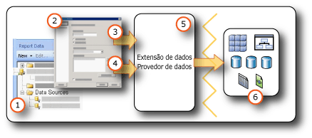

# <a name="data-connections-data-sources-and-connection-strings-report-builder-and-ssrs"></a>Conexões de dados, fontes de dados e cadeias de conexão (Construtor de Relatórios e SSRS)

[!INCLUDE [ssrs-appliesto](../../includes/ssrs-appliesto.md)] [!INCLUDE [ssrs-appliesto-2016-and-later](../../includes/ssrs-appliesto-2016-and-later.md)] [!INCLUDE[ssrs-appliesto-pbirsi](../../includes/ssrs-appliesto-pbirs.md)] [!INCLUDE[ssrs-appliesto-sharepoint-2013-2016i](../../includes/ssrs-appliesto-sharepoint-2013-2016.md)]

[!INCLUDE [ssrs-previous-versions](../../includes/ssrs-previous-versions.md)]

  Para incluir dados em relatórios paginados [!INCLUDE[ssRBnoversion](../../includes/ssrbnoversion-md.md)] e  [!INCLUDE[ssRSnoversion](../../includes/ssrsnoversion-md.md)] , primeiro você deve criar *fontes de dados* e *conjuntos de dados*. Este tópico explica o tipo de fontes de dados, como criar fontes de dados e informações importantes relacionadas às credenciais de fontes de dados. Uma fonte de dados inclui o tipo da fonte de dados, informações da conexão e o tipo de credenciais a serem usadas. Há dois tipos de fontes de dados: inserida ou compartilhada. Um fonte de dados inserida é definida no relatório e usada apenas por esse relatório. Uma fonte de dados compartilhada é definida independentemente de um relatório e pode ser usada por vários relatórios. Para obter mais informações, consulte [inseridos e compartilhados conjuntos de dados &#40; Construtor de relatórios e SSRS &#41; ](../../reporting-services/report-data/embedded-and-shared-datasets-report-builder-and-ssrs.md).  

> [!NOTE]  
>  [!INCLUDE[ssRBRDDup](../../includes/ssrbrddup-md.md)]
  
##  <a name="bkmk_data_sources"></a> Fontes de dados inseridas e compartilhadas  
 As fontes de dados compartilhadas são úteis quando você usa fontes de dados frequentemente. É recomendado usar fontes de dados compartilhadas o máximo possível. Elas facilitam o acesso e o gerenciamento dos relatórios, além de ajudar a proteger os relatórios e as fontes de dados acessados. Se precisar de uma fonte de dados compartilhada, peça ao administrador do sistema para criar uma para você.  
  
 Uma fonte de dados inserida é uma conexão de dados salva na definição de relatório. As informações de conexão de fonte de dados inserida só podem ser usadas pelo relatório no qual a fonte de dados está inserida. Para definir e gerenciar fontes de dados inseridas, use a caixa de diálogo **Propriedades da Fonte de Dados** .  
  
 A diferença entre as fontes de dados inseridas e compartilhadas está em como elas são criadas, armazenadas e gerenciadas.  
  
-   No Designer de Relatórios, crie fontes de dados inseridas e compartilhadas como parte de um projeto do [!INCLUDE[ssBIDevStudioFull](../../includes/ssbidevstudiofull-md.md)] . Você pode controlar se elas devem ser usadas localmente para visualização ou implantadas como parte do projeto para um servidor de relatório ou site do SharePoint. Você pode usar extensões de dados personalizadas que foram instaladas em seu computador e no servidor de relatório ou site do SharePoint onde você implanta seus relatórios.  
  
     Os administradores do sistema podem instalar e configurar extensões de processamento de dados adicionais e provedores de dados do .NET Framework. Para obter mais informações, consulte [Extensões de processamento de dados e provedores de dados do .NET Framework &#40;SSRS&#41;](../../reporting-services/report-data/data-processing-extensions-and-net-framework-data-providers-ssrs.md).  
  
     Os desenvolvedores podem usar a API <xref:Microsoft.ReportingServices.DataProcessing> para criar extensões de processamento de dados para dar suporte a tipos de fonte de dados adicionais.  
  
-   No [!INCLUDE[ssRBnoversion](../../includes/ssrbnoversion-md.md)], navegue para um servidor de relatório ou site do SharePoint e selecione fontes de dados compartilhadas ou crie fontes de dados inseridas no relatório. Não é possível criar uma fonte de dados compartilhada no [!INCLUDE[ssRBnoversion](../../includes/ssrbnoversion-md.md)]. Você não pode usar extensões de dados personalizadas no [!INCLUDE[ssRBnoversion](../../includes/ssrbnoversion-md.md)].  
  
 A tabela seguinte resume as diferenças entre fontes de dados inseridas e compartilhadas.  
  
|Description|Inserida<br /><br /> fonte de dados|Compartilhado<br /><br /> fonte de dados|  
|-----------------|------------------------------|----------------------------|  
|A conexão de dados é inserida na definição do relatório.|||  
|O ponteiro para a conexão de dados no servidor de relatório é inserido na definição do relatório.|||  
|Gerenciada no servidor de relatório|||  
|Obrigatória para conjuntos de dados compartilhados|||  
|Obrigatória para componentes|||  
  
##  <a name="bkmk_DataConnections"></a> Extensões de dados internas  
 As extensões de dados padrão no [!INCLUDE[ssRSnoversion](../../includes/ssrsnoversion-md.md)] incluem os tipos de conexão de dados a seguir:  
  
-   Banco de dados SQL do Microsoft SQL Server e o Microsoft Azure
  
-   Microsoft SQL Server Analysis Services  
  
-   Lista do Microsoft SharePoint  
  
-   [!INCLUDE[ssSDSFull](../../includes/sssdsfull-md.md)]  
  
-   Microsoft SQL Server Parallel Data Warehouse  
  
-   OLE DB  
  
-   Oracle  
  
-   SAP NetWeaver BI  
  
-   Hyperion Essbase  
  
-   Teradata  
  
-   XML  
  
-   ODBC  
  
-   Modelo Semântico de BI da Microsoft para Power View: em um site do SharePoint que foi configurado para uma galeria [!INCLUDE[ssGemini](../../includes/ssgemini-md.md)] e [!INCLUDE[ssCrescent](../../includes/sscrescent-md.md)], esse tipo de fonte de dados está disponível. Esse tipo de fonte de dados é usado somente para apresentações do [!INCLUDE[ssCrescent](../../includes/sscrescent-md.md)] . Para mais informações, consulte [Criando modelos semânticos de tabelas perfeitos de BI para Power View](http://technet.microsoft.com/video/building-the-perfect-bi-semantic-tabular-models-for-power-view.aspx).  
  
 Para obter uma lista completa de fontes de dados e versões aos quais o [!INCLUDE[ssRSnoversion](../../includes/ssrsnoversion-md.md)] dá suporte, consulte [Fontes de dados com suporte no Reporting Services e &#40;SSRS&#41;](../../reporting-services/report-data/data-sources-supported-by-reporting-services-ssrs.md).  
  
## <a name="data-in-includessrbnoversionincludesssrbnoversion-mdmd"></a>Dados em [!INCLUDE[ssRBnoversion](../../includes/ssrbnoversion-md.md)]  
   
  
1.  **Fontes de dados no painel de Dados do Relatório** Uma fonte de dados é exibida no painel de Dados do Relatório depois que você cria uma fonte de dados inserida ou adiciona uma fonte de dados compartilhada.  
  
2.  **Caixa de diálogo Conexão** Use a caixa de diálogo Conexão para criar ou colar uma cadeia de conexão.  
  
3.  **Informações de conexão de dados** A cadeia de conexão é transmitida à extensão de dados.  
  
4.  **Credenciais** As credenciais são gerenciadas separadamente da cadeia de conexão.  
  
5.  **Extensão de dados/Provedor de Dados** A conexão com os dados pode ser feita por meio de várias camadas de acesso a dados.  
  
6.  **Fontes de dados internas** Recupera dados de bancos de dados relacionais, bancos de dados multidimensionais, listas do SharePoint, serviços Web ou modelos de relatório.  
  
##  <a name="bkmk_connection_examples"></a> Exemplos comuns de cadeia de conexão  
 Cadeias de conexão são a representação de texto de propriedades de conexão para um provedor de dados. A tabela a seguir lista exemplos de cadeias de conexão para vários tipos de conexão de dados.  
 
 > [!NOTE]  
>  [Connectionstrings.com](http://www.connectionstrings.com/) é outro recurso para obter exemplos de cadeias de conexão. 
  
|**Data source**|**Exemplo**|**Description**|  
|---------------------|-----------------|---------------------|  
|Banco de dados do SQL Server no servidor local|`data source="(local)";initial catalog=AdventureWorks`|Defina o tipo de fonte de dados como **Microsoft SQL Server**. Para obter mais informações, consulte [Tipo de conexão do SQL Server &#40;SSRS&#41;](../../reporting-services/report-data/sql-server-connection-type-ssrs.md).|  
|Instância do SQL Server<br /><br /> banco de dados|`Data Source=localhost\MSSQL13.<InstanceName>; Initial Catalog=AdventureWorks`|Defina o tipo de fonte de dados como **Microsoft SQL Server**.|  
|Banco de dados do SQL Server Express|`Data Source=localhost\MSSQL13.SQLEXPRESS; Initial Catalog=AdventureWorks`|Defina o tipo de fonte de dados como **Microsoft SQL Server**.|  
|Banco de dados SQL do Azure|`Data Source=<host>;Initial Catalog=AdventureWorks; Encrypt=True`|Defina o tipo de fonte de dados **banco de dados SQL do Microsoft Azure**. Para obter mais informações, consulte [Tipo de conexão do SQL Azure &#40;SSRS&#41;](../../reporting-services/report-data/sql-azure-connection-type-ssrs.md).|  
|SQL Server Parallel Data Warehouse|`HOST=<IP address>;database= AdventureWorks; port=<port>`|Defina o tipo de fonte de dados como **Microsoft SQL Server Parallel Data Warehouse**. Para obter mais informações, consulte [Tipo de conexão do SQL Server Parallel Data Warehouse &#40;SSRS&#41;](../../reporting-services/report-data/sql-server-parallel-data-warehouse-connection-type-ssrs.md).|  
|Banco de dados do Analysis Services no servidor local|`data source=localhost;initial catalog=Adventure Works DW`|Defina o tipo de fonte de dados como **Microsoft SQL Server Analysis Services**. Para obter mais informações, consulte [tipo de Conexão do Analysis Services para MDX &#40; SSRS &#41; ](../../reporting-services/report-data/analysis-services-connection-type-for-mdx-ssrs.md) ou [do tipo de Conexão Analysis Services para DMX &#40; SSRS &#41; ](../../reporting-services/report-data/analysis-services-connection-type-for-dmx-ssrs.md).|  
|Banco de dados modelo de tabela do Analysis Services com perspectiva de vendas|`Data source=<servername>;initial catalog= Adventure Works DW;cube='Sales’`|Defina o tipo de fonte de dados como **Microsoft SQL Server Analysis Services**. Especifique o nome da perspectiva na configuração de cube=. Para obter mais informações, consulte [Perspectivas &#40;SSAS de Tabela&#41;](../../analysis-services/tabular-models/perspectives-ssas-tabular.md).|  
|Fonte de dados de modelo de relatório em um servidor de relatório configurado em modo nativo|`Server=http://myreportservername/reportserver; datasource=/models/Adventure Works`|Especifique o servidor de relatório ou a URL da biblioteca de documentos e o caminho para o modelo publicado na pasta do servidor de relatório ou no namespace da pasta da biblioteca de documentos. Para obter mais informações, consulte [Conexão de modelo de relatório &#40; SSRS &#41; ](../../reporting-services/report-data/report-model-connection-ssrs.md).|  
|Fonte de dados de modelo de relatório em um servidor de relatório configurado em modo integrado do SharePoint|`Server=http://server; datasource=http://server/site/documents/models/Adventure Works.smdl`|Especifique o servidor de relatório ou a URL da biblioteca de documentos e o caminho para o modelo publicado na pasta do servidor de relatório ou no namespace da pasta da biblioteca de documentos.|  
|[!INCLUDE[ssNoVersion](../../includes/ssnoversion-md.md)] do [!INCLUDE[ssASnoversion](../../includes/ssasnoversion-md.md)] 2000|`provider=MSOLAP.2;data source=<remote server name>;initial catalog=FoodMart 2000`|Defina o tipo de fonte de dados como **OLE DB Provider for OLAP Services 8.0**.<br /><br /> É possível obter uma conexão mais rápida com fontes de dados do [!INCLUDE[ssNoVersion](../../includes/ssnoversion-md.md)] 2000 [!INCLUDE[ssASnoversion](../../includes/ssasnoversion-md.md)] se você definir a propriedade **ConnectTo** como **8.0**. Para definir essa propriedade, use a caixa de diálogo **Propriedades da Conexão** , guia **Propriedades Avançadas** .|  
|Servidor do Oracle|`data source=myserver`|Defina o tipo de fonte de dados como **Oracle**. As ferramentas do cliente Oracle devem estar instaladas no computador de Designer de Relatórios e no servidor de relatório. Para obter mais informações, consulte [Tipo de conexão Oracle &#40;SSRS&#41;](../../reporting-services/report-data/oracle-connection-type-ssrs.md).|  
|Fonte de dados do SAP NetWeaver BI|`DataSource=http://mySAPNetWeaverBIServer:8000/sap/bw/xml/soap/xmla`|Defina o tipo de fonte de dados como **SAP NetWeaver Bl**. Para obter mais informações, consulte [Tipo de conexão SAP NetWeaver BI &#40;SSRS&#41;](../../reporting-services/report-data/sap-netweaver-bi-connection-type-ssrs.md).|  
|Fonte de dados do Hyperion Essbase|`Data Source=http://localhost:13080/aps/XMLA; Initial Catalog=Sample`|Defina o tipo de fonte de dados como **Hyperion Essbase**. Para obter mais informações, consulte [Tipo de conexão Hyperion Essbase &#40;SSRS&#41;](../../reporting-services/report-data/hyperion-essbase-connection-type-ssrs.md).|  
|Fonte de dados do Teradata|`data source=`\<NNN >. \<NNN >. \<NNN >. \<NNN >`;`|Defina o tipo de fonte de dados como **Teradata**. A cadeia de conexão é um endereço IP no formulário de quatro campos, em que cada campo pode ter de um a três dígitos. Para obter mais informações, consulte [tipo de Conexão Teradata &#40; SSRS &#41; ](../../reporting-services/report-data/teradata-connection-type-ssrs.md).|  
|Fonte de dados do Teradata|`Database=`*\<database name>* `; data source=` *\<NN*N*>.\< NNN >. \<NNN>. \<N*NN*>*`;Use X Views=False;Restrict to Default Database=True`|Defina o tipo de fonte de dados como **Teradata**, semelhante ao exemplo anterior. Use apenas o banco de dados padrão especificado na marca Database e não descubra automaticamente relações de dados.|  
|Fonte de dados XML, serviço Web|`data source=http://adventure-works.com/results.aspx`|Defina o tipo de fonte de dados como **XML**. A cadeia de conexão é uma URL para um serviço Web com suporte para WSDL. Para obter mais informações, consulte [tipo de Conexão XML &#40; SSRS &#41; ](../../reporting-services/report-data/xml-connection-type-ssrs.md).|  
|Fonte de dados XML, documento XML|`http://localhost/XML/Customers.xml`|Defina o tipo de fonte de dados como **XML**. A cadeia de conexão é uma URL para o documento XML.|  
|Fonte de dados XML, documento XML inserido|*Empty (vazio)*|Defina o tipo de fonte de dados como **XML**. Os dados XML são inseridos na definição do relatório.|  
|Lista do SharePoint|`data source=http://MySharePointWeb/MySharePointSite/`|Definir o tipo de fonte de dados como **lista do SharePoint**.|  
  
 Se não for possível conectar a um servidor de relatório que use **localhost**, verifique se o protocolo de rede TCP/IP está habilitado. Para obter mais informações, consulte [Configure Client Protocols](../../database-engine/configure-windows/configure-client-protocols.md).  
  
 Para obter mais informações sobre as configurações necessárias para se conectar a esses tipos de fonte de dados, consulte o tópico de conexão de dados específicos em [Adicionar dados de fontes de dados externas e &#40;SSRS&#41;](../../reporting-services/report-data/add-data-from-external-data-sources-ssrs.md) ou [Fontes de dados com suporte no Reporting Services &#40;SSRS&#41;](../../reporting-services/report-data/data-sources-supported-by-reporting-services-ssrs.md).  
  
##  <a name="bkmk_special_password_characters"></a> Caracteres especiais em uma senha  
 Se você configurar a fonte de dados ODBC ou SQL para solicitar uma senha ou para incluir uma senha na cadeia de conexão e o usuário inserir a senha com caracteres especiais, como sinais de pontuação, alguns drivers de fonte de dados subjacentes não conseguirão validar os caracteres especiais. Quando você processar o relatório, a mensagem "Senha inválida" poderá indicar esse problema. Se não for possível alterar a senha, você poderá trabalhar com o administrador do banco de dados para armazenar as credenciais apropriadas no servidor como parte de um DSN (nome da fonte de dados) do sistema ODBC. Para obter mais informações, consulte "OdbcConnection.ConnectionString" na documentação do [!INCLUDE[dnprdnshort](../../includes/dnprdnshort-md.md)] SDK.  
  
##  <a name="bkmk_Expressions_in_connection_strings"></a> Cadeias de conexão baseadas em expressão  
 Cadeias de conexão baseadas em expressão são avaliadas em tempo de execução. Por exemplo, você pode especificar a fonte de dados como um parâmetro, incluir a referência ao parâmetro na cadeia de conexão e permitir que o usuário escolha a fonte de dados para o relatório. Por exemplo, suponha que uma empresa multinacional tem servidores de dados em vários países. Com uma cadeia de conexão baseada em expressão, um usuário que está executando um relatório de vendas pode selecionar uma fonte de dados para um país específico antes de executar o relatório.  
  
 O exemplo a seguir ilustra o uso de uma expressão de fonte de dados em uma cadeia de conexão do [!INCLUDE[ssNoVersion](../../includes/ssnoversion-md.md)] . O exemplo assume que você criou um parâmetro de relatório denominado `ServerName`:  
  
```  
="data source=" & Parameters!ServerName.Value & ";initial catalog=AdventureWorks"  
```  
  
 Expressões de fonte de dados são processadas em tempo de execução ou quando um relatório é visualizado. A expressão deve ser escrita no [!INCLUDE[vbprvb](../../includes/vbprvb-md.md)]. Use as seguintes diretrizes ao definir uma expressão de fonte de dados:  
  
-   Crie o relatório usando uma cadeia de conexão estática. Uma cadeia de conexão estática faz referência a uma cadeia de conexão que não é definida através de uma expressão (por exemplo, quando você segue as etapas para criar uma fonte de dados específica ao relatório ou compartilhada, você está definindo um cadeia de conexão estática. O uso de uma cadeia de conexão estática permite conectar à fonte de dados no Designer de Relatórios de forma que você possa obter os resultados da consulta necessários para criar o relatório.  
  
-   Ao definir a conexão da fonte de dados, não use uma fonte de dados compartilhada. Não é possível usar uma expressão de fonte de dados em uma fonte de dados compartilhada. Você deve definir uma fonte de dados inserida para o relatório.  
  
-   Especifique credenciais separadamente da cadeia de conexão. É possível usar credenciais armazenadas, credenciais solicitadas ou segurança integrada.  
  
-   Adicione um parâmetro de relatório para especificar uma fonte de dados. Para os valores dos parâmetros, você pode fornecer uma lista estática de valores disponíveis (neste caso, os valores disponíveis devem ser fontes de dados usadas com o relatório) ou definir uma consulta que recupere uma lista de fontes de dados em tempo de execução.  
  
-   Verifique se a lista de fontes de dados compartilha o mesmo esquema de banco de dados. Todo design de relatório começa com informações de esquema. Se houver uma incompatibilidade entre o esquema usado para definir o relatório e o esquema real usado pelo relatório em tempo de execução, o relatório poderá não ser executado.  
  
-   Antes de publicar o relatório, substitua a cadeia de conexão estática por uma expressão. Espere até a conclusão do design do relatório para substituir a cadeia de conexão estática por uma expressão. Ao usar uma expressão, você não pode executar a consulta no Designer de Relatórios. Além disso, a lista de campos no painel de dados do relatório e a lista de Parâmetros não serão atualizadas automaticamente.  

## <a name="next-steps"></a>Próximas etapas

[Criar, modificar e excluir fontes de dados compartilhadas](../../reporting-services/report-data/create-modify-and-delete-shared-data-sources-ssrs.md)   
[Criar e modificar fontes de dados inseridas](../../reporting-services/report-data/create-and-modify-embedded-data-sources.md)   
[Definir propriedades de implantação](../../reporting-services/tools/set-deployment-properties-reporting-services.md)   
[Especificar informações de credenciais e de conexão para fontes de dados de relatório](../../reporting-services/report-data/specify-credential-and-connection-information-for-report-data-sources.md)  

Ainda tem dúvidas? [Experimente perguntar no fórum do Reporting Services](http://go.microsoft.com/fwlink/?LinkId=620231)

