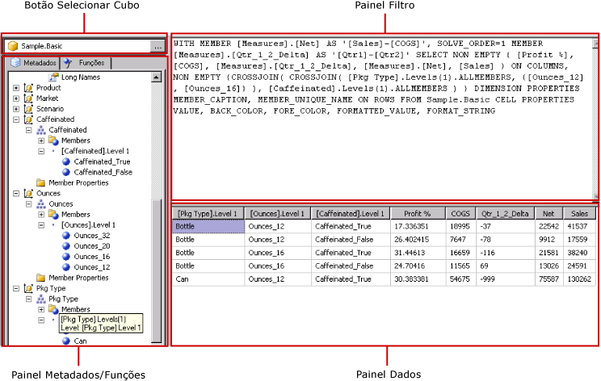

# Interface de usuário do Designer de Consulta do Hyperion Essbase
  [!INCLUDE[ssRSnoversion](../../includes/ssrsnoversion-md.md)] oferece um designer de consultas gráficas para criar consultas MDX (Multidimensional Expression) para uma fonte de dados do [!INCLUDE[extEssbase](../../includes/extessbase-md.md)] . O designer de consultas gráficas MDX tem dois modos: Design e Consulta. Cada modo contém um painel Metadados, do qual é possível arrastar membros de um cubo definido na fonte de dados para criar uma consulta MDX que recupere dados quando o relatório for processado.  
  
> [!IMPORTANT]  
>  Os usuários acessam fontes de dados quando criam e executam consultas. Você deve conceder permissões mínimas nas fontes de dados, como permissões somente leitura.  
  
 Para obter mais informações sobre como trabalhar com uma fonte de dados multidimensionais do [!INCLUDE[extEssbase](../../includes/extessbase-md.md)], consulte [Tipo de conexão do Hyperion Essbase &#40;SSRS&#41;](../../reporting-services/report-data/hyperion-essbase-connection-type-ssrs.md).  
  
 Esta seção descreve os botões da barra de ferramentas e os painéis do designer de consulta para cada modo do designer de consultas gráficas.  
  
## Designer de Consultas Gráficas no modo Design  
 Quando você edita uma consulta MDX para um conjunto de dados que usa uma fonte de dados do [!INCLUDE[extEssbase](../../includes/extessbase-md.md)] , o designer de consultas gráficas será aberto no modo Design.  
  
 A figura a seguir mostra os painéis do modo Design.  
  
   
  
 A tabela a seguir lista os painéis neste modo.  
  
|Painel|Função|  
|----------|--------------|  
|Botão Selecionar Cubo|Exibe o cubo selecionado no momento.|  
|Painel Metadados|Exibe uma lista hierárquica de cubos.|  
|Painel Membros Calculados|Exibe os membros calculados definidos no momento disponíveis para serem usados na consulta.|  
|Painel Filtro|Exibe os filtros a serem aplicados na consulta.|  
|Painel Dados|Exibe os resultados da execução da consulta.|  
  
 Você pode arrastar dimensões e medidas do painel Metadados e membros calculados do painel Membro Calculado para o painel Dados. Se o botão de alternância **Executar Automaticamente** na barra de ferramentas estiver ativo, o designer de consulta executará a consulta toda vez que você soltar um objeto no painel Dados. Se **Executar Automaticamente** estiver desativado, o designer de consulta não executará a consulta quando forem feitas alterações no painel Dados. Você pode executar manualmente a consulta usando o botão **Executar** na barra de ferramentas.  
  
 No painel Filtro, você pode selecionar os valores de dimensão para limitar os dados recuperados da fonte de dados. Os valores definidos no filtro no modo Design são exibidos na cláusula Where do MDX no modo Consulta.  
  
### Barra de ferramentas do Designer de Consultas Gráficas na barra de ferramentas do modo Design  
 A barra de ferramentas do designer de consulta fornece botões para ajudá-lo a criar consultas MDX por meio da interface gráfica. A tabela a seguir mostra os botões e descreve suas funções.  
  
|Botão|Description|  
|------------|-----------------|  
|**Editar como Texto**|Alterna entre o designer de consulta baseado em texto e o designer de consultas gráficas. Não disponível para esse tipo de fonte de dados.|  
|**Importar**|Importa uma consulta existente de um arquivo de definição de relatório (.rdl) no sistema de arquivos. Para obter mais informações, consulte [Conjuntos de dados inseridos e compartilhados de relatório &#40;Construtor de Relatórios e SSRS&#41;](../../reporting-services/report-data/report-embedded-datasets-and-shared-datasets-report-builder-and-ssrs.md).|  
||Atualiza metadados na fonte de dados.|  
||Exibe a caixa de diálogo **Construtor de Membro Calculado** . Use essa opção para criar ou editar expressões de um membro calculado, incluindo a definição da propriedade **Ordem de Resolução** .|  
||Alterna entre mostrar ou não células vazias no painel Dados. (Equivale a usar a cláusula NON EMPTY em MDX).|  
||Executa automaticamente a consulta e mostra o resultado toda vez que é feita uma alteração, por exemplo, excluindo uma coluna no painel Dados. Os resultados são mostrados no painel Dados.|  
||Exclui o item selecionado da consulta. Use esse botão para excluir as linhas selecionadas no painel Filtro.|  
||Executa a consulta e exibe os resultados no painel Dados.|  
||Cancela a consulta.|  
||Alterna entre o modo Design e o modo Consulta.|  
  
## Designer de consultas gráficas no modo Consulta  
 Para alterar o designer de consultas gráficas para o modo Consulta, clique no botão de alternância **Modo Design** na barra de ferramentas. A figura a seguir indica as partes do designer de consulta no modo Consulta.  
  
   
  
 A tabela a seguir descreve a função de cada painel.  
  
|Painel|Função|  
|----------|--------------|  
|Botão Selecionar Cubo|Exibe o cubo selecionado no momento.|  
|Painel Metadados/Funções|Exibe uma janela com guias que mostra uma lista de metadados ou funções disponíveis que pode ser usada para criar o texto de consulta.|  
|Painel Consulta|Exibe o texto da consulta atual.|  
|Painel Resultado|Exibe os resultados da consulta.|  
  
 No painel Metadados, você pode arrastar as medidas e dimensões da guia **Metadados** para o painel Consulta MDX. Você pode arrastar as funções da guia **Funções** para o painel Consulta MDX. Quando você executar a consulta, o painel Resultado exibirá os resultados da consulta MDX atual.  
  
### Barra de ferramentas do Designer de Consultas Gráficas no modo Consulta  
 A barra de ferramentas do designer de consulta fornece botões para ajudá-lo a criar consultas MDX por meio da interface gráfica. Os botões da barra de ferramentas são idênticos nos modos Design e Consulta, mas os botões a seguir não estão ativados no modo Consulta:  
  
-   **Editar como Texto**  
  
-   **Adicionar Membro Calculado** ()  
  
-   **Mostrar Células Vazias** ()  
  
-   **Executar automaticamente** ()  
  
## Consulte também  
 [Criar um conjunto de dados compartilhado ou um conjunto de dados inserido &#40;Construtor de Relatórios e SSRS&#41;](../../reporting-services/report-data/create-a-shared-dataset-or-embedded-dataset-report-builder-and-ssrs.md)   
 [Arquivo de configuração RSReportDesigner](../../reporting-services/report-server/rsreportdesigner-configuration-file.md)  
  
  
