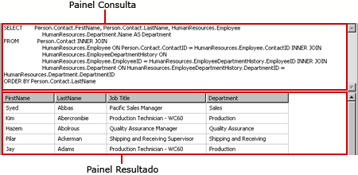
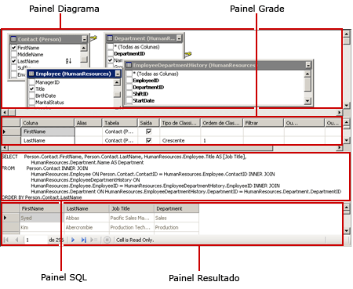
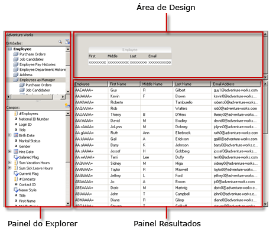
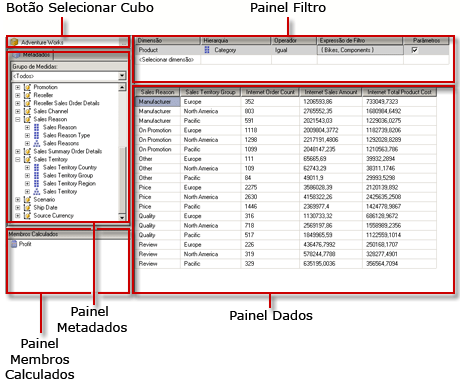
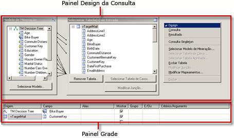
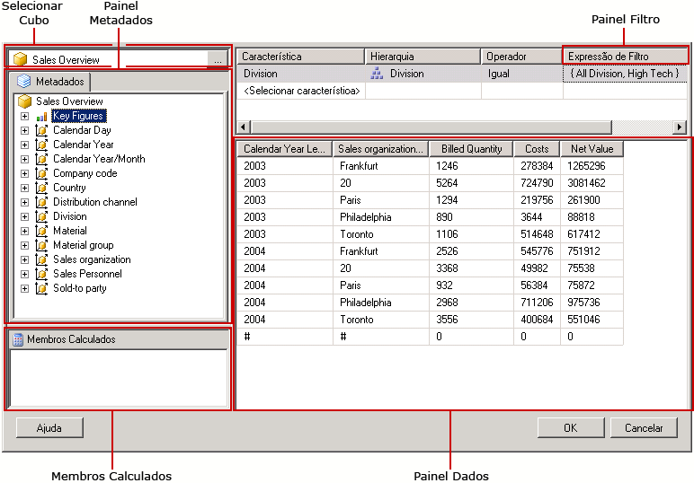
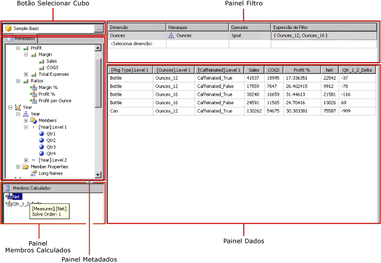

# Ferramentas de Design da Consulta (SSRS)
  [!INCLUDE[ssRSnoversion](../../includes/ssrsnoversion-md.md)] fornece várias ferramentas de design de consulta que podem ser usadas para criar consultas de conjunto de dados no Designer de Relatórios. Alguns designers de consulta fornecem modos alternativos para que você possa escolher se deseja trabalhar no modo visual ou diretamente na linguagem da consulta. Este tópico apresenta cada ferramenta e descreve o tipo de fonte de dados que cada uma suporta. As seguintes ferramentas são descritas neste tópico:  
  
-   [Designer de Consulta baseado em texto](#Textbased)  
  
-   [Designer de Consultas Gráficas](#Graphical)  
  
-   [Designer de Consulta do Modelo de Relatório](#Model)  
  
-   [Designer de Consulta MDX](#MDX)  
  
-   [Designer de Consulta DMX](#DMX)  
  
-   [Designer de Consulta BI SapNetWeaver](#SAPBW)  
  
-   [Designer de Consulta do Hyperion Essbase](#Hyperion)  
  
 Todas as ferramentas de design de consulta são executadas no ambiente de design de dados do [!INCLUDE[ssBIDevStudioFull](../../includes/ssbidevstudiofull-md.md)] quando você trabalha com um modelo de projeto de Servidor de Relatório ou de Assistente de Servidor de Relatório. Para obter mais informações sobre designers de consulta, consulte [Designers de Consulta do Reporting Services](http://msdn.microsoft.com/library/07efd3f1-804f-45f7-b62a-3e727a3d9835).  
  
 O tipo de fonte de dados com a qual você está trabalhando determina a disponibilidade de um designer de consulta específico.  
  
 Os tipos de fonte de dados que estão disponíveis em seu relatório são determinados pelas extensões de dados do [!INCLUDE[ssRSnoversion](../../includes/ssrsnoversion-md.md)] instaladas em seu cliente ou servidor de relatório. Para obter mais informações, consulte [Arquivo de configuração RSReportDesigner](../../reporting-services/report-server/rsreportdesigner-configuration-file.md) e [Arquivo de configuração RsReportServer.config](../../reporting-services/report-server/rsreportserver-config-configuration-file.md).  
  
 Uma extensão de processamento de dados e seu designer de consulta associado podem diferir em termos de suporte para fontes de dados das seguintes maneiras:  
  
-   **Por tipo de designer de consulta.** Por exemplo, uma fonte de dados do [!INCLUDE[ssNoVersion](../../includes/ssnoversion-md.md)] dá suporte a designers de consultas gráficas e baseadas em texto.  
  
-   **Por variação de linguagem de consulta.** Por exemplo, uma linguagem de consulta, como [!INCLUDE[tsql](../../includes/tsql-md.md)] , pode ter sintaxes diferentes dependendo do tipo da fonte de dados. As linguagens do [!INCLUDE[msCoName](../../includes/msconame-md.md)] [!INCLUDE[tsql](../../includes/tsql-md.md)] e do Oracle SQL apresentam algumas variações na sintaxe de um comando de consulta.  
  
-   **Por suporte para parte do esquema de um nome de objeto do banco de dados.** Quando uma fonte de dados usa esquemas como parte do identificador de objeto do banco de dados, o nome do esquema deve ser fornecido como parte da consulta para todos os nomes que não usam o esquema padrão. Por exemplo, `SELECT FirstName, LastName FROM [Person].[Person]`.  
  
-   **Por suporte para parâmetros de consulta.** Em termos de suporte, os provedores de dados diferem dos parâmetros. Alguns provedores de dados oferecem suporte a parâmetros nomeados; por exemplo, `SELECT Col1, Col2 FROM Table WHERE <parameter identifier><parameter name> = <value>`. Outros provedores de dados oferecem suporte a parâmetros não nomeados; por exemplo, `SELECT Col1, Col2 FROM Table WHERE <column name> = ?`. O identificador de parâmetro pode ser diferente com relação a provedores de dados; por exemplo, o [!INCLUDE[ssNoVersion](../../includes/ssnoversion-md.md)] usa o símbolo "arroba" (@), o Oracle usa dois-pontos (:). Em alguns provedores de dados, não há suporte para parâmetros.  
  
-   **Por capacidade de importar consultas.** Por exemplo, para uma fonte de dados do [!INCLUDE[ssNoVersion](../../includes/ssnoversion-md.md)] , você pode importar uma consulta de um arquivo de definição de relatório (.rdl) ou de um arquivo .sql.  
  
##   Designer de Consulta baseado em texto  
 O designer de consulta com base em texto é a ferramenta de criação de consulta padrão para a maioria das fontes de dados relacionais com suporte, inclusive [!INCLUDE[msCoName](../../includes/msconame-md.md)] [!INCLUDE[ssNoVersion](../../includes/ssnoversion-md.md)], Oracle, Teradata, OLE DB, XML e ODBC. Em comparação com o designer de consultas gráficas, essa ferramenta de design de consulta não valida a sintaxe de consulta durante o design da consulta. A imagem a seguir fornece uma ilustração do designer de consulta com base no texto.  
  
   
  
 O designer de consulta com base no texto é recomendado para criar consultas complexas, com o uso de procedimentos armazenados, consultando dados XML, e para escrever consultas dinâmicas. Dependendo da fonte de dados, talvez você possa alternar o botão **Editar como Texto** na barra de ferramentas para alternar entre o designer de consultas gráficas e o designer de consulta com base no texto. Para obter mais informações, consulte [Interface do usuário do Designer de Consultas baseado em texto](http://msdn.microsoft.com/library/44b7c664-03aa-494e-a484-052b318e810c).  
  
##   Designer de Consultas Gráficas  
 O designer de consultas gráficas é usado criar ou modificar consultas [!INCLUDE[tsql](../../includes/tsql-md.md)] executadas em um banco de dados relacional. Essa ferramenta de design de consulta é usada em vários produtos [!INCLUDE[msCoName](../../includes/msconame-md.md)] e em outros componentes do [!INCLUDE[ssNoVersion](../../includes/ssnoversion-md.md)] . Dependendo do tipo de fonte de dados, ele dá suporte aos modos de Texto, StoredProcedure e TableDirect. A imagem a seguir fornece uma ilustração do designer de consultas gráficas.  
  
   
  
 Você pode alternar o botão **Editar como Texto** na barra de ferramentas para alternar entre o designer de consultas gráficas e o designer de consulta com base no texto. Para obter mais informações, consulte [Interface do usuário do Designer de Consultas Gráficas](../../reporting-services/report-data/graphical-query-designer-user-interface.md).  
  
##   Designer de Consulta do Modelo de Relatório  
 O designer de consulta de Modelo de Relatório é usado para criar ou modificar consultas executadas em um modelo de relatório SMDL publicado em um servidor de relatório. Relatórios executados em modelos têm suporte para exploração de dados de clickthrough. A consulta determina o caminho da exploração de dados em tempo de execução. A imagem a seguir fornece uma ilustração do designer de consulta de Modelo de Relatório.  
  
   
  
 Para usar o designer de consulta do Modelo de Relatório, você deve definir uma fonte de dados que aponte para um modelo publicado. Quando você define um conjunto de dados para a fonte de dados, pode abrir a consulta de conjunto de dados no designer de consulta do Modelo de Relatório. O designer de consulta do Modelo de Relatório pode ser usado em modos gráficos ou com base no texto. Você pode alternar o botão **Editar como Texto** na barra de ferramentas para alternar entre o designer de consultas gráficas e o designer de consulta com base no texto. Para obter mais informações, consulte [Interface do usuário do Designer de Consulta do modelo de relatório](../../reporting-services/report-data/report-model-query-designer-user-interface.md).  
  
##   Designer de Consulta MDX  
 O designer de consulta MDX é usado para criar ou modificar consultas executadas em uma fonte de dados do [!INCLUDE[ssASnoversion](../../includes/ssasnoversion-md.md)] com cubos multidimensionais. A imagem a seguir fornece uma ilustração do designer de consulta MDX após a definição da consulta e do filtro.  
  
   
  
 Para usar o designer de consulta MDX, você deve definir uma fonte de dados que tenha um cubo do Analysis Services disponível, válido e que tenha sido processado. Quando você define um conjunto de dados para a fonte de dados, pode abrir a consulta no designer de consulta MDX. Se necessário, use os botões MDX e DMX na barra de ferramentas para alternar entre os modos MDX e DMX. Para obter mais informações, consulte [Interface do usuário do Designer de Consultas MDX do Analysis Services](../../reporting-services/report-data/analysis-services-mdx-query-designer-user-interface.md).  
  
##   Designer de Consulta DMX  
 O designer de consulta DMX é usado para criar ou modificar consultas executadas em uma fonte de dados do [!INCLUDE[ssASnoversion](../../includes/ssasnoversion-md.md)] com modelos de mineração. A imagem a seguir fornece uma ilustração do designer de consulta DMX após a seleção do modelo e das tabelas de entrada.  
  
   
  
 Para usar o designer de consulta DMX, você deve definir uma fonte de dados que tenha um modelo de mineração de dados válido disponível. Quando você define um conjunto de dados para a fonte de dados, pode abrir a consulta no designer de consulta DMX. Se necessário, use os botões MDX e DMX na barra de ferramentas para alternar entre os modos MDX e DMX. Após selecionar o modelo, você pode criar consultas de previsão de mineração de dados que fornecem dados a um relatório. Para obter mais informações, consulte [Interface do usuário do Designer de Consultas DMX do Analysis Services](../../reporting-services/report-data/analysis-services-dmx-query-designer-user-interface.md).  
  
##   Designer de consulta BI Sap NetWeaver  
 O designer de consulta do [!INCLUDE[SAP_DPE_BW_1](../../includes/sap-dpe-bw-1-md.md)] é usado para recuperar dados de um banco de dados do [!INCLUDE[SAP_DPE_BW_1](../../includes/sap-dpe-bw-1-md.md)] . Para usar esse designer de consulta, você deve ter uma fonte de dados do [!INCLUDE[SAP_DPE_BW_1](../../includes/sap-dpe-bw-1-md.md)] que tenha pelo menos uma consulta InfoCube, MultiProvider, ou habilitada para Web definida. A imagem a seguir fornece uma ilustração do designer de consulta [!INCLUDE[SAP_DPE_BW_1](../../includes/sap-dpe-bw-1-md.md)] . Para obter mais informações, consulte [Interface do usuário do Designer de Consulta do SAP NetWeaver BI](../../reporting-services/report-data/sap-netweaver-bi-query-designer-user-interface.md).  
  
   
  
##   Designer de Consulta do Hyperion Essbase  
 O designer de consulta [!INCLUDE[extEssbase](../../includes/extessbase-md.md)] é usado para recuperar dados de bancos de dados e aplicativos [!INCLUDE[extEssbase](../../includes/extessbase-md.md)] . A imagem a seguir fornece uma ilustração do designer de consulta [!INCLUDE[extEssbase](../../includes/extessbase-md.md)] .  
  
   
  
 Para usar este designer de consulta, você deve ter uma fonte de dados [!INCLUDE[extEssbase](../../includes/extessbase-md.md)] que tenha pelo menos um banco de dados.  
  
 Para obter mais informações, consulte [Interface do usuário do Designer de Consulta do Hyperion Essbase](../../reporting-services/report-data/hyperion-essbase-query-designer-user-interface.md).  
  
## Consulte também  
 [Ferramentas do Reporting Services](../../reporting-services/tools/reporting-services-tools.md)   
 [Conjuntos de dados de relatório &#40;SSRS&#41;](../../reporting-services/report-data/report-datasets-ssrs.md)   
 [Conexões de dados, fontes de dados e cadeias de conexão &#40;Construtor de Relatórios e SSRS&#41;](../../reporting-services/report-data/data-connections-data-sources-and-connection-strings-report-builder-and-ssrs.md)   
 [Reporting Services tutoriais &#40; SSRS &#41;](../../reporting-services/reporting-services-tutorials-ssrs.md)   
 [Fontes de dados com suporte no Reporting Services &#40; SSRS &#41;](../../reporting-services/report-data/data-sources-supported-by-reporting-services-ssrs.md)   
 [Criar uma fonte de dados inserida ou compartilhada &#40; SSRS &#41;](http://msdn.microsoft.com/library/b111a8d0-a60d-4c8b-b00a-51644b19c34b)  
  
  

