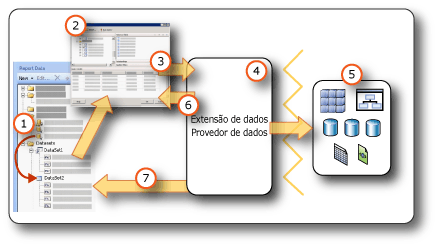

# <a name="report-embedded-datasets-and-shared-datasets-report-builder-and-ssrs"></a>Conjuntos de dados inseridos e compartilhados de relatório (Construtor de Relatórios e SSRS)
  Um conjunto de dados especifica os dados que você pode usar a partir de uma conexão de dados. Um conjunto de dados é baseado em uma conexão de dados que foi salva no relatório como uma fonte de dados inserida ou uma referência a uma fonte de dados compartilhada em um servidor de relatório. O conjunto de dados inclui uma consulta que especifica um conjunto de campos. Ao arrastar esses campos para a superfície de design, você cria expressões que avaliam os dados reais quando o relatório é executado.  
  
 Existem dois tipos de conjuntos de dados:  
  
-   **Conjunto de dados compartilhado.** Um conjunto de dados compartilhado é definido no servidor de relatório. Você pode procurar no servidor para criar um conjunto de dados compartilhado ou selecionar um predefinido para adicionar ao seu relatório. Use um conjunto de dados compartilhado para fornecer uma consulta que pode ser usada por mais de um relatório. Os conjuntos de dados compartilhados são armazenados no servidor de relatório e gerenciados separadamente dos relatórios ou das fontes de dados compartilhadas. Por exemplo, um administrador de servidor de relatório pode atualizar a consulta para tirar proveito da indexação aprimorada ou de outra otimização de desempenho de consulta.  
  
-   **Conjunto de dados incorporado.** Um conjunto de dados inserido é definido no e usado somente pelo relatório em que está inserido. Use um conjunto de dados inserido quando você desejar obter dados de uma fonte de dados externa a ser usada somente em um relatório. Os conjuntos de dados inseridos são úteis quando você deseja criar uma consulta que não tem outras dependências e que não precisa ser usada para vários relatórios.  
  
 Um conjunto de dados também inclui parâmetros, filtros e opções de dados que especificam diferenciação de caracteres, como maiúsculas e minúsculas, tipo kana, largura, acentuação e informações de ordenação.  
  
   
  
1.  **Conjuntos de dados no painel de Dados do Relatório** Um conjunto de dados é exibido no painel de Dados do Relatório depois que você cria um conjunto de dados inserido ou adiciona um conjunto de dados compartilhado. Um conjunto de dados se baseia em uma fonte de dados.  
  
2.  **Designer de Consultas** Quando você projeta uma consulta de conjunto de dados, o designer de consultas associado ao tipo de fonte de dados é aberto.  
  
3.  **Comando Query** O designer de consultas ajuda a criar um comando Query. A sintaxe do comando é determinada pelo provedor de dados.  
  
4.  **Extensão de dados/Provedor de Dados** A conexão com os dados pode ser feita por meio de várias camadas de acesso a dados.  
  
5.  **Fontes de dados internas** Recupera dados de bancos de dados relacionais, bancos de dados multidimensionais, listas do SharePoint, serviços Web ou modelos de relatório.  
  
6.  **Resultados da consulta** Você pode executar a consulta e ver um exemplo do conjunto de resultados. Você deve ter credenciais de tempo de design para executar uma consulta.  
  
7.  **Metadados do esquema** O provedor de dados executa um comando de consulta de esquema separado da consulta para recuperar metadados para a coleção de campos do conjunto de dados. Por exemplo, uma instrução [!INCLUDE[tsql](../../includes/tsql-md.md)] **SELECT** retorna os nomes de colunas para uma tabela do banco de dados. Use o painel de Dados do Relatório para expandir o conjunto de dados para exibir a coleção de campos do conjunto de dados.  
  
 Também é possível incluir dados em um relatório usando conjuntos de dados compartilhados e partes de relatório predefinidos. Esses itens já têm as informações de conexão de dados necessárias. Para obter mais informações, consulte [Conjuntos de dados de relatórios &#40;SSRS&#41;](../../reporting-services/report-data/report-datasets-ssrs.md) e [Partes de relatório &#40;Construtor de Relatórios e SSRS&#41;](../../reporting-services/report-design/report-parts-report-builder-and-ssrs.md).  
  
 Para obter mais informações sobre extensões de dados e tipos de fontes de dados internos, consulte [Adicionar dados de fontes de dados externas &#40;SSRS&#41;](../../reporting-services/report-data/add-data-from-external-data-sources-ssrs.md).  
  
> [!NOTE]  
>  [!INCLUDE[ssRBRDDup](../../includes/ssrbrddup-md.md)]  
  
##  <a name="Overview"></a> Compreendendo os conjuntos de dados de relatório e consultas  
 Um conjunto de dados de relatório contém um comando de consulta que é executado na fonte de dados externa e especifica quais dados serão recuperados. Para criar o comando de consulta, use o designer de consulta que está associado à extensão de dados para a fonte de dados externa. No designer de consulta, é possível executar o comando de consulta e exibir um conjunto de resultados. O conjunto de resultados é um conjunto retangular de linhas com nomes de coluna e linhas com o mesmo número de valores em cada linha. Não há suporte para dados hierárquicos, também conhecidos como *hierarquias imperfeitas*. Os nomes de colunas são salvos na definição de relatório como uma lista de campos do conjunto de dados.  
  
 Depois de adicionar conjuntos de dados a seu relatório, arraste campos de suas coleções de campos no painel de Dados do Relatório para tabelas, gráficos e outros itens de relatório que você usa para criar o layout de relatório. Para obter mais informações sobre como trabalhar com campos, consulte [Coleção de campos de conjuntos de dados &#40;Construtor de Relatórios e SSRS&#41;](../../reporting-services/report-data/dataset-fields-collection-report-builder-and-ssrs.md).  
  
### <a name="understanding-data-from-a-report-dataset"></a>Compreendendo dados a partir de um conjunto de dados de relatório  
 Dependendo da extensão dos dados, um conjunto de dados de relatório pode consistir nos seguintes tipos de dados:  
  
-   Um conjunto de resultados de um banco de dados relacional, que pode ser resultante da execução de comandos de banco de dados, procedimentos armazenados ou funções definidas pelo usuário. Caso vários conjuntos de resultados sejam recuperados com uma única consulta, apenas o primeiro será processado e todos os demais serão ignorados. Por exemplo, quando você executa a seguinte consulta no designer de consulta baseado em texto, apenas o conjunto de resultados de `Production.Product` é exibido no painel de resultados:  
  
    ```  
    SELECT ProductID FROM Production.Product  
    GO  
    SELECT ContactID FROM Person.Contact  
    ```  
  
-   Um conjunto de linhas bidimensional de fontes de dados multidimensionais que usam o protocolo XMLA (XML for Analysis). Alguns provedores de dados fornecem propriedades adicionais de célula e dimensão da fonte de dados que não é possível ver no conjunto de resultados, mas que estão disponíveis no relatório.  
  
-   Um conjunto de resultados bidimensional de fontes de dados XML que incluem elementos XML, seus atributos e elementos filhos.  
  
-   Um conjunto de resultados de qualquer provedor de dados do [!INCLUDE[dnprdnshort](../../includes/dnprdnshort-md.md)] registrado e configurado.  
  
-   Dados de um modelo de relatório criado para uma fonte de dados específica, com entidades predefinidas, relações entre entidades e campos. Para obter mais informações, consulte "Usando modelos de relatório como fontes de dados" na [documentação do Reporting Services](https://go.microsoft.com/fwlink/?linkid=121312) nos Manuais Online do SQL Server.  
  
 Quando o relatório é processado em tempo de execução, o conjunto de resultados real retornado para uma consulta pode ter zero ou mais linhas. Também é possível que as colunas definidas na consulta não sejam encontradas na fonte de dados. Valores nulos da fonte de dados são mapeados para o [!INCLUDE[dnprdnshort](../../includes/dnprdnshort-md.md)] valor **System.DBNull.Value**.  
  
 Para obter mais informações sobre campos de conjuntos de dados, consulte [Coleção de campos de conjuntos de dados &#40;Construtor de Relatórios e SSRS&#41;](../../reporting-services/report-data/dataset-fields-collection-report-builder-and-ssrs.md).  
  
### <a name="dataset-query"></a>Consulta do conjunto de dados  
 Ao executar uma consulta de conjunto de dados em um designer de consulta no tempo de design, você vê um conjunto de linhas da fonte de dados que mostra dados de exemplo. Em tempo de execução, quando um usuário exibe o relatório, a consulta de conjunto de dados pode produzir valores diferentes porque os dados foram alterados na fonte. Sempre que o relatório é processado, podem aparecer dados novos.  
  
 Quando você define cada conjunto de dados, o Construtor de Relatórios abre o designer de consulta que corresponde ao tipo de fonte de dados para ajudar a criar consultas. Por exemplo, para definir uma consulta para dados a partir de um banco de dados relacional do SQL Server, os assistentes de tabela/matriz, gráfico e mapa abrem uma interface gráfica que ajuda a criar a consulta; você só precisa selecionar os campos desejados no conjunto de dados.  
  
 Em um designer de consulta, você pode fazer o seguinte:  
  
-   Ativar/desativar entre exibição de consulta gráfica e baseada em texto. Usar o gráfico para explorar esquemas, tabelas, exibições e procedimentos armazenados na fonte de dados. Usar a exibição baseada em texto para digitar, colar ou exibir uma consulta existente, geralmente usado para uma consulta complexa que não pode ser exibida em um designer de consultas gráficas. Por exemplo, você pode importar uma consulta de um arquivo [!INCLUDE[tsql](../../includes/tsql-md.md)] (.sql), um relatório diferente no servidor de relatório, ou um arquivo de definição de relatório (.rdl) de um compartilhamento de arquivos.  
  
-   Execute a consulta para ver os dados. A consulta retorna um conjunto de resultados. As colunas no conjunto de resultados se transformam na coleção de campos no conjunto de dados. As linhas no resultado se transformam nos dados do conjunto de dados. Você pode trabalhar com a consulta até obter as colunas desejadas.  
  
-   Adicione parâmetros de consulta para ajudar a recuperar apenas os dados que você deseja para o relatório. Os parâmetros de consulta geram automaticamente parâmetros de relatório correspondentes. Para uma fonte de dados de modelo de relatório, o filtro que você especifica gera automaticamente um parâmetro de relatório compatível. Os parâmetros de relatório permitem que os usuários especifiquem os dados de relatório que desejam consultar quando executam o relatório. Por exemplo, o usuário seleciona de quais categorias de produto deseja dados. Quando o relatório executar, somente dados para essas categorias de produto aparecem no relatório.  
  
-   Importe uma consulta existente de outro relatório.  
  
 Designers de consulta podem fornecer um modo gráfico ou um modo de texto dependendo do tipo de fonte de dados. Se você escolher modo de texto, deve usar a sintaxe de consulta apropriada para a fonte de dados.  
  
 Ao definir um conjunto de dados de relatório, você pode configurar propriedades de dados na consulta ou aceitar os padrões definidos pelo provedor de dados. É possível alterar um tipo de dados usando uma das seguintes estratégias:  
  
-   Reescreva a consulta de conjunto de dados para converter especificamente um campo em um tipo de dados diferente.  
  
-   Edite o campo no conjunto de dados e forneça um formato personalizado.  
  
-   Crie um novo campo personalizado com base em um campo do banco de dados e forneça um formato personalizado.  
  
 Para obter mais informações, consulte [Coleção de campos de conjuntos de dados &#40;Construtor de Relatórios e SSRS&#41;](../../reporting-services/report-data/dataset-fields-collection-report-builder-and-ssrs.md).  
  
### <a name="importing-existing-queries-for-a-dataset"></a>Importando consultas existentes de um conjunto de dados  
 Ao criar um conjunto de dados, você pode criar uma nova consulta ou importar uma existente de um arquivo ou de outro relatório. Ao importar uma consulta de outro relatório, você pode escolher qual consulta deve ser importada da lista dos conjuntos de dados no relatório.  
  
 Só há suporte para os tipos de arquivo .sql e .rdl. Consultas de Linguagem MDX, consultas de Previsão de Mineração de Dados (DMX) e consultas de modelo (SMQL) somente podem ser geradas pelo designer de consulta associado.  
  
##  <a name="Compare"></a> Comparando e criando conjuntos de dados compartilhados e conjuntos de dados inseridos  
 Um conjunto de dados inserido é definido em um relatório ou em uma parte de relatório publicada. As alterações feitas em um conjunto de dados inserido afetam somente aquele relatório ou aquela parte de relatório.  
  
 Um conjunto de dados compartilhado é definido em um servidor de relatório ou site do SharePoint, é baseado em uma fonte de dados compartilhada e pode usado por vários relatórios e partes de relatório. As alterações feitas a uma definição de conjunto de dados compartilhada afetam todos os relatórios e todas as partes de relatório que a usam.  
  
 Ao adicionar um conjunto de dados compartilhado ao um relatório, a coleção de campos de conjunto de dados é atualizada para a definição atual no servidor de relatório. Você não recebe notificações de atualização quando são feitas alterações no servidor de relatório. Para sincronizar uma cópia local da coleção de campos com alterações feitas à definição de conjunto de dados compartilhada no servidor de relatório, você deve atualizar a coleção de campos local. Para saber mais, confira [Adicionar, editar e atualizar campos no painel de dados do relatório &#40;Construtor de Relatórios e SSRS&#41;](../../reporting-services/report-data/add-edit-refresh-fields-in-the-report-data-pane-report-builder-and-ssrs.md).  
  
 Os itens de relatório publicados contêm os conjuntos de dados inseridos e compartilhados dos quais eles dependem. Para obter mais informações, consulte [Partes de relatório e conjuntos de dados no Construtor de Relatórios](../../reporting-services/report-data/report-parts-and-datasets-in-report-builder.md).  
  
 A diferença entre as fontes de dados inseridas e compartilhadas está em como elas são criadas, armazenadas e gerenciadas. A tabela seguinte resume as diferenças entre fontes de dados inseridas e compartilhadas:  
  
|Descrição|Inserida<br /><br /> fonte de dados|Compartilhado<br /><br /> fonte de dados|  
|-----------------|------------------------------|----------------------------|  
|A conexão de dados é inserida na definição do relatório.|||  
|O ponteiro para a conexão de dados no servidor de relatório é inserido na definição do relatório.|||  
|Gerenciada no servidor de relatório|||  
|Obrigatória para conjuntos de dados compartilhados|||  
|Obrigatória para componentes|||  
  
 No Designer de Relatórios, você pode criar conjuntos de dados compartilhados como parte de um projeto de relatório e controlar se deve implantá-los em um servidor de relatório. Não é possível navegar até um servidor de relatório e selecionar um conjunto de dados compartilhado para adicionar ao seu relatório.  
  
 No Construtor de Relatórios, você pode fazer o seguinte:  
  
-   Para criar um conjunto de dados compartilhado, use o modo de exibição Design de Conjunto de Dados Compartilhado. É possível salvá-lo em um servidor de relatório ou site do SharePoint para compartilhar com outros relatórios. Você também pode navegar até o servidor de relatório e editar um conjunto de dados compartilhado existente. Nesta exibição, você pode criar uma consulta e definir todas as opções de conjunto de dados. Para obter mais informações, consulte [Modo de exibição de design de conjunto de dados compartilhado &#40;Construtor de Relatórios&#41;](../../reporting-services/report-builder/shared-dataset-design-view-report-builder.md).  
  
-   Para adicionar um conjunto de dados compartilhado a um relatório, abra o Construtor de Relatórios no Modo Design do Relatório. De um assistente ou do painel de dados do relatório, vá para o servidor de relatório e selecione o conjunto de dados compartilhado para adicionar seu relatório. Nesta exibição, você não pode alterar a consulta, exceto para adicionar campos. Você pode substituir outras opções de dados e adicionar filtros. Você não pode remover filtros.  
  
 A tabela a seguir compara as propriedades que podem ser configuradas para a definição do conjunto de dados compartilhado no servidor de relatório e a instância do conjunto de dados compartilhado na definição de relatório.  
  
|Propriedade|Observações sobre a configuração para a definição|Observações sobre a configuração para a instância|  
|--------------|--------------------------------------------|------------------------------------------|  
|Texto da consulta|Configure a consulta, incluindo a sua definição como expressão.|Não pode alterar a consulta.|  
|Parâmetros de consulta|Não pode referenciar parâmetros de relatório<br /><br /> Inclui valores padrão<br /><br /> Inclui um sinalizador Somente Leitura|Configure parâmetros que não são marcados como Somente Leitura na definição|  
|Filtros|Definir filtros|Não é possível exibir ou alterar filtros de conjuntos de dados que fazem parte da definição<br /><br /> Pode criar filtros adicionais|  
|fonte de dados|Deve ser uma fonte de dados compartilhada|Não pode alterar a fonte de dados|  
|Campos|Campos do comando query<br /><br /> Campos calculados não fazem parte da definição do conjunto de dados|Exiba os campos, mas não é possível alterá-los<br /><br /> A coleção de campos é estática com base na consulta no momento em que você adicionou o conjunto de dados compartilhado ao relatório. Para atualizar, clique em **Atualizar Campos** na caixa de diálogo **Propriedades do Conjunto de Dados** . A coleção de campos real é o que quer que seja retornado pela consulta atual na definição.<br /><br /> Adicionar campos calculados|  
|Dataset|Opções de dados, como a diferenciação de maiúsculas e minúsculas|Substitua as opções de dados na instância|  
  
 Para obter mais informações sobre como criar conjuntos de dados, consulte [Criar um conjunto de dados compartilhado ou inserido &#40;Construtor de Relatórios e SSRS&#41;](../../reporting-services/report-data/create-a-shared-dataset-or-embedded-dataset-report-builder-and-ssrs.md) e [Ferramentas do Reporting Services](../../reporting-services/tools/reporting-services-tools.md) na [Documentação do Reporting Services](https://go.microsoft.com/fwlink/?linkid=121312) nos Manuais Online do SQL Server.  
  
##  <a name="SortGroupFilter"></a> Filtrando, classificando e agrupando dados em um conjunto de dados  
 Os dados em um conjunto de dados são obtidos quando um comando de consultas é executado em uma fonte de dados externa. A sintaxe do comando de consulta para uma extensão de dados determina se os dados podem ser classificados ou agrupados. Classificar e agrupar ocorre na consulta antes de os dados serem recuperados para um relatório. Filtrar ocorre após os dados serem recuperados para um relatório.  
  
 Para obter mais informações, consulte [Filtrar, agrupar e classificar dados &#40;Construtor de Relatórios e SSRS&#41;](../../reporting-services/report-design/filter-group-and-sort-data-report-builder-and-ssrs.md).  
  
### <a name="filtering-data-in-a-dataset"></a>Filtrando os dados de um conjunto de dados  
 Os filtros fazem parte da definição de conjunto de dados em um relatório. Use filtros de conjunto de dados para especificar quais dados de um conjunto de dados devem ser incluídos em um relatório. Quando você especifica filtros em um conjunto de dados, todas as regiões de dados que são baseadas no conjunto de dados exibem somente os dados que passam pelos filtros do conjunto de dados.  
  
 Os filtros fazem parte de uma definição de conjuntos de dados compartilhados. Os filtros de conjunto de dados compartilhados afetam todos os relatórios que incluem o conjunto de dados compartilhado. Depois de adicionar um conjunto de dados compartilhado ao relatório, ou depois de adicionar um componente com um conjunto de dados compartilhado dependente, você pode criar filtros de conjunto de dados adicionais. Os filtros que você cria são usados somente no seu relatório, eles não fazem parte da definição de conjunto de dados compartilhada no servidor de relatório.  
  
 É possível definir filtros adicionais em uma região de dados ou grupo de regiões de dados. Você pode usar uma combinação de parâmetros e filtros que permitem que os usuários escolham os dados que eles desejam ver em um relatório. Para obter mais informações, consulte [Parâmetros de relatório &#40;Construtor de Relatórios e Designer de Relatórios&#41;](../../reporting-services/report-design/report-parameters-report-builder-and-report-designer.md).  
  
### <a name="sorting-data-in-a-dataset"></a>Classificando dados em um conjunto de dados  
 Em um conjunto de dados, a ordem dos dados é a ordem em que eles são recuperados da fonte de dados externa. Esta é a mesma ordem que você vê quando executa a consulta no designer de consulta. Se a sintaxe do comando de consulta dá suporte à classificação, você pode editar a consulta para classificar os dados na fonte, antes de eles serem retornados como dados de relatório. Por exemplo, para uma consulta do [!INCLUDE[tsql](../../includes/tsql-md.md)] , a instrução ORDER BY controla a ordem de classificação.  
  
 Para classificar dados depois que são retornados ao relatório, defina expressões de classificação em regiões de dados e grupos de regiões de dados. Para obter mais informações, consulte o tópico do tipo específico de região de dados, por exemplo, [Tabelas, matrizes e listas &#40;Construtor de Relatórios e SSRS&#41;](../../reporting-services/report-design/tables-matrices-and-lists-report-builder-and-ssrs.md).  
  
 Você pode usar uma combinação de parâmetros e expressões de classificação para permitir que os usuários escolham a ordem de classificação para os dados em um relatório. Para obter mais informações, consulte [Parâmetros de relatório &#40;Construtor de Relatórios e Designer de Relatórios&#41;](../../reporting-services/report-design/report-parameters-report-builder-and-report-designer.md).  
  
### <a name="grouping-data-in-a-dataset"></a>Agrupando dados em um conjunto de dados  
 Você não pode agrupar dados em um conjunto de dados. Para agregar dados em um conjunto de dados, você pode editar o comando de consulta para calcular agregações antes de os dados serem recuperados para um relatório. Eles são conhecidos como *agregações do servidor*. Em expressões, para identificar estes valores como agregações pré-calculadas, use a função de agregação. Para obter mais informações, consulte [Função Aggregate &#40;Construtor de Relatórios e SSRS&#41;](../../reporting-services/report-design/report-builder-functions-aggregate-function.md).  
  
##  <a name="Parameters"></a> Usando parâmetros e conjuntos de dados  
 Para uma consulta de banco de dados inserido que contém variáveis de consulta, parâmetros de consulta e os parâmetros de relatório correspondentes são automaticamente criados. Quando o relatório é executado, o valor do parâmetro do relatório é vinculado ao parâmetro de consulta do conjunto de dados. Dessa maneira, o comando de consulta que é executado na fonte de dados externa inclui os valores que são especificados para parâmetros de relatório. Os parâmetros de relatório permitem que um usuário escolha os dados que deseja ver no relatório. Veja como os parâmetros de consulta e de relatório são vinculados na página Caixa de diálogo Propriedades de Banco de Dados, Parâmetros.  
  
 Para um conjunto de dados compartilhado, os parâmetros de consulta fazem parte da definição de conjunto de dados compartilhada que pode ser gerenciada no servidor de relatório independentemente de um relatório. A lista seguinte descreve o suporte para valores de parâmetros de consulta:  
  
-   Pode ser baseado em expressão.  
  
-   Pode incluir valores padrão.  
  
-   Pode ser definido como somente leitura. Parâmetros somente leitura não podem ser alterados em uma instância do conjunto de dados compartilhado em um relatório.  
  
-   Não pode incluir referências à coleção de Parâmetros interna, que representa os parâmetros de relatório.  
  
 Para configurar os valores do parâmetro de consulta para um conjunto de dados compartilhado, no modo de design de conjunto de dados, navegue e abra um conjunto de dados compartilhado do servidor de relatório e defina as opções na página Caixa de diálogo Propriedades de Conjunto de Dados, Parâmetros. Para obter mais informações, consulte [Criar um conjunto de dados compartilhado ou um conjunto de dados inserido &#40;Construtor de Relatórios e SSRS&#41;](../../reporting-services/report-data/create-a-shared-dataset-or-embedded-dataset-report-builder-and-ssrs.md).  
  
 Para algumas fontes de dados multidimensionais, como o [!INCLUDE[ssASnoversion](../../includes/ssasnoversion-md.md)], o designer de consultas gráficas permite especificar filtros de consulta e selecionar uma opção para criar um parâmetro de consulta correspondente. Quando você seleciona a opção de parâmetro, a extensão de dados automaticamente cria um conjunto de dados de relatório separado para fornecer valores disponíveis em uma lista suspensa para aquele parâmetro. Por padrão, esses conjuntos de dados ocultos não são exibidos no painel de Dados do Relatório.  
  
 Parâmetros de relatório que são vinculados a parâmetros de consulta ajudam a filtrar os dados antes de eles serem retornados da fonte de dados externa. Você também pode filtrar dados no relatório criando filtros que fazem parte da definição de relatório. Para obter mais informações, consulte [Filtrar, agrupar e classificar dados &#40;Construtor de Relatórios e SSRS&#41;](../../reporting-services/report-design/filter-group-and-sort-data-report-builder-and-ssrs.md).  
  
### <a name="displaying-hidden-datasets"></a>Exibindo conjuntos de dados ocultos  
 Quando você cria uma consulta parametrizada para algumas fontes de dados multidimensionais, os conjuntos de dados que fornecem valores válidos para o parâmetro são automaticamente criados. Em alguns designers de consulta, você faz isto especificando filtros e selecionando a opção para criar parâmetros. Por padrão, esses conjuntos de dados não são exibidos no painel de Dados do Relatório, mas eles podem ser exibidos. Para obter mais informações, consulte [Mostrar conjuntos de dados ocultos para obter valores de parâmetros para dados multidimensionais &#40;Construtor de Relatórios e SSRS&#41;](../../reporting-services/report-data/show-hidden-datasets-for-parameter-values-multidimensional-data.md).  
  
##  <a name="Maps"></a> Usando mapas e conjuntos de dados  
 Se você incluir um mapa em seu relatório, forneça dados espaciais. Os dados espaciais devem ser obtidos de um conjunto de dados de relatório, de um mapa na galeria de mapas ou dos arquivos de forma ESRI. Os dados espaciais de um relatório ou de um arquivo de forma ESRI não aparecem como um conjunto de dados no painel de Dados do Relatório. Para obter mais informações, consulte [Mapas &#40;Construtor de Relatórios e SSRS&#41;](../../reporting-services/report-design/maps-report-builder-and-ssrs.md).  
  
##  <a name="Multiple"></a> Exibindo dados de vários conjuntos de dados  
 Normalmente, um relatório tem mais de um conjunto de dados. A seguinte lista descreve como é possível usar conjuntos de dados em um relatório:  
  
-   Você exibe os dados de cada conjunto de dados usando uma região de dados separada. Para obter mais informações, consulte [Regiões de dados e mapas &#40;Construtor de Relatórios e SSRS&#41;](../../reporting-services/report-design/data-regions-and-maps-report-builder-and-ssrs.md).  
  
-   Você pode vincular mais de uma região de dados ao conjunto de dados e fornecer várias exibições dos mesmos dados. Para obter mais informações, consulte [Vinculando várias regiões de dados ao mesmo conjunto de dados &#40;Construtor de Relatórios e SSRS&#41;](../../reporting-services/report-design/linking-multiple-data-regions-to-the-same-dataset-report-builder-and-ssrs.md).  
  
-   É possível usar conjuntos de dados para fornecer uma lista suspensa dos valores disponíveis ou padrão de um parâmetro de relatório. Para obter mais informações, consulte [Parâmetros de relatório &#40;Construtor de Relatórios e Designer de Relatórios&#41;](../../reporting-services/report-design/report-parameters-report-builder-and-report-designer.md).  
  
-   É possível vincular dados relacionados de vários conjuntos de dados usando parâmetros com relatórios detalhados ou sub-relatórios. Por exemplo, um relatório de vendas pode mostrar dados resumidos de todas as lojas, e um link para detalhamento pode especificar o identificador da loja como parâmetro de um relatório com uma consulta de conjunto de dados que recupera as vendas individuais da loja especificada. Para obter mais informações, consulte [Detalhamento, busca detalhada, sub-relatórios e regiões de dados aninhadas &#40;Construtor de Relatórios e SSRS&#41;](../../reporting-services/report-design/drillthrough-drilldown-subreports-and-nested-data-regions.md) e [Sub-relatórios &#40;Construtor de Relatórios e SSRS&#41;](../../reporting-services/report-design/subreports-report-builder-and-ssrs.md).  
  
-   Não é possível exibir dados detalhados de vários conjuntos de dados em uma única região de dados. No entanto, você pode exibir valores de função de agregação ou interna de vários conjuntos de dados em uma região de dados. Para obter mais informações, consulte [Referência de funções de agregação &#40;Construtor de Relatórios e SSRS&#41;](../../reporting-services/report-design/report-builder-functions-aggregate-functions-reference.md). Caso precise integrar dados detalhados de vários conjuntos de dados a uma região, você deve reescrever a consulta para recuperar os dados como um conjunto único.  
  
##  <a name="NoRows"></a> Exibindo uma mensagem quando nenhuma linha de dados está disponível  
 Durante o processamento do relatório, quando a consulta a um conjunto de dados é executada, o conjunto de resultados pode não conter nenhuma linha. No relatório renderizado, uma região de dados vinculada a um conjunto de dados vazio é exibida como uma região de dados vazia. É possível especificar um texto a ser exibido no relatório renderizado em lugar da região de dados vazia. Também é possível especificar uma mensagem para sub-relatórios quando as consultas a todos os conjuntos de dados não produzem nenhum dado em tempo de execução. Para obter mais informações, consulte [Definir uma mensagem Nenhum Dado para uma região de dados &#40;Construtor de Relatórios e SSRS&#41;](../../reporting-services/report-data/set-a-no-data-message-for-a-data-region-report-builder-and-ssrs.md).  
  
##  <a name="Options"></a> Definindo opções do conjunto de dados  
 Para fontes de dados que oferecem suporte a dados internacionais, você deve ajustar as propriedades para um conjunto de dados que afetam a ordem de classificação, as propriedades de caracteres internacionais e a diferenciação de maiúsculas e minúsculas. Entre essas propriedades estão maiúsculas e minúsculas, tipo kana, largura, acentuação e ordenação. Para obter mais informações sobre como definir essas propriedades, consulte [Caixa de diálogo Propriedades do Conjunto de Dados, Opções &#40;Construtor de Relatórios&#41;](../../reporting-services/report-data/dataset-properties-dialog-box-options-report-builder.md).  
  
## <a name="see-also"></a>Consulte Também  
 [Coleção de campos de conjuntos de dados &#40;Construtor de Relatórios e SSRS&#41;](../../reporting-services/report-data/dataset-fields-collection-report-builder-and-ssrs.md)   
 [Conexões de dados, fontes de dados e cadeias de conexão no Construtor de Relatórios](https://msdn.microsoft.com/library/7e103637-4371-43d7-821c-d269c2cc1b34)   
 [Conjuntos de dados de relatório &#40;SSRS&#41;](../../reporting-services/report-data/report-datasets-ssrs.md)  
  
  
