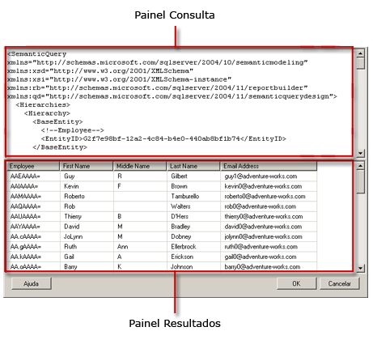

# Interface de usuário do Designer de Consulta do modelo de relatório
  O Designer de Relatórios fornece dois designers de consulta para ajudá-lo a especificar quais dados de uma fonte de dados do Modelo do Servidor de Relatórios você deseja usar em um relatório. Use o designer de consultas gráficas para explorar e escolher entidades de modelo e campos de entidade. Use o designer de consulta baseado em texto para trabalhar diretamente com uma especificação de linguagem SMDL em formato XML.  
  
> [!IMPORTANT]  
>  Os usuários acessam fontes de dados quando criam e executam consultas. Você deve conceder permissões mínimas nas fontes de dados, como permissões somente leitura.  
  
## Designer de Consultas Gráficas  
 O Designer de Relatórios oferece um designer de consultas gráficas que pode ser usado para desenvolver e executar consultas SMDL que, durante o processamento do relatório, preenche a coleção de campos de um conjunto de dados de relatório. O designer de consultas gráficas é dividido em três áreas ou painéis.  
  
 A imagem a seguir define cada painel.  
  
   
  
 A tabela a seguir descreve a função de cada painel.  
  
|Painel|Função|  
|----------|--------------|  
|Painel Explorer|Exibe representações gráficas das entidades e campos de entidade no modelo. Use este painel para explorar entidades, entidades relacionadas e campos.|  
|Área de Design|Exibe uma lista de campos do modelo. Use esse painel para organizar o layout dos campos que você escolheu.|  
|Results pane|Exibe os resultados da consulta. Para executar a consulta, clique com o botão direito do mouse em qualquer painel e, em seguida, clique em **Executar** ou clique no botão **Executar** () na barra de ferramentas.|  
  
 Se você alterar as informações nos painéis Explorer ou Área de Design, o conteúdo do painel Resultado será afetado quando você clicar em **Executar**.  
  
 Para executar ações em um determinado painel, como excluir uma coluna na área de design, clique com o botão direito do mouse na coluna e clique no comando no menu.  
  
### Barra de ferramentas do designer de consultas gráficas  
 Também é possível usar os botões da barra de ferramentas ao criar a consulta. A tabela a seguir lista os botões na barra de ferramentas e descreve suas funções.  
  
|Botão|Descrição|  
|------------|-----------------|  
|**Editar como Texto**|Alterna entre o designer de consulta baseado em texto e o designer de consultas gráficas. A consulta para uma fonte de dados do Modelo do Servidor de Relatórios usa uma especificação SMQL (linguagem de consulta de modelo semântico) em XML.|  
|**Importar**|Importa uma consulta existente de um arquivo de definição de relatório (.rdl) no sistema de arquivos. Para obter mais informações, consulte [Conjuntos de dados inseridos e compartilhados de relatório &#40;Construtor de Relatórios e SSRS&#41;](../../reporting-services/report-data/report-embedded-datasets-and-shared-datasets-report-builder-and-ssrs.md).|  
||Desfaz a última ação.|  
||Refaz a última ação.|  
||Executa a consulta e exibe as linhas resultantes no painel Resultado.|  
||Abre a caixa de diálogo **Filtrar Dados** , que permite especificar quais dados você gostaria de filtrar. Os filtros podem ser especificados independentemente dos dados atuais que constam na Área de Design.|  
  
## Designer de Consulta baseado em texto  
 Ao criar uma consulta do conjunto de dados do Modelo do Servidor de Relatórios, a seleção padrão é o designer de consultas gráficas. Para mudar para o designer de consulta baseado em texto, clique no botão de alternância **Editar como Texto** na barra de ferramentas.  
  
 O designer de consulta baseado em texto é composto por dois painéis: um painel de consulta SMQL e um painel de resultados. Essa exibição do designer de consulta é útil principalmente quando você já tiver uma especificação de consulta SMQL de outra fonte e quiser colá-la no painel de consulta. Ao contrário do designer de consultas gráficas, o designer de consulta baseado em texto não verifica a sintaxe nem reestrutura a consulta. Ao clicar em **Executar** , na barra de ferramentas, a consulta executa a fonte de dados e os resultados são exibidos no painel Resultado.  
  
 A imagem a seguir define cada painel.  
  
   
  
 A tabela a seguir descreve a função de cada painel.  
  
|Painel|Função|  
|----------|--------------|  
|Painel Consulta|Exibe o texto de especificação SMQL.|  
|Painel Resultado|Exibe os resultados da consulta. Para executar a consulta, clique com o botão direito do mouse em qualquer painel e clique em **Executar**ou no botão **Executar** da barra de ferramentas.|  
  
### Barra de ferramentas do Designer de Consulta baseado em texto  
 Também é possível usar os botões da barra de ferramentas ao criar a consulta. A tabela a seguir lista os botões na barra de ferramentas e descreve suas funções.  
  
|Botão|Descrição|  
|------------|-----------------|  
|**Editar como Texto**|Alterna entre o designer de consulta baseado em texto e o designer de consultas gráficas.|  
|**Importar**|Importa uma consulta de um relatório existente.|  
||Executa o texto da consulta e exibe o conjunto de linhas resultante no painel Resultado.|  
  
## Consulte Também  
 [Ferramentas de Design da Consulta &#40;SSRS&#41;](../../reporting-services/report-data/query-design-tools-ssrs.md)   
 [Adicionar dados de fontes de dados externas &#40;SSRS&#41;](../../reporting-services/report-data/add-data-from-external-data-sources-ssrs.md)   
 [Conexão de modelo de relatório &#40;SSRS&#41;](../../reporting-services/report-data/report-model-connection-ssrs.md)   
 [Arquivo de configuração RSReportDesigner](../../reporting-services/report-server/rsreportdesigner-configuration-file.md)  
  
  
