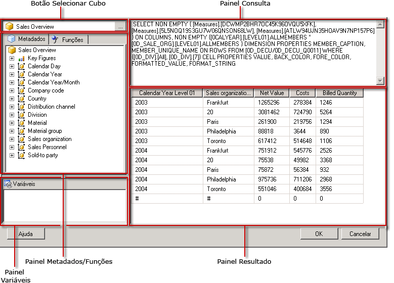

# Interface do usuário do Designer de Consulta do SAP NetWeaver BI
  [!INCLUDE[ssRSnoversion](../../includes/ssrsnoversion-md.md)] fornece um designer de consultas gráficas para criar consultas MDX para uma fonte de dados do SAP NetWeaver® Business Intelligence. O designer de consultas gráficas MDX tem dois modos: Design e Consulta. Cada modo contém um painel Metadados, do qual é possível arrastar membros de um InfoCube, MultiProvider ou consulta habilitada para Web definida na fonte de dados para criar uma consulta MDX que recupere dados quando o relatório for processado.  
  
> [!IMPORTANT]  
>  Os usuários acessam fontes de dados quando criam e executam consultas. Você deve conceder permissões mínimas nas fontes de dados, como permissões somente leitura.  
  
 Para obter mais informações sobre como trabalhar com uma fonte de dados multidimensionais do SAP, consulte [Tipo de conexão SAP NetWeaver BI &#40;SSRS&#41;](../../reporting-services/report-data/sap-netweaver-bi-connection-type-ssrs.md).  
  
 Esta seção descreve os botões da barra de ferramentas e os painéis do designer de consulta para cada modo do designer de consultas gráficas.  
  
## Designer de Consultas Gráficas no modo Design  
 Quando você edita uma consulta de um conjunto de dados que usa uma fonte de dados do [!INCLUDE[SAP_DPE_BW_1](../../includes/sap-dpe-bw-1-md.md)] , o designer de consultas gráficas é aberto no modo Design. A figura a seguir mostra os painéis do modo Design.  
  
   
  
 A tabela a seguir lista os painéis neste modo.  
  
|Painel|Função|  
|----------|--------------|  
|Botão Selecionar Cubo|Exibe o InfoCube, MultiProvider ou consulta habilitada para Web selecionada no momento.|  
|Painel Metadados|Exibe uma lista hierárquica de InfoCubes, MultiProviders e consultas. As consultas criadas na fonte de dados podem ser exibidas no cubo correspondente.|  
|Painel Membros Calculados|Exibe os membros calculados definidos no momento disponíveis para serem usados na consulta.|  
|Painel Dados|Exibe os resultados da execução da consulta.|  
  
 Você pode arrastar dimensões e imagens chave do painel Metadados e membros calculados do painel Membro Calculado para o painel Dados. Se o botão de alternância **Executar Automaticamente** na barra de ferramentas estiver ativo, o designer de consulta executará a consulta toda vez que você soltar um objeto no painel Dados. Se **Executar Automaticamente** estiver desativado, o designer de consulta não executará a consulta quando forem feitas alterações no painel Dados. Você pode executar manualmente a consulta usando o botão **Executar** na barra de ferramentas.  
  
### Barra de ferramentas do Designer de Consultas Gráficas na barra de ferramentas do modo Design  
 A barra de ferramentas do designer de consulta fornece botões para ajudá-lo a criar consultas MDX por meio da interface gráfica. A tabela a seguir descreve os botões e as respectivas funções.  
  
|Botão|Description|  
|------------|-----------------|  
|**Editar como Texto**|Alterna entre o designer de consulta baseado em texto e o designer de consultas gráficas. Não disponível para esse tipo de fonte de dados.|  
|**Importar**|Importa uma consulta existente de um arquivo de definição de relatório (.rdl) no sistema de arquivos. Para obter mais informações, consulte [Conjuntos de dados inseridos e compartilhados de relatório &#40;Construtor de Relatórios e SSRS&#41;](../../reporting-services/report-data/report-embedded-datasets-and-shared-datasets-report-builder-and-ssrs.md).|  
||Atualiza metadados na fonte de dados.|  
||Exibe a caixa de diálogo **Construtor de Membro Calculado** .|  
||Alterna entre mostrar ou não células vazias no painel Dados. (Equivale a usar a cláusula NON EMPTY em MDX).|  
||Executa automaticamente a consulta e mostra o resultado toda vez que é feita uma alteração, por exemplo, excluindo uma coluna no painel Dados. Os resultados são mostrados no painel Dados.|  
||Exclui da consulta a coluna selecionada no painel Dados.|  
||Exiba a caixa de diálogo **Variáveis** . Esse botão é habilitado somente quando o cubo selecionado é um cubo de Consulta (porque somente os cubos de consulta oferecem suporte a variáveis). Quando você atribui um valor padrão a uma variável, um parâmetro de relatório correspondente é criado.|  
||Executa a consulta e exibe os resultados no painel Dados.|  
||Cancela a consulta.|  
||Alterna entre o modo Design e o modo Consulta.|  
  
## Designer de consultas gráficas no modo Consulta  
 Para alterar o designer de consultas gráficas para o modo Consulta, clique no botão de alternância **Modo Design** na barra de ferramentas.  
  
 A figura a seguir indica as partes do designer de consulta no modo Consulta.  
  
   
  
 A tabela a seguir descreve a função de cada painel.  
  
|Painel|Função|  
|----------|--------------|  
|Botão Selecionar Cubo|Exibe o InfoCube, MultiProvider ou outro cubo selecionado no momento.|  
|Painel Metadados/Funções|Exibe uma janela com guias que mostra uma lista de metadados ou funções disponíveis que pode ser usada para criar o texto de consulta.|  
|Painel Variáveis|Exibe as variáveis definidas no momento disponíveis para serem usadas na consulta.|  
|Painel Consulta|Exibe o texto da consulta atual.|  
|Painel Resultado|Exibe os resultados da consulta.|  
  
 No painel Metadados, você pode arrastar as principais figuras e dimensões da guia **Metadados** para o painel Consulta MDX; o nome técnico dos metadados é inserido no cursor. Você pode arrastar as funções da guia **Funções** para o painel Consulta MDX. Quando você executar a consulta, o painel Resultado exibirá os resultados da consulta MDX atual.  
  
 Se seu cubo selecionado for uma consulta habilitada para Web; você será solicitado a definir valores padrão estáticos para as variáveis existentes. Em seguida, você pode arrastar as variáveis para o painel Consulta MDX.  
  
 Os painéis Metadados e Variável exibem nomes amigáveis. Quando você solta os objetos no painel Consulta MDX, você verá os nomes técnicos necessários pela fonte de dados inseridos na consulta MDX.  
  
### Barra de ferramentas do Designer de Consultas Gráficas no modo Consulta  
 A barra de ferramentas do designer de consulta fornece botões para ajudá-lo a criar consultas MDX por meio da interface gráfica. Os botões da barra de ferramentas são idênticos nos modos Design e Consulta, mas os botões a seguir não estão ativados no modo Consulta:  
  
-   **Editar como Texto**  
  
-   **Adicionar Membro Calculado** ()  
  
-   **Mostrar células vazias** ()  
  
-   **Executar automaticamente** ()  
  
-   **Excluir** ()  
  
## Consulte também  
 [Criar um conjunto de dados compartilhado ou um conjunto de dados inserido &#40;Construtor de Relatórios e SSRS&#41;](../../reporting-services/report-data/create-a-shared-dataset-or-embedded-dataset-report-builder-and-ssrs.md)   
 [Arquivo de configuração RSReportDesigner](../../reporting-services/report-server/rsreportdesigner-configuration-file.md)  
  
  
