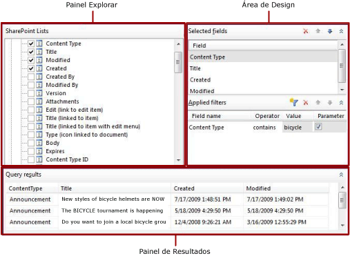

# Designer de Consulta de Lista do SharePoint (Construtor de Relatórios)
  O Designer de Relatórios e o Designer de Relatórios fornecem um designer de consultas gráficas e um designer de consulta baseado em texto para ajudá-lo a criar uma consulta que especifica os dados a serem recuperados do site do SharePoint para um conjunto de dados de relatório. Use o designer de consultas gráficas para explorar os metadados de lista do SharePoint, criar uma consulta interativamente e exibir os resultados da consulta. Use o designer de consulta baseado em texto para exibir a consulta que foi criada pelo designer de consultas gráficas, modificar uma consulta ou digitar os comandos da consulta. Também é possível importar uma consulta existente de um arquivo ou relatório.  
  
> [!IMPORTANT]  
>  Os usuários acessam fontes de dados quando criam e executam consultas. Você deve conceder permissões mínimas nas fontes de dados, como permissões somente leitura.  
  
## Designer de Consultas Gráficas  
 No designer de consultas gráficas, você pode explorar o site do SharePoint, crie interativamente o comando que recupera dados da lista do SharePoint para um conjunto de dados. Você escolhe os campos a serem incluídos no conjunto de dados e, opcionalmente, especifica os filtros que limitam os dados desse conjunto. Você pode especificar que os filtros sejam usados como parâmetros e fornecer o valor do filtro em tempo de execução.  
  
 As listas do SharePoint incluem um número grande de campos específicos do SharePoint que poderiam não ser úteis para serem incluídos em relatórios. O designer de consultas fornece uma opção para ocultar esses campos para tornar mais fácil e rápido determinar os campos para uso.  
  
 O designer de consultas gráficas é dividido em três áreas  
  
-   Explore o painel no qual você seleciona os itens de lista e seus campos a serem usados.  
  
-   Área de design na qual você compila a consulta.  
  
-   Painéis de resultados nos quais você exibe os resultados da consulta.  
  
 A figura a seguir mostra o designer de consultas gráficas quando ele é usado com as listas do SharePoint.  
  
   
  
 A tabela a seguir descreve a função de cada painel.  
  
 [Listas do SharePoint](#DatabaseView)  
 Exibe listas do SharePoint e os campos em cada item na lista.  
  
 [Campos selecionados](#SelectedFields)  
 Exibe a lista de nomes de campos da lista do SharePoint dos itens selecionados no painel Listas do SharePoint. Esses campos se tornam a coleção de campos do conjunto de dados de relatório.  
  
 [Filtros aplicados](#AppliedFilters)  
 Exibe uma lista de campos e critérios de filtragem para tabelas ou exibições na exibição Banco de Dados.  
  
 [Resultados da consulta](#QueryResults)  
 Exibe dados de exemplo do conjunto de resultados da consulta gerada automaticamente.  
  
###   Painel de Listas do SharePoint  
 O painel Listas do SharePoint exibe os metadados para objetos de banco de dados que você tem as permissões para exibir, o que é determinado pela conexão da fonte de dados e credenciais. A exibição hierárquica exibe objetos de banco de dados organizados por esquema de banco de dados. Expanda o nó de cada esquema para exibir tabelas, exibições, procedimentos armazenados e funções com valor de tabela. Expanda uma tabela ou exibição para exibir as colunas.  
  
###   Painel Campos Selecionados  
 O painel Campos Selecionados exibe os campos de item de lista que você seleciona para itens de lista do SharePoint. Os campos mostrados neste painel se tornam a coleção de campos do conjunto de dados de relatório. Depois de criar um conjunto de dados e uma consulta, expanda o painel de dados do relatório para exibir a coleção de campos de um conjunto de dados de relatório. Esses campos representam os dados que você pode exibir em tabelas, gráficos e outros itens de relatório ao exibir um relatório.  
  
 Para adicionar ou remover campos deste painel, marque ou desmarque as caixas de seleção para os campos de tabela ou exibição no painel Listas do SharePoint.  
  
###   Painel Filtros Aplicados  
 O painel Filtros Aplicados exibe os critérios usados para limitar o número de linhas de dados recuperadas no tempo de execução. Os critérios especificados nesse painel são usados para gerar uma cláusula [!INCLUDE[tsql](../../includes/tsql-md.md)] WHERE. Quando você seleciona a opção de parâmetro, um parâmetro de relatório é criado automaticamente. Os parâmetros de relatório se baseiam em parâmetros de consulta que permitem a um usuário especificar valores para a consulta, para controlar os dados no relatório.  
  
 As seguintes colunas são exibidas:  
  
-   **Nome do Campo** Exibe o nome do campo ao qual aplicar os critérios.  
  
-   **Operador** Exibe a operação a ser usada na expressão de filtro.  
  
-   **Valor** Exibe o valor a ser usado na expressão de filtro.  
  
-   **Parâmetro** Exibe a opção para adicionar um parâmetro à consulta. Use as propriedades do conjunto de dados para exibir as relações entre o parâmetro de consulta e o parâmetro do relatório.  
  
###   Painel Resultados da Consulta  
 O painel Resultados da Consulta exibe os resultados para a consulta automaticamente gerada que é especificada por seleções nos outros painéis. As colunas do conjunto de resultados são os campos que você especifica no painel Campos Selecionados e os dados de linha são limitados pelos filtros que você especifica no painel Filtros Aplicados.  
  
 Esses dados representam valores da fonte de dados no momento em que você executa a consulta. Os dados não são salvos na definição de relatório. Os dados reais do relatório são recuperados quando o relatório é processado.  
  
 A ordem de classificação do conjunto de resultados é determinada pela ordem em que os dados são recuperados da fonte de dados. A ordem de classificação pode ser alterada modificando-se a consulta ou após a recuperação dos dados para o relatório.  
  
### Barra de ferramentas do designer de consultas gráficas  
 A barra de ferramentas do designer de consulta relacional fornece os seguintes botões para ajudá-lo a especificar ou exibir os resultados de uma consulta.  
  
|Botão|DESCRIÇÃO|  
|------------|-----------------|  
|**Editar como Texto**|Alterna para o designer de consulta baseado em texto para exibir a consulta gerada automaticamente ou para modificar a consulta.|  
|**Importaçãoação**|Importa uma consulta existente de um arquivo ou relatório. Há suporte para os tipos de arquivo .sql e .rdl.|  
|**Executar consulta**|Executa a consulta. O painel Resultados da consulta exibe o conjunto de resultados.|  
|**Mostrar Campos Ocultos**|Alterne para mostrar ou ocultar os campos que foram gerados automaticamente pelo SharePoint como o ProgId e Nível para itens de link do SharePoint, mas que normalmente não são usados em relatórios. Ocultar esses campos torna a lista de campos mais curta e mais fácil de usar.|  
  
## Consulte Também  
 [Ferramentas de Design da Consulta &#40;SSRS&#41;](query-design-tools-ssrs.md)  
  
  
