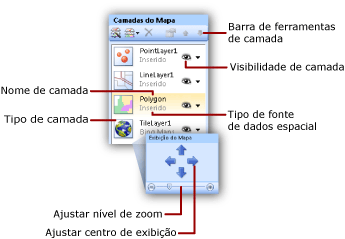

# Adicionar, alterar ou excluir um mapa ou uma camada do mapa (Construtor de Relatórios e SSRS)
  Um mapa é uma coleção de camadas. Quando você adiciona um mapa a um relatório paginado do [!INCLUDE[ssRSnoversion_md](../../includes/ssrsnoversion-md.md)] , define a primeira camada. Você pode criar mais camadas usando o assistente de camada do mapa.  
  
 A maneira mais fácil para adicionar, remover ou alterar as opções de uma camada é usar o assistente de camada do mapa. Você também pode alterar manualmente as opções do painel Mapa. Para exibir o painel **Mapa** , clique no mapa na superfície de design do relatório. A figura seguinte exibe as partes do painel:  
  
   
  
 As camadas do mapa são desenhadas de baixo para cima para que apareçam no painel Mapa. Na figura anterior, a camada da peça é desenhada primeiro e a camada de polígono é desenhada por último. As camadas desenhadas posteriormente podem ocultar elementos do mapa nas camadas desenhadas antes. Você pode alterar a ordem das camadas usando as teclas de direção na barra de ferramentas do painel Mapa. Para mostrar ou ocultar camadas, alterne o ícone de visibilidade. Você pode alterar a transparência de uma camada na página **Visibilidade** da caixa de diálogo **Dados da Camada** .  
  
 A tabela a seguir exibe os ícones da barra de ferramentas do painel **Mapa** .  
  
|Símbolo|Descrição|Quando usar|  
|------------|-----------------|-----------------|  
||Assistente de Camada do Mapa|Para adicionar uma camada usando um assistente, clique em **Assistente de nova camada**.|  
||Adicionar Camada|Para adicionar uma camada manualmente, clique em **Adicionar Camada**e clique no tipo de camada do mapa a ser adicionada.|  
||Camada de Polígono|Adicione uma camada do mapa que exiba áreas ou formas com base em conjuntos de coordenadas de polígonos.|  
||Camada de Linha|Adicione uma camada do mapa que exiba caminhos ou rotas com base em conjuntos de coordenadas de linha.|  
||Camada de Ponto|Adicione uma camada do mapa que exiba locais com base em conjuntos de coordenadas de ponto.|  
||Camada de Peça|Adicione uma camada do mapa que exiba peças de Mapa do Bing que correspondam à área de exibição do mapa atual definida pelo visor.|  
  
 Na parte inferior do painel Mapa fica a área de exibição de Mapa. Para alterar o centro ou as opções de zoom do mapa, use as teclas de direção para ajustar o centro do visor e o controle deslizante para ajustar o nível de zoom.  
  
 Para obter mais informações sobre camadas, consulte [Mapas &#40;Construtor de Relatórios e SSRS&#41;](../../reporting-services/report-design/maps-report-builder-and-ssrs.md).  
  
> [!NOTE]  
>  [!INCLUDE[ssRBRDDup](../../includes/ssrbrddup-md.md)]  
  
##   Para adicionar uma camada com o assistente de camada do mapa  
  
-   Na Faixa de Opções, no menu **Inserir** , clique em **Mapa**e em **Mapa Wizard.** . O assistente o permite a adição de uma camada ao mapa existente. A maioria das páginas de assistente são idênticas entre o assistente de mapa e o assistente de camada do mapa.  
  
     Para obter mais informações, consulte [Assistente de Mapa e Assistente de Camada do Mapa &#40;Construtor de Relatórios e SSRS&#41;](../../reporting-services/report-design/map-wizard-and-map-layer-wizard-report-builder-and-ssrs.md).  
  
##   Para alterar opções para uma camada usando o assistente de camada do mapa  
  
-   Execute o assistente de camada do mapa. Este assistente permite alterar opções para uma camada que você criou usando o assistente de camada do mapa. No painel Mapa, clique com o botão direito do mouse na camada e, na barra de ferramentas, clique no botão do assistente de camada ().  
  
     Para obter mais informações, consulte [Assistente de Mapa e Assistente de Camada do Mapa &#40;Construtor de Relatórios e SSRS&#41;](../../reporting-services/report-design/map-wizard-and-map-layer-wizard-report-builder-and-ssrs.md).  
  
##   Para adicionar uma camada de pontos, linhas ou polígonos da barra de ferramentas do painel Mapa  
  
1.  Clique no mapa até que o painel Mapa apareça.  
  
2.  Na barra de ferramentas, clique no botão **Adicionar Camada** e, na lista suspensa, clique no tipo de camada que você deseja adicionar: **ponto**, **linha** ou **polígono**.  
  
    > [!NOTE]  
    >  Embora seja possível adicionar uma camada do mapa e configurá-la manualmente, é recomendável usar o assistente de camada do mapa para adicionar novas camadas. Para iniciar o assistente por meio da barra de ferramentas do painel Mapa, clique no botão do assistente de camada ().  
  
3.  Clique com o botão direito do mouse na camada e clique em **Dados da Camada**.  
  
4.  Em **Usar dados espaciais de**, selecione a fonte de dados espaciais. As opções variam com base na seleção.  
  
     Para visualizar dados analíticos de seu relatório nesta camada, faça o seguinte:  
  
    1.  Clique em **Dados Analíticos**.  
  
    2.  Em **Conjunto de dados analítico**, clique no nome do conjunto de dados que contém os dados analíticos e os campos de correspondência para criar uma relação entre dados analíticos e espaciais.  
  
    3.  Clique em **Adicionar**.  
  
    4.  Digite o nome do campo de correspondência do conjunto de dados espaciais.  
  
    5.  Digite o nome do campo de correspondência do conjunto de dados analíticos.  
  
     Para obter mais informações sobre como vincular dados espaciais e analíticos, veja [Personalizar os dados e a exibição de um mapa ou de uma camada do mapa &#40;Construtor de Relatórios e SSRS&#41;](../../reporting-services/report-design/customize-the-data-and-display-of-a-map-or-map-layer-report-builder-and-ssrs.md).  
  
5.  [!INCLUDE[clickOK](../../includes/clickok-md.md)]  
  
##   Para filtrar dados analíticos para a camada  
  
1.  Clique no mapa até que o painel Mapa apareça.  
  
2.  Clique com o botão direito do mouse na camada do painel Mapa e clique em  **Dados da Camada**.  
  
3.  Clique em **Filtros**.  
  
4.  Defina uma equação de filtro para limitar os dados analíticos que são usados na exibição de mapa. Para obter mais informações, consulte [Exemplos de equações de filtro &#40;Construtor de Relatórios e SSRS&#41;](../../reporting-services/report-design/filter-equation-examples-report-builder-and-ssrs.md).  
  
##   Para controlar propriedades de ponto para uma camada de ponto ou para pontos centrais de polígono  
  
1.  Selecione **Geral** na caixa de diálogo **Propriedades do Ponto do Mapa** para alterar as opções de rótulo, dica de ferramenta e tipo de marcador dos seguintes elementos do mapa:  
  
    -   Todos os pontos dinâmicos ou inseridos em uma camada de ponto. As regras de cores, as regras de tamanho e as regras de tipo de marcador para pontos substituem essas opções. Para substituir as opções de um ponto inserido específico, use a página [Map Embedded Point Properties Dialog Box, Marker](https://msdn.microsoft.com/library/3c5eb1c5-d40a-424f-aa7c-43b112f42dec) .  
  
    -   O ponto central de todos os polígonos dinâmicos ou inseridos em uma camada de polígono. As regras de cores, as regras de tamanho e as regras de tipo de marcador para pontos centrais substituem essas opções. Para substituir as opções de um ponto central específico, use a página [Caixa de diálogo Mapear Propriedades de Ponto Inserido, Marcador](https://msdn.microsoft.com/library/3c5eb1c5-d40a-424f-aa7c-43b112f42dec) .  
  
##   Para especificar dados inseridos como uma fonte de dados espaciais  
  
1.  Clique no mapa até que o painel Mapa apareça.  
  
2.  Clique com o botão direito do mouse na camada e clique em **Dados da Camada**.  
  
3.  Em **Usar dados espaciais de**, selecione **Dados inseridos no relatório**.  
  
4.  Para carregar elementos do mapa de um relatório existente ou criar elementos do mapa com base em um arquivo ESRI, clique em **Procurar**, aponte para o arquivo e clique em **Abrir**. Os elementos do mapa são inseridos nesta definição de relatório. Os dados espaciais para os quais você aponta devem corresponder ao tipo da camada. Por exemplo, para uma camada de ponto, você deve apontar para dados espaciais que especifiquem conjuntos de coordenadas de ponto.  
  
5.  Em **Campo espacial**, especifique o nome do campo que contém dados espaciais. Talvez seja necessário determinar esse nome com base na fonte de dados espaciais.  
  
    > [!NOTE]  
    >  Se você não souber o nome do campo e navegou para um Arquivo de Forma ESRI, use a opção **Link para arquivo de forma ESRI** , em vez desta opção.  
  
6.  [!INCLUDE[clickOK](../../includes/clickok-md.md)]  
  
##   Para especificar um Arquivo de Forma ESRI como uma fonte de dados espaciais  
  
1.  Clique no mapa até que o painel Mapa apareça.  
  
2.  Clique com o botão direito do mouse na camada e clique em **Dados da Camada**.  
  
3.  Em **Usar dados espaciais de**, selecione **Link para Arquivo de Forma ESRI**.  
  
4.  Em **Nome do arquivo**, digite o local de um Arquivo de Forma ou clique em **Procurar** para selecionar um Arquivo de Forma ESRI.  
  
    > [!NOTE]  
    >  Se o Arquivo de Forma estiver em seu computador local, os dados espaciais serão inseridos na definição de relatório. Para recuperar os dados dinamicamente quando o relatório for processado, carregue o arquivo ESRI .shp e seu arquivo de suporte .dbf no servidor de relatório. Para obter mais informações, consulte [Carregar um arquivo ou relatório](../reports/upload-a-file-or-report-report-manager.md).  
  
5.  [!INCLUDE[clickOK](../../includes/clickok-md.md)]  
  
##   Para especificar um campo de conjunto de dados de relatório como uma fonte de dados espaciais  
  
1.  Clique no mapa até que o painel Mapa apareça.  
  
2.  Clique com o botão direito do mouse na camada e clique em **Dados da Camada**.  
  
3.  Em **Usar dados espaciais de**, selecione **Campo espacial em um conjunto de dados**.  
  
4.  Em **Nome de conjunto de dados**, clique no nome de um conjunto de dados no relatório que contém os dados espaciais desejados.  
  
5.  Em **Nome do campo espacial**, clique no nome do campo no conjunto de dados que contém dados espaciais.  
  
6.  [!INCLUDE[clickOK](../../includes/clickok-md.md)]  
  
##   Para adicionar uma camada de peça  
  
1.  Clique no mapa até que o painel Mapa apareça.  
  
2.  Na barra de ferramentas, clique no botão **Adicionar Camada** e, na lista suspensa, clique em **Camada Lado a Lado**.  
  
    > [!NOTE]  
    >  Para obter mais informações sobre o uso de peças de mapa do Bing no seu relatório, consulte [termos de uso adicionais](https://go.microsoft.com/fwlink/?LinkId=151371).  
  
3.  Clique com o botão direito do mouse na camada lado a lado no painel Mapa e clique em **Propriedades da Peça**.  
  
4.  Em **Opções da peça**, selecione um estilo de peça. Se as peças de mapas do Bing estiverem disponíveis, a camada na superfície de design será atualizada com o estilo selecionado.  
  
    > [!NOTE]  
    >  Também é possível adicionar uma camada de peça quando você adiciona uma camada de polígonos, linhas ou pontos no assistente de Mapa ou de Camada do Mapa. Na página **Escolher as opções de dados espaciais e de exibição do mapa** , selecione a opção **Adicionar um plano de fundo do Bing Maps a esta exibição do mapa**.  
  
##   Para alterar a ordem de desenho de uma camada  
  
1.  Clique no mapa até que o painel Mapa apareça.  
  
2.  Clique na camada no painel Mapa para selecioná-la.  
  
3.  Na barra de ferramentas do painel Mapa, clique na seta para cima ou para baixo para alterar a ordem de desenho de cada camada.  
  
##   Para alterar a transparência de um polígono, linha ou camada de ponto  
  
1.  Clique no mapa até que o painel Mapa apareça.  
  
2.  Clique com o botão direito do mouse na camada e clique em **Dados da Camada**.  
  
3.  Clique em **Visibilidade**.  
  
4.  Em **Opções de Transparência**, digite um valor que represente a transparência percentual, por exemplo, **40**. A transparência zero (0)% significa que a camada é opaca. Uma transparência de 100% significa que você não visualizará a camada no relatório.  
  
5.  [!INCLUDE[clickOK](../../includes/clickok-md.md)]  
  
##   Para alterar a transparência de uma camada de peça  
  
1.  Clique no mapa até que o painel Mapa apareça.  
  
2.  Clique com o botão direito do mouse na camada e clique em **Propriedades da Peça**.  
  
3.  Clique em **Visibilidade**.  
  
4.  Em **Opções de Transparência**, digite um valor que represente a transparência percentual, por exemplo, **40**.  
  
5.  [!INCLUDE[clickOK](../../includes/clickok-md.md)]  
  
##   Para especificar uma conexão segura para uma camada de peça  
  
1.  Clique no mapa até que o painel Mapa apareça.  
  
2.  No painel Mapa, clique na camada da peça para selecioná-la. O painel Propriedades exibe as propriedades da camada da peça.  
  
3.  No painel Propriedades, defina UseSecureConnection como **True**.  
  
 A conexão com o serviço Web Bing Maps usará o serviço HTTP SSL a fim de recuperar peças de mapas para essa camada. O protocolo TLS era anteriormente conhecido como protocolo SSL.
  
##   Para especificar o idioma para rótulos de peças  
  
1.  Por padrão, para estilos de peças que exibem rótulos, o idioma é determinado a partir da localidade padrão do Construtor de Relatórios. Você pode personalizar a configuração de idioma para rótulos de peças das maneiras a seguir.  
  
    -   Clique no mapa fora do visor para selecioná-lo. No painel Propriedades, para a propriedade TileLanguage, selecione um valor de cultura na lista suspensa.  
  
    -   Clique no plano de fundo do relatório para selecioná-lo. No painel Propriedades, para a propriedade Language, selecione um valor de cultura na lista suspensa.  
  
     A ordem de precedência para configurar o idioma do rótulo do ladrilho é: propriedade do relatório Language, localidade padrão para o Construtor de Relatórios e propriedade de mapa TileLanguage.  
  
##   Para ocultar uma camada condicionalmente com base no nível de zoom do visor  
  
1.  Defina as opções de **Visibilidade** para controlar a exibição de uma camada do mapa.  
  
    -   No painel de Camadas do Mapa, clique com o botão direito do mouse em uma camada para selecioná-la e, na barra de ferramentas de Camadas do Mapa, clique nas Propriedades para abrir as **Propriedades da Camada do Mapa**.  
  
    -   Clique em **Visibilidade**.  
  
    -   Na visibilidade de camada, selecione **Mostrar ou ocultar com base no valor de zoom**.  
  
    -   Insira os valores de zoom mínimo e máximo para quando exibir a camada.  
  
    -   Opcional. Insira um valor para a transparência.  
  
     Você também pode ocultar condicionalmente a camada. Para obter mais informações, consulte [Ocultar um item &#40;Construtor de Relatórios e SSRS&#41;](../../reporting-services/report-builder/hide-an-item-report-builder-and-ssrs.md).  
  
## Consulte Também  
 [Mapas &#40;Construtor de Relatórios e SSRS&#41;](../../reporting-services/report-design/maps-report-builder-and-ssrs.md)   
 [Solucionar problemas de relatórios: Mapear relatórios &#40;Construtor de Relatórios e SSRS&#41;](../../reporting-services/report-design/troubleshoot-reports-map-reports-report-builder-and-ssrs.md)  
  
  
