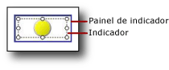

# Adicionar ou excluir um indicador (Construtor de Relatórios e SSRS)
  Em uma relatório paginado do [!INCLUDE[ssRSnoversion_md](../../includes/ssrsnoversion-md.md)] , os indicadores são medidores mínimos que transmitem o estado de um único valor de dados em um relance. Para obter mais informações sobre eles, consulte [Indicadores &#40;Construtor de Relatórios e SSRS&#41;](../../reporting-services/report-design/indicators-report-builder-and-ssrs.md).  
  
 Geralmente, os indicadores são colocados nas células de uma tabela ou matriz, mas você também pode usar indicadores por si mesmos, lado a lado com indicadores ou indicadores inseridos.  
  
 Quando você adiciona um indicador pela primeira vez, por padrão ele é configurado para usar porcentagens como unidades de medida. Os intervalos de porcentagens são distribuídos uniformemente nos membros do conjunto de indicadores, e o escopo de valores mostrados pelo indicador é o pai do indicador, como uma tabela ou matriz.  
  
 Você pode atualizar os valores e os estados de indicadores. Para obter mais informações, consulte os tópicos a seguir:  
  
-   [Alterar os ícones de indicadores e os conjuntos de indicadores &#40;Construtor de Relatórios e SSRS&#41;](../../reporting-services/report-design/change-indicator-icons-and-indicator-sets-report-builder-and-ssrs.md)  
  
-   [Definir e configurar unidades de medida &#40;Construtor de Relatórios e SSRS&#41;](../../reporting-services/report-design/set-and-configure-measurement-units-report-builder-and-ssrs.md)  
  
-   [Definir o escopo da sincronização &#40;Construtor de Relatórios e SSRS&#41;](../../reporting-services/report-design/set-synchronization-scope-report-builder-and-ssrs.md)  
  
 Como um indicador é posicionado dentro do painel de medidores, você precisa selecionar o indicador, em vez do painel, quando deseja configurar o indicador usando a caixa de diálogo **Propriedades de Indicadores** ou o painel **Propriedades** . A imagem a seguir mostra um indicador selecionado em seu painel de medidores.  
  
   
  
> [!NOTE]  
>  Dependendo da largura da coluna e do comprimento de valores de dados, pode haver quebra de texto em células da tabela ou matriz e o texto pode ser exibido em várias linhas. Quando isso ocorre, o ícone de indicador pode ser alongado e mudar de forma. Isso pode tornar o ícone de indicador menos legível. Coloque o indicador dentro de um retângulo para garantir que o ícone nunca seja alongado.  
  
## Para adicionar um indicador a uma tabela ou matriz  
  
1.  Abra um relatório existente ou crie um novo relatório que contenha uma tabela e matriz com os dados a serem exibidos. Para obter mais informações, consulte [Tabelas &#40;Construtor de Relatórios e SSRS&#41;](../../reporting-services/report-design/tables-report-builder-and-ssrs.md) ou [Matrizes](../../reporting-services/report-design/create-a-matrix-report-builder-and-ssrs.md).  
  
2.  Insira uma coluna em sua tabela ou matriz. Para obter mais informações, consulte [Inserir ou excluir uma coluna &#40;Construtor de Relatórios e SSRS&#41;](../../reporting-services/report-design/insert-or-delete-a-column-report-builder-and-ssrs.md).  
  
3.  Opcionalmente, na guia **Inserir**, clique em **Retângulo** e em uma célula na nova coluna.  
  
4.  Na guia **Inserir** , clique em **Indicador**e em uma célula na nova coluna.  
  
     Se você adicionou um retângulo em uma célula, clique nessa célula.  
  
5.  Na caixa de diálogo **Selecionar Estilo de Indicador** , no painel esquerdo, clique no tipo de indicador desejado e no conjunto de indicadores.  
  
6.  Clique em **OK**.  
  
7.  Clique no indicador. O painel **Dados do Medidor** é exibido.  
  
8.  Na área **Valores** , na lista suspensa **(Não Especificado)** , clique no campo cujos valores você deseja exibir como indicador.  
  
     O indicador é configurado para usar valores padrão. Por padrão, os indicadores são configurados para usar porcentagens como unidades de medida e os intervalos de porcentagens são distribuídos uniformemente entre os membros do indicador, e o valor que o indicador transmite usa o escopo do grupo mais próximo.  
  
## Para excluir um indicador de uma tabela ou matriz  
  
1.  Clique com o botão direito do mouse no indicador a ser excluído e clique em **Excluir**.  
  
    > [!NOTE]  
    >  Um indicador pode ser posicionado dentro de um painel de medidores que contenha outros indicadores ou medidores. Se os painéis de medidores contiverem vários itens, clique no indicador para excluí-lo, não no painel de medidores. Se você clicar e depois excluir o painel de medidores, os painéis de medidores e todos os itens neles serão excluídos.  
  
2.  Clique em **Excluir**.  
  
## Consulte também  
 [Indicadores &#40;Construtor de Relatórios e SSRS&#41;](../../reporting-services/report-design/indicators-report-builder-and-ssrs.md)  
  
  

