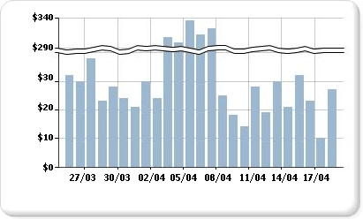

# Adicionar quebras de escala a um gráfico (Construtor de Relatórios e SSRS)

  Uma quebra de escala é uma faixa desenhada em uma área de plotagem de um gráfico para indicar uma quebra de continuidade entre os valores altos e baixos em um eixo de valor (normalmente, o vertical, ou eixo y). Use uma quebra de escala para exibir dois intervalos distintos na mesma área do gráfico.  
  
   
  
> [!NOTE]  
>  Não é possível especificar onde posicionar a quebra de escala no gráfico. O gráfico usa seus próprios cálculos com base nos valores do conjunto de dados para determinar se há separação suficiente entre os intervalos de dados para desenhar uma quebra de escala no eixo de valor (eixo y) em tempo de execução.  
  
 Um exemplo de gráfico com quebras de escala está disponível como um relatório de exemplo. Para obter mais informações sobre como baixar esse relatório de exemplo e outros, consulte [(Relatórios de exemplo do Construtor de relatórios e Designer de relatórios) do](http://go.microsoft.com/fwlink/?LinkId=198283).  
  
> [!NOTE]  
>  [!INCLUDE[ssRBRDDup](../../includes/ssrbrddup-md.md)]  
  
### Para habilitar quebras de escala no gráfico  
  
1.  Clique com o botão direito do mouse no eixo vertical e clique em **Propriedades do Eixo**. A caixa de diálogo **Propriedades VerticalAxis** é aberta.  
  
2.  Marque a caixa de seleção **Habilitar quebras de escala** .  
  
### Para alterar o estilo da quebra de escala  
  
1.  Abra o painel Propriedades.  
  
2.  Na superfície de design, clique com o botão direito do mouse no eixo y do gráfico. As propriedades do objeto do eixo y (denominado Eixo do Gráfico, por padrão) são exibidas no painel Propriedades.  
  
3.  Na seção **Escala** , expanda a propriedade ScaleBreakStyle.  
  
4.  Altere os valores das propriedades ScaleBreakStyle, como BreakLineType e Spacing. Para obter mais informações sobre propriedades de quebra de escala, consulte [Exibindo uma série com vários intervalos de dados em um gráfico &#40;Construtor de Relatórios e SSRS&#41;](../../reporting-services/report-design/displaying-a-series-with-multiple-data-ranges-on-a-chart.md).  

## Próximas etapas

[Gráficos](../../reporting-services/report-design/charts-report-builder-and-ssrs.md)   
[Formatando um gráfico](../../reporting-services/report-design/formatting-a-chart-report-builder-and-ssrs.md)   
[Caixa de diálogo de propriedades do eixo, opções de eixo](http://msdn.microsoft.com/library/b276e210-7a12-48ae-971b-7dabae51df11)  

Mais perguntas? [Tente fazer o fórum do Reporting Services](http://go.microsoft.com/fwlink/?LinkId=620231)
