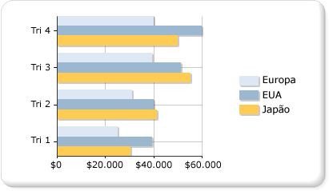

# Gráficos de barras (Construtor de Relatórios e SSRS)
  Um gráfico de barras exibe as séries como conjuntos de barras horizontais. O gráfico de barras plano está bem relacionado ao gráfico de colunas, que exibe uma série como conjuntos de barras verticais e o gráfico de barras de intervalo, que exibe uma série como conjuntos de barras horizontais com pontos de início e término variáveis.  
  
 O gráfico de barras é o único tipo de gráfico que exibe dados horizontalmente. Por esse motivo, é conhecido por representar dados que ocorrem com o tempo, com uma data inicial e final finita. Também é conhecido por mostrar informações categóricas uma vez que as categorias podem ser exibidas horizontalmente. Para obter mais informações sobre como adicionar dados a um gráfico de barras, consulte [Gráficos &#40;Construtor de Relatórios e SSRS&#41;](../../reporting-services/report-design/charts-report-builder-and-ssrs.md).  
  
 A ilustração a seguir mostra um gráfico de barras. O gráfico de barras é o mais adequado para esses dados porque todas as três séries compartilham um período de tempo comum, permitindo que sejam feitas comparações válidas.  
  
   
  
> [!NOTE]  
>  [!INCLUDE[ssRBRDDup](../../includes/ssrbrddup-md.md)]  
  
## Variações do gráfico de barras  
  
-   **Empilhado**. Um gráfico de barras no qual várias séries são empilhadas verticalmente. Se houver apenas uma série em seu gráfico, o gráfico de barras empilhadas exibirá o mesmo que o gráfico de barras.  
  
-   **Por cento empilhado**. Um gráfico de barras no qual várias séries são empilhadas verticalmente para se ajustarem a 100% da área do gráfico. Se houver apenas uma série em seu gráfico, todas as barras serão ajustadas a 100% da área do gráfico.  
  
-   **3D clusterizado**. Um gráfico de barras que mostra séries individuais em linhas separadas em um gráfico 3D.  
  
-   **Cilindro em 3D**. Um gráfico de barras que molda as barras como cilindros em um gráfico 3D.  
  
## Considerações de dados para gráficos de barras  
  
-   Os gráficos de barras têm os eixos invertidos. O eixo de categoria é o eixo vertical (ou "eixo y") e o eixo de valor é o eixo horizontal (ou "eixo x"). Isso significa que em um gráfico de barras, você tem mais espaço para rótulos de categoria a serem exibidos ao longo do eixo y como uma lista que é lida da parte superior para a inferior.  
  
-   Gráficos de barras e colunas são usados com mais frequência para mostrar comparações entre grupos. Se mais de três séries estiverem presentes no gráfico, considere usar um gráfico de colunas ou barras empilhadas. Você também pode coletar gráficos de barras ou colunas empilhadas em vários grupos se tiver várias séries em seu gráfico.  
  
-   Um gráfico de barras exibe valores da esquerda para a direita, que pode ser mais intuitivo ao exibir dados relacionados a durações.  
  
-   Se estiver procurando para adicionar barras a uma tabela ou matriz no relatório, considere usar um medidor linear em vez de um gráfico de barras. O medidor linear é projetado para mostrar um valor em vez de vários grupos para que seja mais flexível para ser usado em uma lista ou região de dados da tabela. Para obter mais informações, consulte [Medidores &#40;Construtor de Relatórios e SSRS&#41;](../../reporting-services/report-design/gauges-report-builder-and-ssrs.md).  
  
-   Você pode adicionar estilos de desenho especiais às barras individuais em um gráfico de barras para aumentar seu impacto visual. Os estilos de desenho incluem entalhe, relevo, cilindro e claro para escuro. Esses efeitos são projetados para melhorar a aparência de seu gráfico 2D. Se estiver usando um gráfico 3D, os estilos de desenho ainda serão aplicados, mas podem não ter o mesmo efeito. Para obter mais informações sobre como adicionar um estilo de desenho a um gráfico de barras, consulte [Adicionar estilos de bisel, relevo e textura a um gráfico &#40;Construtor de Relatórios e SSRS&#41;](../../reporting-services/report-design/chart-effects-add-bevel-emboss-or-texture-report-builder.md).  
  
-   Os gráficos de barras empilhados sobrepõem séries para criar uma pilha de barras. Você tem a opção de separar o gráfico de barras empilhado em vários conjuntos de pilhas para cada categoria. O gráfico empilhado agrupado é exibido lado a lado. É possível haver qualquer número de séries empilhadas agrupadas em um gráfico.  
  
-   Quando rótulos de ponto de dados são mostrados em um gráfico de barras, os rótulos são colocados fora de cada barra. Isso pode fazer com que os rótulos se sobreponham quando as barras ocuparem todo o espaço dividido dentro da área do gráfico. É possível alterar a posição dos rótulos de ponto de dados exibida para cada barra definindo a propriedade **BarLabelStyle** no painel Propriedades.  
  
-   Caso haja muitos pontos de dados no conjunto de dados em relação ao tamanho do gráfico, o tamanho das colunas ou das barras e do espaço entre elas é reduzido. Para definir manualmente a largura das colunas de um gráfico, modifique a largura, em pixels, alterando a propriedade **PointWidth** . Por padrão, o valor dessa propriedade é 0,8. Quando você aumenta a largura das colunas ou das barras em um gráfico, o espaço entre cada coluna ou barra diminui.  
  
## Consulte Também  
 [Gráficos &#40;Construtor de Relatórios e SSRS&#41;](../../reporting-services/report-design/charts-report-builder-and-ssrs.md)   
 [Tipos de gráficos &#40;Construtor de Relatórios e SSRS&#41;](../../reporting-services/report-design/chart-types-report-builder-and-ssrs.md)   
 [Pontos de dados vazios e nulos em gráficos &#40;Construtor de Relatórios e SSRS&#41;](../../reporting-services/report-design/empty-and-null-data-points-in-charts-report-builder-and-ssrs.md)   
 [Gráficos de colunas &#40;Construtor de Relatórios e SSRS&#41;](../../reporting-services/report-design/column-charts-report-builder-and-ssrs.md)   
 [Gráficos de intervalo &#40;Construtor de Relatórios e SSRS&#41;](../../reporting-services/report-design/range-charts-report-builder-and-ssrs.md)   
 [Formatando as cores da série em um gráfico &#40;Construtor de Relatórios e SSRS&#41;](../../reporting-services/report-design/formatting-series-colors-on-a-chart-report-builder-and-ssrs.md)   
 [Formatando rótulos dos eixos de um gráfico &#40;Construtor de Relatórios e SSRS&#41;](../../reporting-services/report-design/formatting-axis-labels-on-a-chart-report-builder-and-ssrs.md)   
 [Formatando a legenda em um gráfico &#40;Construtor de Relatórios e SSRS&#41;](../../reporting-services/report-design/chart-legend-formatting-report-builder.md)   
 [Adicionar estilos de bisel, alto-relevo e textura a um gráfico &#40;Construtor de Relatórios e SSRS&#41;](../../reporting-services/report-design/chart-effects-add-bevel-emboss-or-texture-report-builder.md)   
 [Tutorial: Adicionando um gráfico de barras a um relatório (Construtor de Relatórios)](http://go.microsoft.com/fwlink/?LinkId=198052)   
 [Tutorial: Adicionando um gráfico de barras a um relatório](http://go.microsoft.com/fwlink/?LinkId=198042)  
  
  
