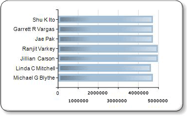

# Efeitos de gráfico – Adicionar bisel, alto-relevo ou textura (Construtor de Relatórios)
  Ao usar determinados tipos de gráficos, você pode especificar um efeito de desenho para aumentar o impacto visual do seu gráfico. Esses efeitos de desenho só são aplicados à série de seu gráfico. Eles não têm nenhum efeito sobre qualquer outro elemento do gráfico.  
  
 Quando você está usando qualquer variante de um gráfico de pizza ou rosca, você pode especificar uma borda suave ou um estilo de desenho côncavo, semelhante aos efeitos de inclinação e relevo que podem ser aplicados a uma imagem.  
  
 Quando você está usando qualquer variante de um gráfico de colunas ou barras, você pode aplicar estilos de textura, como cilindro, entalhe e claro para escuro às colunas ou barras individuais.  
  
 Além desses estilos de desenho, você pode adicionar bordas e sombras a muitos elementos de gráfico para dar a ilusão de profundidade. Para obter mais informações sobre outras maneiras de formatar o gráfico, consulte [Formatando um gráfico &#40;Construtor de Relatórios e SSRS&#41;](../../reporting-services/report-design/formatting-a-chart-report-builder-and-ssrs.md).  
  
> [!NOTE]  
>  [!INCLUDE[ssRBRDDup](../../includes/ssrbrddup-md.md)]  
  
### Para adicionar estilos de inclinação ou relevo a um gráfico de pizza ou rosca  
  
1.  Na guia **Exibir** , selecione **Propriedades** para abrir o painel Propriedades.  
  
2.  Selecione o gráfico de pizza ou rosca que deseja aprimorar. Selecione o campo de dados no gráfico, não o gráfico inteiro.  
  
3.  No painel Propriedades, expanda o nó **CustomAttributes** .  
  
4.  Para PieDrawingStyle, selecione um estilo na lista suspensa.  
  
> [!NOTE]  
>  Você não pode ter os estilos 3D e bisel ou alto-relevo no mesmo gráfico. Se você habilitou 3D para o gráfico, não verá a propriedade PieDrawingStyle.  
  
   
  
### Para adicionar estilos de textura a um gráfico de barras ou coluna  
  
1.  Selecione o gráfico de barras ou colunas que deseja aprimorar. Selecione o campo de dados no gráfico, não o gráfico inteiro.  
  
2.  Abra o painel Propriedades.  
  
3.  Expanda o nó **CustomAttributes** .  
  
4.  Para DrawingStyle, selecione um estilo na lista suspensa.  
  
> [!NOTE]  
>  Você não pode ter os estilos 3D e bisel ou alto-relevo no mesmo gráfico. Se você habilitou 3D para o gráfico, não verá a propriedade PieDrawingStyle.  
  
   
  
## Consulte Também  
 [Gráficos de barras &#40;Construtor de Relatórios e SSRS&#41;](../../reporting-services/report-design/bar-charts-report-builder-and-ssrs.md)   
 [Gráficos de colunas &#40;Construtor de Relatórios e SSRS&#41;](../../reporting-services/report-design/column-charts-report-builder-and-ssrs.md)   
 [Gráficos de pizza &#40;Construtor de Relatórios e SSRS&#41;](../../reporting-services/report-design/pie-charts-report-builder-and-ssrs.md)   
 [Formatando um gráfico &#40;Construtor de Relatórios e SSRS&#41;](../../reporting-services/report-design/formatting-a-chart-report-builder-and-ssrs.md)  
  
  
