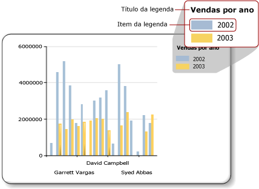

# Legenda de gráfico – formatação (Construtor de Relatórios)
  A legenda do gráfico contém descrições de cada categoria em um gráfico. Uma legenda sempre contém um ou mais itens de legenda, no qual cada item de legenda é composto por uma caixa colorida que representa a série, e uma cadeia de caracteres de texto que descreve a série, conforme indicado na ilustração a seguir.  
  
   
  
 Um item de legenda está conectado a uma série individual no gráfico, exceto para Gráficos de forma, no qual a legenda está conectada a pontos de dados individuais. O gráfico adiciona itens automaticamente na legenda com base na série gerada a partir dos seus dados.  
  
 É possível formatar uma legenda usando a caixa de diálogo **Propriedades da Legenda** ou usando o painel Propriedades. Clique com o botão direito do mouse na legenda e clique em **Propriedades da Legenda** para alterar os valores do texto da legenda, a cor da tela de fundo, as bordas e os efeitos 3D. Para alterar os valores do título da legenda, selecione-a, clique com o botão direito do mouse no título da legenda e clique em **Propriedades do Título da Legenda**.  
  
 Não é possível adicionar imagens, colunas adicionais ou outros itens complementares à legenda.  
  
> [!NOTE]  
>  [!INCLUDE[ssRBRDDup](../../includes/ssrbrddup-md.md)]  
  
## Classificando itens de legenda na legenda  
 As séries são classificadas na legenda, de acordo com a ordem na qual elas são processadas pelo mecanismo de processamento do [!INCLUDE[ssRSnoversion](../../includes/ssrsnoversion-md.md)] . Você pode alterar a ordem, alterando a ordem dos campos na zona de dispersão de campos de dados. Se você estiver usando os agrupamentos de série, os dados de série não serão conhecidos até o processamento, para que você não classifique novamente esses itens. As alterações podem ser vistas na Visualização. Para obter mais informações sobre agrupamento de séries, consulte [Gráficos &#40;Construtor de Relatórios e SSRS&#41;](../../reporting-services/report-design/charts-report-builder-and-ssrs.md).  
  
 Você pode ocultar qualquer série de ser exibida na legenda. Se você estiver usando o agrupamento de série, toda a série relacionada ao campo de dados será oculta. Para obter mais informações, consulte [Ocultar itens de legenda no gráfico &#40;Construtor de Relatórios e SSRS&#41;](../../reporting-services/report-design/chart-legend-hide-items-report-builder.md).  
  
## Alterando o texto ou a cor de um item de legenda na legenda  
 Quando um campo é colocado na zona de dispersão do campo de dados de um gráfico, um item de legenda é gerado automaticamente que contém o nome deste campo. Por padrão, o texto de cada item de legenda é extraído do nome do campo de dados. Cada item de legenda está conectado a uma série individual no gráfico, exceto para Gráficos de forma, nos quaisa legenda está conectada a pontos de dados individuais em vez de séries individuais. Quando um grupo de categorias é definido em um Gráfico de formas, o texto de cada item de legenda é extraído da representação da cadeia do grupo de categorias. Você pode especificar o texto do rótulo personalizado para gráficos de pizza, rosca e funil para mostrar informações diferentes do rótulo de grupo de categorias relacionadas a cada ponto de dados individuais na legenda. Para fazer isso, selecione a legenda e especifique o texto da legenda na caixa de diálogo **Propriedades da Série** ou na propriedade **LegendText** no painel Propriedades. Para obter mais informações, consulte [Alterar o texto de um item de legenda &#40;Construtor de Relatórios e SSRS&#41;](../../reporting-services/report-design/chart-legend-change-item-text-report-builder.md).  
  
 Você também pode especificar as palavras-chave que diferenciam maiúsculas de minúsculas específicas do gráfico para os atributos aos quais é feita referência com frequência na propriedade **LegendText** ou na caixa de diálogo **Propriedades da Série** . O controle de gráfico substitui essas palavras-chave em tempo de execução por sua representação de dados. Essa abordagem é útil nos Gráficos de forma porque é possível mostrar as informações relacionadas a pontos de dados específicos. Para obter mais informações, consulte [Formatando pontos de dados em um gráfico &#40;Construtor de Relatórios e SSRS&#41;](../../reporting-services/report-design/formatting-data-points-on-a-chart-report-builder-and-ssrs.md).  
  
 A caixa colorida exibida para cada item de legenda é herdada a partir da cor de preenchimento de sua série correspondente. Se quiser alterar a cor exibida em um item de legenda, você terá que alterar a cor da série correspondente. Para obter mais informações, consulte [Formatando as cores da série em um gráfico &#40;Construtor de Relatórios e SSRS&#41;](../../reporting-services/report-design/formatting-series-colors-on-a-chart-report-builder-and-ssrs.md).  
  
## Removendo itens de legenda adicionais da legenda  
 A legenda está sempre conectada a uma série. Se um item de legenda for exibido na legenda, mas a série correspondente não for exibida no gráfico, a causa mais provável será que a série não contém qualquer valor. Você deve remover essa série para remover o item de legenda da legenda. Para remover uma série do seu gráfico, você poderá clicar com o botão direito do mouse na série especificada e selecione a opção Excluir Série.  
  
## Reposicionando a legenda  
 A área de gráfico é a área retangular que abrange as legendas de eixo e a área de plotagem. Você pode arrastar a legenda para uma de 12 posições diferentes quando a legenda é colocada fora da área de gráfico. Por padrão, a legenda é mostrada fora da área de gráfico. Você também pode definir a posição na caixa de diálogo **Propriedades da Legenda** .  
  
 Não é possível arrastar a legenda dentro ou fora da área de gráfico. Se quiser posicionar a legenda dentro da área de gráfico, na caixa de diálogo **Propriedades da Legenda** , em **Encaixe**, selecione **Padrão** na lista suspensa e desmarque a opção **Mostrar legenda fora da área de gráfico** . Mostrando a legenda dentro da área de gráfico, você pode maximizar o espaço para pontos de dados no gráfico. No entanto, dependendo do conjunto de dados, ele pode fazer com que a legenda sobreponha alguns pontos de dados na área de gráfico, tornando a leitura do gráfico mais difícil.  
  
## Exibindo itens de legenda na horizontal  
 Por padrão, a legenda é formatada como uma lista de uma ou mais linhas que contém um item de legenda cada uma. A área de legenda se expande para acomodar os itens de legendas. Se a legenda não puder ser expandida, serão exibidas reticências (…). Dependendo do estilo de legenda especificado, a legenda poderá ser expandida na vertical ou horizontal. Você pode alterar o estilo de layout na caixa de diálogo **Propriedades da Legenda** ou alterar o espaço alocado para exibir todos os itens de legenda.  
  
 Para exibir a legenda na horizontal, encaixe a legenda na parte superior ou inferior do gráfico. Isso faz com que a legenda seja expandida na horizontal. Você também pode definir a propriedade Layout como **Linha** ou **Tabela Larga**. Defina a propriedade MaxAutoSize no painel Propriedades para controlar o espaço vertical alocado para a legenda quando ela estiver encaixada na parte superior ou inferior da área de gráfico.  
  
## Formatando o texto da legenda  
 Você pode alterar a fonte, o tamanho, o estilo e a cor do texto da legenda na página **Fonte** da caixa de diálogo **Propriedades da Legenda** .  
  
 Por padrão, o texto da legenda não é otimizado para caber na área de legenda. Para fazer com que o texto da legenda caiba automaticamente no espaço alocado, defina a propriedade AutoFitTextDisabled como **False** e defina um tamanho da fonte mínimo para a propriedade MinFontSize como o menor tamanho da fonte que você acha que será apresentável e que também permita a otimização da legenda.  
  
## Consulte Também  
 [Caixa de diálogo Propriedades da Legenda, Geral &#40;Construtor de Relatórios e SSRS&#41;](http://msdn.microsoft.com/library/db718f8f-f185-422f-871c-96f0749e5893)   
 [Alterar o texto de um item de legenda &#40;Construtor de Relatórios e SSRS&#41;](../../reporting-services/report-design/chart-legend-change-item-text-report-builder.md)   
 [Formatando um gráfico &#40;Construtor de Relatórios e SSRS&#41;](../../reporting-services/report-design/formatting-a-chart-report-builder-and-ssrs.md)   
 [Formatando as cores da série em um gráfico &#40;Construtor de Relatórios e SSRS&#41;](../../reporting-services/report-design/formatting-series-colors-on-a-chart-report-builder-and-ssrs.md)   
 [Gráficos &#40;Construtor de Relatórios e SSRS&#41;](../../reporting-services/report-design/charts-report-builder-and-ssrs.md)   
 [Ocultar itens de legenda no gráfico &#40;Construtor de Relatórios e SSRS&#41;](../../reporting-services/report-design/chart-legend-hide-items-report-builder.md)   
 [Definir cores em um gráfico usando uma paleta &#40;Construtor de Relatórios e SSRS&#41;](../../reporting-services/report-design/define-colors-on-a-chart-using-a-palette-report-builder-and-ssrs.md)  
  
  
