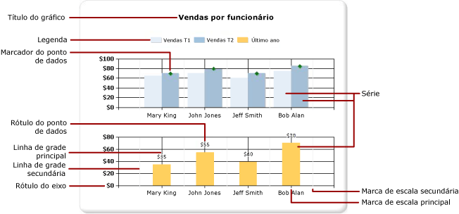
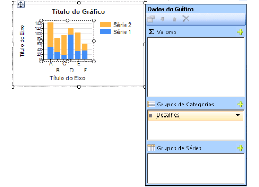
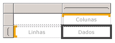
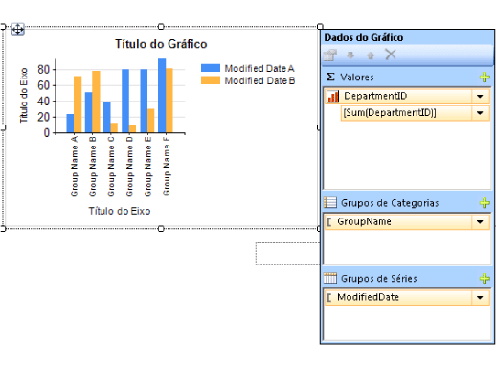

# Gráficos (Construtor de Relatórios e SSRS)
Leia mais sobre como usar regiões de dados do gráfico para ajudar os leitores de seus relatórios paginados do [!INCLUDE[ssRSnoversion_md](../../includes/ssrsnoversion-md.md)] a entender grandes volumes de dados agregados em uma visão rápida.  

Quanto mais tempo você passa preparando cuidadosamente e entendendo seus dados antes de criar um gráfico, mais fácil será criar os gráficos com rapidez e eficiência. Para ajudar a escolher qual gráfico será usado, consulte [Tipos de gráfico](../../reporting-services/report-design/chart-types-report-builder-and-ssrs.md) Para começar a experimentar os gráficos imediatamente, consulte os tutoriais de gráfico de barras, colunas, minigráfico e gráfico de pizza em [Tutoriais do Construtor de Relatórios](../../reporting-services/report-builder-tutorials.md).  
  
 A ilustração a seguir mostra muitos dos diferentes elementos usados no gráfico.  
  
   
  
 É possível publicar gráficos separadamente de um relatório como *partes de relatório*. Para obter mais informações, consulte [Partes de relatório](../../reporting-services/report-design/report-parts-report-builder-and-ssrs.md).
  
 
##   Criando um gráfico  
 Depois de adicionar uma região de dados do gráfico à superfície de design, você pode arrastar campos do conjunto de dados do relatório de dados numéricos e não numéricos para o painel Dados do Gráfico do gráfico. Quando você clica no gráfico na superfície de design, o painel Dados do Gráfico aparece, com três áreas: Grupos de Categorias, Grupos de Séries e Valores. Se o relatório possui um conjunto de dados compartilhado ou inserido, os campos no conjunto de dados aparecem no painel Dados do Relatório. Arraste os campos do conjunto de dados para a área apropriada do painel Dados do Gráfico. Por padrão, quando um campo é adicionado a uma das áreas do gráfico, o [!INCLUDE[ssRSnoversion](../../includes/ssrsnoversion-md.md)] calcula uma agregação para o campo. Também é possível usar agrupamento de séries para gerar séries dinamicamente. Um gráfico é [organizado como uma matriz](#SimilarMatrix).  
  
   
  
> [!NOTE]  
>  Os dados no gráfico na hora da criação são diferentes dos dados no gráfico quando o relatório é processado. Não são seus dados reais. São dados gerados que foram adicionados para possibilitar o design do gráfico com uma ideia de qual será a aparência do gráfico.  
  
##   Como um gráfico é semelhante a uma matriz  
 Uma maneira de entender como os gráficos trabalham é compará-los a matrizes.  
  
   
  
 Conceitualmente, a organização deles é idêntica:  
  
-   O grupo Colunas na matriz é semelhante à área Grupo de Categorias no gráfico.  
  
-   O grupo Linhas na matriz é semelhante à área Grupo de Séries no gráfico.  
  
-   A área Dados na matriz é semelhante à área Valores no gráfico.  
  
 
##   Adicionando dados ao gráfico  
 Suponha que você tem um relatório que mostre Vendas por Nome. Você solta o campo Nome Completo na área Grupos de Categorias e o campo Vendas na área Valores.  
  
 Quando você adiciona o campo Vendas à área Valores, o texto do campo de dados aparece na legenda e os dados desse campo numérico são agregados em um valor. Por padrão, o valor é agregado usando a função interna Sum. O painel Dados do Gráfico conterá uma única expressão para o campo. Em nosso exemplo, `[Sum(Sales)]` aparecerá para a expressão do campo `=Sum(Fields!Sales.Value)`. Se nenhum grupo estiver especificado, o gráfico mostrará só um ponto de dados. Para mostrar vários pontos de dados, você deverá agrupar os dados adicionando um campo de agrupamento. Quando você adiciona o campo Nome à área Grupos de Categorias, um campo de agrupamento com o mesmo nome que o nome do campo é automaticamente adicionado ao gráfico. Quando são adicionados campos que definem os valores ao longo dos eixos x e y, o gráfico tem informações suficientes para plotar os dados corretamente.  
  
   
  
 Quando a área Grupos de Séries é deixada vazia, o número de série é fixado em tempo de design. Neste exemplo, Vendas é a única série que aparece no gráfico.  
  
 
##   Categorias e séries Grupos em um gráfico  
 Um gráfico oferece suporte a grupos aninhados de categorias e de séries. Os gráficos não exibem dados detalhados. Adicione grupos a um gráfico arrastando campos de conjunto de dados às áreas para arrastar e soltar de categorias e séries referentes a um gráfico selecionado.  
  
 Gráficos como, por exemplo, em forma de pizza oferecem suporte a grupos de categorias e a grupos de categorias aninhados. Outros gráficos como, por exemplo, de barras oferecem suporte a grupos de categorias e de séries. É possível aninhar grupos, mas verifique se os números de categorias ou séries não obscurecem a apresentação das informações a respeito do gráfico.  
  
### Adicionando agrupamento de séries a um gráfico  
 Se você adicionar um campo à área Grupos de Séries, o número de séries dependerá dos dados contidos naquele campo. Em nosso exemplo anterior, suponha você adiciona um campo Ano à área Grupos de Séries. O número de valores no campo Ano determinará quantas séries aparecerão no gráfico. Se o campo Ano contiver os anos de 2004, 2005 e 2006, o gráfico exibirá três séries para cada campo na área Valores.  
  
##   Considerações sobre o conjunto de dados antes de criar um gráfico  
 Os gráficos fornecem uma exibição resumida dos dados. No entanto, com grandes conjuntos de dados, as informações em um gráfico podem se tornar obscurecidas ou ilegíveis. Pontos de dados ausentes ou nulos, tipos de dados inadequados ao tipo de gráfico e aplicativos avançados, como combinação de gráficos com tabelas, podem afetar a legibilidade de um gráfico. Antes de criar um gráfico, prepare e entenda cuidadosamente os dados para criar os gráficos de maneira rápida e eficiente.  
  
 Você pode ter tantos gráficos quantos desejar em seu relatório. Um gráfico, como qualquer outra região de dados, como uma matriz ou tabela, está associado a um único conjunto de dados. Se desejar exibir vários conjuntos de dados no mesmo gráfico, poderá criar um conjunto de dados adicional que use uma instrução JOIN ou UNION na consulta SQL antes de adicionar dados ao gráfico. Para obter mais informações sobre a instrução JOIN e UNION, consulte os Manuais Online ou outra referência de SQL.  
  
 Considere a pré-agregação de dados na consulta do conjunto de dados caso dados detalhados não sejam necessários ou úteis. Para exibir cada ponto de dados mais claramente, reduza o número de categorias no conjunto de dados. É possível filtrar o conjunto de dados ou adicionar uma condição à consulta que reduza o número de linhas retornadas. 
  
##   Práticas recomendadas ao exibir dados em um gráfico  
 Os gráficos são mais efetivos quando o número de elementos exibidos apresenta uma imagem clara das informações subjacentes. Alguns gráficos, como os gráficos de dispersão, beneficiam-se de muitos pontos de dados, enquanto outros, como gráficos de pizza, são mais efetivos com menos pontos de dados. Escolha cuidadosamente um tipo de gráfico com base nos valores do conjunto de dados e em como deseja que essas informações sejam mostradas. Para obter mais informações, consulte [Tipos de gráficos &#40;Construtor de Relatórios e SSRS&#41;](../../reporting-services/report-design/chart-types-report-builder-and-ssrs.md).  
  
 Existem várias maneiras de consolidar dados em um gráfico:  
  
-   Ao usar um gráfico de pizza, colete pequenas fatias em uma fatia chamada "Outra". Isso reduz o número de fatias no gráfico de pizza. Para obter mais informações, consulte [Coletar fatias pequenas em um gráfico de pizza &#40;Construtor de Relatórios e SSRS&#41;](../../reporting-services/report-design/collect-small-slices-on-a-pie-chart-report-builder-and-ssrs.md).  
  
-   Evite usar rótulos de pontos de dados quando houver muitos pontos de dados. Os rótulos de pontos de dados são mais efetivos quando há apenas alguns pontos no gráfico.  
  
-   Filtre dados indesejado ou irrelevantes. Isso ajuda a realçar os dados principais que você está tentando exibir no gráfico. Para filtrar pontos de dados em um gráfico, defina um filtro em um grupo de categorias ou em um grupo de série. Por padrão, o gráfico usa a função interna Sum para agregar valores que pertencem ao mesmo grupo em um ponto de dados individual na série. Se você alterar a função de agregação de uma série, deverá alterar também a função de agregação na expressão de filtro. Para obter mais informações, consulte [Filtrar, agrupar e classificar dados &#40;Construtor de Relatórios e SSRS&#41;](../../reporting-services/report-design/filter-group-and-sort-data-report-builder-and-ssrs.md).  
  
-   Para exibir dados de taxa em uma tabela ou modelo de matriz, use um indicador linear em vez de um gráfico de barras. Os indicadores são mais adequados para mostrar um único valor dentro de uma célula. Para obter mais informações, consulte [Regiões de dados aninhadas &#40;Construtor de Relatórios e SSRS&#41;](../../reporting-services/report-design/nested-data-regions-report-builder-and-ssrs.md).  
   
##   Agregando valores de um campo de dados no gráfico  
 Por padrão, quando um campo é adicionado à área Valores do gráfico, o [!INCLUDE[ssRSnoversion](../../includes/ssrsnoversion-md.md)] calcula uma agregação para o campo. Se você arrastar um campo para o gráfico sem soltá-lo em uma área específica, o gráfico determinará se esse campo pertence ao eixo da categoria (x) ou ao eixo de valor (y) com base no tipo de dados do campo. Campos numéricos que são soltos na área Valores são agregados usando a função SUM. Se o tipo de dados do campo de valor for String na área Valores, o gráfico não poderá exibir um valor numérico, mesmo que haja números nos campos, portanto o gráfico exibirá a função COUNT. Para evitar esse comportamento, verifique se os campos usados têm tipos de dados numéricos, em vez de cadeias de caracteres que contêm números formatados. É possível usar uma expressão do Visual Basic para converter valores de cadeia de caracteres em tipo de dados numéricos usando a constante **CDbl** ou **CInt** . Por exemplo, a expressão complexa a seguir converte um campo denominado `MyField` que contém valores numéricos que são formatados como cadeias de caracteres.  
  
 `=Sum(CDbl(Fields!MyField.Value))`  
  
 Para obter mais informações sobre expressões de agregação, consulte [Referência de funções de agregação &#40;Construtor de Relatórios e SSRS&#41;](../../reporting-services/report-design/report-builder-functions-aggregate-functions-reference.md).  
   
##   Nesta seção  
 [Adicionar um gráfico a um relatório &#40;Construtor de Relatórios e SSRS&#41;](../../reporting-services/report-design/add-a-chart-to-a-report-report-builder-and-ssrs.md)  
 Descreve as primeiras etapas para adicionar um gráfico ao relatório.  
  
 [Tipos de gráficos &#40;Construtor de Relatórios e SSRS&#41;](../../reporting-services/report-design/chart-types-report-builder-and-ssrs.md)  
 Descreve todos os tipos e subtipos de gráficos disponíveis no [!INCLUDE[ssRSnoversion](../../includes/ssrsnoversion-md.md)], incluindo considerações e práticas recomendadas para uso de vários tipos de gráficos.  
  
 [Formatando um gráfico &#40;Construtor de Relatórios e SSRS&#41;](../../reporting-services/report-design/formatting-a-chart-report-builder-and-ssrs.md)  
 Use formatação para melhorar a aparência global e realçar pontos de dados importantes de seu gráfico.  
  
 [Pontos de dados vazios e nulos em gráficos &#40;Construtor de Relatórios e SSRS&#41;](../../reporting-services/report-design/empty-and-null-data-points-in-charts-report-builder-and-ssrs.md)  
 Descreve considerações ao trabalhar com gráficos baseados em campos com valores vazios ou nulos.  
  
 [Como exibir uma série com vários intervalos de dados em um gráfico &#40;Construtor de Relatórios e SSRS&#41;](../../reporting-services/report-design/displaying-a-series-with-multiple-data-ranges-on-a-chart.md)  
 Descreve como adicionar quebras de escala a uma série que contém mais de um intervalo de dados.  
  
 [Várias séries em um gráfico &#40;Construtor de Relatórios e SSRS&#41;](../../reporting-services/report-design/multiple-series-on-a-chart-report-builder-and-ssrs.md)  
 Descreve vários métodos de como mostrar várias séries no mesmo gráfico, incluindo como combinar tipos de gráfico, como usar o eixo secundário, como especificar diferentes tipos de gráfico e como usar várias áreas do gráfico.  
  
 [Vinculando várias regiões de dados ao mesmo conjunto de dados &#40;Construtor de Relatórios e SSRS&#41;](../../reporting-services/report-design/linking-multiple-data-regions-to-the-same-dataset-report-builder-and-ssrs.md)  
 Forneça exibições de dados diferentes do mesmo conjunto de dados de relatório.  
  
 [Adicionar ou excluir um grupo em um gráfico &#40;Construtor de Relatórios e SSRS&#41;](../../reporting-services/report-design/add-or-delete-a-group-in-a-chart-report-builder-and-ssrs.md)  
 Descreve a adição de grupos e grupos aninhados para um gráfico.  
  
 [Adicionar uma média móvel a um gráfico &#40;Construtor de Relatórios e SSRS&#41;](../../reporting-services/report-design/add-a-moving-average-to-a-chart-report-builder-and-ssrs.md)  
 Descreve o uso da fórmula Média Móvel para calcular a média dos dados em sua série.  
  
 [Solução de problemas de gráficos &#40;Construtor de Relatórios e SSRS&#41;](../../reporting-services/report-design/troubleshoot-charts-report-builder-and-ssrs.md)  
 Descreve dicas para trabalhar com gráficos.  
  
## Consulte também  
 [Imagens, caixas de texto, retângulos e linhas &#40;Construtor de Relatórios e SSRS&#41;](../../reporting-services/report-design/images-text-boxes-rectangles-and-lines-report-builder-and-ssrs.md)   
 [Classificação interativa, mapas de documentos e links &#40;Construtor de Relatórios e SSRS&#41;](../../reporting-services/report-design/interactive-sort-document-maps-and-links-report-builder-and-ssrs.md)   
 [Regiões de dados aninhadas &#40;Construtor de Relatórios e SSRS&#41;](../../reporting-services/report-design/nested-data-regions-report-builder-and-ssrs.md)   
 [Tutorial: Adicionar um gráfico de colunas ao relatório &#40;Construtor de Relatórios&#41;](../../reporting-services/tutorial-add-a-column-chart-to-your-report-report-builder.md)   
 [Tutorial: Adicionar um gráfico de pizza ao relatório &#40;Construtor de Relatórios&#41;](../../reporting-services/tutorial-add-a-pie-chart-to-your-report-report-builder.md)   
 [Tutorial: Adicionar um gráfico de barras ao relatório &#40;Construtor de Relatórios&#41;](../../reporting-services/tutorial-add-a-bar-chart-to-your-report-report-builder.md)  
  
  
