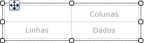
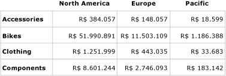
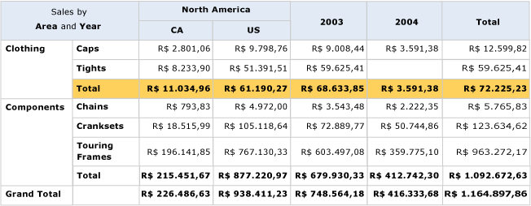
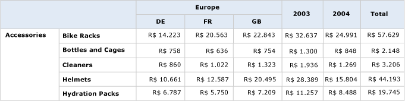

# Criar uma matriz (Construtor de Relatórios e SSRS)
  Use uma matriz para exibir dados agrupados e informações de resumo. É possível agrupar dados por vários campos ou expressões em grupos de linhas e de colunas. As matrizes oferecem funcionalidade semelhante às tabelas de referência cruzada e dinâmicas. Em tempo de execução, conforme os dados e as regiões de dados do relatório são combinados, uma matriz cresce horizontalmente e verticalmente na página. Os valores das células da matriz exibem valores de agregação com escopo para a interseção dos grupos de linhas e de colunas aos quais a célula pertence. É possível formatar as linhas e as colunas para realçar os dados que você deseja enfatizar. Também é possível incluir alternâncias detalhadas que inicialmente ocultam dados de detalhes. Em seguida, o usuário pode clicar nas alternâncias para exibir mais ou menos detalhes, conforme o necessário.  
  
 Após o design inicial, é possível continuar a desenvolver uma matriz para melhorar a experiência de exibição para o usuário. Para obter mais informações, consulte [Controlando a exibição da região de dados Tablix em uma página do relatório &#40;Construtor de Relatórios e SSRS&#41;](../../reporting-services/report-design/controlling-the-tablix-data-region-display-on-a-report-page.md).  
  
 Para começar rapidamente com matrizes, consulte [Tutorial: criação de um relatório de matriz &#40;Construtor de Relatórios&#41;](../../reporting-services/tutorial-creating-a-matrix-report-report-builder.md).  
  
> [!NOTE]  
>  É possível publicar listas separadamente de um relatório como partes do relatório. Leia mais sobre [Partes de relatório (Construtor de Relatórios e SSRS)](../../reporting-services/report-design/report-parts-report-builder-and-ssrs.md).  
  
##   Adicionando uma matriz ao relatório  
 Adicione uma matriz à superfície de design usando a guia Inserir ou a faixa de opções. Você tem a opção de adicionar uma matriz usando o Assistente de Tabela ou Matriz, que inclui a criação de uma conexão de fonte de dados e de um conjunto de dados e a configuração ou a adição da matriz com base no modelo de matriz.  
  
> [!NOTE]  
>  O assistente está disponível apenas no [!INCLUDE[ssRBDenali](../../includes/ssrbdenali-md.md)].  
  
 Para descrever como configurar uma tabela do início ao fim, este tópico usa o modelo de matriz.  Inicialmente, a matriz tem um grupo de linhas, um grupo de colunas, uma célula de canto e uma célula de dados, conforme mostrado na figura a seguir.  
  
   
  
 Quando você seleciona uma matriz na superfície de design, alças de linha e de coluna são exibidas, conforme mostrado na figura a seguir.  
  
   
  
 Adicione grupos arrastando campos de conjuntos de dados para as áreas do Grupos de Linhas e Grupos de Colunas do painel Agrupamento. O primeiro campo arrastado para o painel de grupos de linhas ou de colunas substitui o grupo de padrão vazio inicial. Você pode aplicar formatação a cada célula, dependendo dos dados.  
  
   
  
 Em Visualização, a matriz é expandida para mostrar os valores dos grupos de linhas e colunas. As células exibem valores resumidos, conforme mostrado na figura a seguir.  
  
   
  
 A matriz com a qual você inicia é um modelo baseado na região de dados tablix. É possível continuar desenvolvendo o design da matriz adicionando grupos de linhas ou de colunas adjacentes ou até mesmo linhas de detalhes. Para obter mais informações, consulte [Explorando a flexibilidade de uma região de dados Tablix &#40;Construtor de Relatórios e SSRS&#41;](../../reporting-services/report-design/exploring-the-flexibility-of-a-tablix-data-region-report-builder-and-ssrs.md).  
  
  
##   Adicionando um grupo pai ou filho a uma matriz  
 Para adicionar um grupo baseado em um único campo de conjunto de dados, arraste o campo do painel de dados do relatório para a área Grupos de Linhas ou Grupos de Colunas do painel Agrupamento. Solte o campo na hierarquia de grupo para definir sua relação com grupos existentes. Solte-o sobre um grupo existente para criar um grupo pai ou abaixo de um grupo existente para criar um grupo filho.  
  
 Várias coisas acontecem quando você solta um campo no painel **Agrupamento** :  
  
-   Um novo grupo com um nome exclusivo baseado no nome do campo é criado automaticamente. A expressão de grupo é definida como a referência de nome de campo simples, por exemplo `[Category]`.  
  
-   Uma nova linha ou coluna aparece na área do grupo de linhas ou de colunas correspondente.  
  
-   Na nova coluna, uma célula de grupo de linhas é exibida para as linhas de dados padrão do conjunto de dados do relatório. As células no corpo do tablix dessa linha agora são os novos membros do grupo de linhas. Se houver qualquer grupo de colunas definido, as células que estiverem nas colunas serão os membros desses grupos de coluna. Indicadores de grupo fornecem indicações visuais para a associação de grupo de cada célula.  
  
 Para personalizar o grupo depois de criado, use a caixa de diálogo **Grupo Tablix** . É possível alterar o nome do grupo e editar ou adicionar expressões adicionais à definição de grupo. Para adicionar ou remover linhas da tabela, consulte [Inserir ou excluir uma linha &#40;Construtor de Relatórios e SSRS&#41;](../../reporting-services/report-design/insert-or-delete-a-row-report-builder-and-ssrs.md).  
  
 Quando o relatório é executado, os cabeçalhos das colunas dinâmicas são expandidos à direita (ou à esquerda, se a propriedade Direção da matriz estiver definida como RTL) resultando em uma coluna para cada valor de grupo exclusivo. As linhas dinâmicas são expandidas para baixo na página. Os dados exibidos nas células do corpo tablix são agregações baseadas nas interseções de grupos de linhas e de colunas, conforme mostrado na figura a seguir.  
  
   
  
 Na visualização, o relatório é exibido como na figura a seguir.  
  
   
  
 Para escrever expressões que especifiquem um escopo diferente do escopo padrão, você deve especificar o nome de um conjunto de dados, uma região de dados ou um grupo na função de agregação tudo. Para calcular a porcentagem de contribuição de cada categoria para os valores do grupo da categoria Vestuário, adicione uma coluna dentro do grupo Categoria ao lado da coluna Total, formate a caixa de texto para mostrar a porcentagem e adicione uma expressão que use o escopo padrão no numerador e o escopo do grupo Categoria no denominador, conforme mostrado no exemplo a seguir.  
  
 `=SUM(Fields!Linetotal.Value)/SUM(Fields! Linetotal.Value,"Category")`  
  
 Para obter mais informações, consulte [Escopo das expressões para totais, agregações e coleções internas &#40;Construtor de Relatórios e SSRS&#41;](../../reporting-services/report-design/expression-scope-for-totals-aggregates-and-built-in-collections.md).  
  
  
##   Adicionando um grupo adjacente a uma matriz  
 Para adicionar um grupo adjacente com base em um único campo de conjunto de dados, use o menu de atalho no painel Agrupamento. Para obter mais informações, consulte [Adicionar ou excluir um grupo em uma região de dados &#40;Construtor de Relatórios e SSRS&#41;](../../reporting-services/report-design/add-or-delete-a-group-in-a-data-region-report-builder-and-ssrs.md). A figura a seguir mostra um grupo baseado em geografia e um grupo adjacente baseado em ano.  
  
   
  
 Neste exemplo, a consulta filtrou valores de dados para incluir apenas os valores relativos à Europa e aos anos de 2003 e 2004. No entanto é possível definir filtros independentemente em cada grupo. Na visualização, o relatório é exibido como na figura a seguir.  
  
   
  
 Para adicionar uma coluna de total para um grupo de colunas adjacente, clique na célula de definição do grupo de colunas e use o comando **Adicionar Total** . Uma nova coluna estática é adicionada ao grupo de colunas, com uma soma de agregação padrão para cada campo numérico nas linhas existentes. Para alterar a expressão, edite manualmente a agregação padrão, por exemplo, `Avg([Sales])`. Para obter mais informações, consulte [Adicionar um total a um grupo ou a uma região de dados Tablix &#40;Construtor de Relatórios e SSRS&#41;](../../reporting-services/report-design/add-a-total-to-a-group-or-tablix-data-region-report-builder-and-ssrs.md).  
  
  
## Consulte Também  
 [Referência de funções de agregação &#40;Construtor de Relatórios e SSRS&#41;](../../reporting-services/report-design/report-builder-functions-aggregate-functions-reference.md)   
 [Exemplos de expressões &#40;Construtor de Relatórios e SSRS&#41;](../../reporting-services/report-design/expression-examples-report-builder-and-ssrs.md)  
  
  
