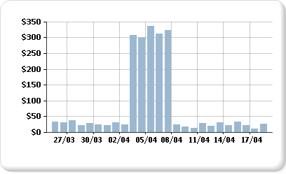

# Exibindo uma série com vários intervalos de dados em um gráfico

  O gráfico usará os valores mínimo e máximo de uma série para calcular a escala do eixo. Quando uma série do gráfico contiver mais que um intervalo de dados, os pontos de dados poderão ficar obscuros e apenas alguns deles poderão ser visualizados facilmente no gráfico. Por exemplo, suponha que um relatório exiba informações sobre o total de vendas diário de um período de 30 dias.  
  
   
  
 Na maior parte do mês, as vendas ficam entre 10 e 40. No entanto, uma campanha publicitária de uma semana provocou um aumento repentino nas vendas no início de abril. Essa alteração nos dados de vendas produz uma distribuição irregular dos pontos de dados que reduz a legibilidade geral do gráfico.  
  
 Existem maneiras diferentes de melhorar a legibilidade:  
  
-   **Habilitar quebras de escala**. Se os dados formarem dois ou mais conjuntos de intervalos de dados, use uma quebra de escala para remover a lacuna entre os intervalos. Uma quebra de escala é uma faixa desenhada em uma área de plotagem para indicar a quebra entre os valores altos e baixos de uma série.  
  
-   **Filtrar valores desnecessários**. Se houver pontos de dados que estão encobrindo um intervalo de dados importante que deve aparecer no gráfico, remova os pontos indesejados usando um filtro de relatório. Para obter informações sobre como adicionar um filtro ao gráfico no [!INCLUDE[ssRSnoversion](../../includes/ssrsnoversion-md.md)], consulte [Adicionar filtros de conjunto de dados, de região de dados e de grupo &#40;Construtor de Relatórios e SSRS&#41;](../../reporting-services/report-design/add-dataset-filters-data-region-filters-and-group-filters.md).  
  
-   **Plotar cada intervalo de dados como uma série separada para comparar várias séries**. Se houver dois ou mais intervalos de dados, considere separá-los em séries distintas. Para obter mais informações, consulte [Várias séries em um gráfico &#40;Construtor de Relatórios e SSRS&#41;](../../reporting-services/report-design/multiple-series-on-a-chart-report-builder-and-ssrs.md).  
  
> [!NOTE]  
>  [!INCLUDE[ssRBRDDup](../../includes/ssrbrddup-md.md)]  
  
## Exibindo vários intervalos de dados usando quebras de escala  
 Quando você habilita uma quebra de escala, o gráfico calcula onde desenhar uma linha no gráfico. Deve haver espaço suficiente entre os intervalos para desenhar uma quebra de escala. Por padrão, a quebra de escala poderá ser adicionada somente se houver uma separação entre os intervalos de dados de pelo menos 25% do gráfico.  
  
   
  
> [!NOTE]  
>  Não é possível especificar onde posicionar a quebra de escala em um gráfico. No entanto, você pode modificar como ela será calculada, o que será descrito adiante neste tópico.  
  
 Se você habilitar uma quebra de escala mas ela não aparecer, mesmo que haja distância suficiente entre os intervalos de dados, será possível definir a propriedade CollapsibleSpaceThreshold com um valor inferior a 25. CollapsibleSpaceThreshold especifica o percentual de espaço recolhível necessário entre os intervalos de dados. Para obter mais informações, consulte [Adicionar quebras de escala a um gráfico &#40;Construtor de Relatórios e SSRS&#41;](../../reporting-services/report-design/add-scale-breaks-to-a-chart-report-builder-and-ssrs.md).  
  
 Os gráficos suportam até cinco quebras de escala por gráfico; no entanto, exibir mais de uma quebra de escala pode deixar o gráfico ilegível. Se houver dois ou mais intervalos de dados, considere o uso de outro método para exibir esses dados. Para obter mais informações, consulte [Várias séries em um gráfico &#40;Construtor de Relatórios e SSRS&#41;](../../reporting-services/report-design/multiple-series-on-a-chart-report-builder-and-ssrs.md).  
  
## Cenários de quebra de escala não suportados  
 As quebras de escala não são suportadas nos seguintes cenários:  
  
-   O gráfico está habilitado para 3D.  
  
-   Um eixo de valor logarítmico foi especificado.  
  
-   O eixo de valor mínimo ou máximo foi definido explicitamente.  
  
-   O tipo de gráfico é polar, radar, pizza, anel, funil, pirâmide ou algum gráfico empilhado.  
  
 Um exemplo de gráfico com quebras de escala está disponível como um relatório de exemplo. Para obter mais informações sobre como baixar esse relatório de exemplo e outros, consulte [(Relatórios de exemplo do Construtor de relatórios e Designer de relatórios) do](http://go.microsoft.com/fwlink/?LinkId=198283).  

## Próximas etapas

[Várias séries em um gráfico](../../reporting-services/report-design/multiple-series-on-a-chart-report-builder-and-ssrs.md)   
[Formatando um gráfico](../../reporting-services/report-design/formatting-a-chart-report-builder-and-ssrs.md)   
[Efeitos 3D, bisel e outros efeitos em um gráfico](../../reporting-services/report-design/chart-effects-3d-bevel-and-other-report-builder.md)   
[Gráficos](../../reporting-services/report-design/charts-report-builder-and-ssrs.md)   
[Caixa de diálogo Propriedades do Eixo, Opções de Eixo](http://msdn.microsoft.com/library/b276e210-7a12-48ae-971b-7dabae51df11)   
[Coletar fatias pequenas em um gráfico de pizza](../../reporting-services/report-design/collect-small-slices-on-a-pie-chart-report-builder-and-ssrs.md)  

Ainda tem dúvidas? [Experimente perguntar no fórum do Reporting Services](http://go.microsoft.com/fwlink/?LinkId=620231)
