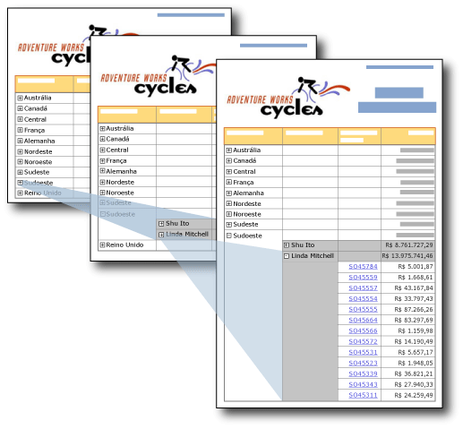

# A&#231;&#227;o de an&#225;lise detalhada (Construtor de Relat&#243;rios e SSRS)
  Ao fornecer ícones de sinal de adição ou de subtração em uma caixa de texto, você permitirá que os usuários ocultem ou exibam itens interativamente. Isso se chama *busca detalhada* . Para uma tabela ou matriz, você pode mostrar ou ocultar linhas e colunas estáticas ou linhas e colunas que estão associadas a grupos.  
  
   
  
 Nesta ilustração, o usuário clica nos sinais de adição (+) no relatório para mostrar dados detalhados.  
  
 Por exemplo, você pode ocultar inicialmente todas as linhas, exceto a linha de resumo do grupo externo de uma tabela com grupos de linhas. Para cada grupo interno (inclusive os grupo de detalhes), adicione um ícone de expandir/recolher à célula de agrupamento do grupo contentor. Quando o relatório for renderizado, o usuário poderá clicar na caixa de texto para expandir e recolher os dados de detalhes. Para obter mais informações, consulte [Tabelas &#40;Construtor de Relatórios e SSRS&#41;](../../reporting-services/report-design/tables-report-builder-and-ssrs.md).  
  
 Para permitir que os usuários expandam ou recolham um item, defina as propriedades de visibilidade do item.  
  
> [!NOTE]  
>  Quando você cria um relatório com uma ação de busca detalhada, as informações de visibilidade devem ser definidas no grupo, na coluna ou na linha que você deseja ocultar, não apenas uma única caixa de texto na linha ou coluna. Além disso, a caixa de texto que você usa para alternância deve estar em um escopo de contenção que controle o item que você deseja mostrar ou ocultar.  
>   
>  Por exemplo, para ocultar uma linha associada a um grupo aninhado, a caixa de texto deve estar em uma linha associada ao grupo pai ou superior na hierarquia de contenção.  
>   
>  Para obter informações sobre como configurar informações de visibilidade no grupo, na coluna ou na linha, consulte [Adicionar uma ação de expandir/recolher a um item &#40;Construtor de Relatórios e SSRS&#41;](../../reporting-services/report-design/add-an-expand-or-collapse-action-to-an-item-report-builder-and-ssrs.md)  
  
 Para obter mais informações sobre como ocultar itens de relatório, consulte [Ocultar um item &#40;Construtor de Relatórios e SSRS&#41;](../../reporting-services/report-builder/hide-an-item-report-builder-and-ssrs.md).  
  
> [!NOTE]  
>  [!INCLUDE[ssRBRDDup](../../includes/ssrbrddup-md.md)]  
  
## Comparando relatórios de busca detalhada com relatórios detalhados  
 Em um relatório de busca detalhada, um usuário clica em um botão de adição ou subtração para expandir ou recolher uma seção de um relatório para mostrar dados detalhados no local. Em um relatório detalhado, o usuário clica em um link para um valor resumido e isso abre um relatório relacionado separado para mostrar dados de detalhes. Os dados de detalhes só são recuperados quando o relatório de detalhes é executado. Normalmente, os relatórios detalhados exigem menos recursos do que os relatórios de busca detalhada. Para obter mais informações, consulte [Detalhamento, busca detalhada, sub-relatórios e regiões de dados aninhadas &#40;Construtor de Relatórios e SSRS&#41;](../../reporting-services/report-design/drillthrough, drilldown, subreports, and nested data regions.md).  
  
## Suporte à extensão de renderização para itens de relatório ocultos  
 Só há suporte para a alternância de mostrar e ocultar itens de relatório por extensões de renderização que dão suporte à interatividade de usuário, como a extensão de renderização HTML usada quando você executa um relatório no Construtor de Relatórios e no Gerenciador de Relatórios, por exemplo. Outras extensões de renderização exibem itens ocultos. A lista a seguir descreve suporte para itens de relatório com visibilidade condicional:  
  
-   Em HTML, se os itens estiverem ocultos, eles não serão visíveis no código-fonte HTML.  
  
-   A extensão de renderização XML exibe todos os itens do relatório, quer eles estejam ocultos ou não.  
  
-   A extensão de renderização do Excel exibe e expande linhas e colunas ocultas de uma tabela, matriz ou lista. Todas as linhas e colunas são visíveis.  
  
 Para obter mais informações, consulte [Comportamentos de renderização &#40;Construtor de Relatórios e SSRS&#41;](../../reporting-services/report-design/rendering-behaviors-report-builder-and-ssrs.md).  
  
## Consulte também  
 [Detalhamento, busca detalhada, sub-relatórios e regiões de dados aninhadas &#40;Construtor de Relatórios e SSRS&#41;](../../reporting-services/report-design/drillthrough, drilldown, subreports, and nested data regions.md)   
 [Classificação interativa, mapas de documentos e links &#40;Construtor de Relatórios e SSRS&#41;](../../reporting-services/report-design/interactive-sort-document-maps-and-links-report-builder-and-ssrs.md)   
 [Exemplos de expressões &#40;Construtor de Relatórios e SSRS&#41;](../../reporting-services/report-design/expression-examples-report-builder-and-ssrs.md)  
  
  