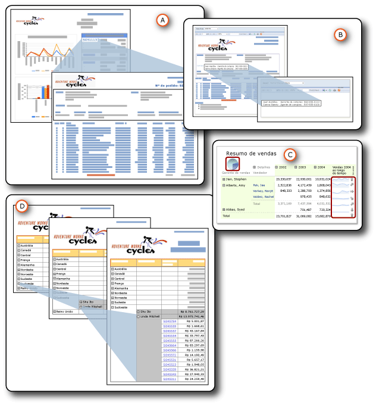

# Detalhamento, busca detalhada, sub-relatórios e regiões de dados aninhadas
  É possível organizar dados de várias formas para mostrar a relação entre o geral e o detalhado.  É possível colocar todos os dados no relatório, mas defini-lo como oculto até que um usuário clique para revelar detalhes; trata-se de uma ação de *busca detalhada* . É possível exibir os dados em uma região de dados, como uma tabela ou um gráfico, *aninhado* em outra região de dados, como uma tabela ou matriz. É possível exibir os dados em um *sub-relatório* totalmente contido em um relatório principal. Se preferir, você pode colocar os dados detalhados em relatórios de *detalhamento* , relatórios à parte que são exibidos quando um usuário clica em um link.  
  
   
  
 A. Relatório detalhado  
  
 B. sub-relatório  
  
 C. Regiões de dados aninhadas  
  
 D. Ação de busca detalhada  
  
 Todos eles têm aspectos em comum, mas com finalidades diferentes e recursos diferentes. Dois deles, relatórios detalhados e sub-relatórios, são relatórios efetivamente à parte. Aninhamento é um meio de colocar uma região de dados dentro de outra região de dados. A busca detalhada é uma ação que é possível aplicar a qualquer item de relatório para ocultar e mostrar outros itens de relatório. Todos eles são formas de organizar e exibir dados para ajudar os usuários a compreender melhor o relatório.  
  
> [!NOTE]  
>  [!INCLUDE[ssRBRDDup](../../includes/ssrbrddup-md.md)]  
  
##   Resumo das características  
 Esta tabela resume essas características diferentes. Os detalhes estarão em seções separadas posteriormente neste tópico. A busca detalhada não está incluída nessas comparações porque é possível aplicar a ação de exibição e ocultação a qualquer item de relatório.  
  
|Característica|sub-relatório|detalhamento|aninhado|  
|-----------|---------------|------------------|------------|  
|Usa o conjunto de dados do relatório principal|Igual ou diferente|Igual ou diferente|Igual|  
|Recupera dados|Dados recuperados ao mesmo tempo que o relatório principal|Dados recuperaram um relatório detalhado por vez|Dados recuperados todos ao mesmo tempo que o relatório principal|  
|São processados e renderizados|Com o relatório principal|Quando o link é clicado|Com o relatório principal.|  
|É executado|Mais lenta (mas recupera todos os dados com o relatório principal)|Mais rápida (mas não recupera todos os dados com o relatório principal)|Mais rápida (e recupera todos os dados com o relatório principal)|  
|Usa parâmetros|Sim|Sim|Não|  
|Podem ser reutilizados.|Como relatório, sub-relatório ou relatório detalhado em outros relatórios|Como relatório, sub-relatório ou relatório detalhado em outros relatórios|Não podem ser reutilizados.|  
|São localizados|Externos ao relatório principal, mesmo servidor de relatório ou diferente|Externos ao relatório principal, mesmo servidor de relatório|Internos ao relatório principal|  
|São exibidos|No relatório principal|Em um relatório diferente|No relatório principal|  
  
  
##   Detalhes das características  
  
###   Conjuntos de dados usados  
 Os sub-relatórios e os relatórios detalhados podem usar o mesmo conjunto de dados no relatório principal ou usar um diferente. As regiões de dados aninhadas usam o mesmo conjunto de dados.  
  
###   Recuperando dados  
 Os sub-relatórios e as regiões de dados aninhadas recuperam dados ao mesmo tempo que o relatório principal. Os relatórios detalhados, não. Cada relatório detalhado recupera dados quando um usuário clica em cada link. Isso será significativo, se os dados do relatório principal e do relatório subordinado precisarem ser recuperados ao mesmo tempo.  
  
###   Processamento e renderização  
 Um sub-relatório é processado como parte do relatório principal. Por exemplo, se um sub-relatório com informações sobre os detalhes do pedido for adicionado a uma célula de tabela na linha de detalhes, o sub-relatório será processado uma vez por linha e será renderizado como parte do relatório principal. Um relatório detalhado só é processado e renderizado quando o usuário clica no link de detalhamento no relatório de resumo principal.  
  
###   Desempenho  
 Ao decidir qual usar, considere usar uma região de dados, e não um sub-relatório, especialmente se ele não for usado por vários relatórios. Como o servidor de relatório processa cada instância de um sub-relatório como um relatório separado, pode haver impacto no desempenho. As regiões de dados fornecem muito da funcionalidade e flexibilidade de sub-relatórios, mas com melhor desempenho. Os relatórios detalhados também têm desempenho melhor que os sub-relatórios, porque eles não recuperam todos os dados ao mesmo tempo que o relatório principal.  
  
###   Uso de parâmetros  
 Normalmente, os relatórios detalhados e os sub-relatórios têm parâmetros de relatório que especificam quais dados de relatório devem ser exibidos. Por exemplo, se você clicar em um número de pedido de venda em um relatório principal, um relatório detalhado será aberto, aceitando o número de pedido de venda como um parâmetro e exibindo todos os dados desse pedido. Ao criar o link no relatório principal, você especifica valores a serem passados como parâmetros ao relatório detalhado.  
  
 Para criar um relatório detalhado ou sub-relatório, você deve criar o relatório detalhado de destino ou o sub-relatório primeiro e, em seguida, criar uma ação de detalhamento ou adicionar a referência ao relatório principal.  
  
###   Capacidade de reutilização  
 Os sub-relatórios e os relatórios detalhados são relatórios separados. Dessa forma, eles podem ser usados em vários relatórios ou exibidos como relatórios autônomos. As regiões de dados aninhadas não são reutilizávéis. Não é possível salvá-los como partes de relatório porque eles são aninhados em uma região de dados. É possível salvar a região de dados que os contém como uma parte de relatório, mas não a região de dados aninhada.  
  
###   Local  
 Como os sub-relatórios e os relatórios detalhados são separados, eles são armazenados externamente ao relatório principal. Os sub-relatórios podem estar no mesmo servidor de relatório ou em um diferente, mas os relatórios detalhados devem estar no mesmo servidor de relatório. As regiões de dados aninhadas fazem parte do relatório principal.  
  
###   Exibição  
 Os sub-relatórios e as regiões de dados aninhadas são exibidos no relatório principal. Os relatórios detalhados são exibidos sozinhos.  
  
  
##   Nesta seção  
 [Relatórios de detalhamento &#40;Construtor de Relatórios e SSRS&#41;](../../reporting-services/report-design/drillthrough-reports-report-builder-and-ssrs.md)  
 Explica relatórios abertos quando um usuário clica em um link em um relatório principal.  
  
 [Sub-relatórios &#40;Construtor de Relatórios e SSRS&#41;](../../reporting-services/report-design/subreports-report-builder-and-ssrs.md)  
 Explica esses sub-relatórios exibidos no corpo de um relatório principal.  
  
 [Regiões de dados aninhadas &#40;Construtor de Relatórios e SSRS&#41;](../../reporting-services/report-design/nested-data-regions-report-builder-and-ssrs.md)  
 Explica o aninhamento de uma região de dados em outra, como um gráfico aninhado dentro de uma matriz.  
  
 [Ação de análise detalhada &#40;Construtor de Relatórios e SSRS&#41;](../../reporting-services/report-design/drilldown-action-report-builder-and-ssrs.md)  
 Explica o uso da ação de busca detalhada para ocultar e mostrar itens de relatório.  
  
 [Especificando caminhos para itens externos &#40;Construtor de Relatórios e SSRS&#41;](../../reporting-services/report-design/specifying-paths-to-external-items-report-builder-and-ssrs.md)  
 Explica como se referir a itens que são externo ao arquivo de definição de relatório.  
  
## Consulte também  
 [Parâmetros de relatório &#40;Construtor de Relatórios e Designer de Relatórios&#41;](../../reporting-services/report-design/report-parameters-report-builder-and-report-designer.md)  
  
  
