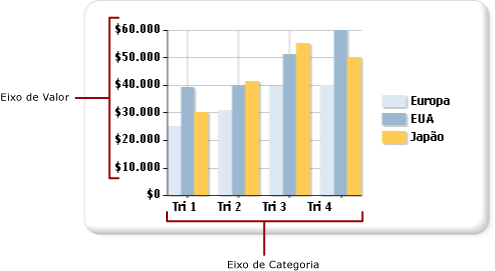

# Formatando rótulos dos eixos de um gráfico (Construtor de Relatórios e SSRS)
  Os tipos de gráficos baseados em coordenadas (colunas, barras, áreas, pontos, linhas e intervalo) possuem dois eixos usados para categorizar e exibir relações de dados. Diferentes tipos de formatação são aplicados a cada eixo.  
  
 É possível formatar eixos usando a caixa de diálogo **Propriedades do Eixo** ou usando o painel Propriedades. Clique com o botão direito do mouse no eixo a ser formatado e clique em **Propriedades do Eixo** para alterar os valores do texto do eixo, os formatos numéricos e de data, as marcas de escala principais e secundárias, o ajuste automático dos rótulos e a espessura, cor e estilo da linha do eixo. Para alterar os valores do título do eixo, clique com o botão direito do mouse no título do eixo e clique em **Propriedades do Título do Eixo**.  
  
 Os rótulos de eixos identificam os intervalos principais no gráfico. Por padrão, o gráfico usa um algoritmo para determinar como os rótulos devem ser colocados de maneira ideal no eixo para evitar sobreposição do texto.  
  
> [!NOTE]  
>  [!INCLUDE[ssRBRDDup](../../includes/ssrbrddup-md.md)]  
  
## Tipos de eixos  
 O gráfico possui dois tipos de eixo primário: o eixo de valor e o eixo de categoria.  
  
   
  
 Ao arrastar um campo do conjunto de dados sobre a superfície do gráfico, o gráfico determina se esse campo pertence ao eixo de valor ou à categoria.  
  
 O eixo de valor geralmente é o eixo vertical ou o eixo y do gráfico. Ele é usado para exibir valores de dados numéricos que estão sendo representados por um gráfico. Um campo que é arrastado para a região dos campos de dados é plotado no eixo de valor. O eixo de categoria geralmente é o eixo horizontal ou o eixo x do gráfico. Para gráficos de barras, esses eixos são invertidos. Em tipos de gráficos de barras, o eixo de categoria é o eixo vertical e o eixo de valor é o eixo horizontal. Para obter mais informações, consulte [Gráficos de barras &#40;Construtor de Relatórios e SSRS&#41;](../../reporting-services/report-design/bar-charts-report-builder-and-ssrs.md).  
  
## Os rótulos dos eixos identificam os intervalos dos rótulos dos eixos  
 Antes de formatar os rótulos dos eixos, você deve compreender como o gráfico calcula intervalos de rótulos dos eixos. Isso permite definir as propriedades necessárias para obter o comportamento do rótulo do eixo desejado.  
  
 A escala do eixo é associada por um valor mínimo e máximo que define o intervalo de dados a serem exibidos ao longo do eixo. O gráfico calcula o valor mínimo e máximo ao longo de cada eixo com base nos valores no conjunto de resultados. No eixo de valor, a escala é sempre determinada pelo número menor e maior no campo de valor. No eixo de categoria, os tipos de valor mínimo e máximo são determinados de acordo com o tipo de campo de categoria. Qualquer campo em um conjunto de dados pode ser categorizado em um dos três tipos de campo de categoria. A tabela a seguir ilustra esses três tipos de campos de categoria.  
  
|Tipo de campo de categoria|Description|Exemplo|  
|-------------------------|-----------------|-------------|  
|Numérico|As categorias são plotadas em ordem numérica ao longo do eixo x.|Um relatório de vendas pelo número de identificação do funcionário exibe os números de identificação dos funcionários ao longo do eixo x.|  
|Data/hora|As categorias são plotadas em ordem cronológica ao longo do eixo x.|Um relatório de vendas mensal exibe datas formatadas ao longo do eixo x.|  
|Cadeias de caracteres|As categorias são plotadas na ordem em que aparecem primeiro na fonte de dados ao longo do eixo x.|Um relatório de vendas por região exibe os nomes das regiões ao longo do eixo x.|  
  
 Todos os tipos de gráficos com dois eixos são criados para suprimir alguns rótulos dos eixos quando há muitas categorias a serem ajustadas para produzir uma imagem mais limpa no gráfico e evitar colisões de rótulos.  
  
 O aplicativo calcula onde os rótulos são colocados em um eixo de acordo com as etapas a seguir:  
  
1.  Os valores mínimo e máximo são identificados com base nos valores no conjunto de resultados.  
  
2.  Um número equidistante de intervalos do eixo, geralmente entre quatro e seis, é calculado com base nesses valores mínimo e máximo.  
  
3.  Com base nas propriedades dos rótulos dos eixos, os rótulos são exibidos nesses intervalos. As propriedades que afetam o posicionamento do rótulo incluem o tamanho da fonte, o ângulo no qual os rótulos são exibidos e as propriedades de quebra de texto. Essas opções de ajuste automático do rótulo do eixo podem ser alteradas.  
  
### Exemplo de como o gráfico calcula os rótulos dos eixos  
 A tabela mostrada aqui contém dados de vendas de exemplo a serem plotados em um gráfico de colunas. O campo Nome é adicionado à área Grupos de Categorias e o campo Quantidade é adicionado à área Valores.  
  
|Nome|Quantidade|  
|----------|--------------|  
|Michael Blythe|229|  
|Jae Pak|112|  
|Ranjit Varkey Chudukatil|494|  
|Jillian Carson|247|  
|Linda Mitchell|339|  
|Rachel Valdez|194|  
  
 O campo Quantidade é plotado ao longo do eixo de valor. O valor mais baixo é 112 e o mais alto é 494. Nesse caso, o gráfico calcula a escala para iniciar em 0 e terminar em 500. O gráfico também calcula cinco intervalos equidistantes de 100 e cria rótulos em 0, 100, 200, 300, 400 e 500.  
  
 O campo Nome é plotado ao longo do eixo de categoria. O gráfico calcula entre quatro e seis rótulos e calcula configurações de ajuste automático para determinar como os rótulos podem se ajustar no eixo de categoria sem provocar colisões de rótulos. Como resultado, alguns rótulos de categoria podem ser omitidos. É possível substituir as opções de ajuste automático para cada eixo independentemente.  
  
## Exibindo todos os rótulos no eixo de categoria  
 No eixo de valor, os intervalos do eixo fornecem uma medida consistente dos pontos de dados no gráfico. No entanto, no eixo de categoria, esta funcionalidade pode fazer com que as categorias sejam exibidas sem os rótulos do eixo. Geralmente, você deseja que todas as categorias sejam rotuladas. É possível definir o número de intervalos como 1 para mostrar todas as categorias.  Para obter mais informações, consulte [Especificar um intervalo do eixo &#40;Construtor de Relatórios e SSRS&#41;](../../reporting-services/report-design/specify-an-axis-interval-report-builder-and-ssrs.md).  
  
> [!NOTE]  
>  Substituindo os recursos de rótulos automáticos por um intervalo manual em um eixo, o gráfico deve redimensionar todos os outros elementos adequadamente. Como resultado, você pode encontrar resultados imprevistos com o tamanho e o posicionamento dos rótulos ou com o tamanho de outros elemento no gráfico.  
  
## Intervalos de eixo variável  
 O gráfico calcula aproximadamente cinco intervalos de rótulos do eixo independentemente do tamanho do gráfico. Em gráficos mais largos ou mais altos, se você mostrar apenas cinco rótulos em um eixo, grandes lacunas poderão ser exibidas entre cada rótulo. Isso dificulta a identificação do valor de cada ponto de dados em relação ao eixo. Para evitar esse comportamento em gráficos mais largos ou mais altos, defina um intervalo de eixo variável. O gráfico calcula o número ideal de rótulos que podem ser exibidos no eixo baseados na largura ou altura do gráfico de acordo com o eixo correspondente. Para obter mais informações, consulte [Especificar um intervalo do eixo &#40;Construtor de Relatórios e SSRS&#41;](../../reporting-services/report-design/specify-an-axis-interval-report-builder-and-ssrs.md).  
  
## Classificando valores do eixo  
 Categorias são exibidas ao longo do eixo x para que sejam exibidas no conjunto de resultados. É possível alterar a ordem do grupo adicionando um comando SORT à consulta ou classificando o conjunto de dados usando uma expressão. As regiões de dados do gráfico são classificadas da mesma maneira que todas as outras regiões de dados. Para obter mais informações sobre como classificar dados, consulte [Classificar dados em uma região de dados &#40;Construtor de Relatórios e SSRS&#41;](../../reporting-services/report-design/sort-data-in-a-data-region-report-builder-and-ssrs.md).  
  
## Especificando valores escalares no eixo de categoria  
 Por padrão, o gráfico exibe apenas os rótulos do eixo para pontos de dados no conjunto de dados que contêm valores válidos. Por exemplo, se você tiver os valores de 1, 2 e 6 no eixo de categoria, o gráfico mostrará apenas as categorias 1, 2 e 6. Para manter a escala de valores de categoria, você pode especificar que o gráfico use um eixo escalar. Neste cenário, o gráfico mostra os rótulos de 1 a 6 no eixo x, embora o conjunto de dados não contenha valores de 3 a 5.  
  
 Existem duas maneiras de definir um eixo escalar:  
  
-   Selecione a opção **Eixo escalar** na caixa de diálogo **Propriedades do Eixo** . Isso adiciona valores numéricos ou de data/hora ao eixo onde não existir nenhum valor de agrupamento de dados. Para obter mais informações, consulte [Caixa de diálogo Propriedades do Eixo, Opções de Eixo &#40;Construtor de Relatórios e SSRS&#41;](http://msdn.microsoft.com/library/b276e210-7a12-48ae-971b-7dabae51df11).  
  
-   Selecione um campo ou digite uma expressão para a opção **Campo de categoria** na caixa de diálogo **Propriedades da Série** . O gráfico adicionará intervalos do eixo para todos os valores no campo de categoria especificado.  
  
## Adicionando ou removendo margens laterais do eixo de categoria  
 Nos tipos de gráfico de Barras, Colunas Dispersão, o gráfico adiciona automaticamente margens laterais nas extremidades do eixo x. Não é possível alterar o tamanho da margem. Em todos os outros tipos de gráfico, as margens laterais não são adicionadas. Para obter mais informações, consulte [Adicionar ou remover margens de um gráfico &#40;Construtor de Relatórios e SSRS&#41;](../../reporting-services/report-design/add-or-remove-margins-from-a-chart-report-builder-and-ssrs.md).  
  
## Nesta seção  
 [Formatar rótulos de eixo como datas ou moedas &#40;Construtor de Relatórios e SSRS&#41;](../../reporting-services/report-design/format-axis-labels-as-dates-or-currencies-report-builder-and-ssrs.md)  
  
 [Posicionar rótulos em um gráfico &#40;Construtor de Relatórios e SSRS&#41;](../../reporting-services/report-design/position-labels-in-a-chart-report-builder-and-ssrs.md)  
  
 [Especificar um intervalo do eixo &#40;Construtor de Relatórios e SSRS&#41;](../../reporting-services/report-design/specify-an-axis-interval-report-builder-and-ssrs.md)  
  
 [Adicionar ou remover margens de um gráfico &#40;Construtor de Relatórios e SSRS&#41;](../../reporting-services/report-design/add-or-remove-margins-from-a-chart-report-builder-and-ssrs.md)  
  
 [Especificar uma escala logarítmica &#40;Construtor de Relatórios e SSRS&#41;](../../reporting-services/report-design/specify-a-logarithmic-scale-report-builder-and-ssrs.md)  
  
## Consulte Também  
 [Formatando um gráfico &#40;Construtor de Relatórios e SSRS&#41;](../../reporting-services/report-design/formatting-a-chart-report-builder-and-ssrs.md)   
 [Gráficos &#40;Construtor de Relatórios e SSRS&#41;](../../reporting-services/report-design/charts-report-builder-and-ssrs.md)   
 [Formatando pontos de dados em um gráfico &#40;Construtor de Relatórios e SSRS&#41;](../../reporting-services/report-design/formatting-data-points-on-a-chart-report-builder-and-ssrs.md)  
  
  
