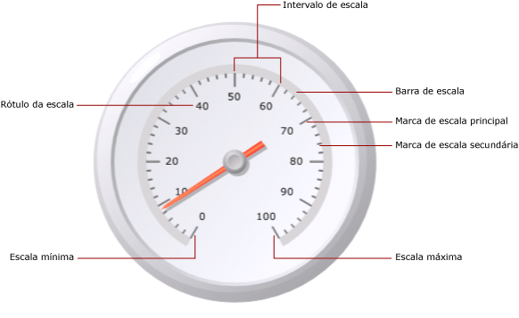

# Formatando escalas de um medidor (Construtor de Relatórios e SSRS)
  Em um relatório paginado do [!INCLUDE[ssRSnoversion_md](../../includes/ssrsnoversion-md.md)] , a escala do medidor é o intervalo de números, limitados por um mínimo e um máximo, mostrado em um medidor. Normalmente, a escala de um medidor contém rótulos de marcas de escala do medidor que fornecem uma leitura precisa do que o ponteiro do medidor mostra. Geralmente, a escala de um medidor está associada a um ou mais ponteiros do medidor. Você pode ter mais de uma escala no mesmo medidor.  
  
   
  
 Diferente de gráficos, nos quais vários grupos são definidos, o medidor mostra apenas um valor. Você deve definir os valores mínimo e máximo da escala. Os números do intervalo são calculados automaticamente com base nos valores especificados para o mínimo e máximo.  
  
 Quando você adiciona uma segunda escala em um medidor que já contém uma escala, as propriedades da aparência da primeira escala são clonadas na segunda escala.  
  
 Você pode definir as propriedades na escala clicando com o botão direito do mouse nos rótulos e nas marcas de escala e selecionando **Propriedades de Escala Radial** ou **Propriedades de Escala Linear**. Cada tipo de medidor contém pelo menos uma escala com o mesmo conjunto de propriedades. Também existem propriedades exclusivas para cada tipo de medidor:  
  
-   Em um medidor radial, é possível especificar o raio, o ângulo inicial e o ângulo de flecha da escala radial.  
  
-   Em um medidor linear, é possível especificar a largura das margens de início e de fim relativas aos pontos de extremidade.  
  
 Para se familiarizar rapidamente com escalas de formatação, consulte [Definir mínimo ou máximo em um medidor &#40;Construtor de Relatórios e SSRS&#41;](../../reporting-services/report-design/set-a-minimum-or-maximum-on-a-gauge-report-builder-and-ssrs.md).  
  
##   Definindo o mínimo, o máximo e os intervalos em uma escala  
 Um medidor é usado com frequência para exibir KPIs que são medidos em porcentagens de 0 a 100, portanto esses são os valores padrão fornecidos para as propriedades de máximo e de mínimo no medidor. Porém, esses valores podem não representar a escala de valores que você está tentando mostrar. Como não há nenhuma lógica interna para determinar o que o campo de dados de KPI representa, o medidor não calcula automaticamente os valores mínimo e máximo. Se o campo de dados de KPI não for um valor entre 0 e 100, você deverá definir explicitamente os valores das propriedades de mínimo e máximo para fornecer contexto para o valor que está sendo exibido no medidor.  
  
 Há marcas de escala principais e secundárias. Além disso, a escala tem rótulos que normalmente estão associados às marcas de escala principais. Por exemplo, uma escala pode ter marcas principais em 0, 20, 40, 60, 80 e 100. Os rótulos devem corresponder a essas marcas de escala. A diferença entre os valores de rótulos é chamada de intervalo de escala. Neste exemplo, o intervalo de escala está definido como 20. É possível definir a propriedade de Intervalo na caixa de diálogo **Propriedades de Escala Radial** ou **Propriedades de Escala Linear** .  
  
 O aplicativo calcula os intervalos de escala de acordo com as seguintes etapas:  
  
1.  Especifica os valores mínimo e máximo. Esses valores não são calculados automaticamente com base no conjunto de dados, portanto você deve fornecer os valores na caixa de diálogo **Propriedades** do medidor.  
  
2.  Se você não especificar um valor para Intervalo, o valor padrão será Automático. Isso significa que o aplicativo calculará um número equidistante de intervalos com base nos valores mínimo e máximo especificados na primeira etapa. Se você especificar um valor para Intervalo, o medidor calculará a diferença entre o valor máximo e mínimo e dividirá esse número pelo valor especificado na propriedade de Intervalo.  
  
 Também há propriedades para definir o rótulo e os intervalos das marcas de escala. Se você especificar um valor para essas propriedades, elas substituirão o valor especificado para a propriedade de intervalo de escala. Por exemplo, se o intervalo de escala for Automático, mas você especificar 4 para o intervalo de rótulo, os rótulos serão exibidos como 0, 4, 8 e assim por diante, mas as marcas de escala principais ainda serão calculadas pelo medidor com base em seu próprio cálculo. Isto pode provocar situações em que os rótulos não estejam sincronizados com as marcas de escala. Considere a possibilidade de ocultar as marcas de escala da exibição caso você tenha definido um intervalo de rótulo.  
  
 O deslocamento do intervalo determina o número de unidades que serão puladas antes do primeiro rótulo ser mostrado. Todas as marcas de escala e rótulos principais sucessivos que aparecerem na escala usarão o intervalo especificado. Um valor de 0 para intervalos de rótulo ou marca de escala tem o mesmo efeito que a definição do intervalo como Automático.  
  
##   Reduzindo colisões de rótulos com multiplicadores  
 Se os valores contiverem muitos dígitos, eles poderão obscurecer a legibilidade do medidor. É possível usar um multiplicador de escala para aumentar ou reduzir a escala dos valores. Quando um multiplicador de escala é especificado, cada valor original na escala é multiplicado pelo multiplicador antes de ser exibido na escala. Para reduzir a escala de valores, você deve especificar um número decimal. Por exemplo, se a escala for de 0 a 10000, mas você desejar mostrar os números 0 a 10 no medidor, um valor multiplicador de 0,001 poderá ser usado.  
  
> [!NOTE]  
>  O uso de um multiplicador não multiplica o valor real do campo agregado usado pelo medidor. Ele apenas multiplica os valores dos rótulos exibidos no medidor depois que o mínimo, o máximo e os intervalos estiverem definidos. Considere a possibilidade de manter os cálculos do intervalo como automáticos ao usar um multiplicador.  
  
##   Especificando a largura da barra da escala, o raio e os ângulos em uma escala radial  
 Use a página **Layout** da caixa de diálogo **Propriedades de Escala Radial** para definir a largura da barra da escala, o raio da escala, o ângulo inicial e o ângulo de flecha da escala. Você pode usar essas propriedades para personalizar o tamanho e o formato da escala. Por exemplo, se você posicionar rótulos da escala fora da escala, será necessário redimensionar o raio da escala para ajustar os rótulos dentro do medidor.  
  
> [!NOTE]  
>  Quando você clica na escala de um medidor, um contorno pontilhado é exibido ao redor da escala. Esse contorno não é a barra da escala e não é usado ao calcular medidas no medidor. Ele está disponível apenas no momento de design para que você possa realçar a escala para acessar as propriedades da escala.  
  
 Todas as medidas são baseadas na barra da escala. Quando você seleciona um medidor, a largura da barra da escala não é mostrada. Especificar um valor para a barra da escala ajuda a calcular todas as outras medidas relacionadas à escala. Para exibir a barra da escala, defina a propriedade **Largura da barra da escala** na página **Layout** da caixa de diálogo **Propriedades da Escala Radial** como um valor maior que 0. Em um medidor radial, a barra da escala é medida como uma porcentagem do diâmetro do medidor. Em um medidor linear, a barra da escala é medida como uma porcentagem da largura ou da altura do medidor, a que for menor.  
  
 O raio da escala é a distância do centro do medidor até o meio da barra da escala. O valor do raio da escala é medido como uma porcentagem do diâmetro do medidor. É uma prática recomendada manter o raio da escala abaixo de um valor de 35. Se você especificar um valor maior que 35, a escala será provavelmente desenhada fora dos limites do medidor. A ilustração a seguir mostra como o raio da escala é medido em relação ao diâmetro do medidor na barra da escala.  
  
   
  
 O ângulo inicial é o ângulo de rotação, entre 0 e 360, no qual a escala começará. A posição zero (0) está localizada na parte inferior do medidor, e o ângulo inicial gira no sentido horário. Por exemplo, um ângulo inicial de 90 graus inicia a escala na posição de 9 horas.  
  
 O ângulo de flecha é o número de graus, entre 0 e 360, que a escala varrerá em um círculo. Um ângulo de flecha de 360 graus produz uma escala que é um círculo completo. Isto será útil se você desejar criar um medidor parecido com um relógio.  
  
##   Posicionando rótulos em uma escala linear ou radial  
 Há duas propriedades que determinam a posição dos rótulos. A propriedade de posicionamento de rótulos especifica se os rótulos serão exibidos no lado de dentro, de fora, ou ao longo da barra de escala. A propriedade de distância define a distância do rótulo em relação à escala, iniciando na barra da escala. Se você desejar posicionar rótulos dentro da barra da escala, especifique um número negativo. Por exemplo, se os rótulos estiverem fora da escala e você tiver definido uma distância da escala de 10, os rótulos serão mostrados 10 unidades fora do local onde os rótulos são posicionados normalmente, onde 1 unidade é:  
  
-   1% do diâmetro do medidor em um medidor radial, ou  
  
-   1% do valor menor da altura ou da largura do medidor em um medidor linear.  
  
## Consulte Também  
 [Formatando intervalos de um medidor &#40;Construtor de Relatórios e SSRS&#41;](../../reporting-services/report-design/formatting-ranges-on-a-gauge-report-builder-and-ssrs.md)   
 [Formatando ponteiros de um medidor &#40;Construtor de Relatórios e SSRS&#41;](../../reporting-services/report-design/formatting-pointers-on-a-gauge-report-builder-and-ssrs.md)   
 [Formatar rótulos de eixo como datas ou moedas &#40;Construtor de Relatórios e SSRS&#41;](../../reporting-services/report-design/format-axis-labels-as-dates-or-currencies-report-builder-and-ssrs.md)   
 [Formatando rótulos dos eixos de um gráfico &#40;Construtor de Relatórios e SSRS&#41;](../../reporting-services/report-design/formatting-axis-labels-on-a-chart-report-builder-and-ssrs.md)   
 [Medidores &#40;Construtor de Relatórios e SSRS&#41;](../../reporting-services/report-design/gauges-report-builder-and-ssrs.md)  
  
  
