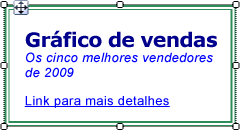
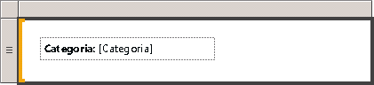

# Formatando texto e espaços reservados (Construtor de Relatórios e SSRS)
  Uma caixa de texto pode ser um item de relatório ou uma célula individual dentro de uma região de dados que contém texto, um campo calculado, um ponteiro para um campo em um banco de dados ou uma combinação dos três itens. Você pode misturar fontes e cores, adicionar estilos em negrito e itálico e usar estilos de parágrafo, como alinhamento e recuos deslocados. Você pode formatar uma caixa de texto inteira ou formatar texto, números, expressões ou campos específicos dentro da caixa de texto.  
  
 Fonte, tamanho, cor e efeitos, tudo contribui para a legibilidade de um relatório. Fonte, estilo de fonte, tamanho da fonte e efeitos de sublinhados podem ser aplicados ao texto dentro de uma caixa de texto ou região de dados. Por padrão, a fonte de relatório usada é Arial, 10 pontos e preto. Usando as caixas de diálogo **Caixa de Texto** e **Propriedades do Texto** , é possível especificar como o texto é exibido quando o relatório é renderizado.  
  
   
  
 Nessa ilustração, a própria caixa de texto tem uma borda e todo o texto está na mesma caixa de texto, mas o texto tem várias formatações.  
  
 Para começar a usar rapidamente, consulte [Tutorial: Formatar texto &#40;Construtor de Relatórios&#41;](../../reporting-services/tutorial-format-text-report-builder.md).  
  
> [!NOTE]  
>  [!INCLUDE[ssRBRDDup](../../includes/ssrbrddup-md.md)]  
  
## Criando texto de espaço reservado em uma caixa de texto  
 Quando uma expressão simples ou complexa é definida dentro de uma caixa de texto, a representação da interface do usuário resultante dessa expressão é conhecida como um *espaço reservado*. Você pode definir cores, fontes, ações e outro comportamento em qualquer número de espaços reservados ou seções de texto dentro de uma única caixa de texto.  
  
 O valor de um espaço reservado é sempre uma expressão simples ou complexa. Você pode adicionar um espaço reservado a uma caixa de texto criando uma expressão que usa um dos seguintes métodos:  
  
-   Arraste um campo do painel **Dados do Relatório** e solte-o dentro da caixa de texto. Se você arrastar a expressão em qualquer outro lugar no corpo de relatório, uma nova caixa de texto será criada contendo o espaço reservado. O valor desse espaço reservado será a expressão de campo correspondente ao campo que foi solto.  
  
-   Clique com o botão direito do mouse em qualquer lugar na caixa de texto e selecione **Inserir Espaço Reservado**. Na caixa de diálogo **Propriedades do Espaço Reservado** , é possível especificar uma expressão como o valor do espaço reservado. Para obter mais informações, consulte [Caixa de diálogo Propriedades do Espaço Reservado, Geral &#40;Construtor de Relatórios e SSRS&#41;](http://msdn.microsoft.com/library/7a867736-a3b0-4b5a-b3e5-fe7c8d7618a8).  
  
-   Digite qualquer expressão simples ou complexa na caixa de texto. Por exemplo, se você digitar **Name: [Name]** na caixa de texto, o texto **[Name]** será exibido como um espaço reservado que representa a expressão `=Fields!Name.Value`.  
  
-   Digite uma expressão em uma caixa de texto vazia iniciando com um sinal de igualdade (=). Quando alterar o foco para fora a caixa de texto, a expressão resultante será convertida em um espaço reservado que pode ser editado. Se a caixa de texto não estiver vazia, ou o sinal de igualdade for inserido em um lugar diferente do primeiro caractere na caixa de texto, o sinal de igualdade será tratado como um literal de cadeia de caracteres e não será criado um espaço reservado. Para obter mais informações sobre como definir expressões simples e complexas, consulte [Usos de expressões em relatórios &#40;Construtor de Relatórios e SSRS&#41;](../../reporting-services/report-design/expression-uses-in-reports-report-builder-and-ssrs.md).  
  
## Formatando espaços reservados e texto estático em uma caixa de texto  
 É possível formatar espaços reservados usando a caixa de diálogo **Propriedades do Espaço Reservado** . Você pode formatar somente o espaço reservado inteiro, e não seções dele. Para ver a expressão subjacente, pause o ponteiro sobre o espaço reservado. Você pode alterar a expressão subjacente clicando duas vezes no espaço reservado ou clicando com o botão direito do mouse no espaço reservado e selecionando **Propriedades do Espaço Reservado**. Também é possível especificar um rótulo da interface do usuário que usa a propriedade **Rótulo** em **Geral** da caixa de diálogo **Propriedades do Espaço Reservado** . Esse será o texto mostrado em tempo de design para o espaço reservado.  
  
   
  
 Nesta ilustração, uma caixa de texto em uma lista contém um rótulo com formatação em negrito e um espaço reservado sem formatação.  
  
 Diferentemente do texto do espaço reservado, você pode alinhar um texto individual em uma caixa de texto separadamente, usar vários parágrafos em uma única caixa de texto e definir outro comportamento para qualquer subconjunto de texto.  
  
 É possível definir cores, fontes, ações e outro comportamento em qualquer subconjunto de texto dentro de uma única caixa de texto para criar uma mala direta ou um modelo de texto no seu relatório. Também é possível usar vários parágrafos dentro de uma única caixa de texto. Por exemplo, se houver dois parágrafos diferentes de texto, é possível separá-los pressionando ENTER na caixa de texto. Você também pode definir um valor de alinhamento para qualquer cadeia de caracteres individual de texto. Além disso, é possível definir uma ação para texto individual em uma caixa de texto. Isso pode ser útil para adicionar um hiperlink em uma cadeia de caracteres de texto contida em uma caixa de texto.  
  
> [!NOTE]  
>  As ações definidas na caixa de texto têm uma prioridade mais alta que ações definidas para texto individual em uma caixa de texto.  
  
 Para obter mais informações sobre formatação mista, consulte [Formatar o texto em uma caixa de texto &#40;Construtor de Relatórios e SSRS&#41;](../../reporting-services/report-design/format-text-in-a-text-box-report-builder-and-ssrs.md).  
  
## Alinhando texto horizontal usando geral  
 Em **Alinhamento** na caixa de diálogo **Propriedades da Caixa de Texto** , você pode especificar como o texto deve ser alinhado horizontalmente. Se você não especificar um valor para o alinhamento, o valor padrão do alinhamento será **Padrão**. Isso significa que o texto será alinhado com base no tipo de campo do valor de espaço reservado. Se você especificar uma expressão avaliada com um valor diferente de cadeia de caracteres, ou seja, um número, o texto será alinhado à direita. Se a expressão for avaliada com um valor da cadeia de caracteres, como um número, o texto será alinhado à esquerda.  
  
## Consulte Também  
 [Expressões &#40;Construtor de Relatórios e SSRS&#41;](../../reporting-services/report-design/expressions-report-builder-and-ssrs.md)   
 [Formatando rótulos dos eixos de um gráfico &#40;Construtor de Relatórios e SSRS&#41;](../../reporting-services/report-design/formatting-axis-labels-on-a-chart-report-builder-and-ssrs.md)   
 [Formatando escalas em um medidor &#40;Construtor de Relatórios e SSRS&#41;](../../reporting-services/report-design/formatting-scales-on-a-gauge-report-builder-and-ssrs.md)   
 [Tabelas, matrizes e listas &#40;Construtor de Relatórios e SSRS&#41;](../../reporting-services/report-design/tables-matrices-and-lists-report-builder-and-ssrs.md)   
 [Caixa de diálogo Propriedades do Espaço Reservado, Geral &#40;Construtor de Relatórios e SSRS&#41;](http://msdn.microsoft.com/library/7a867736-a3b0-4b5a-b3e5-fe7c8d7618a8)   
 [Exportando para o Microsoft Excel &#40;Construtor de Relatórios e SSRS&#41;](../../reporting-services/report-builder/exporting-to-microsoft-excel-report-builder-and-ssrs.md)   
 [Caixas de texto &#40;Construtor de Relatórios e SSRS&#41;](../../reporting-services/report-design/text-boxes-report-builder-and-ssrs.md)  
  
  
