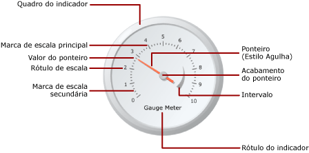

# Medidores (Construtor de Relatórios e SSRS)
  Nos relatórios paginados do [!INCLUDE[ssRSnoversion_md](../../includes/ssrsnoversion-md.md)] , uma região de dados de medidor exibe um único valor para o conjunto de dados. Um medidor individual é sempre posicionado dentro de um painel de medidores, onde é possível adicionar medidores filho ou adjacentes. Dentro de um painel de medidor único, você pode criar vários medidores que compartilham funções comuns, como filtragem, agrupamento ou classificação.  
  
 Os medidores podem executar várias tarefas em um relatório:  
  
-   Exibir os indicadores chave de desempenho (KPIs) em um único medidor radial ou linear.  
  
-   Incluir um medidor em uma tabela ou matriz para ilustrar os valores dentro de cada célula.  
  
-   Usar vários medidores em um único painel de medidores para comparar dados entre campos.  
  
 Há dois tipos de medidores: radial e linear. A ilustração a seguir mostra os elementos básicos de um único medidor radial no painel de medidores.  
  
   
  
 Para obter mais informações sobre como usar medidores como KPIs, consulte [Tutorial: Adicionando um KPI ao seu relatório &#40;Construtor de Relatórios&#41;](../../reporting-services/tutorial-adding-a-kpi-to-your-report-report-builder.md).  
  
> [!NOTE]  
>  É possível publicar medidores separadamente de um relatório como partes do relatório. Leia mais sobre as [Partes do relatório](../../reporting-services/report-design/report-parts-report-builder-and-ssrs.md).  
  
##   Tipos de medidores  
 [!INCLUDE[ssRSnoversion](../../includes/ssrsnoversion-md.md)] fornece dois tipos de medidores: radial e linear. O medidor radial geralmente é usado quando você deseja expressar os dados como uma velocidade. O medidor linear é usado para expressar os dados como uma temperatura ou um valor escalar.  
  
 As principais diferenças entre os dois tipos são a forma geral do medidor e os ponteiros de medidor disponíveis. Os medidores radiais são circulares, ou graus de um círculo, e lembram velocímetros. Os ponteiros do medidor frequentemente são agulhas, mas podem ser marcadores ou barras.  
  
 Os medidores lineares são retangulares, com orientação vertical ou horizontal, e lembram réguas. Os ponteiros do medidor frequentemente são termômetros, mas podem ser marcadores ou barras. Devido à sua forma, esse tipo de medidor é útil quando para integração a regiões de dados de tabela ou matriz para mostrar dados de progresso.  
  
 Sem ser essas diferenças, os dois tipos de medidores são intercambiáveis. No entanto, se você tiver que usar um medidor simples no relatório, considere utilizar indicador, em vez de um medidor. Para obter mais informações, consulte [indicadores &#40; Construtor de relatórios e SSRS &#41; ](../../reporting-services/report-design/indicators-report-builder-and-ssrs.md).  
  
 As ilustrações a seguir mostram medidores radiais e lineares. O medidor radial é redondo e usa o ponteiro de agulha. O medidor linear é horizontal e usa o ponteiro de termômetro.  
  
 **Medidor radial**  
  
   
  
 Opções de medidor radial: Radial, Radial com Minimedidor, Duas Escalas, 90 Graus Nordeste, 90 Graus Noroeste, 90 Graus Sudoeste, 90 Graus Sudeste, 180 Graus Norte, 180 Graus Sul, 180 Graus Oeste, 180 Graus Leste e Medidor.  
  
 **Medidor linear**  
  
   
  
 Opções de medidor linear: Horizontal, Vertical, Vários Ponteiros de Barra, Duas Escalas, Intervalo de Três Cores, Logarítmico, Termômetro, Termômetro Fahrenheit/Celsius e Gráfico de Marcador.  
  
##   Adicionando dados a um medidor  
 Depois que você adicionar um medidor à superfície de design, arraste um campo de subconjunto para o painel de dados do medidor. Por padrão, o medidor agrega todos os valores de campo em um valor que é mostrado no medidor. Esse valor é anexado ao ponteiro com o uso da propriedade Value. Dependendo do tipo de dados do campo, o medidor usará a agregação SUM ou COUNT. Quando você usar dados numéricos, apropriados para adição, o medidor usará a função SUM. Caso contrário, usará a agregação COUNT. O valor do ponteiro poderá usar uma agregação diferente ou nenhuma agregação.  
  
 É possível adicionar agrupamento ao medidor para exibir grupos ou linhas individuais no medidor. Depois que o agrupamento e a filtragem são aplicados, o medidor usa o valor do ponteiro para exibir o último grupo ou linha no conjunto de dados retornado.  
  
 É possível adicionar vários valores a um medidor individual adicionando outro ponteiro. Esse ponteiro pode pertencer à mesma escala ou outra escala pode ser adicionada e associada ao ponteiro.  
  
 Diferente dos tipos de gráfico disponíveis na caixa de diálogo **Selecionar Tipo de Gráfico** , os tipos de medidor disponíveis na caixa de diálogo **Selecionar Tipo de Medidor** são criados a partir de uma combinação de propriedades de medidor. Sendo assim, não é possível alterar o tipo de medidor como você faria com um tipo de gráfico. Para alterar o tipo de medidor, é preciso removê-lo e adicioná-lo novamente à superfície de design. Um medidor tem, no mínimo, uma escala e um ponteiro. Você pode ter várias escalas clicando com o botão direito do mouse no medidor e selecionando **Adicionar Escala**. Por padrão, isso cria uma escala menor que será posicionada dentro da primeira escala. A escala exibe rótulos e marcas de escala. Há dois conjuntos de marcas de escala: secundária e principal.  
  
 Você pode ter vários ponteiros clicando com o botão direito do mouse em um medidor e selecionando **Adicionar Ponteiro**. Isso criará outro ponteiro na mesma escala, mas, se houver várias escalas, será possível associar um ponteiro com qualquer escala do medidor.  
  
### Considerações ao adicionar dados ao medidor  
 Como todas as outras regiões de dados, a região de dados do Medidor pode ser associada a apenas um conjunto de dados. Se você tiver vários conjuntos de dados, considere a possibilidade de usar um JOIN ou UNION para criar um conjunto de dados ou use medidores separados para cada conjunto de dados.  
  
 Tipos de dados numéricos são agregados com a função SUM. Tipos de dados não numéricos são agregados com a função COUNT que conta o número de instâncias de um valor ou campo específico dentro do conjunto de dados ou grupo.  
  
 Depois de adicionar os dados, quando clicar com o botão direito do mouse no ponteiro, você obterá as opções Limpar Valor do Ponteiro e Excluir Ponteiro. A opção Limpar Valor do Ponteiro remove o campo anexado ao medidor, mas o ponteiro ainda aparecerá no medidor. A opção Excluir Ponteiro remove o campo do medidor e exclui o ponteiro da exibição. Se você adicionar novamente um campo ao medidor, o ponteiro padrão reaparecerá. Depois de adicionar o campo ao medidor, você deve definir os valores mínimo e máximo na escala correspondente para dar contexto ao valor no medidor. Você também pode definir os valores mínimo e máximo em um intervalo, o que mostra uma área crítica na escala. O medidor não definirá automaticamente os valores mínimo ou máximo na escala ou no intervalo porque ele não pode determinar como o valor deve ser percebido.  
  
### Métodos para adicionar dados a um medidor  
 Depois de definir um conjunto de dados para o relatório, é possível adicionar um campo de dados ao medidor usando uma das seguintes abordagens:  
  
-   Arraste um campo do conjunto de dados até o painel de dados. Clique no medidor e arraste um campo até ele. Você pode abrir o painel de dados clicando no medidor ou arrastando um campo pelo medidor. Se ainda não houver um ponteiro no medidor, um ponteiro será adicionado e associado ao campo adicionado.  
  
-   Exiba o painel de dados e aponte para o espaço reservado do campo. Clique na seta para baixo ao lado do espaço reservado do campo e selecione o campo que você deseja usar. Se houver um campo já selecionado, clique na seta para baixo e selecione outro campo.  
  
    > [!NOTE]  
    >  Essa abordagem não é aplicável quando não há nenhum ponteiro no medidor ou o relatório contém mais de um conjunto de dados e o painel de medidores não está associado ao conjunto de dados.  
  
-   Clique com o botão direito do mouse no ponteiro do medidor e selecione **Propriedades do Ponteiro**. Para **Valor**, selecione um campo na lista suspensa ou defina uma expressão de campo clicando no botão **Expressão** (*fx*).  
  
### Agregando campos em um único valor  
 Quando um campo é adicionado a um medidor, por padrão, o [!INCLUDE[ssRSnoversion](../../includes/ssrsnoversion-md.md)] calcula uma agregação para o campo. Tipos de dados numéricos são agregados com a função SUM. Tipos de dados não numéricos são agregados com a função COUNT que conta o número de instâncias de um valor ou campo específico dentro do conjunto de dados ou grupo. Se o tipo de dados do campo de valor for String, o medidor não poderá exibir um valor numérico, mesmo que haja numerais nos campos. Em vez disso, o medidor agrega campos de cadeia de caracteres usando a função COUNT. Para evitar esse comportamento, verifique se os campos usados têm tipos de dados numéricos, em vez de cadeias de caracteres que contêm números formatados. É possível usar uma expressão do Visual Basic para converter valores de cadeia de caracteres em um tipo de dados numérico usando a constante CDbl ou CInt. Por exemplo, a expressão a seguir converte um campo de cadeia de caracteres chamado MyField em valores numéricos.  
  
 `=Sum(CDbl(Fields!MyField.Value))`  
  
 Para obter mais informações sobre expressões de agregação, consulte [Referência de funções de agregação &#40;Construtor de Relatórios e SSRS&#41;](../../reporting-services/report-design/report-builder-functions-aggregate-functions-reference.md).  
  
### Definindo um grupo em um medidor  
 Depois de adicionar um campo ao medidor, é possível adicionar um grupo de dados. O Medidor difere de todas as outras regiões de dados no [!INCLUDE[ssRSnoversion](../../includes/ssrsnoversion-md.md)]que podem exibir vários grupos em uma região de dados. A adição de um grupo com a definição de uma expressão de grupo no medidor é o mesmo que adicionar um grupo de linhas na região de dados Tablix. Porém, quando o grupo é adicionado, só o valor do último grupo é exibido como o valor do ponteiro no medidor. Por exemplo, se você adicionar uma expressão de agrupamento no Ano, o ponteiro apontará para o valor que representa o valor de vendas de agregação para o último ano no conjunto de dados. Para obter mais informações sobre grupos, consulte [Noções básicas sobre grupos &#40;Construtor de Relatórios e SSRS&#41;](../../reporting-services/report-design/understanding-groups-report-builder-and-ssrs.md).  
  
 Você pode desejar adicionar um grupo no medidor se, por exemplo, estiver exibindo vários medidores em uma tabela ou lista e desejar exibir dados agregados por grupo. Para obter mais informações, consulte [Adicionar ou excluir um grupo em uma região de dados &#40;Construtor de Relatórios e SSRS&#41;](../../reporting-services/report-design/add-or-delete-a-group-in-a-data-region-report-builder-and-ssrs.md).  
  
##   Posicionando elementos em um medidor  
 O painel de medidores é o contêiner de nível superior que mantém um ou mais medidores. É possível exibir a caixa de diálogo **Propriedades do Painel de Medidores** clicando fora do medidor. Por sua vez, cada medidor contém vários elementos de medidor: uma escala, um intervalo e um ponteiro. Ao usar o medidor, você precisa compreender como os elementos são medidos no painel de medidores para modificar o tamanho e o local desses elementos.  
  
### Compreendendo as medidas de tamanho e de posição  
 Todas as medidas de tamanho e de posição no medidor são calculadas como uma porcentagem de seu elemento pai. Quando elementos pai têm valores de largura e altura diferentes, o tamanho do elemento do medidor é calculado como uma porcentagem do menor dos dois valores. Por exemplo, em um medidor linear, todas as medidas do ponteiro são calculadas como uma porcentagem da largura ou da altura do medidor linear, a que for menor.  
  
 As medidas de posição também são calculadas como uma porcentagem de seus elementos pai usando um sistema de coordenadas. A origem desse sistema de coordenadas está no canto superior esquerdo, com o eixo X apontando para a direita e o eixo Y apontando para baixo. Os valores das coordenadas devem estar entre 0 e 100 e todas as medidas são representadas como uma porcentagem. Por exemplo, quando as posições de X e Y do medidor linear estiverem definidas como 50 e 50, o medidor será posicionado no meio do painel de medidores.  
  
### Posicionando vários medidores dentro do painel de medidores  
 Existem duas maneiras de adicionar um novo medidor a um painel de medidores que já contém um medidor. Você pode adicionar um medidor como um filho do primeiro ou adicionar outro medidor adjacente ao primeiro.  
  
 Quando um novo medidor é adicionado ao painel de medidores, ele é dimensionado e posicionado na mesma proporção que todos os outros medidores no painel de medidores. Por exemplo, se um medidor radial for adicionado um painel de medidores que já contém um medidor radial, os dois medidores serão automaticamente redimensionados para que cada um se ajuste à metade do painel.  
  
 É possível adicionar um novo medidor a um painel de medidores que já contém um medidor. Para fazer isso, clique com o botão direito do mouse em qualquer lugar do painel de medidores, focalize **Adicionar Novo Medidor** e selecione **Filho**. A caixa de diálogo **Selecionar Tipo de Medidor** é exibida. Quando o novo medidor é adicionado como um filho, ele é adicionado em uma das duas maneiras. Em um medidor radial, o medidor filho é posicionado no canto superior esquerdo do primeiro medidor. Em um medidor linear, o medidor filho é posicionado no meio do primeiro medidor. É possível posicionar o medidor filho, relativo ao medidor pai, usando as propriedades de Posição. Como com todos os outros elementos, as medidas de posição são calculadas como uma porcentagem do elemento pai correspondente.  
  
### Posicionando rótulos de escala e intervalos de medidor  
 Há duas propriedades que determinam a posição dos rótulos em uma escala de medidor. É possível definir a propriedade de **Posicionamento** da escala do medidor para especificar se os rótulos são exibidos dentro, fora ou ao longo da barra da escala. Também é possível especificar um valor numérico para a propriedade de **Distância da escala** , o que especifica o número de unidades que são adicionadas ou subtraídas do posicionamento para determinar a posição do rótulo. Por exemplo, se o **Posicionamento** estiver definido como **Externo** e você tiver definido a **Distância da escala** como 10, os rótulos serão posicionados 10 unidades a partir da borda externa da escala do medidor, em que uma unidade pode ser:  
  
-   1% do diâmetro do medidor em um medidor radial, ou  
  
-   1% do valor menor da altura ou da largura do medidor em um medidor linear.  
  
 As propriedades de **Posição** e **Distância da escala** também se aplicam a intervalos do medidor.  
  
### Mantendo a taxa de proporção em um medidor linear  
 O medidor linear assume uma forma circular, portanto, normalmente, esse tipo de medidor mantém os mesmos valores de largura e altura. No entanto, em um medidor linear que assume uma forma retangular, a proporção entre a largura e a altura normalmente é irregular. A taxa de proporção de um medidor determina a proporção da largura em relação à altura que deveria ser mantida quando o medidor é redimensionado. Por exemplo, se o valor estiver definido como 2, a largura do medidor será sempre duas vezes a altura do medidor, não importando a maneira como o medidor é redimensionado. Para definir a taxa de proporção, você pode definir a propriedade AspectRatio na caixa de diálogo **Propriedades de Medidor Linear** .  
  
##   Tópicos de instruções  
 Esta seção lista os procedimentos que mostram, passo a passo, como trabalhar com medidores nos relatórios; como obter dados para exibição efetivamente em medidores e como adicionar e configurar medidores e seus elementos.  
  
-   [Adicionar um medidor a um relatório &#40;Construtor de Relatórios e SSRS&#41;](../../reporting-services/report-design/add-a-gauge-to-a-report-report-builder-and-ssrs.md)  
  
-   [Definir mínimo ou máximo em um medidor &#40;Construtor de Relatórios e SSRS&#41;](../../reporting-services/report-design/set-a-minimum-or-maximum-on-a-gauge-report-builder-and-ssrs.md)  
  
-   [Definir um intervalo de ajuste em um medidor (Construtor de Relatórios e SSRS)](http://msdn.microsoft.com/en-us/0ece7297-6e2f-47fb-835d-b9e9cce53fe2)  
  
-   [Especificar uma imagem como um ponteiro em um medidor (Construtor de Relatórios e SSRS)](http://msdn.microsoft.com/en-us/9d73b3c3-a068-4868-a2be-0cd261b6e92b)  
  
##   Nesta seção  
 Os tópicos a seguir fornecem informações adicionais sobre como trabalhar com medidores.  
  
|||  
|-|-|  
|Termo|Definição|  
|[Formatando escalas em um medidor &#40;Construtor de Relatórios e SSRS&#41;](../../reporting-services/report-design/formatting-scales-on-a-gauge-report-builder-and-ssrs.md)|Fornece informações gerais sobre escalas de formatação em medidores e informações detalhadas sobre as opções de formatação para escalas em medidores radiais e lineares.|  
|[Formatando ponteiros de um medidor &#40;Construtor de Relatórios e SSRS&#41;](../../reporting-services/report-design/formatting-pointers-on-a-gauge-report-builder-and-ssrs.md)|Fornece informações gerais sobre ponteiros de formatação em medidores e informações detalhadas sobre as opções de formatação para estilos de ponteiros disponíveis para medidores radiais e lineares.|  
|[Formatando intervalos de um medidor &#40;Construtor de Relatórios e SSRS&#41;](../../reporting-services/report-design/formatting-ranges-on-a-gauge-report-builder-and-ssrs.md)|Fornece informações sobre intervalos de formatação em medidores para indicar uma subseção importante de valores no medidor ou indicar visualmente quando o valor do ponteiro entrar em uma certa faixa de valores.|  
  
## Consulte também  
 [Expressões &#40;Construtor de Relatórios e SSRS&#41;](../../reporting-services/report-design/expressions-report-builder-and-ssrs.md)   
 [Filtro, grupo e classificar dados e &#40; Construtor de relatórios e SSRS &#41;](../../reporting-services/report-design/filter-group-and-sort-data-report-builder-and-ssrs.md)   
 [Parâmetros de relatório e &#40; Construtor de relatórios, Report Designer e &#41;](../../reporting-services/report-design/report-parameters-report-builder-and-report-designer.md)   
 [Gráficos de &#40; Construtor de relatórios e SSRS &#41;](../../reporting-services/report-design/charts-report-builder-and-ssrs.md)   
 [Tabelas, matrizes e listas de &#40; Construtor de relatórios e SSRS &#41;](../../reporting-services/report-design/tables-matrices-and-lists-report-builder-and-ssrs.md)  
  
  
