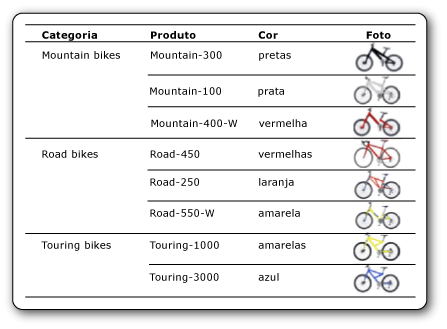

# Imagens (Construtor de Relatórios e SSRS)
  Uma imagem é um item de relatório que contém uma referência a uma imagem inserida em um relatório, armazenada em um banco de dados, no servidor de relatório ou em qualquer outro lugar na Web. Uma imagem pode ser uma imagem que é repetida com linhas de dados. Você também pode usar uma imagem como plano de fundo para determinados itens de relatórios.  
  
 Convém armazenar logotipos em um servidor pois você pode usar o mesmo logotipo em muitos relatórios.  
  
> [!NOTE]  
>  [!INCLUDE[ssRBRDDup](../../includes/ssrbrddup-md.md)]  
  
##   Comparando imagens externas, inseridas e vinculadas a dados  
 Quando você usar uma imagem com base em servidor ou outra imagem externa em um relatório, o item de imagem conterá um caminho que aponta para uma imagem no servidor de relatório ou onde quer que esteja na Web. No entanto, quando você usar uma imagem inserida, seus dados serão armazenados na definição de relatório e não existirão como um arquivo separado.  
  
 As imagens com base no servidor funcionam bem para logotipos e imagens estáticas compartilhadas entre vários relatórios ou páginas da Web. As imagens inseridas garantem que as imagens estejam sempre disponíveis para o relatório, mas elas não podem ser compartilhadas. As definições do relatório com imagens externas são menores que as definições com imagens inseridas.  
  
 As imagens vinculadas a dados também podem ser exibidas de dados binários armazenados em um banco de dados. Por exemplo, as imagens exibidas ao lado dos nomes de produtos em uma lista de produtos são imagens de banco de dados. Na imagem a seguir, as imagens de bicicletas são armazenadas em um banco de dados e recuperadas no relatório para ilustrar cada produto.  
  
   
  
  
##   Imagens como partes do relatório  
 Você pode salvar imagens separadamente de um relatório como partes de relatório. [!INCLUDE[ssRBrptparts](../../includes/ssrbrptparts-md.md)]  
  
  
##   Inserindo imagens  
 Você pode inserir imagens em um relatório para que todos os dados de imagens sejam armazenados na definição de relatório. Quando você insere uma imagem, ela tem codificação MIME e é armazenada como texto na definição de relatório. Usar uma imagem inserida garante que ela esteja sempre disponível para o relatório, mas também aumenta o tamanho da definição de relatório.  
  
 Para obter mais informações sobre como inserir uma imagem, consulte [Inserir uma imagem em um relatório &#40;Construtor de Relatórios e SSRS&#41;](../../reporting-services/report-design/embed-an-image-in-a-report-report-builder-and-ssrs.md).  
  
  
##   Imagens externas  
 Você pode incluir imagens armazenadas em um relatório, especificando uma URL para a imagem. Quando você usar uma imagem externa em um relatório, a origem será definida como **External** e o valor da imagem será seu endereço de URL ou o caminho para a imagem.  
  
 Para obter mais informações, consulte [Especificando caminhos para itens externos &#40;Construtor de Relatórios e SSRS&#41;](../../reporting-services/report-design/specifying-paths-to-external-items-report-builder-and-ssrs.md).  
  
 Quando o relatório for executado no Construtor de Relatórios ou no Designer de Relatórios, a visualização usará as credenciais do usuário para exibir a imagem. Quando o relatório for executado no servidor de relatório, a imagem no relatório talvez não seja exibida se as credenciais do servidor não forem suficientes para acessá-la. Nesse caso, contate o administrador do sistema.  
  
 Para obter mais informações sobre como adicionar uma imagem externa a um relatório, consulte [Adicionar uma imagem externa &#40;Construtor de Relatórios e SSRS&#41;](../../reporting-services/report-design/add-an-external-image-report-builder-and-ssrs.md).  
  
  
##   Imagens de plano de fundo  
 Você pode usar uma imagem como uma imagem de plano de fundo no corpo do relatório ou em um retângulo, caixa de texto, lista, matriz ou tabela. Uma imagem de plano de fundo e uma imagem têm propriedades semelhantes. Também é possível especificar como a imagem será repetida para preencher o plano de fundo do item.  
  
> [!NOTE]  
>  Algumas extensões de renderização, como a extensão de renderização HTML, renderizam a imagem de plano de fundo do corpo do relatório no corpo, no cabeçalho da página e no rodapé da página. Você pode definir uma imagem de plano de fundo separada para o cabeçalho e rodapé da página, mas, se nenhuma imagem for definida, o relatório usará a imagem de plano de fundo do corpo. Outras extensões de renderização, como a extensão de renderização de Imagem, não renderizam a imagem de plano de fundo do corpo no cabeçalho e rodapé da página.  
  
 Para obter mais informações sobre como adicionar uma imagem de tela de fundo, consulte [Adicionar uma imagem de tela de fundo &#40;Construtor de Relatórios e SSRS&#41;](../../reporting-services/report-design/add-a-background-image-report-builder-and-ssrs.md).  
  
  
##   Imagens vinculadas a dados  
 Você pode adicionar imagens armazenadas em um banco de dados ao seu relatório. Use o mesmo item de relatório de imagem como aquele usado para imagens estáticas, mas com um conjunto de propriedades que indica que a imagem está armazenada em um banco de dados. Para ver instruções sobre como trabalhar com imagens vinculadas a dados, consulte [Adicionar uma imagem vinculada a dados &#40;Construtor de Relatórios e SSRS&#41;](../../reporting-services/report-design/add-a-data-bound-image-report-builder-and-ssrs.md).  
  
  
##   Tópicos de instruções  
 [Adicionar uma imagem externa &#40;Construtor de Relatórios e SSRS&#41;](../../reporting-services/report-design/add-an-external-image-report-builder-and-ssrs.md)  
  
 [Inserir uma imagem em um relatório &#40;Construtor de Relatórios e SSRS&#41;](../../reporting-services/report-design/embed-an-image-in-a-report-report-builder-and-ssrs.md)  
  
 [Adicionar uma imagem de tela de fundo &#40;Construtor de Relatórios e SSRS&#41;](../../reporting-services/report-design/add-a-background-image-report-builder-and-ssrs.md)  
  
 [Adicionar uma imagem vinculada a dados &#40;Construtor de Relatórios e SSRS&#41;](../../reporting-services/report-design/add-a-data-bound-image-report-builder-and-ssrs.md)  
  
  
## Consulte também  
 [Exportando para um arquivo de imagem &#40;Construtor de Relatórios e SSRS&#41;](../../reporting-services/report-builder/exporting-to-an-image-file-report-builder-and-ssrs.md)   
 [Comportamentos de renderização &#40;Construtor de Relatórios e SSRS&#41;](../../reporting-services/report-design/rendering-behaviors-report-builder-and-ssrs.md)  
  
  
