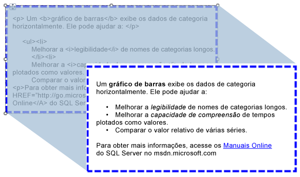

# Importando HTML para um relatório (Construtor de Relatórios e SSRS)
  É possível usar uma caixa de texto para inserir em um relatório um texto formatado em HTML recuperado de um campo em seu conjunto de dados. O texto pode ser de qualquer expressão simples ou complexa avaliada como HTML formatado corretamente. O texto formatado pode ser renderizado em todos os formatos de saída com suporte, inclusive PDF.  
  
   
  
 Esta ilustração mostra texto com formatação HTML em uma exibição de design de relatório, além do mesmo texto como é renderizado quando o relatório é executado.  
  
> [!NOTE]  
>  Ao importar texto contendo marcação HTML, os dados sempre devem ser analisados primeiro pela caixa de texto. Como apenas um subconjunto de marcas HTML possui suporte, o HTML mostrado no relatório renderizado pode ser diferente do HTML original.  
  
 Para começar a usar rapidamente, consulte [Tutorial: Formatar texto &#40;Construtor de Relatórios&#41;](../../reporting-services/tutorial-format-text-report-builder.md).  
  
> [!NOTE]  
>  [!INCLUDE[ssRBRDDup](../../includes/ssrbrddup-md.md)]  
  
## Tags HTML Suportadas  
 A seguir, há uma lista completa de marcas que são renderizadas como HTML quando definidas como texto de espaço reservado:  
  
-   Hiperlinks: \<A HREF>  
  
-   Fontes: \  
  
-   Elementos de cabeçalho, estilo e bloco: \<H{n}>, \
, \,\
, \
, \<LI>, \<HN>  
  
-   Formato de texto: \<B>, \<I>, \<U>, \<S>  
  
-   Manipulação de lista: \<OL>, \<UL>, \<LI>  
  
 Qualquer outra marcação HTML será ignorada durante o processamento de relatório. Se o HTML representado pela expressão no texto de espaço reservado não for bem formado, o espaço reservado será processado como texto sem-formatação. Todas as marcas HTML não diferenciam maiúsculas de minúsculas.  
  
 Se o texto na sua caixa de texto tiver apenas um bloco de texto, qualquer HTML no espaço reservado que define os elementos do bloco será renderizado corretamente. Entretanto, se a caixa de texto tiver vários blocos de texto, as marcas HTML serão ignoradas e a estrutura do texto será definida pelos blocos de texto.  
  
 Se mais de uma marca for definida para texto, e o [!INCLUDE[ssRSnoversion](../../includes/ssrsnoversion-md.md)] detectar um conflito entre o HTML e as restrições de relatório existentes, somente a marca HTML mais interna será tratada como HTML.  
  
 Para obter mais informações, consulte [Adicionar HTML a um relatório &#40;Construtor de Relatórios e SSRS&#41;](../../reporting-services/report-design/add-html-into-a-report-report-builder-and-ssrs.md).  
  
## Limitações de atributos de folha de estilos em cascata  
 Ao usar atributos de folha de estilos em cascata (CSS), somente um conjunto básico de marcas é definido. Estes são os atributos com suporte:  
  
-   alinhamento de texto, recuo de texto  
  
-   font-family  
  
-   font-size  
  
    -   Há suporte somente para valores de tamanho RDL válido em unidades de comprimento CSS absoluto. Unidades com suporte: in, cm, mm, pt, pc.  
  
    -   As unidades de comprimento CSS relativas são ignoradas e não têm suporte. As unidades com suporte são em, ex, px,%,rem.  
  
     Para saber mais sobre as unidades CSS, veja: [Valores CSS e referência de unidades](https://msdn.microsoft.com/library/ms531211\(VS.85\).aspx) (https://msdn.microsoft.com/library/ms531211(VS.85).aspx).  
  
-   color  
  
-   preenchimento, preenchimento inferior, preenchimento superior, preenchimento à direita, preenchimento à esquerda  
  
-   espessura da fonte  
  
 Eis algumas considerações quanto ao uso de CSS:  
  
-   Valores CSS malformados são ignorados da mesma maneira que HTML malformado.  
  
-   Quando o atributo e os atributos de estilo CSS existirem na mesma marca, a propriedade CSS tem maior precedência. Por exemplo, se o texto for **\
**, somente o atributo de alinhamento de texto será aplicado e o texto será alinhado à direita.  
  
-   Para atributos e a estilos CSS, se uma propriedade for especificada mais de uma vez, somente sua última instância será aplicada. Por exemplo, se o texto for **\
**, ele será alinhado à direita.  
  
## Consulte Também  
 [Renderizando para HTML &#40;Construtor de Relatórios e SSRS&#41;](../../reporting-services/report-builder/rendering-to-html-report-builder-and-ssrs.md)  
  
  
