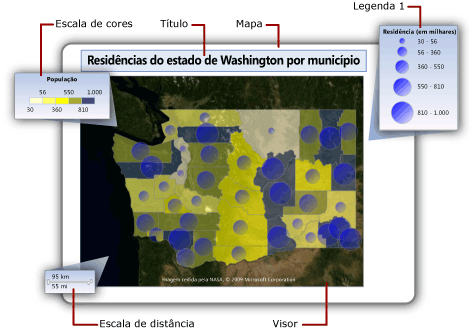
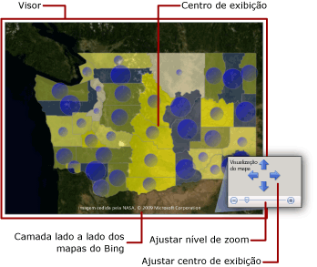

# Mapas (Construtor de Relatórios e SSRS)
  Para visualizar dados comerciais em uma tela de fundo geográfica, você pode acrescentar um mapa ao seu relatório paginado do [!INCLUDE[ssRSnoversion_md](../../includes/ssrsnoversion-md.md)] . O tipo de mapa selecionado depende de qual informação você deseja comunicar no seu relatório. Você pode adicionar um mapa que só exibe locais ou um mapa de bolhas que varia o tamanho da bolha com base no número de residências em uma área, ou um mapa de marcador que varia o estilo de marcador com base no produto mais lucrativo para cada loja, ou um mapa de linha que exibe rotas entre lojas.  
  
 Um mapa contém um título, um visor que especifica o ponto central e a escala, um plano de fundo de peça de mapa do Bing opcional para o visor, uma ou mais camadas que exibem dados espaciais e várias legendas que ajudam os usuários a interpretarem as visualizações de dados. A ilustração a seguir mostra as partes básicas de um mapa.  
  
   
  
 Para começar a usar o mapa imediatamente, consulte [Tutorial: relatório de mapa &#40;Construtor de Relatórios&#41;](../../reporting-services/tutorial-map-report-report-builder.md) ou [Exemplos de relatórios (Construtor de Relatórios e SSRS)](http://go.microsoft.com/fwlink/?LinkId=198283).  
  
> [!NOTE]  
>  Você pode salvar mapas separadamente de um relatório como partes de relatório. Leia mais sobre as [Partes do relatório](../../reporting-services/report-design/report-parts-report-builder-and-ssrs.md).  
  
##   Adicionando um mapa ao relatório  
 Para adicionar um mapa ao relatório, veja aqui uma lista das etapas gerais seguir:  
  
-   Determine os dados analíticos que você deseja exibir e os tipos de dados espaciais necessários. Por exemplo, para exibir as vendas anuais relativas da loja em um mapa de bolha, você precisa do nome e das vendas da loja para dados analíticos e do nome e do local da loja como latitude e longitude para dados espaciais.  
  
-   Escolha o estilo do mapa desejado. Mapas básicos exibem apenas locais. Mapas de bolhas variam o tamanho da bolha com base em um único valor analítico. Mapas de cores analíticos variam os elementos do mapa com base em intervalos de dados analíticos. O estilo selecionado dependerá dos dados que você deseja visualizar e do tipo de dados espaciais utilizado.  
  
-   Colete as informações necessárias para especificar fontes de dados espaciais, dados espaciais, fontes de dados analíticos e dados analíticos. Isso inclui cadeias de conexão para fontes de dados espaciais, especificando o tipo de dados espaciais de que você precisa e assegurando que os dados de relatório incluem campos de correspondência que associam os dados espaciais e os dados analíticos.  
  
-   Execute o assistente de mapa para adicionar um mapa ao seu relatório. Esse procedimento adiciona a primeira camada ao mapa. Execute o assistente de Camada do Mapa para criar camadas adicionais ou modificar as camadas existentes. Os assistentes fornecem um modo fácil de começar. Para obter mais informações, consulte [Assistente de Mapa e Assistente de Camada do Mapa &#40;Construtor de Relatórios e SSRS&#41;](../../reporting-services/report-design/map-wizard-and-map-layer-wizard-report-builder-and-ssrs.md).  
  
-   Depois que você visualizar o mapa no relatório, provavelmente desejará ajustar a exibição do mapa, alterar o modo como os dados variam a exibição de cada camada, fornecer legendas para ajudar seus usuários a interpretarem os dados e ajustar a resolução para oferecer uma boa experiência de exibição para os usuários.  
  
 Para obter mais informações, consulte [Planejar um relatório de mapa &#40;Construtor de Relatórios e SSRS&#41;](../../reporting-services/report-design/plan-a-map-report-report-builder-and-ssrs.md).  
  
##   Adicionando dados a um mapa  
 Um mapa usa dois tipos de dados: dados espaciais e dados analíticos. Os dados espaciais definem a aparência do mapa, enquanto os dados analíticos fornecem os valores associados ao mapa. Por exemplo, os dados espaciais definem os locais de cidades em uma área, enquanto os dados analíticos fornecem a população de cada cidade.  
  
 Um mapa deve ter dados espaciais; os dados analíticos são opcionais. Por exemplo, você pode adicionar um mapa que exibe apenas os locais de lojas em uma cidade.  
  
 Para visualizar dados em um mapa, os dados analíticos e os dados espaciais devem ter uma relação. Quando os dados espaciais e os dados analíticos são provenientes da mesma origem, a relação é conhecida. Quando os dados espaciais e os dados analíticos vêm de origens diferentes, você deve especificar campos de correspondência para relacioná-los.  
  
### Dados espaciais  
 Os dados espaciais consistem em conjuntos de coordenadas. Os dados espaciais de uma fonte de dados podem ser um único ponto, vários pontos, uma única linha, várias linhas ou um conjunto de polígonos. Cada conjunto de coordenadas define um *elemento do mapa*, por exemplo, um polígono que representa a estrutura de um município, uma linha que representa uma estrada ou um ponto que representa o local de uma cidade.  
  
 Os dados espaciais se baseiam em um dos seguintes sistemas de coordenadas:  
  
-   **Geográfico** Especifica as coordenadas geodésicas em uma superfície esférica usando a longitude e a latitude. Quando os dados espaciais são geográficos, uma projeção deve ser especificada. Uma projeção é um conjunto de regras que especifica como desenhar objetos que têm coordenadas esféricas em uma superfície planar. Somente dados geográficos com a mesma projeção podem ser comparados ou combinados.  
  
-   **Planar** Especifica as coordenadas geométricas em uma superfície planar usando X e Y.  
  
 Cada camada do mapa exibe um tipo de dados espaciais: polígonos, linhas ou pontos. Para exibir vários tipos de dados espaciais, adicione várias camadas ao mapa. Você também pode adicionar uma camada de peças de mapa do Microsoft Bing. A camada de peça não depende dos dados espaciais. A camada de peça exibe imagens lado a lado que correspondem às coordenadas do visor do mapa.  
  
#### Fontes de dados espaciais  
 As seguintes fontes de dados espaciais têm suporte:  
  
-   **Relatórios da galeria de mapas.** Os dados espaciais são inseridos em relatórios localizados na galeria de mapas. Por padrão, a Galeria de Mapas está instalada em *\<drive>*:\Program Files\Microsoft SQL Server\Report Builder \MapGallery.  
  
    > [!NOTE]  
    >  Esse recurso de mapeamento do [!INCLUDE[ssRSnoversion](../../includes/ssrsnoversion-md.md)] usa dados de arquivos de forma TIGER/Line fornecidos pela Agência de Recenseamento norte-americana ([http://www.census.gov/](http://www.census.gov/)). Os arquivos de forma TIGER/Line são um extrato das informações geográficas e cartográficas selecionadas do banco de dados Census MAF/TIGER. Esses arquivos de forma podem ser obtidos sem encargos com a Agência de Recenseamento norte-americana. Para saber mais sobre os arquivos de forma TIGER/Line, visite [http://www.census.gov/geo/www/tiger](http://www.census.gov/geo/www/tiger). As informações de limites nos arquivos de forma Tiger/Line destinam-se apenas a fins de coleta de dados estatísticos e tabulação; a representação e a designação dessas informações para propósitos estatísticos não constituem uma determinação de autoridade de jurisdição ou direitos de propriedade ou qualificação e elas não são descrições de terra legais. Census TIGER e TIGER/Line são marcas registradas da Agência de Recenseamento norte-americana.  
  
-   **Arquivos de forma ESRI.** Os arquivos de forma ESRI contêm dados compatíveis com o Environmental Systems Research Institute, Inc. ESRI (Environmental Systems Research Institute, Inc.). Os arquivos de forma ESRI referem-se a um conjunto de arquivos. Dados no arquivo .shp especificam as formas geográficas ou geométricas. Os dados no arquivo .dbf fornecem atributos para as formas. Para exibir um mapa em modo design ou executar um mapa do servidor de relatório, ambos os arquivos devem estar na mesma pasta. Quando você adicionar dados espaciais de um arquivo .shp em seu sistema de arquivos local, os dados espaciais serão incorporados em seu relatório. Para recuperar dados espaciais dinamicamente em tempo de execução, carregue os arquivos de forma no servidor de relatório e especifique-os como a fonte de dados espaciais. Para obter mais informações, consulte [Localizando arquivos de forma ESRI para um mapa](http://go.microsoft.com/fwlink/?linkid=178814).  
  
-   **Dados espaciais do SQL Server armazenados em um banco de dados.** É possível usar uma consulta que especifique tipos de dados **SQLGeometry** ou **SQLGeography** de um banco de dados relacional do [!INCLUDE[ssNoVersion](../../includes/ssnoversion-md.md)] . Para obter mais informações, veja [Visão geral de tipos de dados espaciais](../../relational-databases/spatial/spatial-data-types-overview.md).  
  
     No conjunto de resultados que você vê no designer de consulta, cada linha de dados espaciais é tratada como uma unidade e armazenada em um único elemento de mapa. Por exemplo, se houver vários pontos definidos em uma linha no conjunto de resultados, as propriedades de vídeo se aplicarão a todos os pontos naquele elemento de mapa.  
  
-   **Locais personalizados que você cria.** Você pode acrescentar locais manualmente como pontos incorporados a uma camada de ponto incorporada. Para obter mais informações, consulte [Adicionar locais personalizados a um mapa &#40;Construtor de Relatórios e SSRS&#41;](../../reporting-services/report-design/add-custom-locations-to-a-map-report-builder-and-ssrs.md).  
  
#### Dados espaciais no modo Design  
 No modo Design, o processador de relatório exibe dados espaciais de exemplo para ajudá-lo a criar a camada do mapa. Os dados exibidos dependem da disponibilidade dos dados espaciais:  
  
-   **Dados incorporados.** Os dados de exemplo são recuperados de elementos do mapa incorporados às camadas do mapa em seu relatório.  
  
-   **Link para um arquivo de forma ESRI.** Se o arquivo de forma (.shp) ESRI e o arquivo de suporte (.dbf) estiverem disponíveis, os dados de exemplo serão carregados a partir do arquivo de forma. Caso contrário, o processador de relatório gerará dados de exemplo e exibirá a mensagem **Nenhum dado espacial disponível**.  
  
-   **Dados espaciais do SQL Server.** Se a fonte de dados estiver disponível e as credenciais forem válidas, os dados de exemplo serão carregados a partir dos dados espaciais no banco de dados. Caso contrário, o processador de relatório gerará dados de exemplo e exibirá a mensagem **Nenhum dado espacial disponível**.  
  
#### Inserindo dados espaciais na definição do relatório  
 Diferentemente dos dados analíticos, você tem a opção de inserir dados espaciais em uma camada do mapa na definição do relatório. Ao inserir dados espaciais, você insere elementos do mapa que são usados na camada do mapa.  
  
 Os elementos inseridos aumentam o tamanho da definição do relatório, mas asseguram que os dados espaciais sempre estejam disponíveis quando o relatório for executado, na visualização ou no servidor de relatório. Mais dados significam mais armazenamento e tempos de processamento maiores. Sempre é uma prática recomendada limitar dados espaciais, além de outros dados do relatório, apenas às informações necessárias para o relatório.  
  
#### Controlando a resolução do mapa em tempo de execução  
 Ao alterar a resolução dos dados espaciais, você especifica o quão detalhadas devem ser as linhas desenhadas em um mapa. Por exemplo, para áreas, você precisa de granularidade até cem metros da área da superfície na terra ou detalhes de aproximadamente 1,6 km são suficientes?  
  
 Se os dados espaciais forem inseridos no relatório, a resolução usada afetará o número de elementos do mapa na definição do relatório. Uma resolução mais alta aumenta o número de elementos necessários para desenhar bordas nessa resolução. Se os dados espaciais não são inseridos no relatório, o servidor de relatório calcula as linhas necessárias para desenhar as bordas nessa resolução toda vez que o relatório é exibido. Para criar um relatório que equilibra a resolução de exibição e o tempo de renderização de relatório aceitável, simplifique a resolução do mapa para o nível de detalhe de que você precisa no relatório para visualizar dados analíticos.  
  
### Dados analíticos  
 Os dados analíticos são os dados que você deseja visualizar no mapa, por exemplo, a população de uma cidade ou o total de vendas de uma loja. Os dados analíticos podem vir de uma das seguintes fontes:  
  
-   **Campo de conjunto de dados.** Um campo de um conjunto de dados no painel de Dados do Relatório.  
  
-   **Campo de fonte de dados espaciais.** Um campo da fonte de dados espaciais incluída nos dados espaciais. Por exemplo, um arquivo de forma ESRI frequentemente inclui dados espaciais e analíticos. Os nomes de campos da fonte de dados espaciais começam com #e aparecem na lista suspensa de campos quando você está especificando o campo de dados para regras de uma camada.  
  
-   **Dados inseridos para um elemento do mapa.** Depois que você inserir polígonos, linhas ou pontos em um relatório, poderá substituir os campos de dados de elementos do mapa individuais e definir valores personalizados.  
  
 Ao especificar regras para uma camada e selecionar o campo de dados analíticos, se o tipo de dados for numérico, o processador de relatório usará automaticamente a função padrão Sum para calcular valores de agregação para o elemento do mapa. Se o campo não for numérico, nenhuma função de agregação será especificada e a função de agregação implícita First será usada. Para alterar a expressão padrão, altere as opções de regras da camada. Para obter mais informações, consulte [Variar a exibição de polígono, linha e ponto por regras e dados analíticos &#40;Construtor de Relatórios e SSRS&#41;](../../reporting-services/report-design/vary-polygon-line-and-point-display-by-rules-and-analytical-data.md).  
  
### Campos de correspondência  
 Para relacionar dados analíticos a elementos do mapa em uma camada, você deve especificar *campos de correspondência*. Os campos de correspondência são usados para criar uma relação entre elementos do mapa e dados analíticos. Você pode usar um ou mais campos para corresponder, desde que eles especifiquem um valor analítico exclusivo para cada local espacial.  
  
 Por exemplo, para um mapa de bolha que varie o tamanho da bolha por população da cidade, os seguintes dados são necessários:  
  
-   A partir da fonte de dados espaciais:  
  
    -   **SpatialData.** Um campo que tem dados espaciais que especificam a latitude e a longitude da cidade.  
  
    -   **Nome.** Um campo que tem o nome da cidade.  
  
    -   **Área.** Um campo que tem o nome da região.  
  
-   A partir da fonte de dados analíticos:  
  
    -   **População.** Um campo que tem a população da cidade.  
  
    -   **Cidade.** Um campo que tem o nome da cidade.  
  
    -   **Área.** Um campo que tem o nome do território, estado ou região.  
  
 Neste exemplo, o nome da cidade apenas não é o bastante para identificar exclusivamente a população. Por exemplo, há muitas cidades denominadas Albany nos Estados Unidos. Para denominar uma cidade específica, você deve especificar a área além do nome de cidade.  
  
##   Entendendo o visor do mapa  
 Depois que especificar dados do mapa para um relatório, você poderá limitar a área de exibição do mapa especificando um *visor*do mapa. Por padrão, o visor corresponde à mesma área do mapa inteiro. Para cortar o mapa, você pode especificar o centro, o nível de zoom e as coordenadas máxima e mínima que definem a área que você deseja incluir no relatório. Para aprimorar a exibição do mapa no relatório, você pode mover as legendas, a escala de distância e a escala de cores para fora do visor. A figura seguinte mostra um visor:  
  
   
  
##   Adicionando uma camada de peças de mapa do Bing  
 Você pode adicionar uma camada para peças de mapa do Bing que fornece um plano de fundo geográfico para a exibição de mapa atual conforme definido pelo visor. Para adicionar uma camada lado a lado, você deve especificar o sistema de coordenadas **geográfico** e o tipo de projeção **Mercator**. Itens lado a lado que correspondem ao centro do visor e ao nível de zoom selecionado são recuperados automaticamente dos Serviços Web Bing Maps.  
  
 Você pode personalizar a camada especificando as opções seguintes:  
  
-   Tipo de arquivo. Há suporte para os seguintes estilos:  
  
    -   **Rodoviário.** Exibe um estilo de mapa rodoviário que tem um plano de fundo branco, estradas e texto de rótulo.  
  
    -   **Aéreo.** Exibe um estilo de imagem aéreo sem texto.  
  
    -   **Híbrido.** Exibe uma combinação de estilos **Rodoviário** e **Aéreo** .  
  
-   O idioma para o texto de exibição nas peças.  
  
-   Se deseja usar uma conexão segura para recuperar as peças do serviço Web do Bing Maps.  
  
 Para obter instruções passo a passo, consulte [Adicionar, alterar ou excluir um mapa ou uma camada do mapa &#40;Construtor de Relatórios e SSRS&#41;](../../reporting-services/report-design/add-change-or-delete-a-map-or-map-layer-report-builder-and-ssrs.md).  
  
 Para obter mais informações sobre peças, consulte [Sistema de Peças do Bing Maps](http://go.microsoft.com/fwlink/?linkid=147315). Para obter mais informações sobre o uso de peças de mapa do Bing no seu relatório, consulte [termos de uso adicionais](http://go.microsoft.com/fwlink/?LinkId=151371).  
  
##   Entendendo camadas e elementos do mapa  
 Um mapa pode ter várias camadas. Há três tipos de camadas: Cada camada exibe um tipo de dados espaciais:  
  
-   **Camada de polígono.** Exibe contornos das áreas ou marcadores para o ponto central do polígono, que é calculado automaticamente para cada polígono.  
  
-   **Camada de linha.** Exibe linhas para caminhos ou rotas.  
  
-   **Camada de ponto.** Exibe marcadores para locais de ponto.  
  
 Quando você especifica a fonte de dados espaciais para uma camada, o assistente verifica o campo de dados espaciais e define o tipo de camada com base em seu tipo. Um elemento do mapa é adicionado à camada para cada valor da fonte de dados.  
  
 Por exemplo, para exibir as rotas de entrega de um depósito central para suas lojas, você pode adicionar duas camadas: uma camada de ponto com marcadores de pino para exibir locais de loja e uma camada de linha para exibir rotas de entrega para cada loja do depósito. A camada de ponto precisa de dados espaciais de Ponto que especificam locais de loja e a camada de linha precisa de dados espaciais de Linha que especificam as rotas de entrega.  
  
 O quarto tipo de camada é a camada lado a lado. Uma camada lado a lado adiciona um plano de fundo de peças de mapa do Bing que corresponde ao centro do visor e ao nível de zoom do mapa.  
  
 Para trabalhar com camadas, selecione um mapa na superfície de design do relatório para exibir o painel de Mapa. O painel de Mapa exibe a lista de camadas definidas para o mapa. Use esse painel para selecionar uma camada para alterar as opções, alterar a ordem de desenho das camadas, adicionar uma camada ou executar o assistente de Camada do Mapa, ocultar ou mostrar uma camada e alterar o centro de exibição e o nível de zoom do visor do mapa. A figura seguinte mostra um visor:  
  
   
  
 Para obter mais informações sobre as camadas do mapa, consulte [Adicionar, alterar ou excluir um mapa ou uma camada do mapa &#40;Construtor de Relatórios e SSRS&#41;](../../reporting-services/report-design/add-change-or-delete-a-map-or-map-layer-report-builder-and-ssrs.md).  
  
### Propriedades de exibição variáveis para pontos, linhas e polígonos  
 As opções de exibição para elementos do mapa podem ser definidas no nível de camada, usando as regras da camada ou elementos individuais. Por exemplo, você pode definir propriedades de exibição para todos os pontos em uma camada ou pode definir as regras que controlam as propriedades de exibição de todos os pontos em uma camada, quer eles sejam inseridos ou não, ou pode substituir as configurações das propriedades de exibição para pontos inseridos específicos.  
  
 Quando você exibir um relatório, os valores de exibição visualizados são controlados por essa hierarquia, listada em ordem crescente. Os números mais altos têm precedência:  
  
1.  **Propriedades da camada.** As propriedades que se aplicam a toda a camada. Por exemplo, use as propriedades da camada para definir a fonte de dados analíticos ou a visibilidade da camada inteira.  
  
2.  **Propriedades de Polígono, Linha e Ponto e propriedades de Polígono, Linha e Ponto Inserido.** Propriedades que se aplicam a todos os elementos do mapa em uma camada, quer os elementos sejam de dados espaciais dinâmicos ou dados espaciais inseridos. Por exemplo, use as propriedades de ponto central do polígono para definir a cor de preenchimento para bolhas de uma gradação que preencha áreas de da bolha de azul-escuro a azul-claro e de cima para baixo.  
  
3.  **Regras de cores, regras de tamanho, regras de largura, regras de tipo de marcador.** As regras aplicam propriedades a uma camada quando essa camada tem elementos do mapa que possuem uma relação com os dados analíticos. O tipo de regras varia com base no tipo de camada. Por exemplo, use regras de tamanho de ponto para variar o tamanho da bolha com base na população.  
  
4.  **Substituir as propriedades de Polígono, Linha ou Ponto inserido**. Para elementos de mapas inseridos, você pode selecionar a opção de substituição e alterar qualquer propriedade ou valor de dados. As alterações que você fizer para substituir as regras para elementos individuais são irreversíveis. Por exemplo, você pode realçar uma loja específica usando um marcador de pino.  
  
 Para obter mais informações, consulte [Variar a exibição de polígono, linha e ponto por regras e dados analíticos &#40;Construtor de Relatórios e SSRS&#41;](../../reporting-services/report-design/vary-polygon-line-and-point-display-by-rules-and-analytical-data.md).  
  
 Além de variar a aparência dos elementos do mapa, você pode adicionar interatividade a pontos, linhas e polígonos, ou a camadas, das seguintes maneiras:  
  
-   Crie dicas de ferramenta para fornecer mais detalhes sobre um elemento do mapa quando o usuário passar o ponteiro sobre o mapa.  
  
-   Adicione ações de detalhamento para vincular a outros locais no relatório, a outros relatórios ou a páginas da Web.  
  
-   Adicione parâmetros em expressões que definam a visibilidade da camada para permitir a um usuário mostrar ou ocultar camadas do mapa específicas.  
  
 Para obter mais informações, consulte [Classificação interativa, mapas de documentos e links &#40;Construtor de Relatórios e SSRS&#41;](../../reporting-services/report-design/interactive-sort-document-maps-and-links-report-builder-and-ssrs.md).  
  
##   Entendendo legendas do mapa, escala de cores e escala de distância  
 Você pode adicionar várias legendas a seu relatório para ajudar os usuários a interpretarem um mapa. Os mapas podem incluir os seguintes itens:  
  
-   **Legendas.** Você pode criar várias legendas. Os itens que são listados em uma legenda são gerados automaticamente com base nas regras que você especifica para elementos do mapa em cada camada. Para cada regra, você especifica a legenda a ser usada para exibir seus itens relacionados. Dessa maneira, você pode atribuir itens de várias camadas à mesma legenda ou a legendas diferentes.  
  
-   **Escala de cores.** Você pode criar uma escala de cores. Como uma alternativa para fornecer uma legenda para uma regra de cor, você pode exibir os itens para uma regra de cor na escala de cores. Várias regras de cores podem se aplicar à escala de cores.  
  
-   **Escala de distância.** Você pode exibir uma escala de distância. A escala de distância exibe uma escala para a exibição de mapa atual em quilômetros e milhas.  
  
 Você pode posicionar as legendas, a escala de cores e a escala de distância em locais discretos dentro ou fora do visor. Para obter mais informações, consulte [Alterar legendas de mapa, escala de cores e regras associadas &#40;Construtor de Relatórios e SSRS&#41;](../../reporting-services/report-design/change-map-legends-color-scale-and-associated-rules-report-builder-and-ssrs.md).  
  
##   Solucionando problemas de mapas  
 Os relatórios de mapa usam dados espaciais e analíticos de várias fontes de dados. Cada camada do mapa pode usar fontes de dados diferentes. As propriedades de exibição de cada camada seguem uma precedência específica com base nas propriedades da camada, nas regras e nas propriedades do elemento do mapa.  
  
 Se você não visualizar o resultado desejado quando quiser exibir um relatório de mapa, as causas-raiz poderão vir vários problemas. Para ajudá-lo a isolar e entender cada problema, é útil trabalhar com uma camada de cada vez. Use o painel de Mapa para selecionar uma camada e alternar sua visibilidade facilmente.  
  
 Para obter mais informações sobre problemas de relatório de mapa, consulte [Solução de problemas de relatórios: relatórios de mapa &#40;Construtor de Relatórios e SSRS&#41;](../../reporting-services/report-design/troubleshoot-reports-map-reports-report-builder-and-ssrs.md)  
  
##   Tópicos de instruções  
 Esta seção lista procedimentos que mostram para você, passo a passo, como trabalhar com mapas e camadas do mapa em seus relatórios.  
  
-   [Adicionar, alterar ou excluir um mapa ou uma camada do mapa &#40;Construtor de Relatórios e SSRS&#41;](../../reporting-services/report-design/add-change-or-delete-a-map-or-map-layer-report-builder-and-ssrs.md)  
  
-   [Alterar legendas de mapa, escala de cores e regras associadas &#40;Construtor de Relatórios e SSRS&#41;](../../reporting-services/report-design/change-map-legends-color-scale-and-associated-rules-report-builder-and-ssrs.md)  
  
-   [Adicionar locais personalizados a um mapa &#40;Construtor de Relatórios e SSRS&#41;](../../reporting-services/report-design/add-custom-locations-to-a-map-report-builder-and-ssrs.md)  
  
##   Nesta seção  
 [Planejar um relatório de mapa &#40;Construtor de Relatórios e SSRS&#41;](../../reporting-services/report-design/plan-a-map-report-report-builder-and-ssrs.md)  
  
 [Assistente de Mapa e Assistente de Camada do Mapa &#40;Construtor de Relatórios e SSRS&#41;](../../reporting-services/report-design/map-wizard-and-map-layer-wizard-report-builder-and-ssrs.md)  
  
 [Personalizar os dados e a exibição de um mapa ou de uma camada do mapa &#40;Construtor de Relatórios e SSRS&#41;](../../reporting-services/report-design/customize-the-data-and-display-of-a-map-or-map-layer-report-builder-and-ssrs.md)  
  
 [Variar a exibição de polígono, linha e ponto por regras e dados analíticos &#40;Construtor de Relatórios e SSRS&#41;](../../reporting-services/report-design/vary-polygon-line-and-point-display-by-rules-and-analytical-data.md)  
  
 [Adicionar, alterar ou excluir um mapa ou uma camada do mapa &#40;Construtor de Relatórios e SSRS&#41;](../../reporting-services/report-design/add-change-or-delete-a-map-or-map-layer-report-builder-and-ssrs.md)  
  
 [Alterar legendas de mapa, escala de cores e regras associadas &#40;Construtor de Relatórios e SSRS&#41;](../../reporting-services/report-design/change-map-legends-color-scale-and-associated-rules-report-builder-and-ssrs.md)  
  
 [Adicionar locais personalizados a um mapa &#40;Construtor de Relatórios e SSRS&#41;](../../reporting-services/report-design/add-custom-locations-to-a-map-report-builder-and-ssrs.md)  
  
 [Solução de problemas de relatórios: relatórios de mapa &#40;Construtor de Relatórios e SSRS&#41;](../../reporting-services/report-design/troubleshoot-reports-map-reports-report-builder-and-ssrs.md)  
  
  
