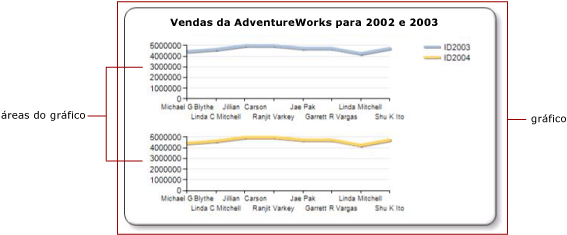

# Várias séries em um gráfico (Construtor de Relatórios e SSRS)
  Quando várias séries estiverem presentes em um gráfico, determine a melhor maneira de compará-las. É possível usar um gráfico empilhado para mostrar proporções relativas de cada série. Se estiver comparando só duas séries que compartilham um eixo de categoria (x) comum, use o eixo secundário. Isso é útil ao mostrar duas séries relacionadas de dados, por exemplo, preço e volume ou renda e imposto. Se o gráfico ficar ilegível, considere a possibilidade de usar várias áreas do gráfico para criar mais separação visual entre cada série.  
  
 Além de usar recursos de gráfico, é importante decidir o tipo de gráfico que deve ser usado para obter os dados. Se os campos no conjunto de dados estiverem relacionados, considere a possibilidade de usar um gráfico de intervalo.  
  
> [!NOTE]  
>  [!INCLUDE[ssRBRDDup](../../includes/ssrbrddup-md.md)]  
  
## Usando gráficos empilhados e 100% empilhados  
 Gráficos empilhados normalmente são usados para exibir várias séries em uma área do gráfico. Considere a possibilidade de usar gráficos empilhados quando os dados que você está tentando mostrar estão intimamente relacionados. Também é uma prática recomendada mostrar quatro ou menos séries em um gráfico empilhado. Para comparar a proporção de contribuição de cada série em relação ao todo, use uma área, barra ou gráfico de coluna 100% empilhado. Esses gráficos calculam a porcentagem relativa da contribuição de cada série à categoria. Para obter mais informações, consulte [Gráficos de áreas &#40;Construtor de Relatórios e SSRS&#41;](../../reporting-services/report-design/area-charts-report-builder-and-ssrs.md), [Gráficos de barras &#40;Construtor de Relatórios e SSRS&#41;](../../reporting-services/report-design/bar-charts-report-builder-and-ssrs.md) e [Gráficos de colunas &#40;Construtor de Relatórios e SSRS&#41;](../../reporting-services/report-design/column-charts-report-builder-and-ssrs.md).  
  
## Usando o eixo secundário  
 Quando uma nova série é adicionada ao gráfico, ela é plotada usando os eixos primários x e y. Para comparar valores com diferentes unidades de medida, considere a possibilidade de usar o *eixo secundário* para que duas séries possam ser plotadas em eixos separados. O eixo secundário é útil ao comparar valores que têm diferentes unidades de medida. O eixo secundário é desenhado no lado oposto do eixo primário. O gráfico só dá suporte a um eixo primário e a um eixo secundário. O eixo secundário tem as mesmas propriedades que o eixo primário. Para obter mais informações, consulte [Plotar dados em um eixo secundário &#40;Construtor de Relatórios e SSRS&#41;](../../reporting-services/report-design/plot-data-on-a-secondary-axis-report-builder-and-ssrs.md).  
  
 Para exibir mais de duas séries que têm diferentes intervalos de dados, considere a possibilidade de colocar as séries em áreas separadas do gráfico.  
  
## Usando áreas do gráfico  
 O gráfico é o contêiner de nível superior que inclui a borda exterior, o título e a legenda do gráfico. Por padrão, o gráfico contém uma área de gráfico padrão. A área do gráfico não é visível na superfície do gráfico, mas você pode imaginá-la como um contêiner que inclui somente os rótulos e o título dos eixos e a área de plotagem de uma ou mais séries. A ilustração a seguir mostra o conceito de áreas de gráfico dentro de um único gráfico.  
  
   
  
 Usando a caixa de diálogo **Propriedades da Área do Gráfico** , você pode especificar a orientação 2D e 3D de todas as séries contidas na área do gráfico, alinhar várias áreas dentro do mesmo gráfico e formatar as cores da área de plotagem. Quando uma nova área do gráfico é definida em um gráfico que contém somente uma área de gráfico padrão, o espaço disponível para uma área do gráfico é dividido horizontalmente por dois, e a nova área do gráfico é posicionada abaixo da primeira área do gráfico.  
  
 Cada série pode ser conectada a apenas uma área do gráfico. Por padrão, todas as séries são adicionadas à área do gráfico padrão. Ao usar área, coluna, linha e gráficos de dispersão, qualquer combinação dessas séries pode ser exibida na mesma área do gráfico. Por exemplo, você pode exibir uma série de colunas e uma série de linhas na mesma área do gráfico. A vantagem de usar a mesma área do gráfico para várias séries é que os usuários finais podem fazer comparações facilmente.  
  
 Gráficos de barras, de radar e de forma não podem ser combinados com qualquer outro tipo de gráfico na mesma área do gráfico. Para fazer comparações com várias séries que sejam do tipo barras, radar ou forma, será necessário executar uma das seguintes opções:  
  
-   Alterar todas as séries da área do gráfico para que sejam do mesmo tipo do gráfico.  
  
-   Criar uma nova área do gráfico e mover um ou mais das séries da área do gráfico padrão para a área do gráfico recém-criada.  
  
 O recurso de várias áreas de gráfico de um único gráfico também é útil se você estiver tentando comparar dados que têm diferentes escalas de valores. Por exemplo, se sua primeira série contiver dados no intervalo de 10 a 20 e sua segunda série contiver dados no intervalo de 400 a 800, os valores da primeira série poderão ficar obscurecidos. Considere a possibilidade de separar cada série em uma área do gráfico diferente. Para obter mais informações, consulte [Especificar uma área do gráfico para uma série &#40;Construtor de Relatórios e SSRS&#41;](../../reporting-services/report-design/specify-a-chart-area-for-a-series-report-builder-and-ssrs.md).  
  
## Usando gráficos de intervalo  
 Gráficos de intervalo têm dois valores por ponto de dados. Se o gráfico contiver duas séries que compartilham o mesmo eixo de categoria (x), você poderá usar um gráfico de intervalo para mostrar a diferença entre as duas séries. Gráficos de intervalo são mais adequados para exibir informações de máximo-mínimo ou superior-inferior. Por exemplo, se a primeira série contiver a venda mais alta de cada dia em janeiro, e a segunda série contiver a venda mais baixa do mesmo período, você poderá usar um gráfico de intervalo para mostrar a diferença entre a venda mais alta e a mais baixa de cada dia. Para obter mais informações, consulte [Gráficos de intervalo &#40;Construtor de Relatórios e SSRS&#41;](../../reporting-services/report-design/range-charts-report-builder-and-ssrs.md).  
  
## Consulte também  
 [Gráficos &#40;Construtor de Relatórios e SSRS&#41;](../../reporting-services/report-design/charts-report-builder-and-ssrs.md)   
 [Exibindo uma série com vários intervalos de dados em um gráfico &#40;Construtor de Relatórios e SSRS&#41;](../../reporting-services/report-design/displaying-a-series-with-multiple-data-ranges-on-a-chart.md)   
 [Tipos de gráficos &#40;Construtor de Relatórios e SSRS&#41;](../../reporting-services/report-design/chart-types-report-builder-and-ssrs.md)  
  
  
