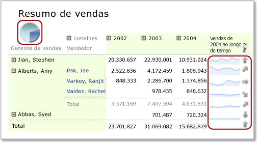

# Regiões de dados aninhadas (Construtor de Relatórios e SSRS)
  É possível aninhar uma região de dados, como um gráfico, em outra, como uma matriz, normalmente para exibir resumos de dados de maneira concisa ou para fornecer uma exibição visual, bem como uma exibição de tabela ou de matriz.  
  
 Por exemplo, para uma matriz (também chamada de *tablix*) que contém pedidos de vendas agrupados por Loja em linhas e por Trimestre em colunas, é possível adicionar uma tabela ou um gráfico à célula do canto para resumir as vendas de todas as lojas ou adicionar um gráfico a um cabeçalho de coluna de matriz para mostrar a contribuição de vendas dos dados na coluna como um percentual de todas as vendas.  
  
   
  
 Nesta ilustração, o gráfico de pizza na célula de canto e o minigráfico nas linhas são regiões de dados aninhadas.  
  
 Por definição, regiões de dados aninhadas são baseadas no mesmo conjunto de dados do relatório. Não é possível aninhar regiões de dados que sejam baseadas em conjuntos de dados diferentes. Para exibir dados de conjuntos de dados diferentes, considere a possibilidade de usar relatórios detalhados ou sub-relatórios. Para obter mais informações, consulte [Detalhamento, busca detalhada, sub-relatórios e regiões de dados aninhadas &#40;Construtor de Relatórios e SSRS&#41;](../../reporting-services/report-design/drillthrough-drilldown-subreports-and-nested-data-regions.md).  
  
> [!NOTE]  
>  [!INCLUDE[ssRBRDDup](../../includes/ssrbrddup-md.md)]  
  
## Entendendo o escopo de uma região de dados aninhada  
 O escopo de dados em uma região de dados aninhada é definido automaticamente por seu posicionamento na região de dados pai. Por exemplo, o escopo de dados de um gráfico aninhado em uma célula de canto tablix são os dados do conjunto de dados associados à região de dados tablix após os filtros serem aplicados ao conjunto de dados, à região de dados tablix e à região de dados do gráfico. O escopo de um tablix aninhado em uma célula tablix é igual ao escopo da célula de canto, mas com escopo adicional das associações do grupo de linhas e colunas da célula na qual ele está aninhado, com os filtros de grupo correspondentes aplicados. Para obter mais informações sobre escopo, consulte [Escopo das expressões para totais, agregações e coleções internas &#40;Construtor de Relatórios e SSRS&#41;](../../reporting-services/report-design/expression-scope-for-totals-aggregates-and-built-in-collections.md).  
  
 A lista a seguir descreve o escopo de células nas seguintes áreas de tablix:  
  
-   **Canto de tablix** O escopo são os dados da região de dados vinculada à região de dados tablix, após as expressões de filtro e de classificação do conjunto de dados e do tablix externo serem aplicadas.  
  
-   **Grupo de colunas do tablix** Os dados do grupo de colunas interno, após as expressões de filtro e de classificação do conjunto de dados, do tablix externo e dos grupos de colunas serem aplicadas.  
  
-   **Grupo de linhas do tablix** Os dados do grupo de linhas interno, após as expressões de filtro e classificação do conjunto de dados, do tablix externo e dos grupos de colunas serem aplicadas.  
  
-   **Corpo do tablix** Os dados do grupo interno representados pela interseção dos grupos de linhas e de colunas, após as expressões de filtro e de classificação do conjunto de dados, do tablix externo e dos grupos de linhas e de colunas serem aplicadas.  
  
 Para obter mais informações, consulte [Áreas da região de dados Tablix &#40;Construtor de Relatórios e SSRS&#41;](../../reporting-services/report-design/tablix-data-region-areas-report-builder-and-ssrs.md).  
  
## Aninhando um gráfico, minigráfico ou barra de dados em um tablix  
 Quando você adiciona um gráfico (inclusive um minigráfico ou barra de dados) à linha de cabeçalho ou de rodapé de um grupo de colunas tablix ou a uma célula de corpo tablix, os dados passados para o gráfico estão no escopo do subconjunto de dados dessa célula. Por padrão, quando você adiciona um gráfico a uma célula tablix, as dimensões do gráfico são expandidas para preencher a célula.  
  
> [!NOTE]  
>  Para ter mais controle sobre o tamanho de um gráfico em uma célula tablix, primeiro adicione o gráfico a um retângulo e, em seguida, adicione o retângulo a uma célula tablix.  
  
 Por padrão, as cores de legendas de gráfico são determinadas pela cor dos pontos de dados na série de gráfico. Para controlar cores para que todas as regiões de dados de gráfico usem a mesma cor para a mesma categoria de dados, você deve usar cores personalizadas e definir expressões de classificação nos dados. Para obter mais informações, consulte [Especificar cores consistentes em vários gráficos de forma &#40;Construtor de Relatórios e SSRS&#41;](../../reporting-services/report-design/specify-consistent-colors-across-multiple-shape-charts-report-builder-and-ssrs.md) e [Classificar dados em uma região de dados &#40;Construtor de Relatórios e SSRS&#41;](../../reporting-services/report-design/sort-data-in-a-data-region-report-builder-and-ssrs.md).  
  
## Aninhando um indicador em um tablix  
 É possível aninhar um indicador dentro de uma tabela, matriz ou lista para mostrar um KPI (indicador chave de desempenho). Quando você colocar um indicador dentro de uma tabela, ele será renderizado para cada linha no tablix. Para obter mais informações sobre como adicionar indicadores a um tablix, consulte [Indicadores &#40;Construtor de Relatórios e SSRS&#41;](../../reporting-services/report-design/indicators-report-builder-and-ssrs.md).  
  
### Adicionando um medidor a um tablix  
 Há duas maneiras de adicionar um medidor a uma região de dados tablix:  
  
-   Clique dentro da célula tablix e insira uma medidor. A caixa de diálogo **Selecionar Tipo de Medidor** é exibida. Depois que você selecionar um tipo de medidor, a região de dados do Medidor será posicionada dentro da célula tablix selecionada. Provavelmente, será necessário redimensionar o tablix para formatar o medidor.  
  
-   Clique fora da tabela e insira um medidor. A caixa de diálogo **Selecionar Tipo de Medidor** é exibida. Depois de selecionar um tipo de medidor, a região de dados do Medidor é posicionada no canto superior esquerdo do relatório. Após adicionar dados e formatar esse medidor, arraste-o e solte-o dentro da célula tablix.  
  
 Como no gráfico, o conjunto de dados passado para o medidor tem o escopo do subconjunto de dados daquela célula. Quando um medidor é colocado dentro de uma célula tablix, o medidor sempre agrega apenas uma linha de dados.  
  
 Quando os dados do tablix contiverem agrupamento, a região de dados do Medidor que estiver aninhada dentro do tablix não herdará esse grupo automaticamente. Você deve adicionar uma expressão de grupo correspondente ao medidor para mostrar as mesmas informações mostradas no tablix. Por exemplo, se os dados do tablix estiverem agrupados por Produto, você deve adicionar uma expressão de grupo de Produto ao medidor para mostrar os mesmos dados. Para obter mais informações, consulte [Medidores &#40;Construtor de Relatórios e SSRS&#41;](../../reporting-services/report-design/gauges-report-builder-and-ssrs.md) e [Adicionar ou excluir um grupo em uma região de dados &#40;Construtor de Relatórios e SSRS&#41;](../../reporting-services/report-design/add-or-delete-a-group-in-a-data-region-report-builder-and-ssrs.md).  
  
 Você deve definir os valores mínimo e máximo que serão exibidos na escala do medidor. Para especificar o valor máximo do medidor, você pode usar uma expressão, como `=Max!MyField.Value`. No entanto, como essa expressão será avaliada apenas dentro do escopo dos dados da célula, o máximo de cada medidor não será igual para todas as linhas do tablix. Isso poderá dificultar ainda mais o entendimento de comparações entre medidores no tablix. Como alternativa, é possível especificar um valor estático para o máximo. Todas as linhas dentro do tablix mostrarão um medidor com esse valor máximo. Para obter mais informações, consulte [Definir mínimo ou máximo em um medidor &#40;Construtor de Relatórios e SSRS&#41;](../../reporting-services/report-design/set-a-minimum-or-maximum-on-a-gauge-report-builder-and-ssrs.md).  
  
 Se os dados crescerem muito no medidor, considere a possibilidade de usar um multiplicador de escala para reduzir a quantidade de dígitos exibidos. Para especificar um multiplicador, você pode clicar com o botão direito do mouse na escala e selecionar **Propriedades da Escala**. Quando a caixa de diálogo **Propriedades da Escala** for aberta, especifique um valor para **Multiplicador**.  
  
## Aninhando uma tabela ou matriz e um gráfico em uma lista  
 Para aninhar várias regiões de dados em uma Lista, primeiro adicione um retângulo e, em seguida, adicione as regiões de dados ao retângulo.  
  
 É possível definir um grupo para a região de dados de uma Lista e, em seguida, adicionar um tablix e um gráfico para fornecer diferentes exibições dos mesmos dados. Para obter esse efeito, você deve definir expressões idênticas de grupo e de classificação para o tablix e o gráfico inseridos. Por definição, o tablix e o gráfico usam dados do conjunto de dados da região de dados da lista pai.  
  
> [!NOTE]  
>  Por padrão, quando você adiciona uma região de dados de Lista à superfície de design, a lista inclui uma linha de detalhes. Você pode alterar esse padrão adicionando uma linha de grupo e removendo a linha de detalhes. Para obter mais informações, consulte [Explorando a flexibilidade de uma região de dados Tablix &#40;Construtor de Relatórios e SSRS&#41;](../../reporting-services/report-design/exploring-the-flexibility-of-a-tablix-data-region-report-builder-and-ssrs.md).  
  
 Para obter mais informações, consulte [Noções básicas sobre grupos &#40;Construtor de Relatórios e SSRS&#41;](../../reporting-services/report-design/understanding-groups-report-builder-and-ssrs.md) e [Adicionar, mover ou excluir uma tabela, matriz ou lista &#40;Construtor de Relatórios e SSRS&#41;](../../reporting-services/report-design/add-move-or-delete-a-table-matrix-or-list-report-builder-and-ssrs.md).  
  
## Consulte também  
 [Filtro, grupo e classificar dados e &#40; Construtor de relatórios e SSRS &#41;](../../reporting-services/report-design/filter-group-and-sort-data-report-builder-and-ssrs.md)   
 [Tabelas, matrizes e listas de &#40; Construtor de relatórios e SSRS &#41;](../../reporting-services/report-design/tables-matrices-and-lists-report-builder-and-ssrs.md)   
 [Gráficos de &#40; Construtor de relatórios e SSRS &#41;](../../reporting-services/report-design/charts-report-builder-and-ssrs.md)   
 [Medidores &#40; Construtor de relatórios e SSRS &#41;](../../reporting-services/report-design/gauges-report-builder-and-ssrs.md)   
 [Expressões &#40; Construtor de relatórios e SSRS &#41;](../../reporting-services/report-design/expressions-report-builder-and-ssrs.md)   
 [Formatando itens de relatório &#40; Construtor de relatórios e SSRS &#41;](../../reporting-services/report-design/formatting-report-items-report-builder-and-ssrs.md)   
 [Tutorial: Adicionando um KPI ao relatório &#40; Construtor de relatórios &#41;](../../reporting-services/tutorial-adding-a-kpi-to-your-report-report-builder.md)   
 [Formatando escalas em um medidor &#40; Construtor de relatórios e SSRS &#41;](../../reporting-services/report-design/formatting-scales-on-a-gauge-report-builder-and-ssrs.md)  
  
  

