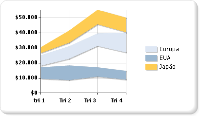

# Gr&#225;ficos de intervalos (Construtor de Relat&#243;rios e SSRS)
  Um tipo de gráfico de intervalos exibe um conjunto de pontos de dados que são definidos por diversos valores para a mesma categoria. Os valores são representados pela altura do marcador, de acordo com a medição feita pelo eixo y. Os rótulos de categoria são exibidos no eixo de categoria. O gráfico de intervalos comum preenche a área entre os valores superior e inferior de cada ponto de dados.  
  
 A ilustração a seguir mostra um gráfico de intervalos comum com três séries.  
  
   
  
> [!NOTE]  
>  [!INCLUDE[ssRBRDDup](../../includes/ssrbrddup-md.md)]  
  
## Variações  
  
-   **Intervalo suave**. Um intervalo suave exibe linhas curvas em vez de linhas retas.  
  
-   **Intervalo de colunas**. Um intervalo de colunas usa colunas em vez de áreas para exibir os intervalos.  
  
-   **Intervalo de barras**. Um intervalo de barras usa barras em vez de áreas para exibir os intervalos.  
  
## Considerações de dados para gráficos de intervalos  
  
-   Os tipos de gráfico de intervalos exigem dois valores por ponto de dados. Esses valores correspondem com um valor alto e um baixo que definem o intervalo para cada ponto de dados.  
  
-   Os gráficos de intervalos só serão úteis para análise se os valores superiores sempre forem mais altos que os valores inferiores. Caso contrário, considere o uso de um gráfico de linhas. Se o valor alto for menor que o valor baixo, o gráfico de intervalos exibirá o valor absoluto da diferença entre esses valores.  
  
-   Se apenas um dos valores for especificado, o gráfico de intervalos será exibido como se ele fosse um gráfico de áreas comum, com um valor por ponto de dados.  
  
-   Os gráficos de intervalos geralmente são usados para grafar dados que contêm valores máximo e mínimo para cada grupo de categorias no banco de dados.  
  
-   O gráfico de intervalos não oferece suporte à exibição de marcadores em cada ponto de dados.  
  
-   Assim como no gráfico de áreas, em um gráfico de intervalos comum, se os valores em diversas séries forem semelhantes, as séries serão sobrepostas. Neste cenário, você pode usar um gráfico de intervalos de colunas ou de barras em vez de um gráfico de intervalos comum.  
  
-   Os gráficos de Gantt podem ser criados usando um gráfico de intervalos de barras.  
  
## Consulte também  
 [Gráficos &#40;Construtor de Relatórios e SSRS&#41;](../../reporting-services/report-design/charts-report-builder-and-ssrs.md)   
 [Tipos de gráficos &#40;Construtor de Relatórios e SSRS&#41;](../../reporting-services/report-design/chart-types-report-builder-and-ssrs.md)   
 [Formatando um gráfico &#40;Construtor de Relatórios e SSRS&#41;](../../reporting-services/report-design/formatting-a-chart-report-builder-and-ssrs.md)  
  
  