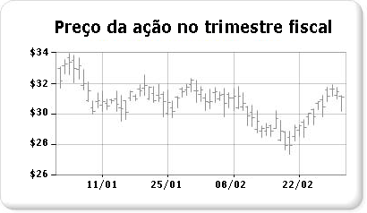

# Gráficos de ações (Construtor de Relatórios e SSRS)

  Um gráfico de estoque é especificamente projetado para dados financeiros ou científicos que usam até quatro valores por ponto de dados. Esses valores se alinham com os valores alto, baixo, aberto e fechado usados para plotar dados de estoque financeiro. Esse tipo de gráfico exibe valores de abertura e fechamento usando marcadores, que geralmente são linhas ou triângulos. No exemplo a seguir, os valores de abertura são mostrados pelos marcados à esquerda e os valores de fechamento são mostrados pelos marcadores à direita.  
  
   
  
 Um exemplo de um gráfico de ações está disponível como um relatório do construtor de relatórios de exemplo. Para obter mais informações sobre como baixar esse relatório de exemplo e outros, consulte [(Relatórios de exemplo do Construtor de relatórios e Designer de relatórios) do](http://go.microsoft.com/fwlink/?LinkId=198283).  
  
> [!NOTE]  
>  [!INCLUDE[ssRBRDDup](../../includes/ssrbrddup-md.md)]  
  
## Variações  
  
-   **Velas**. O gráfico de velas é uma forma especializada do gráfico de estoque, na qual as caixas são usadas para mostrar a faixa entre os valores de abertura e fechamento. Da mesma forma que o gráfico de estoque, o gráfico de velas pode exibir até quatro valores por ponto de dados.  
  
## Considerações de dados para gráficos de estoque  
  
-   Ao apresentar muitos pontos de dados de estoque, como tendências de preço de estoque anual, é difícil distinguir entre os valores aberto, fechado, alto e baixo de cada ponto de dados. Nesse cenário, considere usar um gráfico de linhas em vez de um gráfico de estoque.  
  
-   Quando os rótulos de eixos são gerados, a rotulação geralmente começa em zero.  Em geral, os preços de estoque não flutuam no mesmo grau que os outros conjuntos de dados. Por esse motivo, talvez você queira desativar os rótulos de eixos de iniciar em zero para obter uma melhor exibição de seus dados. Para fazer isso, defina **IncludeZero** como **false** na caixa de diálogo **Propriedades do Eixo** ou na janela Propriedades. Para obter mais informações sobre como o gráfico gera rótulos de eixo, consulte [Formatação de rótulos de eixo de um gráfico &#40;Construtor de Relatórios e SSRS&#41;](../../reporting-services/report-design/formatting-axis-labels-on-a-chart-report-builder-and-ssrs.md).  
  
-   O [!INCLUDE[ssRSnoversion](../../includes/ssrsnoversion-md.md)] fornece muitas fórmulas calculadas para uso com gráficos de estoque, inclusive Indicador de Preços, Índice de Força Relativa, MACD e outros.  

## Próximas etapas

[Gráficos de intervalo](../../reporting-services/report-design/range-charts-report-builder-and-ssrs.md)   
[Gráficos](../../reporting-services/report-design/charts-report-builder-and-ssrs.md)   
[Formatando um gráfico](../../reporting-services/report-design/formatting-a-chart-report-builder-and-ssrs.md)   
[Caixa de diálogo de propriedades do eixo, opções de eixo](http://msdn.microsoft.com/library/b276e210-7a12-48ae-971b-7dabae51df11)  

Mais perguntas? [Tente fazer o fórum do Reporting Services](http://go.microsoft.com/fwlink/?LinkId=620231)
