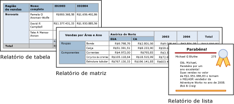
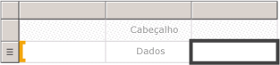

# Tabelas, matrizes e listas (Construtor de Relatórios e SSRS)
 No [!INCLUDE[ssRSnoversion_md](../../includes/ssrsnoversion-md.md)], tabelas, matrizes e listas são *regiões de dados* que exibem dados de relatório paginado em células organizadas em linhas e colunas. As células geralmente contêm dados de texto como texto, datas e números, mas também podem conter medidores, gráficos ou itens de relatório como imagens. Coletivamente, tabelas, matrizes e listas são geralmente chamadas de regiões de dados do *tablix* .  
  
 Os modelos de tabela, matriz e lista são criados na região de dados do tablix, que é uma grade flexível que pode exibir dados em células. Nos modelos de tabela e matriz, as células são organizadas em linhas e colunas. Como os modelos são variações da região de dados Tablix genérica subjacente, você pode exibir dados em uma combinação de formatos de modelo e alterar a tabela, matriz ou lista para incluir os recursos de outra região de dados à medida que desenvolve seu relatório. Por exemplo, se você adicionar uma tabela e achar que ela não atende às suas necessidades, você poderá adicionar grupos de colunas para transformar a tabela em uma matriz.  
  
 As regiões de dados de tabela e matriz podem exibir relações de dados complexas ao incluir tabelas aninhadas, matrizes, listas, gráficos e medidores. Tabelas e matrizes têm um layout tabular e seus dados vêm de um único conjunto de dados, criado em uma única fonte de dados. A principal diferença entre tabelas e matrizes é que tabelas podem incluir somente grupos de linhas, enquanto que as matrizes têm grupos de linhas e grupos de colunas.  
  
 Listas são um pouco diferentes. Elas dão suporte a um layout livre que pode incluir várias tabelas semelhantes ou matrizes, cada uma usando dados de um conjunto de dados diferente. Listas também podem ser usadas para formulários, como faturas.  
  
 As imagens seguintes mostram relatórios simples com uma tabela, matriz ou lista.  
  
   
  
 Confira uma introdução rápida a tabelas, matrizes e listas no [Tutorial: Criar um relatório de tabela básico &#40;Construtor de Relatórios&#41;](../../reporting-services/tutorial-creating-a-basic-table-report-report-builder.md), [Tutorial: Criar um relatório de matriz &#40;Construtor de Relatórios&#41;](../../reporting-services/tutorial-creating-a-matrix-report-report-builder.md) e [Tutorial: Criar um relatório de forma livre &#40;Construtor de Relatórios&#41;](../../reporting-services/tutorial-creating-a-free-form-report-report-builder.md).  
  
> [!NOTE]  
>  É possível publicar tabelas, matrizes e listas separadamente de um relatório como partes do relatório. Leia mais sobre as [Partes do relatório](../../reporting-services/report-design/report-parts-report-builder-and-ssrs.md).  
  
##   Table  
 Use uma tabela para exibir dados de detalhes, organizar os dados em grupos de linhas ou ambos. O modelo Tabela contém três colunas com uma linha de cabeçalho de tabela e uma linha de detalhes para dados. A figura a seguir mostra o modelo de tabela inicial, selecionado na superfície de design:  
  
   
  
 É possível agrupar dados por um campo único, vários campos ou escrevendo uma expressão própria. Você pode criar grupos aninhados ou independentes, grupos adjacentes e exibir valores agregados para dados agrupados ou acrescentar totais a grupos. Por exemplo, se sua tabela tiver um grupo de linhas chamado [Categoria], você poderá adicionar um subtotal para cada grupo e também um total principal para o relatório. Para melhorar a aparência da tabela e realçar os dados que você deseja enfatizar, você pode mesclar células e aplicar formatação a dados e títulos da tabela.  
  
 Inicialmente, é possível ocultar dados detalhados ou agrupados e incluir alternâncias de detalhamento para permitir que um usuário escolha interativamente quantos dados devem ser mostrados.  
  
 Para obter mais informações, consulte [Tabelas &#40;Construtor de Relatórios e SSRS&#41;](../../reporting-services/report-design/tables-report-builder-and-ssrs.md).  
  
##   Matriz  
 Use uma matriz para exibir resumos de dados agregados, agrupados em linhas e colunas, de maneira semelhante a uma Tabela Dinâmica ou tabela de referência cruzada. O número de linhas e colunas para grupos é determinado pelo número de valores exclusivos de cada linha e grupo de colunas. A figura a seguir mostra o modelo de matriz inicial, selecionado na superfície de design:  
  
   
  
 É possível agrupar dados por vários campos ou expressões em grupos de linhas e de colunas. Em tempo de execução, quando são combinados os dados de relatório e as regiões de dados, uma matriz cresce horizontalmente e verticalmente na página à medida que são adicionadas colunas para grupos de colunas e linhas para grupos de linhas. As células da matriz exibem valores de agregação com escopo para a interseção dos grupos de linhas e de colunas aos quais a célula pertence. Por exemplo, se sua matriz tiver um grupo de linhas (Categoria) e dois grupos de colunas (Território e Ano) que exibem a soma de vendas, o relatório exibirá duas células com somas de vendas para cada valor no grupo Categorias. O escopo das células são as duas interseções: Categoria e Território, e Categoria e Ano. A matriz pode incluir grupos aninhados e grupos adjacentes. Os grupos aninhados possuem uma relação pai-filho e os grupos adjacentes possuem uma relação de mesmo nível. Você pode adicionar subtotais para todos os níveis de linha aninhada e grupos de colunas dentro da matriz.  
  
 Para tornar os dados da matriz mais fáceis de ler e realçar os dados que você deseja enfatizar, você pode mesclar células ou dividir horizontalmente e verticalmente, e aplicar formatação a dados e títulos de grupos.  
  
 Também é possível incluir alternâncias detalhadas que inicialmente ocultam dados de detalhes. Em seguida, o usuário pode clicar nas alternâncias para exibir mais ou menos detalhes, conforme o necessário.  
  
 Para obter mais informações, consulte [Crie uma matriz](../../reporting-services/report-design/create-a-matrix-report-builder-and-ssrs.md).  
  
##   Lista  
 Use uma lista para criar um layout de forma livre. Você não está limitado a um layout de grade, mas pode colocar campos livremente dentro da lista. É possível usar uma lista para criar um formulário para exibir muitos campos do conjunto de dados ou como um contêiner para exibir várias regiões de dados lado a lado para dados agrupados. Por exemplo, é possível definir um grupo para uma lista, adicionar uma tabela, gráfico e imagem, e exibir valores em forma de tabela e gráfico para cada valor do grupo, como para um registro de funcionário ou de paciente.  
  
   
  
 Para obter mais informações, consulte [Criar faturas e formulários com listas].  
  
##   Preparando dados  
 Uma região de dados de tabela, matriz e lista exibe dados de um conjunto de dados. Você pode preparar os dados na consulta que recupera os dados para o conjunto de dados ou definindo propriedades na tabela, matriz ou lista.  
  
 As linguagens de consulta como [!INCLUDE[tsql](../../includes/tsql-md.md)]que você usa para recuperar os dados para os conjuntos de dados de relatório podem preparar os dados aplicando filtros para incluir somente um subconjunto dos dados, substituindo valores nulos ou espaços em branco com constantes que tornam o relatório mais legível, e classificando e agrupando dados.  
  
 Se desejar preparar os dados na região de dados de tabela, matriz ou lista de um relatório, defina as propriedades das regiões de dados ou células dentro da região de dados. Se você desejar filtrar ou classificar os dados, defina as propriedades na região de dados. Por exemplo, para classificar os dados, especifique as colunas desejadas e a direção de classificação. Se desejar fornecer um valor alternativo para um campo, defina os valores do texto de célula que exibe o campo. Por exemplo, para exibir em branco quando um campo está vazio ou nulo, use uma expressão para definir o valor.  
  
 Para obter mais informações, consulte [Preparando dados para exibição em uma região de dados Tablix &#40;Construtor de Relatórios e SSRS&#41;](../../reporting-services/report-design/preparing-data-for-display-in-a-tablix-data-region-report-builder-and-ssrs.md).  
  
##   Criando e configurando uma tabela, matriz ou lista  
 Ao acrescentar tabelas ou matrizes a seu relatório, você pode usar o Assistente de Tabela e Matriz ou criá-las manualmente a partir dos modelos fornecidos pelo Construtor de Relatórios ou pelo Designer de Relatórios. Listas são compiladas manualmente a partir do modelo de lista.  
  
 O assistente ajuda a criar e configurar uma tabela ou matriz rapidamente. Depois de concluir o assistente ou se você criar as regiões de dados do tablix do zero, poderá configurá-los e refiná-los mais adiante. As caixas de diálogo, disponíveis nos menus do botão direito do mouse nas regiões de dados, facilitam a definição das propriedades mais comuns para quebras de páginas, repetição e visibilidade de cabeçalhos e rodapés, opções de exibição, filtros e classificação. Mas a região de dados do tablix fornece uma grande variedade de propriedades adicionais que você só pode definir no painel Propriedades do Construtor de Relatórios. Por exemplo, se você desejar exibir uma mensagem quando o conjunto de dados para uma tabela, matriz ou lista estiver vazio, especifique o texto da mensagem na propriedade do tablix NoRowsMessage no painel Propriedades.  
  
##   Alterando entre modelos do tablix  
 Você não está limitado pela escolha inicial do modelo do tablix. Ao adicionar grupos, totais e rótulos, você pode querer modificar o design do tablix. Por exemplo, você pode começar com uma tabela e, em seguida, excluir as linhas de detalhes e adicionar grupos de colunas. Para obter mais informações, consulte [Explorando a flexibilidade de uma região de dados Tablix &#40;Construtor de Relatórios e SSRS&#41;](../../reporting-services/report-design/exploring-the-flexibility-of-a-tablix-data-region-report-builder-and-ssrs.md).  
  
 Você pode continuar a desenvolver uma tabela, matriz ou lista adicionando qualquer recurso do tablix. Os recursos do tablix incluem a exibição de dados de detalhes ou agregações para dados agrupados em linhas e colunas. É possível criar grupos aninhados, grupos adjacentes independentes ou grupos recursivos. É possível filtrar e classificar dados agrupados e combinar grupos facilmente com a inclusão de várias expressões de grupo em uma definição de grupo  
  
 Também é possível adicionar totais para um grupo ou totais gerais para a região de dados. É possível ocultar linhas ou colunas para simplificar um relatório e permitir que o usuário alterne a exibição dos dados ocultos como em um relatório de análise. Para obter mais informações, consulte [Controlando a exibição da região de dados Tablix em uma página do relatório &#40;Construtor de Relatórios e SSRS&#41;](../../reporting-services/report-design/controlling-the-tablix-data-region-display-on-a-report-page.md).  
  
##   Tópicos de instruções  
 Esta seção lista procedimentos que mostram, passo a passo, como trabalhar com tabelas, matrizes e listas em seus relatórios; como exibir dados em linhas e colunas, adicionar e excluir colunas, mesclar células, e incluir subtotais para linha e grupos de colunas.  
  
-   [Adicionar um grupo de detalhes &#40;Construtor de Relatórios e SSRS&#41;](../../reporting-services/report-design/add-a-details-group-report-builder-and-ssrs.md)  
  
-   [Adicionar um total a um grupo ou a uma região de dados Tablix &#40;Construtor de Relatórios e SSRS&#41;](../../reporting-services/report-design/add-a-total-to-a-group-or-tablix-data-region-report-builder-and-ssrs.md)  
  
-   [Alterar um item de uma célula &#40;Construtor de Relatórios e SSRS&#41;](../../reporting-services/report-design/change-an-item-within-a-cell-report-builder-and-ssrs.md)  
  
-   [Alterar a altura da linha ou a largura da coluna &#40;Construtor de Relatórios e SSRS&#41;](../../reporting-services/report-design/change-row-height-or-column-width-report-builder-and-ssrs.md)  
  
-   [Inserir ou excluir uma coluna &#40;Construtor de Relatórios e SSRS&#41;](../../reporting-services/report-design/insert-or-delete-a-column-report-builder-and-ssrs.md)  
  
-   [Inserir ou excluir uma linha &#40;Construtor de Relatórios e SSRS&#41;](../../reporting-services/report-design/insert-or-delete-a-row-report-builder-and-ssrs.md)  
  
-   [Mesclar células em uma região de dados &#40;Construtor de Relatórios e SSRS&#41;](../../reporting-services/report-design/merge-cells-in-a-data-region-report-builder-and-ssrs.md)  
  
-   [Criar um grupo de hierarquia recursiva &#40;Construtor de Relatórios e SSRS&#41;](../../reporting-services/report-design/create-a-recursive-hierarchy-group-report-builder-and-ssrs.md)  
  
-   [Adicionar ou excluir um grupo em uma região de dados &#40;Construtor de Relatórios e SSRS&#41;](../../reporting-services/report-design/add-or-delete-a-group-in-a-data-region-report-builder-and-ssrs.md)  
  
-   [Exibir cabeçalhos e rodapés com um grupo &#40;Construtor de Relatórios e SSRS&#41;](../../reporting-services/report-design/display-headers-and-footers-with-a-group-report-builder-and-ssrs.md)  
  
-   [Criar um novo relatório de nível &#40;Construtor de Relatórios e SSRS&#41;](../../reporting-services/report-design/create-a-stepped-report-report-builder-and-ssrs.md)  
  
-   [Adicionar, mover ou excluir uma tabela, matriz ou lista &#40;Construtor de Relatórios e SSRS&#41;](../../reporting-services/report-design/add-move-or-delete-a-table-matrix-or-list-report-builder-and-ssrs.md)  
  
##   Nesta seção  
 Os tópicos a seguir fornecem informações adicionais sobre como trabalhar com regiões de dados do tablix.  
  
 [Região de dados Tablix &#40;Construtor de Relatórios e SSRS&#41;](../../reporting-services/report-design/tablix-data-region-report-builder-and-ssrs.md)  
 Explica conceitos importantes relacionados à região de dados do tablix como áreas do tablix, dados detalhados e agrupados, grupos de coluna e de linha, e linhas e colunas estáticas e dinâmicas.  
  
 [Adicionando dados a uma região de dados Tablix &#40;Construtor de Relatórios e SSRS&#41;](../../reporting-services/report-design/adding-data-to-a-tablix-data-region-report-builder-and-ssrs.md)  
 Fornece informações detalhadas sobre como adicionar dados detalhados e agrupados, subtotais e totais, e rótulos a uma região de dados do tablix.  
  
 [Controlando a exibição da região de dados Tablix em uma página do relatório &#40;Construtor de Relatórios e SSRS&#41;](../../reporting-services/report-design/controlling-the-tablix-data-region-display-on-a-report-page.md)  
 Descreve as propriedades de uma região de dados do tablix que pode ser modificada para alterar a forma como uma região de dados do tablix é exibida quando visualizada em um relatório.  
  
 [Controlando títulos de linha e coluna &#40;Construtor de Relatórios e SSRS&#41;](../../reporting-services/report-design/controlling-row-and-column-headings-report-builder-and-ssrs.md)  
 Descreve como controlar títulos de linha e coluna quando uma região de dados de tabela, matriz ou lista abrange várias páginas horizontal ou verticalmente.  
  
 [Criar grupos de hierarquia recursiva &#40;Construtor de Relatórios e SSRS&#41;](../../reporting-services/report-design/creating-recursive-hierarchy-groups-report-builder-and-ssrs.md)  
 Descreve como exibir dados recursivos em que a relação entre pai e filho é representada por campos no conjunto de dados.  
  
 [Noções básicas sobre grupos &#40;Construtor de Relatórios e SSRS&#41;](../../reporting-services/report-design/understanding-groups-report-builder-and-ssrs.md)  
 Explica o que são grupos e quando devem ser usados, e descreve os grupos disponíveis para as diferentes regiões de dados do tablix.  
  
## Consulte Também  
 [Adicionar filtros de conjunto de dados, de região de dados e de grupo &#40;Construtor de Relatórios e SSRS&#41;](../../reporting-services/report-design/add-dataset-filters-data-region-filters-and-group-filters.md)   
 [Regiões de dados aninhadas &#40;Construtor de Relatórios e SSRS&#41;](../../reporting-services/report-design/nested-data-regions-report-builder-and-ssrs.md)   
 [Vinculando várias regiões de dados ao mesmo conjunto de dados &#40;Construtor de Relatórios e SSRS&#41;](../../reporting-services/report-design/linking-multiple-data-regions-to-the-same-dataset-report-builder-and-ssrs.md)   
 [Expressões &#40;Construtor de Relatórios e SSRS&#41;](../../reporting-services/report-design/expressions-report-builder-and-ssrs.md)   
 [Filtrar, agrupar e classificar dados &#40;Construtor de Relatórios e SSRS&#41;](../../reporting-services/report-design/filter-group-and-sort-data-report-builder-and-ssrs.md)   
 [Parâmetros de relatório &#40;Construtor de Relatórios e Designer de Relatórios&#41;](../../reporting-services/report-design/report-parameters-report-builder-and-report-designer.md)   
 [Gráficos &#40;Construtor de Relatórios e SSRS&#41;](../../reporting-services/report-design/charts-report-builder-and-ssrs.md)   
 [Medidores &#40;Construtor de Relatórios e SSRS&#41;](../../reporting-services/report-design/gauges-report-builder-and-ssrs.md)  
  
  
