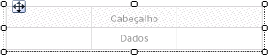
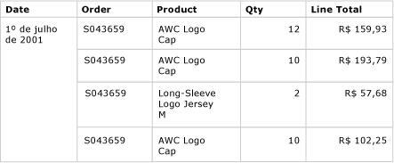
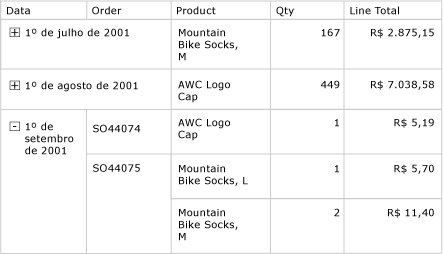

# Tabelas (Construtor de Relatórios e SSRS)
 No [!INCLUDE[ssRSnoversion_md](../../includes/ssrsnoversion-md.md)], você pode usar uma tabela para exibir dados detalhados ou dados agrupados, ou uma combinação de ambos em um relatório paginado.   
   
 É possível agrupar dados por um campo único, vários campos ou escrevendo uma expressão própria. Você pode criar grupos aninhados ou adjacentes, independentes. Para exibir valores agregados em relação aos dados agrupados, adicione totais aos grupos. Formate as linhas e as colunas para realçar os dados que você deseja enfatizar. Inicialmente, é possível ocultar dados detalhados ou agrupados e incluir alternâncias de detalhamento para permitir que um usuário escolha interativamente quantos dados devem ser mostrados.  
  
 Para começar rapidamente a usar tabelas, consulte [Tutorial: criando um relatório de tabela básico &#40;Construtor de Relatórios&#41;](../../reporting-services/tutorial-creating-a-basic-table-report-report-builder.md) ou [Criar um relatório de tabela básico &#40;Tutorial do SSRS&#41;](../../reporting-services/create-a-basic-table-report-ssrs-tutorial.md).  
  
> [!NOTE]  
>  É possível publicar tabelas separadamente de um relatório como partes do relatório. Leia mais sobre as [Partes do relatório](../../reporting-services/report-design/report-parts-report-builder-and-ssrs.md).  
  
  
##   Adicionando uma tabela para exibir dados detalhados  
 Adicione uma tabela à superfície de design usando a guia Inserir na faixa de opções. Para adicionar uma tabela, use o Assistente de Tabela ou Matriz, que inclui a criação de uma conexão de fonte de dados e de um conjunto de dados e a configuração da tabela, ou uma tabela com base no modelo de tabela, que você pode configurar manualmente.  
  
> [!NOTE]  
>  O assistente só está disponível no Construtor de Relatórios.  
  
 Para descrever como configurar uma tabela do início ao fim, este tópico usa o modelo de tabela.  
  
 Por padrão, uma nova tabela tem um número fixo de colunas com uma linha de cabeçalho para rótulos e uma linha de dados para dados detalhados. A seguinte figura mostra uma nova tabela adicionada à superfície de design.  
  
   
  
 Quando você seleciona a tabela, identificadores de linha e coluna são exibidos fora da tabela e colchetes, dentro das células. Identificadores de linha exibem gráficos que ajudam a compreender a finalidade de cada linha. Os colchetes indicam a associação a um grupo referente a uma célula selecionada. A seguinte figura mostra uma célula vazia selecionada em uma tabela padrão.  
  
   
  
 O identificador de linha para a linha de dados mostra o símbolo de detalhes (). Para exibir dados nessas linhas, arraste campos do painel de dados do relatório para as células da tabela na linha detalhada ou do cabeçalho. Ambas as linhas são preenchidas simultaneamente. Para adicionar mais colunas, arraste o campo para a tabela até que você veja um ponto de inserção. Depois de adicionar campos de conjunto de dados à tabela, você pode alterar o formato padrão das datas e da moeda para controlar o modo de exibição no relatório. O seguinte diagrama mostra uma região de dados de tabela com estes campos: Data, Ordem, Produto, Quantidade e Total da Linha.  
  
   
  
 Verifique o design exibindo o relatório em Visualização. A tabela é expandida na página conforme necessário. As linhas de rótulo e detalhada são exibidas uma vez para todas as linhas do conjunto de resultados da consulta de conjunto de dados. Cada produto vendido na ordem é listado em uma linha separada com a quantidade e o total da linha referentes ao item, como mostrado na seguinte figura:  
  
   
  
 A tabela com a qual você inicia é um modelo baseado na região de dados tablix. É possível aprimorar o design da tabela adicionando recursos para os quais a região de dados tablix subjacente oferece suporte. Para obter mais informações, consulte [Controlando a exibição da região de dados Tablix em uma página do relatório &#40;Construtor de Relatórios e SSRS&#41;](../../reporting-services/report-design/controlling-the-tablix-data-region-display-on-a-report-page.md). Também é possível continuar desenvolvendo a tabela adicionando grupos de linhas, de colunas e adicionando ou removendo grupos detalhados. Para obter mais informações, consulte [Explorando a flexibilidade de uma região de dados Tablix &#40;Construtor de Relatórios e SSRS&#41;](../../reporting-services/report-design/exploring-the-flexibility-of-a-tablix-data-region-report-builder-and-ssrs.md).  
  
### Adicionando totais de dados detalhados  
 Para adicionar totais, selecione células com dados numéricos e use o menu de atalho para adicionar automaticamente rótulos e totais dos dados detalhados de campos numéricos. Também é possível especificar outros rótulos e totais manualmente. A seguinte figura mostra uma linha de totais típica que inclui totais especificados automática e manualmente:  
  
   
  
 Em Visualização, o relatório exibe as linhas de cabeçalho e detalhada uma vez para todas as linhas do conjunto de resultados da consulta de conjunto de dados, além de exibir a linha de totais. A seguinte figura mostra as últimas linhas da tabela, inclusive a linha de total.  
  
   
  
 Para obter mais informações, consulte [Adicionar um total a um grupo ou a uma região de dados Tablix &#40;Construtor de Relatórios e SSRS&#41;](../../reporting-services/report-design/add-a-total-to-a-group-or-tablix-data-region-report-builder-and-ssrs.md).  
  
##   Adicionando grupos de linhas a uma tabela  
 Da mesma forma como é possível arrastar um campo do painel de dados do relatório para uma célula a fim de exibir dados detalhados, você pode arrastar um campo para o painel Agrupamento a fim de adicionar um grupo. Em uma tabela, arraste o campo para o painel Grupos de Linhas. Após a adição de um grupo, a tabela automaticamente adiciona células a novas colunas da área do grupo de linhas em que os valores do grupo devem ser exibidos. Para obter mais informações sobre áreas, consulte [áreas da região de dados Tablix &#40; Construtor de relatórios e SSRS &#41; ](../../reporting-services/report-design/tablix-data-region-areas-report-builder-and-ssrs.md).  
  
 A seguinte figura mostra uma tabela com dois grupos de linhas aninhados no modo Design. Os grupos de linhas foram criados arrastando o campo Ordem e o campo Data para o painel Grupos de Linhas e inserindo cada grupo como pai dos grupos existentes. A figura mostra um grupo pai baseado na data e um grupo filho baseado no número da ordem, bem como o grupo detalhado definido por padrão.  
  
   
  
 Em Visualização, o relatório exibe primeiro os dados da ordem agrupados por data e, então, por ordem, como mostrado na seguinte figura.  
  
   
  
 Uma forma alternativa de exibir dados agrupados é recuando a hierarquia de grupo para exibir a relação aninhada dos grupos, e não apresentando cada valor na coluna própria. Esse estilo de formatação é chamado relatório em níveis. Para obter mais informações sobre como formatar informações agrupadas como um relatório, consulte [criar um relatório de nível &#40; Construtor de relatórios e SSRS &#41; ](../../reporting-services/report-design/create-a-stepped-report-report-builder-and-ssrs.md).  
  
### Adicionando totais a grupos de linhas  
 Para mostrar totais de um grupo, é possível usar o comando **Adicionar Total** contextual. Em um grupo de linhas, o comando Adicionar Total adiciona uma linha fora do grupo para que ela só se repita uma vez em relação ao grupo. Em grupos aninhados, a linha de total do grupo filho está fora do grupo filho, mas dentro do grupo pai. Em casos assim, é útil definir a cor do plano de plano da linha de total do grupo filho para diferenciá-la das linhas detalhadas. Também é possível usar uma cor do plano de fundo diferente para diferenciar as linhas do cabeçalho e do rodapé da tabela. A seguinte figura mostra a tabela com uma linha de total adicionada para o grupo baseado nos números de ordens.  
  
   
  
 Quando você exibe o relatório, a linha que mostra os subtotais de ordem se repete uma vez para todos os números de ordem. O rodapé da tabela exibe totais de todas as datas. Na seguinte figura, as últimas linhas mostram as últimas três linhas detalhadas, o subtotal do último número de ordem SO71952 e os totais de todas as datas na tabela.  
  
   
  
 Para obter mais informações, consulte [Adicionar um total a um grupo ou a uma região de dados Tablix &#40;Construtor de Relatórios e SSRS&#41;](../../reporting-services/report-design/add-a-total-to-a-group-or-tablix-data-region-report-builder-and-ssrs.md).  
  
##   Removendo ou ocultando linhas detalhadas  
 Depois de visualizar uma tabela em um relatório, você talvez opte por remover as linhas detalhadas existentes. Ou você pode optar por ocultá-las por padrão e permitir ao usuário alternar visualizações mais ou menos detalhadas, como acontece em um relatório de de busca detalhada.  
  
 Para remover linhas detalhadas de uma tabela, use o painel Agrupamento. Selecione o grupo detalhado e use o menu de atalho para excluir o grupo e as linhas que exibem os dados detalhados. A seguinte figura mostra o modo design de uma tabela agrupada por data e número de ordem, mas sem linhas detalhadas. Nenhuma linha de total foi adicionada à tabela.  
  
   
  
 Depois que você exclui a linha detalhada, o escopo dos valores passa a ser os grupos de linhas. Os dados detalhados não são mais exibidos.  
  
> [!NOTE]  
>  Depois da remoção de uma linha de detalhes, verifique se a expressão em cada célula especifica uma expressão de agregação quando apropriado. Se necessário, edite a expressão para especificar funções de agregação.  
  
 A seguinte figura mostra o relatório em Visualização.  
  
   
  
 Para adicionar ou remover linhas da tabela, consulte [Inserir ou excluir uma linha &#40;Construtor de Relatórios e SSRS&#41;](../../reporting-services/report-design/insert-or-delete-a-row-report-builder-and-ssrs.md).  
  
 Também é possível ocultar linhas detalhadas quando o relatório é exibido inicialmente. Para isso, você pode criar um relatório de busca detalhada em que apenas os dados do grupo pai são exibidos. Em cada grupo interno (inclusive o grupo detalhado), adicione uma alternância de visibilidade à célula de agrupamento do grupo contentor. Por exemplo, no grupo detalhado, adicione uma alternância à caixa de texto que exibe o valor do grupo de números de ordem. No grupo de números de ordem, adicione uma alternância à caixa de texto que exibe o valor do grupo de datas. A seguinte figura mostra a linha referente a 1º de setembro de 2001, expandida para exibir as primeiras ordens.  
  
   
  
 Para obter mais informações, consulte [Adicionar uma ação de expandir/recolher a um item &#40;Construtor de Relatórios e SSRS&#41;](../../reporting-services/report-design/add-an-expand-or-collapse-action-to-an-item-report-builder-and-ssrs.md).  
  
## Consulte também  
 [Filtrar, agrupar e classificar dados &#40;Construtor de Relatórios e SSRS&#41;](../../reporting-services/report-design/filter-group-and-sort-data-report-builder-and-ssrs.md)   
 [Expressões &#40; Construtor de relatórios e SSRS &#41;](../../reporting-services/report-design/expressions-report-builder-and-ssrs.md)   
 [Exemplos de expressões &#40; Construtor de relatórios e SSRS &#41;](../../reporting-services/report-design/expression-examples-report-builder-and-ssrs.md)   
 [Tabelas, matrizes e listas de &#40; Construtor de relatórios e SSRS &#41;](../../reporting-services/report-design/tables-matrices-and-lists-report-builder-and-ssrs.md)  
  
  

