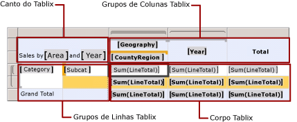
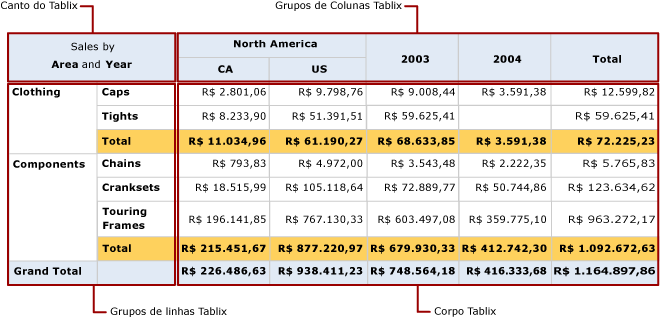

# Áreas da região de dados Tablix (Construtor de Relatórios e SSRS)
 Em um [!INCLUDE[ssRSnoversion_md](../../includes/ssrsnoversion-md.md)] relatório paginado, uma região de dados tablix tem quatro áreas que contêm células tablix:   
* O canto  
* A área do grupo de linhas  
* A área do grupo de colunas  
* O corpo   
  
As células de cada área têm uma função distinta. Você adiciona células à área de corpo de Tablix para exibir detalhes e dados agrupados. O Construtor de Relatórios e o Designer de Relatórios adicionam células à área do grupo de linhas ou grupo de colunas quando você cria um grupo para exibir valores de instância de grupo. O Construtor de Relatórios e o Designer de Relatórios criam células de canto de tablix quando existem grupos de linhas e de colunas.  
  
Na superfície de design, linhas pontilhadas denotam as quatro áreas de uma região de dados Tablix selecionada. A figura a seguir mostra as áreas de uma região de Tablix com grupos de linhas aninhados com base na categoria e na subcategoria, grupos de colunas aninhados com base na geografia e em país/região e um grupo de colunas adjacente com base no ano.  
  
   
  
 A lista seguinte descreve cada área:  
  
-   **Área do canto de Tablix**. (Opcional) Um canto de Tablix localiza-se no canto superior esquerdo ou no canto do superior direito de layouts da direita para a esquerda (RTL). Essa área será criada automaticamente quando você adicionar grupos de linhas e de colunas a uma região de dados Tablix. Nessa área, é possível mesclar células e adicionar um rótulo ou inserir outro item de relatório. Na figura, as células mescladas no canto exibem o rótulo Sales by Area and Year.  
  
-   **Área de grupos de colunas de Tablix**. (Opcional) Os grupos de colunas de Tablix localizam-se no canto superior direito (canto superior esquerdo no layout RTL). Essa área será criada automaticamente quando você adicionar um grupo de colunas. As células dessa área representam os membros da hierarquia de grupos de colunas e exibem os valores de instância do grupo de colunas. Na figura, as células que exibem [Geography] e [CountryRegion] estão aninhadas em grupos de colunas, enquanto a célula que exibe [Year] é um grupo de colunas adjacente. A coluna [Total] exibe os totais agregados por linha.  
  
-   **Área de grupos de linhas de Tablix**. (Opcional) Os grupos de linhas de Tablix localizam-se no canto inferior esquerdo (inferior direito no layout RTL). Essa área será criada automaticamente quando você adicionar um grupo de linhas. As células dessa área representam os membros da hierarquia de grupos de linhas e exibem os valores de instância do grupo de linhas. Na figura, as células que exibem [Category] e [Subcat] são grupos de linhas aninhados. A linha Total abaixo de Subcat repete-se a cada grupo de categoria para mostrar os subtotais agregados de cada coluna. A linha de total geral mostra os totais de todas as categorias.  
  
-   **Área de corpo de Tablix**. O corpo de tablix localiza-se no canto inferior direito (inferior esquerdo no layout RTL). O corpo de Tablix exibe detalhes e dados agrupados. Neste exemplo, somente dados agregados são usados. O escopo da expressão é determinado pelos grupos internos aos quais a caixa de texto pertence. As células do corpo de Tablix exibirão dados detalhados se forem membros de uma linha de detalhes e representarão dados de agregação se forem membros de uma linha ou coluna associada a um grupo. Por padrão, as células de uma linha ou coluna de grupo que contém expressões simples que não incluem uma função de agregação são avaliadas como o primeiro valor do grupo. Na figura, as células exibem os totais de agregação para totais de linha de todos os pedidos de venda.  
  
 Quando o relatório for executado, os grupos de colunas serão expandidos à direita (ou à esquerda, se a propriedade Direction da região de dados Tablix estiver definida como RTL) resultando em uma coluna para cada valor exclusivo de uma expressão de grupo. Os grupos de linhas expandem-se para baixo na página. Para obter mais informações, consulte [Células, linhas e colunas da região de dados Tablix &#40;Construtor de Relatórios&#41; e SSRS](../../reporting-services/report-design/tablix-data-region-cells-rows-and-columns-report-builder-and-ssrs.md).  
  
 A figura seguinte mostra a região de dados Tablix em Visualização.  
  
   
  
 A área de grupo de linhas exibe duas instâncias de grupo de categoria para Clothing e Components. O grupo de colunas exibe uma instância de grupo de geografia para North America, com duas instâncias de grupo país/região aninhadas para Canada (CA) e United States (US). Além disso, a coluna adjacente exibe duas instâncias de grupo de ano para 2003 e 2004. A linha da coluna Total exibe os totais da linha; a linha de totais que se repete com o grupo da categoria mostra os totais das subcategorias, e a linha de total geral exibe os totais das categorias uma vez para essa região de dados.  
  
## Consulte Também  
 [Tabelas, matrizes e listas &#40;Construtor de Relatórios e SSRS&#41;](../../reporting-services/report-design/tables-matrices-and-lists-report-builder-and-ssrs.md)   
 [Tutoriais do Construtor de Relatórios](../../reporting-services/report-builder-tutorials.md)   
 [Tabelas &#40;Construtor de Relatórios e SSRS&#41;](../../reporting-services/report-design/tables-report-builder-and-ssrs.md)   
 [Criar uma matriz](../../reporting-services/report-design/create-a-matrix-report-builder-and-ssrs.md)   
 [Criar faturas e formulários com listas](../../reporting-services/report-design/create-invoices-and-forms-with-lists-report-builder-and-ssrs.md)   
 [Região de dados Tablix &#40;Construtor de Relatórios e SSRS&#41;](../../reporting-services/report-design/tablix-data-region-report-builder-and-ssrs.md)  
  
  
