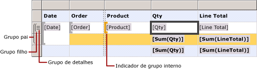
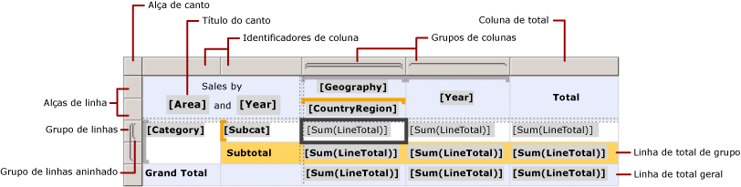
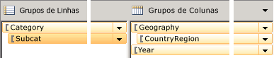
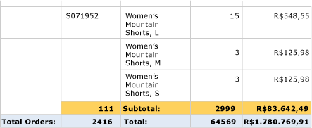

# Células, linhas e colunas em uma região de dados Tablix (Construtor de Relatórios) e SSRS

  Para controlar como as linhas e colunas de uma região de dados tablix exibem dados em um relatório paginado [!INCLUDE[ssRSnoversion_md](../../includes/ssrsnoversion-md.md)] , você deve compreender como especificá-las para dados detalhados, dados de grupo, além de rótulos e totais. Em muitos casos, é possível usar as estruturas padrão em uma tabela, matriz ou lista para exibir os dados. Para obter mais informações, consulte [Tabelas &#40;Construtor de Relatórios e SSRS&#41;](../../reporting-services/report-design/tables-report-builder-and-ssrs.md), [Matrizes](../../reporting-services/report-design/create-a-matrix-report-builder-and-ssrs.md) ou [Listas](../../reporting-services/report-design/create-invoices-and-forms-with-lists-report-builder-and-ssrs.md).  
  
 Uma região de dados tablix exibe dados detalhados em linhas e colunas detalhadas, além de dados agrupados em linhas e colunas agrupadas. Quando você adiciona grupos de linhas e de colunas a uma região de dados tablix, as linhas e as colunas nas quais os dados são exibidos são adicionadas automaticamente. É possível adicionar e remover manualmente linhas e colunas para personalizar uma região de dados tablix e controlar a forma como os dados são exibidos no relatório.  
  
 Para compreender como personalizar uma região de dados tablix, você deve compreender inicialmente como interpretar as indicações visuais exibidas quando você seleciona uma região de dados tablix na superfície de design.  
  
> [!NOTE]  
>  [!INCLUDE[ssRBRDDup](../../includes/ssrbrddup-md.md)]  
  
## Compreendendo as indicações visuais Tablix  
 As indicações visuais em uma região de dados tablix ajudam você a trabalhar com uma região de dados tablix para exibir os dados desejados.  
  
### Identificadores de linha e de coluna  
 Quando você seleciona uma região de dados tablix, gráficos indicadores de linha e de coluna apontam o propósito de cada uma delas. Os identificadores mostram as linhas e as colunas que estão dentro ou fora de um grupo. A tabela a seguir mostra várias exibições de identificadores.  
  
|ícone|DESCRIÇÃO|  
|----------|-----------------|  
||Apenas o grupo detalhado na hierarquia do grupo de linhas|  
||Um grupo externo e o grupo detalhado filho|  
||Um grupo externo, um grupo interno; nenhum grupo detalhado|  
||Um grupo externo, um grupo interno e o grupo detalhado filho|  
||Um grupo externo com uma linha de rodapé para totais e um grupo interno|  
||Um grupo externo com uma linha de rodapé para totais, um grupo interno com uma linha de rodapé para totais e uma linha detalhada|  
||Um grupo externo com um cabeçalho para rótulos e um rodapé para totais, além de um grupo interno; nenhum grupo detalhado|  
  
### Linhas de grupo  
 As linhas dentro de um grupo se repetem uma vez por valor de grupo exclusivo e costumam ser usadas em resumos de agregação. Linhas fora de um grupo se repetem uma vez em relação ao grupo e são usadas em rótulos ou subtotais. Quando você seleciona uma célula tablix, identificadores e colchetes dentro da região de dados tablix mostram os grupos aos quais uma célula pertence. Esta figura exibe as seguintes indicações visuais:  
  
-   Identificadores e linha e coluna que mostram associações de grupo.  
  
-   Indicadores de grupo realçados que mostram a associação ao grupo interno de uma célula selecionada.  
  
-   Indicadores de grupo que mostram todas as associações a grupo de uma célula selecionada.  
  
   
  
### Linhas de total  
 Após adicionar grupos de linhas e de colunas, é possível adicionar uma linha para exibir totais de colunas e uma coluna para exibir totais de linhas. A seguinte figura mostra uma matriz com grupos de linhas e de colunas, além de uma linha e uma coluna de total.  
  
   
  
### Painel Agrupamento  
 O painel Agrupamento exibe os grupos de linhas e de colunas referentes à região de dados tablix selecionada na superfície de design no momento. A seguinte figura mostra o painel Agrupamento da região de dados tablix.  
  
   
  
 O painel Grupos de Linhas mostra o grupo pai Categoria e o grupo filho Subcat. O painel Grupos de Colunas mostra o grupo pai Geografia e o grupo filho CountryRegion, além do grupo Ano, adjacente ao grupo Geografia. Quando você seleciona o grupo Subcat no painel Grupos de Linhas, a barra do grupo é exibida com uma sombra laranja mais escura e a célula do membro do grupo de linhas correspondente é selecionada na superfície de design.  
  
## Exibindo dados em linhas e colunas  
 Linhas e grupos de linhas e colunas e grupos de colunas têm relações idênticas. A seguinte descrição aborda como adicionar linhas para exibir detalhes e agrupar dados em linhas em uma região de dados tablix, embora os mesmos princípios se apliquem à adição de colunas para exibir dados detalhados e agrupados.  
  
 Para cada linha de uma região de dados tablix, uma linha permanece dentro ou fora de cada grupo de linhas. Caso esteja dentro de um grupo de linhas, a linha se repete uma vez para todos os valores exclusivos do grupo, o que é conhecido como *instância de grupo*. Caso esteja fora de um grupo de linhas, ela se repete apenas uma vez em relação ao grupo. Linhas fora de todos os grupos de linhas são estáticas e são repetidas apenas uma vez para a região de dados. Por exemplo, um cabeçalho da tabela ou linha de rodapé é uma linha estática. As linhas que se repetem em pelo menos um grupo são dinâmicas.  
  
 Quando há grupos aninhados, uma linha pode estar dentro de um grupo pai, mas fora de um grupo filho. A linha se repete em todos os valores do grupo pai, mas é exibida apenas uma vez em relação ao grupo filho. Para exibir rótulos ou totais de um grupo, adicione uma linha fora do grupo. Para exibir dados que se alteram a cada instância de grupo, adicione uma linha dentro do grupo.  
  
 Quando há grupos detalhados, cada linha detalhada permanece dentro do grupo. A linha se repete em todos os valores do conjunto de resultados da consulta do conjunto de dados.  
  
 Para obter mais informações sobre hierarquias de grupos, consulte [Noções básicas sobre grupos &#40;Construtor de Relatórios e SSRS&#41;](../../reporting-services/report-design/understanding-groups-report-builder-and-ssrs.md).  
  
 A seguinte figura mostra uma região de dados tablix com grupos de linhas aninhados e um grupo detalhado.  
  
   
  
 Em uma região de dados tablix que exibe dados detalhados, o grupo detalhado é o grupo filho interno. As linhas adicionadas a um grupo detalhado se repetem uma vez por linha no conjunto de resultados da consulta referente ao conjunto de dados vinculado à região de dados tablix. A seguinte figura mostra a última página do relatório renderizado. Nela, é possível ver as últimas linhas detalhadas e a linha de subtotal referente ao último pedido.  
  
   
  
 Para cada coluna de uma região de dados tablix, se aplicam os mesmos princípios. Por exemplo, uma coluna está dentro ou fora de cada grupo de colunas. Para exibir totais, adicione uma coluna fora do grupo.  
  
 Para remover linhas e colunas associadas a um grupo, é possível excluí-lo. Ao excluir um grupo, você tem a opção de excluir apenas a definição de grupo ou excluir o grupo e todas as linhas e colunas associadas. Excluindo apenas o grupo, você preserva o layout da linha e da coluna na região de dados. Ao excluir o grupo e as linhas e colunas relacionadas, você está excluindo todas as linhas e colunas estáticas (inclusive cabeçalhos e rodapés do grupo), além das linhas e colunas dinâmicas (inclusive instâncias de grupo) associadas ao grupo.  
  
 Para obter instruções passo a passo sobre como adicionar ou excluir linhas e colunas, consulte [Inserir ou excluir uma linha &#40;Construtor de Relatórios e SSRS&#41;](../../reporting-services/report-design/insert-or-delete-a-row-report-builder-and-ssrs.md) e [Inserir ou excluir uma coluna &#40;Construtor de Relatórios e SSRS&#41;](../../reporting-services/report-design/insert-or-delete-a-column-report-builder-and-ssrs.md).  
  
## Compreendendo células Tablix  
 As células tablix pertencem a uma das quatro áreas tablix: corpo, áreas do grupo de linhas ou de colunas ou canto. Embora cada célula possa exibir qualquer valor no conjunto de dados, a função padrão de cada célula é determinada pelo local. Para obter informações detalhadas sobre áreas Tablix, consulte [Áreas da região de dados Tablix &#40;Construtor de Relatórios e SSRS&#41;](../../reporting-services/report-design/tablix-data-region-areas-report-builder-and-ssrs.md).  
  
 Por padrão, células nas áreas dos grupos de linhas e de colunas tablix representam membros de grupo. Os membros do grupo são organizados em várias estruturas de árvore na definição de relatório. A hierarquia de grupo da linha se expande horizontalmente. A hierarquia de grupo da coluna se expande verticalmente. Essas células são adicionadas automaticamente quando você cria um grupo e exibem os valores exclusivos de um grupo em tempo de execução.  
  
 As células no canto tablix são criadas quando há áreas dos grupos de linhas e de colunas. É possível mesclar células nessa área para criar um rótulo ou inserir outro item de relatório.  
  
 As células na área do corpo tablix podem exibir dados detalhados quando a célula está em uma linha ou coluna detalhada e dados agregados quando ela se encontra em uma linha ou coluna do grupo. O escopo dos dados de uma célula é a interseção entre os grupos internos de linhas e de colunas aos quais a célula pertence.  
  
> [!NOTE]  
>  Os dados reais exibidos referentes a cada célula formam a expressão avaliada do item de relatório que ela contém, normalmente uma caixa de texto. Em uma célula pertencente a uma linha ou coluna detalhada, a expressão usa como padrão os dados detalhados (por exemplo, **[LineTotal])** . Em uma célula não pertencente a uma linha ou coluna detalhada, a expressão usa como padrão uma função de agregação (por exemplo, **Sum[LineTotal])** . Caso uma expressão não especifique uma função de agregação mesmo que a célula pertença a uma linha ou coluna do grupo, é exibido o primeiro valor do grupo. Para obter mais informações sobre agregações, consulte [Escopo das expressões para totais, agregações e coleções internas &#40;Construtor de Relatórios e SSRS&#41;](../../reporting-services/report-design/expression-scope-for-totals-aggregates-and-built-in-collections.md).  
  
### Mesclando e dividindo células  
 Em uma área tablix, é possível mesclar várias células adjacentes. Por exemplo, você pode criar células para rótulos que incluam várias colunas ou linhas.  
  
 Na área de canto tablix, as células podem ser combinadas em uma única direção por vez: horizontalmente nas colunas ou verticalmente nas linhas. Para mesclar um bloco de células, mescle primeiro as células horizontalmente. Após a mesclagem de todas as células em uma única célula em cada linha, selecione as células adjacentes (é possível selecionar todas as células adjacentes em uma coluna) e as mescle.  
  
 Na área de corpo tablix, as células só podem ser mescladas horizontalmente. Não há suporte para a mesclagem vertical.  
  
 Para obter mais informações, consulte [Mesclar células em uma região de dados &#40;Construtor de Relatórios e SSRS&#41;](../../reporting-services/report-design/merge-cells-in-a-data-region-report-builder-and-ssrs.md).  
  
 É possível dividir uma célula mesclada previamente. Você pode dividir as células horizontalmente em colunas ou verticalmente em linhas. Para dividir uma célula em um bloco de células, divida primeiro a célula horizontalmente e divida verticalmente quantas vezes forem necessárias.  
  
## Consulte Também  
 [Região de dados Tablix &#40;Construtor de Relatórios e SSRS&#41;](../../reporting-services/report-design/tablix-data-region-report-builder-and-ssrs.md)  
  
  
