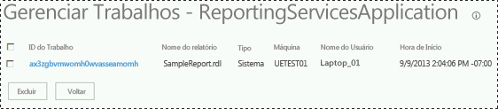

# <a name="manage-a-reporting-services-sharepoint-service-application"></a>Manage a Reporting Services SharePoint Service Application
  [!INCLUDE[ssRSnoversion](../../includes/ssrsnoversion-md.md)] são gerenciados na Administração Central do SharePoint. As páginas Gerenciamento e Propriedades permitem atualizar a configuração do aplicativo de serviço, bem como as tarefas de administração comuns.  
  
 Este tópico aborda as seguintes informações:  
  
-   [Para abrir páginas de gerenciamento de aplicativos de serviço](#bkmk_openpages)  
  
-   [Página de configurações do sistema](#bkmk_systemsettings)  
  
-   [Gerenciar trabalhos](#bkmk_managejobs)  
  
-   [Gerenciamento de chaves](#bkmk_keymgt)  
  
-   [Conta de execução](#bkmk_executionaccount)  
  
-   [Configurações de email](#bkmk_email)  
  
-   [Provisionar Assinaturas e Alertas](#bkmk_provisionsubscriptions)  
  
## <a name="to-open-service-application-properties-page"></a>Para abrir a página de propriedades de gerenciamento de aplicativos de serviço  
 Para abrir a página de propriedades de um aplicativo de serviço do [!INCLUDE[ssRSnoversion](../../includes/ssrsnoversion-md.md)] , siga as etapas abaixo:  
  
1.  Na Administração Central, no grupo Gerenciamento de Aplicativos, clique em **Gerenciar aplicativos de serviço**.  
  
2.  Clique próximo ao nome do aplicativo de serviço ou na coluna **tipo** ; essa ação selecionará toda a linha. Em seguida, clique em **Propriedades** na faixa de opções do SharePoint.  
  
 Para obter mais informações sobre as propriedade do aplicativo de serviço, consulte [Etapa 3: Criar um aplicativo de serviço do Reporting Services](../../reporting-services/install-windows/install-the-first-report-server-in-sharepoint-mode.md#bkmk_create_serrviceapplication).  
  
##  <a name="bkmk_openpages"></a> Para abrir páginas de gerenciamento de aplicativos de serviço  
 Para abrir as páginas de gerenciamento de um aplicativo de serviço do [!INCLUDE[ssRSnoversion](../../includes/ssrsnoversion-md.md)] , siga as etapas abaixo:  
  
1.  Na Administração Central, no grupo Gerenciamento de Aplicativos, clique em **Gerenciar aplicativos de serviço**.  
  
2.  Clique no nome do aplicativo de serviço, e a página **Gerenciar Aplicativo Reporting Service** será aberta.  
  
3.  Se desejar, você poderá clicar próximo ao nome ou na coluna **tipo** do aplicativo de serviço; essa ação selecionará toda a linha. Em seguida, clique no botão **Gerenciar** na faixa de opções do SharePoint.  
  
##  <a name="bkmk_systemsettings"></a> Página de configurações do sistema  
 A página de configurações de sistemas permite configurar o comportamento e a experiência de usuário do aplicativo de serviço, incluindo vários tempos limite.  
  
-   [Configurações do relatório](#bkmk_report_settings_section)  
  
-   [Configurações da sessão](#bkmk_session_settings_section)  
  
-   [Configurações do sistema para registro](#bkmk_logging_settings_section)  
  
-   [Configurações de segurança](#bkmk_security_settings_section)  
  
-   [Configurações de cliente](#bkmk_client_settings_section)  
  
###  <a name="bkmk_report_settings_section"></a> Configurações do relatório  
  
|Configuração|Comentários|  
|-------------|--------------|  
|Tempo Limite de Imagens Externas|O padrão é 600 segundos.|  
|Compactação de Instantâneo|O padrão é SQL|  
|Tempo Limite de Relatório do Sistema|O padrão é 1.800 segundos.<br /><br /> Especifique se o tempo limite de processamento do relatório se esgota no servidor de relatórios após um certo número de segundos. Esse valor se aplica ao processamento de relatório em um servidor de relatório. Ele não afeta o processamento de dados no servidor de banco de dados que fornece os dados para o seu relatório. O relógio do timer do processamento de relatórios é acionado quando o relatório é selecionado e desativado quando o relatório é aberto. O valor especificado deve ser suficiente para concluir o processamento dos dados e do relatório.|  
|Limite de Instantâneos do Sistema|O padrão -1, que significa sem limite.<br /><br /> Defina um valor padrão no nível do site para o número de cópias do histórico de relatórios a serem mantidas. O valor padrão fornece uma definição inicial que estabelece o número de instantâneos que pode ser armazenado para cada relatório. Você pode especificar limites diferentes em páginas de propriedades de relatórios específicos.|  
|Tempo de Vida de Parâmetros Armazenados|O padrão é 180|  
|Limite de Parâmetros Armazenados|O padrão é 1500 dias.|  
  
###  <a name="bkmk_session_settings_section"></a> Configurações da sessão  
  
|Configuração|Comentários|  
|-------------|--------------|  
|Limite de Tempo da Sessão|O padrão é 600 segundos.|  
|Usar Cookies de Sessão|O padrão é TRUE.|  
|Tempo Limite do Relatório EDLX|O padrão é 1.800 segundos.|  
  
###  <a name="bkmk_logging_settings_section"></a> Configurações do sistema para registro  
  
|Configuração|Comentários|  
|-------------|--------------|  
|Habilitar Log de Execução|O padrão é TRUE.<br /><br /> Especifique se o servidor de relatórios gerará logs de rastreamento e por quantos dias os logs serão mantidos. . Os logs são armazenados no computador do servidor de relatório, na pasta \Microsoft SQL Server\MSSQL.n\ReportServer\Log. Um novo arquivo de log é iniciado cada vez que o serviço é reiniciado. Para obter mais informações sobre arquivos de log, consulte [Report Server Service Trace Log](../../reporting-services/report-server/report-server-service-trace-log.md)|  
|Dias em Que o Log de Execução Será Mantido|O padrão é 60 dias.|  
  
 [!INCLUDE[ssRSnoversion](../../includes/ssrsnoversion-md.md)] oferece suporte para o log ULS do SharePoint.  Para obter mais informações, consulte [Ativar eventos do Reporting Services para o log de rastreamento do SharePoint &#40;ULS&#41;](../../reporting-services/report-server/turn-on-reporting-services-events-for-the-sharepoint-trace-log-uls.md)  
  
###  <a name="bkmk_security_settings_section"></a> Configurações de segurança  
  
|Configuração|Comentários|  
|-------------|--------------|  
|Habilitar Segurança Integrada|O padrão é TRUE.<br /><br /> Especifica se uma conexão com uma fonte de dados de relatório pode ser feita usando o token de segurança do Windows do usuário que solicitou o relatório.|  
|Habilitar Definição de Relatório de Carregamento|O padrão é TRUE.|  
|Habilitar Erros Remotos|O padrão é FALSE|  
|Habilitar Erros Detalhados de Conexão de Teste|O padrão é TRUE.|  
  
###  <a name="bkmk_client_settings_section"></a> Configurações de cliente  
  
|Configuração|Comentários|  
|-------------|--------------|  
|Habilitar Download do Construtor de Relatórios|O padrão é TRUE.<br /><br /> Especifica se os clientes podem ver o botão para baixar o aplicativo de construtor de relatórios.|  
|URL de Inicialização do Construtor de Relatórios|Especifique uma URL personalizada quando o servidor de relatórios não usar a URL padrão do Construtor de Relatórios. Essa configuração é opcional. Se você não especificar um valor, a URL padrão será usada, o que inicia o Construtor de Relatórios. Para iniciar o construtor de relatórios 3.0 como um clique-aplicativo ClickOnce, digite o seguinte valor: http://\<computername > / ReportServer/ReportBuilder/ReportBuilder_3_0_0_0.application.|  
|Habilitar Impressão de Cliente|O padrão é TRUE.<br /><br /> Especifica se os usuários podem baixar o controle do cliente, que fornece opções de impressão.|  
|Editar Tempo Limite da Sessão|O padrão é 7200 segundos.|  
|Editar Limite de Cache de Sessão|O padrão é 5.|  
  
##  <a name="bkmk_managejobs"></a> Gerenciar trabalhos  
 Você pode visualizar e excluir os trabalhos em execução; por exemplo trabalhos que foram criados pelas assinaturas de relatórios e assinaturas controladas por dados. A página não é usada para gerenciar assinaturas, mas trabalhos que foram disparados por uma assinatura. Por exemplo, uma assinatura que foi agendada para ser executada uma vez a cada hora gerará um trabalho por hora que será exibido na página **Gerenciar Trabalhos** .  
  
   
  
##  <a name="bkmk_keymgt"></a> Gerenciamento de chaves  
 A tabela a seguir resume as páginas de gerenciamento de chaves  
  
> [!IMPORTANT]  
>  Alterar periodicamente a chave de criptografia do Reporting Services é uma prática recomendada de segurança. Um momento indicado para alterar a chave é imediatamente após uma atualização de versão principal do Reporting Services. Alterar a chave depois de uma atualização minimiza a interrupção de serviço adicional causada pela alteração da chave de criptografia do Reporting Services fora do ciclo de atualização.  
  
|Página|Description|  
|----------|-----------------|  
|Chave de Criptografia de Backup|1) Digite uma senha nas caixas **Senha:** e **Confirmar Senha:** , e clique em **Exportar**. Você verá um aviso se a senha digitada não atender aos requisitos de complexidade da política de domínio.<br /><br /> 2) Será solicitado que você informe um local em que o arquivo da chave será salvo. É recomendável armazenar o arquivo da chave em um computador que não seja o que está executando o [!INCLUDE[ssRSnoversion](../../includes/ssrsnoversion-md.md)]. O nome de arquivo padrão é o mesmo do aplicativo de serviço.|  
|Restaurar chave de criptografia|1) Digite ou navegue até o arquivo da chave na caixa **Local do Arquivo**<br /><br /> 2) Na caixa **Senha** , digite a senha que foi usada para fazer backup do arquivo de criptografia.<br /><br /> 3) Clique em **OK**|  
|Alterar Chave de Criptografia|Esta operação criará uma nova chave e criptografará novamente seu conteúdo criptografado. Se você tiver muito conteúdo, esta operação poderá levar várias horas.<br /><br /> Quando a operação de alteração de chave de criptografia for concluída, é recomendado que você faça um backup de sua nova chave.|  
|Conteúdo Criptografado Excluído|O conteúdo excluído não pode ser recuperado.<br /><br /> **\*\* Importante \*\*** A ação de excluir e recriar a chave simétrica não pode ser invertida ou desfeita. Excluir ou recriar a chave simétrica pode ter ramificações importantes em sua instalação atual. Se você excluir a chave, quaisquer dados existentes criptografados pela chave simétrica também serão excluídos. Os dados excluídos incluem cadeias de caracteres de conexão a fontes de dados de relatório externas, cadeias de caracteres de conexões armazenadas e algumas informações de assinatura.|  
  
##  <a name="bkmk_executionaccount"></a> Conta de execução  
 Use esta página para configurar uma conta a ser usada para processamento autônomo. Essa conta é usada em circunstâncias especiais, quando outras fontes de credenciais não estiverem disponíveis:  
  
-   Quando o servidor de relatório se conecta a uma fonte de dados que não requer credenciais. Exemplos de fontes de dados que podem não requerer credenciais incluem documentos XML e alguns aplicativos de banco de dados do lado do cliente.  
  
-   Quando o servidor de relatório se conecta a outro servidor para recuperar arquivos de imagem externos ou outros recursos que são referenciados em um relatório.  
  
 A configuração dessa conta é opcional, mas não configurá-la limita seu uso de imagens externas e conexões com algumas fontes de dados. Ao recuperar arquivos de imagem externos, o servidor de relatório verifica se uma conexão anônima pode ser feita. Se a conexão for protegida por senha, o servidor de relatório usa a conta de processamento autônomo de relatórios para conectar-se ao servidor remoto. Ao recuperar dados de um relatório, o servidor de relatório representa o usuário atual, solicita ao usuário que forneça credenciais, usa credenciais armazenadas ou usa a conta de processamento autônomo se a conexão da fonte de dados especificar **Nenhum** como o tipo de credencial. O servidor de relatório não permite que as credenciais de sua conta de serviço sejam delegadas ou representadas ao conectar-se a outros computadores, portanto ele deverá usar a conta de processamento autônomo se nenhuma outra credencial estiver disponível.  
  
 A conta que você especifica deve ser diferente da usada para executar a conta de serviço. Se você estiver executando o servidor de relatório em uma implantação de expansão, deverá configurar essa conta da mesma maneira em cada servidor de relatório.  
  
 Você pode usar qualquer conta de usuário do Windows. Para obter melhores resultados, escolha uma conta que tenha permissões de leitura e permissões de logon na rede a fim de dar suporte a conexões com outros computadores. Ela deve ter a permissão de leitura em qualquer imagem externa ou arquivo de dados que você deseja usar em um relatório. Não especifique uma conta local, a menos que todas as fontes de dados do relatório e imagens externas estejam armazenadas no computador do servidor de relatório. Use a conta somente para o processamento autônomo de relatórios.  
  
   
  
 O seguinte exemplo é de um comando do PowerShell para retornar a lista de aplicativos de serviço do [!INCLUDE[ssRSnoversion](../../includes/ssrsnoversion-md.md)] com a propriedade UEAccount:  
  
```  
Get-SPRSServiceApplication | select typename, name, service, ueaccountname  
```  
  
 Para obter mais informações, consulte [Cmdlets do PowerShell para o modo SharePoint do Reporting Services](../../reporting-services/report-server-sharepoint/powershell-cmdlets-for-reporting-services-sharepoint-mode.md).  
  
### <a name="options"></a>Opções  
 **Especificar uma conta de execução**  
 Selecione para especificar uma conta.  
  
 **Conta**  
 Insira uma conta de usuário de domínio do Windows. Use este formato:  *\<domínio >\\< conta de usuário\>*.  
  
 **Senha**  
 Digite a senha.  
  
 **Confirmar senha**  
 Redigite a senha.  
  
##  <a name="bkmk_email"></a> Configurações de email  
 Use esta página para especificar configurações do protocolo SMTP que habilitem a entrega de email do servidor de relatório a partir do servidor de relatório. Você pode usar a extensão de entrega de email do Servidor de Relatório para distribuir relatórios ou notificações de processamento de relatório por meio de assinaturas de email. A extensão de entrega de email do Servidor de relatório requer um servidor SMTP e um endereço de email a ser usado no campo De:.  
  
### <a name="options"></a>Opções  
 **Usar Servidor SMTP Server**  
 Especifica que o email do servidor de relatório é roteado por um servidor SMTP.  
  
 **Servidor SMTP de Saída**  
 Especifique o servidor SMTP ou o gateway a ser usado. Você pode usar um servidor local ou um servidor SMTP em sua rede.  
  
 **Endereço De**  
 Especifica o endereço de email a ser usado no campo De: de um email gerado. Você deve especificar uma conta de usuário que tenha permissão para enviar email do servidor SMTP.  
  
##  <a name="bkmk_provisionsubscriptions"></a> Provisionar Assinaturas e Alertas  
 Use esta página para verificar se o SQL Server Agent está em execução e provisionar acesso para que o Reporting Services use o SQL Server Agent. O SQL Server Agent é necessário para assinaturas, agendas e alertas de dados do [!INCLUDE[ssRSnoversion](../../includes/ssrsnoversion-md.md)] . [Provisionar Assinaturas e Alertas para aplicativos de serviço SSRS](../../reporting-services/install-windows/provision-subscriptions-and-alerts-for-ssrs-service-applications.md)  
  
## <a name="proxy-association"></a>Associação de proxy  
 Ao criar o aplicativo de serviço Reporting Services, você selecionou o aplicativo Web para associar e provisionar permissões para acesso pelo aplicativo de serviço Reporting Services. Se você optou por não fazer a associação ou se você deseja alterar a associação, execute as seguintes etapas.  
  
1.  Na Administração Central do SharePoint, em Gerenciamento de Aplicativo, clique em **Configurar Associações de Aplicativo de Serviço**.  
  
2.  Na página Associações de Aplicativos de Serviço, altere a exibição para **Aplicativos de Serviço**.  
  
3.  Localize e clique no nome do novo aplicativo de serviço [!INCLUDE[ssRSnoversion](../../includes/ssrsnoversion-md.md)] . Você também pode clicar no nome do grupos de proxies de aplicativos **padrão** para adicionar o proxy ao grupo padrão em vez de concluir as etapas a seguir.  
  
4.  Selecione **Personalizado** na caixa de seleção **Editar o seguinte grupo de conexões**.  
  
5.  Marque a caixa do proxy e clique em **Ok**.  
  
  
