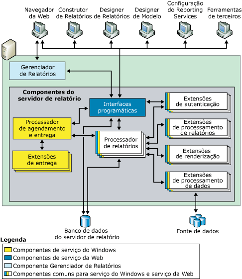
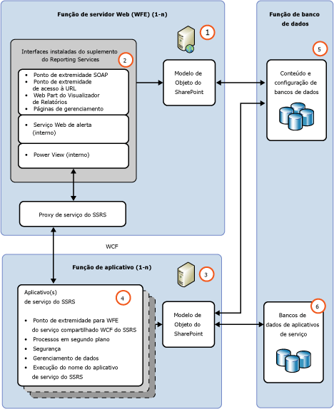

# Servidor de Relatório do Reporting Services

Saiba mais sobre a parte central de uma instalação do [!INCLUDE[ssNoVersion](../../includes/ssnoversion-md.md)] [!INCLUDE[ssRSnoversion](../../includes/ssrsnoversion-md.md)] . Ela consiste em um mecanismo de processamento juntamente com extensões para adicionar funcionalidade.

Um servidor de relatório do [!INCLUDE[ssRSnoversion](../../includes/ssrsnoversion-md.md)] é executado em um destes dois modos de implantação: modo nativo ou modo do SharePoint. Consulte a seção [Comparação de recursos do SharePoint e do modo nativo](#bkmk_featuresupport) para obter uma comparação entre os recursos.  
  
 **Instalação:** Para obter informações sobre a instalação do [!INCLUDE[ssRSnoversion](../../includes/ssrsnoversion-md.md)] , consulte o seguinte:  
  
-   [Instalar o servidor de relatório de modo nativo do Reporting Services](assetid:///8f25e6dc-b753-400e-9e9a-50f4f35bf6c4)  
  
-   [Instalar recursos de BI do SQL Server com o SharePoint &#40;Power Pivot e Reporting Services&#41;](assetid:///ac6cba68-2665-4a39-8fa3-cb7d7e6723c0)  
  
 **Windows Azure**: para obter informações sobre como usar o [!INCLUDE[ssRSnoversion](../../includes/ssrsnoversion-md.md)] com máquinas virtuais do Windows Azure, consulte o seguinte:  
  
-   [SQL Server Business Intelligence em máquinas virtuais do Windows Azure](http://msdn.microsoft.com/library/windowsazure/jj992719.aspx).  
  
-   [Utilize o PowerShell para criar uma VM do Azure com um servidor de relatório no modo nativo](https://msdn.microsoft.com/library/azure/dn449661.aspx).   
  
##   Visão geral dos modos do servidor de relatório  
 Mecanismos de processamento (processadores) são o núcleo do servidor de relatório. Os processadores oferecem suporte à integridade do sistema de geração de relatórios e não podem ser modificados ou estendidos. Extensões também são processadores, mas elas executam funções muito específicas. [!INCLUDE[ssRSnoversion](../../includes/ssrsnoversion-md.md)] inclui uma ou mais extensões padrão para todo tipo de extensão com suporte. É possível adicionar extensões personalizadas a um servidor de relatório. Isso permite estender um servidor de relatório para que ofereça suporte a recursos que não vêm com suporte de fábrica; exemplos da funcionalidade personalizada podem incluir suporte a tecnologias de logon único, saída de relatório em formatos de aplicativo que não estão prontos para serem manipulados pelas extensões de renderização padrão e entrega de relatório para uma impressora ou aplicativo.  
  
 Uma única instância de servidor de relatório é definida pela coleção inteira de processadores e extensões que fornecem processamento de ponta a ponta, desde a manipulação da solicitação inicial até a apresentação de um relatório concluído. Através de seus subcomponentes, o servidor de relatório processa as solicitações de relatório e torna os relatórios disponíveis para acesso sob demanda ou distribuição agendada.  
  
 Funcionalmente, um servidor de relatório permite experiências de criação de relatório, renderização de relatório e entrega de relatório para várias fontes de dados, bem como autenticação extensível e esquemas de autorização. Além disso, um servidor de relatório contém bancos de dados de servidor de relatório que armazenam relatórios publicados, fontes de dados compartilhadas, conjuntos de dados compartilhados, partes de relatório, agendas compartilhadas e assinaturas, arquivos de origem de definição de relatórios, definições de modelos, relatórios compilados, instantâneos, parâmetros e outros recursos. Um servidor de relatório também permite que um administrador configure o servidor de relatório para processar solicitações de relatório, mantenha históricos de instantâneos e gerencie permissões para relatórios, fontes de dados, conjuntos de dados e assinaturas.  
  
 Um servidor de relatório do [!INCLUDE[ssRSnoversion](../../includes/ssrsnoversion-md.md)] oferece suporte a dois modos de implantação para instâncias do servidor de relatório:  
  
-   O modo**nativo**, incluindo o modo nativo com Web Parts do SharePoint, no qual um servidor de relatório é executado como um servidor de aplicativo que fornece todos os recursos de processamento e gerenciamento exclusivamente através de componentes do [!INCLUDE[ssRSnoversion](../../includes/ssrsnoversion-md.md)] . Você configura um servidor de relatório de modo nativo com o gerenciador de configurações do [!INCLUDE[ssRSnoversion](../../includes/ssrsnoversion-md.md)] e o SQL Server Management Studio.  
  
-   O modo do**SharePoint**, no qual um servidor de relatório é instalado como parte de um farm de servidores do SharePoint.  Implante e configure o modo do SharePoint usando comandos do PowerShell ou páginas de gerenciamento de conteúdo do SharePoint.  
  
 No SQL Server Reporting Services, você não pode alternar um servidor de relatório de um modo para outro. Se você quiser alterar o tipo de servidor de relatório que seu ambiente usa, deve instalar o modo do servidor de relatório desejado e, em seguida, copiar ou mover os itens de relatório ou o banco de dados do servidor de relatório antigo para o novo. Esse processo geralmente é denominado 'migração'. As etapas necessárias para migrar dependem do modo que você está migrando e a versão da qual você está migrando. Para obter mais informações, consulte [Upgrade and Migrate Reporting Services](../../reporting-services/install-windows/upgrade-and-migrate-reporting-services.md).  
  
##  Comparação de recursos do SharePoint e modo nativo  
  
|Recurso ou componente|nativo|SharePoint|  
|--------------------------|-----------------|---------------------|  
|**Endereçamento de URL**|Sim|O endereçamento de URL é diferente no modo integrado do SharePoint. As URLs do SharePoint são usadas para relatórios de referência, modelos de relatório, fontes de dados compartilhadas e recursos. A hierarquia de pastas do servidor de relatório não é usada. Se você tiver aplicativos personalizados que dependem do acesso à URL com suporte em um servidor de relatório no modo nativo, essa funcionalidade deixará de funcionar quando o servidor de relatório for configurado para integração com o SharePoint.   Para obter mais informações sobre acesso à URL, consulte [Referência de parâmetro de acesso à URL](../../reporting-services/url-access-parameter-reference.md)|  
|**Extensões de segurança personalizadas**|Sim|[!INCLUDE[ssRSnoversion](../../includes/ssrsnoversion-md.md)] não podem ser implantadas nem usadas no servidor de relatório. O servidor de relatório inclui uma extensão de segurança para fins especiais que é usada sempre que você configura um servidor de relatório para ser executado no modo integrado do SharePoint. Essa extensão de segurança é um componente interno e é necessário para operações integradas.|  
|**Configuration Manager**|Sim|**\*\* Importante \*\*** O Configuration Manager não pode ser usado para gerenciar servidor de relatório do modo do SharePoint. Em vez disso, use a administração central do SharePoint.|  
|**Gerenciador de Relatórios**|Sim|O Gerenciador de Relatórios não pode ser usado para gerenciar o modo do SharePoint. Use as páginas do aplicativo do SharePoint. Para obter mais informações, consulte [Serviço SharePoint do Reporting Services e aplicativos de serviço](../../reporting-services/report-server-sharepoint/reporting-services-sharepoint-service-and-service-applications.md).|  
|**Relatórios vinculados**|Sim|Nenhum.|  
|**Meus Relatórios**|Sim|Não|  
|**Minhas Assinaturas** e métodos de envio em lote.|Sim|Não|  
|**Alertas de dados**|Não|Sim|  
|**Power View**|Não|Sim   Exige o Silverlight no navegador do cliente. Para obter mais informações sobre os requisitos de navegador, veja [Suporte ao navegador para Reporting Services e Power View](../../reporting-services/browser-support-for-reporting-services-and-power-view.md)|  
|**Relatórios .RDL**|Sim|Sim   Relatórios .RDL podem ser executados em servidores de relatório do [!INCLUDE[ssRSnoversion](../../includes/ssrsnoversion-md.md)] no modo nativo ou no modo do SharePoint.|  
|**Relatórios .RDLX**|Não|Sim   Relatórios .RDLX do Power View só podem ser executados em servidores de relatório do [!INCLUDE[ssRSnoversion](../../includes/ssrsnoversion-md.md)] no modo do SharePoint.|  
|**Credenciais do token do usuário do SharePoint para a extensão de lista do SharePoint**|Não|Sim|  
|**As zonas do AAM para implantações voltadas para a Internet**|Não|Sim|  
|**Backup e recuperação do SharePoint**|Não|Sim|  
|**Suporte de log ULS**|Não|Sim|  
  
##   nativo  
 No modo nativo, um servidor de relatório é um servidor de aplicativo autônomo que fornece todas as exibições, gerenciamento, processamento e entrega de relatórios e modelos de relatório. Este é o modo padrão para instâncias do servidor de relatório. Você pode instalar um servidor de relatório no modo nativo que seja configurado durante a instalação ou pode configurá-lo para operações do modo nativo quando a instalação for concluída.  
  
 O diagrama seguinte mostra a arquitetura de três camadas de uma implantação de modo Nativo do [!INCLUDE[ssRSnoversion](../../includes/ssrsnoversion-md.md)] . Ele mostra o banco de dados do servidor de relatório e as fontes de dados na camada de dados, os componentes do servidor do relatório na camada intermediária, os aplicativos cliente e as ferramentas internas ou personalizadas na camada de apresentação. Apresenta o fluxo de solicitações, os dados entre os componentes do servidor e quais componentes enviam e recuperam conteúdo a partir de um repositório de dados.  
  
   
  
 O servidor de relatório é implementado como um serviço do [!INCLUDE[msCoName](../../includes/msconame-md.md)] Windows, chamado "serviço Servidor de Relatório", que hospeda um serviço Web, processamento em segundo plano e outras operações. No aplicativo do console Serviços, o serviço é listado como MSSQLSERVER (SQL Server Reporting Services).  
  
 Desenvolvedores de terceiros podem criar extensões adicionais para substituir ou estender a capacidade de processamento do servidor de relatório. Para obter mais informações sobre as interfaces programáticas disponíveis para desenvolvedores de aplicativos, consulte a [Referência Técnica](../../reporting-services/technical-reference-ssrs.md).  
  
###   Modo nativo com Web Parts do SharePoint  
 [!INCLUDE[ssRSnoversion](../../includes/ssrsnoversion-md.md)] fornece duas Web Parts que você pode instalar e registrar em uma instância do [!INCLUDE[winSPServ](../../includes/winspserv-md.md)] 2.0 ou posterior ou [!INCLUDE[spPortalServ](../../includes/spportalserv-md.md)] 2003 ou posterior. A partir de um site do SharePoint, você pode usar as Web Parts para localizar e exibir relatórios armazenados e processados em um servidor de relatório executado no modo nativo. Essas Web Parts foram introduzidas em versões anteriores do [!INCLUDE[ssRSnoversion](../../includes/ssrsnoversion-md.md)].  
  
##   SharePoint  
 No modo do SharePoint, um servidor de relatório deve ser executado em um farm de servidores do SharePoint. Os recursos de processamento, renderização e gerenciamento do servidor de relatório são representados por um servidor de aplicativos do SharePoint que executa o serviço compartilhado SharePoint para [!INCLUDE[ssRSnoversion](../../includes/ssrsnoversion-md.md)] e um ou mais aplicativos de serviço do [!INCLUDE[ssRSnoversion](../../includes/ssrsnoversion-md.md)] . Um site do SharePoint fornece o acesso front-end ao conteúdo e às operações do servidor de relatório.  
  
 O modo do SharePoint requer:  
  
-   [!INCLUDE[SPF2010](../../includes/spf2010-md.md)] ou [!INCLUDE[SPS2010](../../includes/sps2010-md.md)].  
  
-   Uma versão apropriada do Suplemento do [!INCLUDE[ssRSnoversion](../../includes/ssrsnoversion-md.md)] para Produtos do SharePoint 2010.  
  
-   Um servidor de aplicativos do SharePoint com o serviço compartilhado do [!INCLUDE[ssRSnoversion](../../includes/ssrsnoversion-md.md)] instalado e pelo menos um aplicativo de serviço do [!INCLUDE[ssRSnoversion](../../includes/ssrsnoversion-md.md)] .  
  
 A ilustração a seguir mostra um ambiente do [!INCLUDE[ssRSnoversion](../../includes/ssrsnoversion-md.md)] no modo do SharePoint:  
  
   
  
||Description|  
|-|-----------------|  
|**(1)**|Servidores Web ou WFE (front-ends da Web). O suplemento do [!INCLUDE[ssRSnoversion](../../includes/ssrsnoversion-md.md)] deve ser instalado em cada servidor Web do qual você deseja utilizar os recursos de aplicativo Web, como exibição de relatórios ou páginas de gerenciamento do [!INCLUDE[ssRSnoversion](../../includes/ssrsnoversion-md.md)] para tarefas como gerenciar fontes de dados ou assinaturas.|  
|**(2)**|O suplemento instala a URL e pontos de extremidade SOAP para clientes se comunicarem com os servidores de aplicativos, pelo proxy de serviço do [!INCLUDE[ssRSnoversion](../../includes/ssrsnoversion-md.md)] .|  
|**(3)**|Os servidores de aplicativos que executam o serviço compartilhado do [!INCLUDE[ssRSnoversion](../../includes/ssrsnoversion-md.md)] . A expansão do processamento de relatório é gerenciado como parte do farm do SharePoint e adicionando o serviço do [!INCLUDE[ssRSnoversion](../../includes/ssrsnoversion-md.md)] para servidores de aplicativos adicionais.|  
|**(4)**|Você pode criar mais de um aplicativo de serviço do [!INCLUDE[ssRSnoversion](../../includes/ssrsnoversion-md.md)] , com configurações diferentes inclusive permissões, email, proxy e assinaturas.|  
|**(5)**|Relatórios, fontes de dados e outros itens são armazenados nos bancos de dados de conteúdo do SharePoint.|  
|**(6)**|[!INCLUDE[ssRSnoversion](../../includes/ssrsnoversion-md.md)] criam três bancos de dados para servidor de relatório, temporário e recursos de alertas de dados. Os parâmetros de configuração que se aplicam a todos os aplicativos de serviço do SSRS são armazenadas no arquivo **RSReportserver.config** .|  
  
##   Processo de relatório e processo de agendamento e entrega 
 O servidor de relatório inclui dois mecanismos de processamento que executam processamento de relatório preliminar e intermediário, além de operações agendadas e de entrega. O Processador de Relatório recupera a definição ou modelo de relatório, combina informações de layout com dados a partir da extensão de processamento de dados e as renderiza no formato solicitado. O Processo de Agendamento e Entrega processa relatórios disparados a partir de um agendamento e entrega os relatórios aos destinos pretendidos.  
  
##   Banco de dados do servidor de relatório  
 O servidor de relatório é um servidor sem monitoração de estado que armazena todas as propriedades, objetos e metadados em um banco de dados do [!INCLUDE[ssNoVersion](../../includes/ssnoversion-md.md)] . Os dados armazenados incluem relatórios publicados, relatórios compilados, modelos de relatório e a hierarquia de pastas que fornece o endereço para todos os itens gerenciados pelo servidor de relatório. Um banco de dados do servidor de relatório pode fornecer armazenamento interno para uma única instalação do [!INCLUDE[ssRSnoversion](../../includes/ssrsnoversion-md.md)] ou para vários servidores de relatório que façam parte de uma implantação de expansão. Se você configurar um servidor de relatório para ser executado em uma implantação maior do produto ou tecnologia do SharePoint, o servidor de relatório usará os bancos de dados do SharePoint além do banco de dados do servidor de relatório. Para obter mais informações sobre os repositórios de dados usados na instalação do Reporting Services, consulte [Banco de dados do servidor de relatório &#40;modo nativo do SSRS&#41;](../../reporting-services/report-server/report-server-database-ssrs-native-mode.md).  
  
##   Extensões de autenticação, renderização, dados e entrega  
 O servidor de relatório oferece suporte aos seguintes tipos de extensões: autenticação, processamento de dados, processamento de relatórios, renderização e entrega. Um servidor de relatório requer pelo menos uma extensão de autenticação, de processamento de dados e de renderização. As extensões de processamento de relatório personalizado e de entrega são opcionais, mas necessárias se você quiser oferecer suporte aos controles de distribuição e personalização.  
  
 O Reporting Services fornece extensões padrão para que você possa usar todos os recursos de servidor sem ter de desenvolver componentes personalizados. A tabela a seguir descreve as extensões padrão que contribuem para uma instância de servidor de relatório completa que fornece funcionalidades prontas para uso:  
  
|Tipo|Default|  
|----------|-------------|  
|Autenticação|Uma instância de servidor de relatório padrão oferece suporte à Autenticação do Windows, incluindo recursos de representação e delegação, caso estejam habilitados no seu domínio.|  
|Processamento de dados|Uma instância do servidor de relatório padrão inclui extensões de processamento de dados para fontes de dados do [!INCLUDE[ssNoVersion](../../includes/ssnoversion-md.md)], [!INCLUDE[ssASnoversion](../../includes/ssasnoversion-md.md)], Oracle, Hyperion Essbase, SAPBW, OLE DB, Parallel Data Warehouse e ODBC.|  
|Renderização|Uma instância de servidor de relatório padrão inclui extensões de renderização para HTML, Excel, CSV, XML, Imagem, Word, lista do SharePoint e PDF.|  
|Entrega|Uma instância de servidor de relatório padrão inclui uma extensão de entrega de email e uma extensão de entrega de compartilhamento de arquivos. Se o servidor de relatório for configurado para integração com o SharePoint, você poderá usar uma extensão de entrega que salva relatórios em uma biblioteca do SharePoint.|  
  
> [!NOTE]  
>  O Reporting Services inclui um conjunto completo de ferramentas e aplicativos que você pode usar para administrar o servidor, criar conteúdo e torná-lo disponível aos usuários de sua organização.  
  
##   Tarefas relacionadas  
 Os tópicos a seguir fornecem mais informações sobre como instalar, usar e manter um servidor de relatório:  
  
|Tarefa|Link|  
|----------|----------|  
|Revisar os requisitos de hardware e software.|[Hardware and Software Requirements for Reporting Services in SharePoint Mode](http://msdn.microsoft.com/library/ed91877d-4f74-4266-a932-b824b4810c99).|  
|Instalar o [!INCLUDE[ssRSnoversion](../../includes/ssrsnoversion-md.md)] no modo do SharePoint.|[Instalar o Reporting Services no modo do SharePoint para SharePoint 2010](http://msdn.microsoft.com/en-us/47efa72e-1735-4387-8485-f8994fb08c8c)|  
|Se você for um desenvolvedor Web ou possuir conhecimento especializado na criação de folhas de estilo em cascata, poderá modificar os tamanhos padrão por seu próprio risco para alterar cores, fontes e layout da barra de ferramentas do Gerenciador de Relatórios. Nem as folhas de estilo padrão nem as instruções para modificar as folhas de estilo são documentadas nesta versão.|[Personalizar folhas de estilo para o Visualizador de HTML e o Gerenciador de Relatórios](http://msdn.microsoft.com/library/df805cff-b1de-4062-b2ac-423f37390fbd)|  
|Desenvolvedores Web familiares com estilos de HTML e CSS (Folhas de Estilo em Cascata) podem usar as informações neste tópico para determinar quais arquivos podem ser modificados para personalizar a aparência do Gerenciador de Relatórios.|[Configurar o portal da Web para passar cookies de autenticação personalizados](assetid:///91aeb053-149e-4562-ae4c-a688d0e1b2ba)|  
|Explica como ajustar as configurações de memória para o serviço Web Servidor de Relatórios e serviço Windows.|[Configurar memória disponível para aplicativos do Servidor de Relatórios](../../reporting-services/report-server/configure-available-memory-for-report-server-applications.md)|  
|Explica as etapas recomendadas para configurar o servidor de relatório para administração remota.|[Configurar um servidor de relatório para administração remota](../../reporting-services/report-server/configure-a-report-server-for-remote-administration.md)|  
|Fornece instruções sobre como configurar a disponibilidade de **Meus Relatórios** em uma instância nativa de servidor de relatório.|[Habilitar e desabilitar Meus Relatórios](../../reporting-services/report-server/enable-and-disable-my-reports.md)|  
|Fornece instruções para configurar o controle RSClientPrint que fornece a funcionalidade de impressão nos navegadores com suporte. Para obter mais informações sobre os requisitos de navegador, veja [Suporte ao navegador para Reporting Services e Power View](../../reporting-services/browser-support-for-reporting-services-and-power-view.md).|[Habilitar e desabilitar a impressão do lado do cliente para Reporting Services](../../reporting-services/report-server/enable-and-disable-client-side-printing-for-reporting-services.md)|  

## Próximas etapas

[Extensões do Reporting Services](../../reporting-services/extensions/reporting-services-extensions.md)   
[Ferramentas do Reporting Services](../../reporting-services/tools/reporting-services-tools.md)   
[Assinaturas e entrega &#40;Reporting Services&#41;](../../reporting-services/subscriptions/subscriptions-and-delivery-reporting-services.md)   
[Banco de dados do servidor de relatório &#40;modo nativo do SSRS&#41;](../../reporting-services/report-server/report-server-database-ssrs-native-mode.md)   
[Implementando uma extensão de segurança](../../reporting-services/extensions/security-extension/implementing-a-security-extension.md)   
[Implementando uma extensão de processamento de dados](../../reporting-services/extensions/data-processing/implementing-a-data-processing-extension.md)   
[Fontes de dados com suporte no Reporting Services &#40;SSRS&#41;](../../reporting-services/report-data/data-sources-supported-by-reporting-services-ssrs.md)   

Mais perguntas? [Tente fazer o fórum do Reporting Services](http://go.microsoft.com/fwlink/?LinkId=620231)
