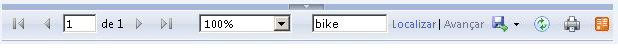

# Habilitar e desabilitar a impress&#227;o do lado do cliente para Reporting Services
  O botão Imprimir na barra de ferramentas do visualizador de relatórios usa o formato PDF (Portable Document Format) para a impressão do lado do cliente de relatórios do [!INCLUDE[ssRSnoversion](../../includes/ssrsnoversion-md.md)] exibidos em um navegador. A nova experiência de impressão remota usa a extensão de renderização de PDF incluída no [!INCLUDE[ssRSnoversion](../../includes/ssrsnoversion-md.md)] para renderizar o relatório no formato PDF. Você pode baixar um formulário .PDF do relatório ou, se você tiver um aplicativo instalado para exibição de arquivos .PDF, o botão de impressão exibirá uma caixa de diálogo de impressão para itens de configuração de página comuns como tamanho e orientação da página, além de uma visualização do arquivo .PDF. Embora a impressão do lado do cliente esteja habilitada por padrão, você pode desabilitar o recurso para impedi-lo de ser usado.  
  
 Versões anteriores do [!INCLUDE[ssRSnoversion](../../includes/ssrsnoversion-md.md)] usavam um controle ActiveX que exigia o download do servidor de relatório para o computador cliente. Se você atualizar seu servidor de relatório para o [!INCLUDE[ssCurrent](../../includes/sscurrent-md.md)], o controle de impressão não será removido do servidor de relatório nem dos computadores cliente.  
  
##  <a name="bkmk_top"></a> Neste tópico  
  
-   [A Experiência de Impressão](#bkmk_clientside_printexpereince)  
  
-   [Solucionar problemas de impressão do lado do cliente](#bkmk_troubleshoot_clientsideprinting)  
  
-   [Habilitar e desabilitar a impressão do lado do cliente](#bkmk_enable)  
  
##  <a name="bkmk_clientside_printexpereince"></a> A Experiência de Impressão  
 Quando você clica no botão Imprimir  na barra de ferramentas do visualizador de relatórios, a experiência varia dependendo de quais aplicativos de visualização de .PDF estão instalados no computador cliente e de qual navegador está sendo usado.   Você pode baixar o arquivo PDF ou configurar as opções de impressão de uma caixa de diálogo, ou mesmo fazer ambos, dependendo do computador cliente.  
  
   
  
|||  
|-|-|  
|A primeira caixa de diálogo é igual para todos os navegadores e permite que você altere as propriedades de layout básico como a orientação. Quando você clica em **Imprimir**, a experiência será um pouco diferente dependendo do navegador utilizado.||  
|No Chrome, uma caixa de diálogo de impressão detalhada do navegador se abre.   Você pode alterar as configurações de impressão, imprimir e abrir a caixa de diálogo de impressão do sistema operacional.| |  
|Se você tiver um aplicativo de leitor PDF instalado, o botão de impressão abrirá uma janela de visualização do arquivo PDF e você poderá salvar ou imprimir.||  
|Se você não tiver um aplicativo de leitor PDF instalado, há duas experiências do usuário:<br /><br /> O relatório será renderizado automaticamente e usará o processo de download do seu navegador para baixar o arquivo PDF.   **Observação:** quanto mais complicado o relatório for, maior será o tempo de atraso entre a hora em que você clicar em **Imprimir** e o momento em que você visualizar a notificação de download do seu navegador. Você também pode forçar o download novamente clicando em **Clique aqui para exibir o PDF do seu relatório**.<br /><br /> Force o download do PDF clicando em **Clique aqui para exibir o PDF do seu relatório**.||  
  
##  <a name="bkmk_troubleshoot_clientsideprinting"></a> Solucionar problemas de impressão do lado do cliente  
 Se o botão de impressão da barra de ferramentas do visualizador de relatórios estiver desabilitado, verifique o seguinte:  
  
-   A impressão do lado do cliente está desabilitada para o servidor de relatório no [!INCLUDE[ssManStudio](../../includes/ssmanstudio-md.md)]. Consulte a seção [Habilitar e desabilitar a impressão do lado do cliente](#bkmk_enable) neste tópico.  
  
-   A extensão de renderização de PDF do [!INCLUDE[ssRSCurrent](../../includes/ssrscurrent-md.md)] está desabilitada. Examine a seção `<Extension Name="PDF"` do arquivo **rsreportserver.config**.  
  
-   Você está exibindo o relatório no modo de comparação, que usa o antigo mecanismo de renderização HTML4 do [!INCLUDE[ssRSCurrent](../../includes/ssrscurrent-md.md)]. A experiência de impressão de PDF requer o mecanismo de renderização HTML 5.  Clique no botão **Experimentar Visualização** na barra de ferramentas.  
  
       
  
##  <a name="bkmk_enable"></a> Habilitar e desabilitar a impressão do lado do cliente  
 Os administradores do servidor de relatório têm a opção de desabilitar o recurso de impressão remota, definindo a propriedade do sistema do servidor de relatório **EnableClientPrinting** como **false**. Isso desabilitará a impressão do lado do cliente para todos os relatórios gerenciados por esse servidor. Por padrão, **EnableClientPrinting** está definido como **true**. Você pode desabilitar a impressão do lado do cliente das seguintes formas:  
  
-   Para um **Servidor de relatório no modo nativo**:  
  
    1.  Inicie o [!INCLUDE[ssManStudio](../../includes/ssmanstudio-md.md)] com privilégios administrativos.  
  
    2.  Conecte-se a uma instância do servidor de relatório no [!INCLUDE[ssManStudio](../../includes/ssmanstudio-md.md)].  
  
    3.  Clique com o botão direito do mouse no nó do servidor de relatório e clique em **Propriedades**. Se a opção **Propriedades** estiver desabilitada, verifique se você iniciou o [!INCLUDE[ssManStudio](../../includes/ssmanstudio-md.md)] com privilégios administrativos.  
  
    4.  Clique em **Avançado**.  
  
    5.  Selecione **EnableClientPrinting**.  
  
    6.  Defina como True ou False e clique em **OK**.  
  
           
  
-   Para um **servidor de relatório no modo do SharePoint**:  
  
    1.  Na Administração Central do SharePoint, clique em **Gerenciamento de Aplicativos**.  
  
    2.  Clique em **Gerenciar aplicativos de serviço**.  
  
    3.  Clique no nome do aplicativo de serviço do [!INCLUDE[ssRSnoversion](../../includes/ssrsnoversion-md.md)] e clique em **Gerenciar** na faixa de opções do SharePoint.  
  
    4.  Clique em **Configurações do Sistema**.  
  
    5.  Selecione **Habilitar Impressão de Cliente**. A opção **Habilitar Impressão de Cliente** está próxima à parte inferior da página.  
  
    6.  Clique em **OK**.  
  
-   Escreva um script ou código para definir a propriedade do sistema do servidor de relatório **EnableClientPrinting** como **false**.  
  
 O exemplo de script a seguir ilustra uma abordagem para desabilitar a impressão do lado do cliente. Compile e execute o seguinte código [!INCLUDE[msCoName](../../includes/msconame-md.md)] [!INCLUDE[vbprvb](../../includes/vbprvb-md.md)] para definir a propriedade **EnableClientPrinting** como **False**. Depois de executar o código, reinicialize o IIS.  
  
### Exemplo de Script  
  
```  
Imports System  
Imports System.Web.Services.Protocols  
Class Sample  
   Public Shared Sub Main()  
Dim rs As New ReportingService()  
      rs.Credentials = System.Net.CredentialCache.DefaultCredentials  
        Dim props(0) As [Property]  
        Dim setProp As New [Property]  
        setProp.Name = "EnableClientPrinting"  
        setProp.Value = “False”   
        props(0) = setProp  
        Try  
            rs.SetSystemProperties(props)  
        Catch ex As System.Web.Services.Protocols.SoapException  
            Console.Write(ex.Detail.InnerXml)  
        Catch e as Exception  
            Console.Write(e.Message)  
        End Try  
    End Sub 'Main  
End Class 'Sample  
```  
  
  