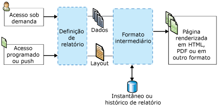

# Conceitos do Reporting Services (SSRS)
  Este tópico fornece um resumo breve de conceitos do [!INCLUDE[ssNoVersion](../includes/ssnoversion-md.md)] [!INCLUDE[ssRSnoversion](../includes/ssrsnoversion-md.md)] .  
  
 **[!INCLUDE[applies](../includes/applies-md.md)]**  [!INCLUDE[ssRSnoversion](../includes/ssrsnoversion-md.md)] | Modo do SharePoint do [!INCLUDE[ssRSnoversion](../includes/ssrsnoversion-md.md)]    
  
##   Conceitos do servidor de relatório  
 Um servidor de relatório é um computador que tem uma instância do [!INCLUDE[ssRSnoversion](../includes/ssrsnoversion-md.md)] instalada. Um servidor de relatório armazena internamente itens como relatórios móveis e paginados, itens e recursos relacionados a relatórios, agendas e assinaturas. Um servidor de relatório pode ser configurado como um único servidor autônomo ou como um farm em expansão ou pode ser integrado ao Servidor do SharePoint. Você interage com itens do servidor de relatório por meio do serviço Web do [!INCLUDE[ssRSnoversion](../includes/ssrsnoversion-md.md)] , do provedor WMI, de acesso à URL ou programaticamente por meio de scripts. A maneira como você interage com um servidor de relatório depende da topologia de implantação e da configuração.  
  
### Servidores de relatório no modo nativo
 Um servidor de relatório configurado em modo nativo é um computador que tem o [!INCLUDE[ssNoVersion](../includes/ssnoversion-md.md)] [!INCLUDE[ssRSnoversion](../includes/ssrsnoversion-md.md)] instalado e configurado como um servidor autônomo. Você interage com o servidor de relatório, relatórios e itens relacionados a relatórios por meio de um navegador com o [!INCLUDE[ssRSWebPortal](../includes/ssrswebportal.md)] ou comandos de acesso à URL, do SQL Server Management Studio ou programaticamente por meio de scripts. Para obter mais informações, consulte [Servidor de relatório do Reporting Services &#40;Modo Nativo&#41;](../reporting-services/report-server/reporting-services-report-server-native-mode.md).  
  
### Servidores de relatório no modo do SharePoint  
 Um servidor de relatório integrado com o SharePoint tem duas possíveis configurações. No [!INCLUDE[ssRSCurrent](../includes/ssrscurrent-md.md)], o [!INCLUDE[ssRSnoversion](../includes/ssrsnoversion-md.md)] é instalado com o SharePoint Server como um serviço compartilhado do SharePoint. Em versões anteriores, o servidor de relatório integra-se com o SharePoint Server por meio da instalação do Suplemento do SharePoint do [!INCLUDE[ssRSnoversion](../includes/ssrsnoversion-md.md)] . Nos dois casos, você interage com o servidor de relatório, relatórios e itens relacionados a relatórios por meio de páginas do aplicativo no site do SharePoint. Você usa a biblioteca de documentos do SharePoint e outras bibliotecas que você cria para armazenar os tipos de conteúdo relacionadas a relatórios. Para obter mais informações, veja [Servidor de relatório do Reporting Services &#40;Modo do SharePoint&#41;](../reporting-services/report-server-sharepoint/reporting-services-report-server-sharepoint-mode.md).  
  
### Itens de servidor de relatório 
 Os itens de servidor de relatório incluem relatórios móveis e paginados, KPIs, fontes de dados compartilhadas, conjuntos de dados compartilhados e outros itens que você pode publicar, carregar ou salvar em um servidor de relatório. Organize os itens na estrutura hierárquica de pastas do servidor de relatório em um servidor de relatório nativo ou em bibliotecas de conteúdo do SharePoint em um site do SharePoint. Para obter mais informações, consulte [Gerenciamento de conteúdo do Servidor de Relatório &#40;modo nativo do SSRS&#41;](../reporting-services/report-server/report-server-content-management-ssrs-native-mode.md).  
  
### Pastas
 Em um servidor de relatório nativo, as pastas fornecem a estrutura de navegação hierárquica e o caminho de todos os itens endereçáveis armazenados em um servidor de relatório. Você usa a hierarquia de pastas e as permissões de site e de pastas para ajudar a controlar o acesso a itens de servidor de relatório, conhecido como *segurança em nível de item*. Por padrão, as atribuições de função que você define para pastas específicas são herdadas por pastas filho na hierarquia de pastas. Se você atribuir funções específicas a uma pasta, as regras de herança não serão mais aplicadas. A estrutura de pastas consiste em um nó raiz denominado **Página Inicial**e em pastas reservadas que dão suporte ao recurso opcional **Meus Relatórios** . Em um navegador, o nó raiz é o nome do diretório virtual do servidor de relatório; por exemplo, `http://myreportserver/reports`. Para obter mais informações, consulte [Folders](../reporting-services/report-server/report-server-content-management-ssrs-native-mode.md#bkmk_Folders).  
  
 Em um site do SharePoint, use pastas do SharePoint em bibliotecas de documentos e bibliotecas de conteúdo organizar os itens.  
  
### Funções e permissões
 Em um servidor de relatório nativo, o administrador do sistema do servidor de relatório gerencia as permissões de acesso, configura o servidor de relatório para processar solicitações de relatório, mantém históricos de instantâneos e gerencia permissões para relatórios, fontes de dados, conjuntos de dados e assinaturas. Por exemplo, um relatório publicado é protegido por meio de atribuições de função com o uso do modelo de segurança baseado em funções do [!INCLUDE[ssRSnoversion](../includes/ssrsnoversion-md.md)] . Para obter mais informações, consulte [Funções e permissões &#40;Reporting Services&#41;](../reporting-services/security/roles-and-permissions-reporting-services.md).  
  
 Em um site do SharePoint, use a página de administradores de site do SharePoint para gerenciar permissões de acesso em relatórios e conteúdo de site relacionado a relatórios.  
  
### Agendamentos
 Em um servidor de relatório nativo, você pode agendar relatórios paginados, conjuntos de dados compartilhados e assinaturas para recuperar dados e entregar relatórios e consultas de conjuntos de dados em horários específicos ou fora dos horários de pico. As agendas podem ser executadas uma vez ou continuamente em intervalos de horas, dias, semanas ou meses. Para obter mais informações, consulte [Schedules](../reporting-services/subscriptions/schedules.md).  
  
### Assinaturas e entrega  
 Uma assinatura é uma solicitação para o fornecimento de um relatório em um horário determinado em resposta a um evento, em formato de arquivo do aplicativo especificado na assinatura. As assinaturas são uma alternativa à execução de um relatório sob demanda. Um relatório sob demanda exige que você selecione ativamente o relatório sempre que quiser exibi-lo. Em contraste, as assinaturas podem ser usadas para agendar e automatizar a entrega de um relatório. Você pode entregar relatórios em uma caixa de entrada de email ou em um compartilhamento de arquivos. Para obter mais informações, consulte [Assinaturas e entrega &#40;Reporting Services&#41;](../reporting-services/subscriptions/subscriptions-and-delivery-reporting-services.md).  
  
### Extensões
 [!INCLUDE[ssNoVersion](../includes/ssnoversion-md.md)] [!INCLUDE[ssRSnoversion](../includes/ssrsnoversion-md.md)] fornece uma arquitetura extensível que você pode usar para personalizar soluções de relatório. O servidor de relatório dá suporte aos seguintes tipos de extensões: autenticação personalizada, processamento de dados, processamento de relatórios, renderização e entrega, e as extensões que estão disponíveis para os usuários são configuráveis no arquivo de configuração RSReportServer.config. Por exemplo, você pode limitar os formatos de exportação que o visualizador de relatório tem permissão para usar. As extensões de entrega e de processamento de relatório são opcionais, mas necessárias se você desejar dar suporte aos controles de distribuição e personalização. Para obter mais informações, consulte [Extensões do Reporting Services&#40;SSRS&#41;](../reporting-services/extensions-ssrs.md).  
  
### Acesso a relatórios 
 O acesso sob demanda permite que os usuários selecionem os relatórios a partir de uma ferramenta de visualização de relatório. Dependendo da configuração do servidor de relatório, você poderá usar o [!INCLUDE[ssRSWebPortal](../includes/ssrswebportal.md)], uma Web Part do [!INCLUDE[msCoName](../includes/msconame-md.md)] SharePoint 2.0, uma biblioteca do SharePoint quando o [!INCLUDE[ssRSnoversion](../includes/ssrsnoversion-md.md)] estiver instalado no modo integrado do SharePoint, um controle ReportViewer inserido ou um navegador com o uso de acesso de URL. Para obter mais informações sobre o acesso sob demanda aos relatórios, consulte [Localizando, exibindo e gerenciando relatórios &#40;Construtor de Relatórios e SSRS&#41;](../reporting-services/report-builder/finding-viewing-and-managing-reports-report-builder-and-ssrs.md).  
  
 As assinaturas são uma alternativa à execução de um relatório sob demanda. Para obter mais informações, consulte [Assinaturas e entrega &#40;Reporting Services&#41;](../reporting-services/subscriptions/subscriptions-and-delivery-reporting-services.md).  
  
 Para obter a lista de ferramentas a serem usadas para interagir com o servidor de relatório, consulte [Ferramentas do Reporting Services](../reporting-services/tools/reporting-services-tools.md).  
  
  
##   Conceitos de relatórios e itens relacionados  
### Relatórios e definições de relatórios

 **RDL** 
 
 Uma definição de relatório é um arquivo XML em conformidade com uma gramática XML chamada linguagem RDL. No [!INCLUDE[ssRSnoversion](../includes/ssrsnoversion-md.md)], você cria uma definição de relatório em uma ferramenta, como o Construtor de Relatórios ou o Designer de Relatórios. A definição inclui elementos que definem as conexões de fontes de dados, as consultas usadas para recuperar dados, as expressões, os parâmetros, as imagens, as caixas de texto, as tabelas e qualquer outro layout de tempo de design. Para obter mais informações, consulte [Linguagem RDL &#40;SSRS&#41;](../reporting-services/reports/report-definition-language-ssrs.md).  
  
 **RSMOBILE**

Você pode criar relatórios móveis do Reporting Services (arquivos .rsmobile) no SQL Server Mobile Report Publisher. Eles são otimizados para dispositivos móveis e conectados a dados locais, com uma variedade de visualizações de dados. Leia mais sobre [relatórios móveis do Reporting Services](../reporting-services/mobile-reports/create-mobile-reports-with-sql-server-mobile-report-publisher.md). 
  
 **RDLC** 
 
 O Designer de Relatórios do Visual Studio produz arquivos de definição de relatório de cliente (.rdlc) em formato XML a serem usados com o controle ReportViewer.  
  
### Conexões de dados de relatórios e fontes de dados 
 Os relatórios usam conexões de dados para recuperar dados de um relatório quando uma consulta é executada ou o relatório é processado. Em uma definição de relatório, uma conexão de dados é igual a uma fonte de dados. Você escolhe em uma lista de tipos de conexões de dados internos a serem conectados a um banco de dados relacional, a um banco de dados multidimensional, a um serviço Web ou a alguma outra fonte de dados. Os termos a seguir são usados para descrever conexões de dados.  
  
-   **Conexão de dados.** Também conhecida como uma *fonte de dados*. Uma conexão de dados inclui um nome e propriedades de conexão que dependem do tipo de conexão. Por design, uma conexão de dados não inclui credenciais. Uma conexão de dados não especifica os dados a serem recuperados da fonte de dados externa. Para fazer isso, especifique uma consulta ao criar um conjunto de dados.  
  
-   **Definição da fonte de dados.** Um arquivo que contém a representação XML de uma fonte de dados de relatório. Quando um relatório é publicado, suas fontes de dados são salvas no servidor de relatório ou no site do SharePoint como definições de fonte de dados, independentemente da definição de relatório. Por exemplo, um administrador de servidor de relatório poderia atualizar a cadeia de conexão ou credenciais. Em um servidor de relatório nativo, o tipo de arquivo é .rds. Em um site do SharePoint, o tipo de arquivo é .rsds.  
  
-   **Cadeia de conexão.** Uma cadeia de conexão é uma versão de cadeia de caracteres das propriedades de conexão necessárias à conexão a uma fonte de dados. As propriedades de conexão variam com base no tipo de conexão de dados.  
  
-   **Fonte de dados compartilhada.** Uma fonte de dados disponível em um servidor de relatório ou site do SharePoint a ser usada por vários relatórios.  
  
     As fontes de dados compartilhadas são úteis quando você usa fontes de dados frequentemente. É recomendado usar fontes de dados compartilhadas o máximo possível. Elas facilitam o acesso e o gerenciamento dos relatórios, além de ajudar a proteger os relatórios e as fontes de dados acessados. Se precisar de uma fonte de dados compartilhada, peça ao administrador do sistema para criar uma para você.  
  
     No Construtor de Relatórios, não é possível criar uma fonte de dados compartilhada. Você pode navegar do servidor de relatório até uma fonte de dados compartilhada e selecioná-la.  
  
     No Designer de Relatórios, não é possível navegar até uma fonte de dados compartilhada no servidor de relatório. No Gerenciador de Soluções, você pode criar fontes de dados compartilhados como parte de um projeto e decidir se deve implantá-las em um servidor de relatório. Talvez você opte por usá-las localmente apenas por causa das diferenças em credenciais exigidas pelo seu computador ou pelo servidor de relatório.  
  
-   **Fonte de dados inserida** Também conhecida como uma *fonte de dados específica ao relatório*, uma fonte de dados inserida é definida em um relatório e usada apenas por aquele relatório.  
  
     Uma fonte de dados inserida é uma conexão de dados salva na definição de relatório. As informações de conexão de fonte de dados inserida só podem ser usadas pelo relatório no qual a fonte de dados está inserida.  
  
-   **Credenciais.** Credenciais são as informações de autenticação a serem fornecidas para permitir que você acesse dados externos.  
  
     As credenciais são usadas para criar uma fonte de dados inserida, para executar uma consulta ou para recuperar dados durante o processamento de relatórios. O proprietário da fonte de dados determina o tipo de credenciais que você deve usar para acessar os dados. As credenciais são gerenciadas independentemente da conexão de dados em um servidor de relatório, em um site do SharePoint ou em um computador local em um ambiente de criação de relatório. Dependendo do tipo de fonte de dados, as credenciais podem ser salvas para evitar a solicitação ou podem ser definidas para solicitar o acesso de cada usuário. As credenciais de que você precisa variam de acordo com a origem da conexão à fonte de dados: do computador ou do servidor de relatório. Para obter mais informações, consulte [Especificar as credenciais no Construtor de Relatórios](http://msdn.microsoft.com/library/7412ce68-aece-41c0-8c37-76a0e54b6b53).  
  
### Conjuntos de dados de relatório 
 Em um relatório, um conjunto de dados representa dados de relatório retornados em virtude da execução de um consulta em uma fonte de dados externa. O conjunto de dados depende da conexão de dados que contém informações sobre a fonte de dados externa. Os dados em si não são incluídos na definição de relatório. O conjunto de dados contém um comando de consulta, uma coleção de campos, parâmetros, filtros e opções de dados que incluem diferenciação de maiúsculas e minúsculas e agrupamento. Existem dois tipos de conjuntos de dados:  
  
-   **Conjuntos de dados compartilhados.** Um conjunto de dados compartilhado é publicado em um servidor de relatório e pode ser usado por vários relatórios. Um conjunto de dados compartilhado deve ser baseado em uma fonte de dados compartilhada. Um conjunto de dados compartilhado pode ser armazenado em cache e programado, criando um plano de atualização do cache.  
  
-   **Conjuntos de dados inseridos.** Os conjuntos de dados inseridos são definidos e usados por um único relatório.  
  
 Para obter mais informações, consulte [Conjuntos de dados inseridos e compartilhados de relatório &#40;Construtor de Relatórios e SSRS&#41;](../reporting-services/report-data/report-embedded-datasets-and-shared-datasets-report-builder-and-ssrs.md).  
  
### Parâmetros de relatório 
 Parâmetros de relatório são uma parte de uma definição de relatório. Você pode adicionar parâmetros a relatórios móveis e paginados do Reporting Services para vincular relatórios relacionados, controlar a aparência do relatório, filtrar dados de relatórios ou restringir o escopo de um relatório a usuários ou locais específicos. Quando um relatório paginado é publicado em um servidor de relatório nativo ou em um site do SharePoint, os parâmetros do relatório são salvos como um item de servidor de relatório separado. Os parâmetros podem ser gerenciados independentemente da definição do relatório. Para criar vários conjuntos de parâmetros para o mesmo relatório, crie *relatórios vinculados*.  
  
### Itens de relatório 
 Um item de relatório é um conceito interno básico em uma definição de relatório paginado do Reporting Services. As propriedades de um item de relatório se aplicam a regiões de dados, mapas, caixas de texto, imagens e outros elementos de design que você adiciona a um relatório. A compreensão das propriedades de um item de relatório pode ajudar a criar conteúdo e aparência personalizados para o relatório. Por exemplo, todos os itens do relatório têm uma propriedade Hidden para controlar a visibilidade.  
  
### Regiões de dados e mapas 
 Uma região de dados é um elemento do layout que exibe dados de um único conjunto de dados em um relatório paginado do Reporting Services. Os tipos de região de dados incluem tablix, gráfico, medidor e indicador. Mapa é um tipo especial de região de dados porque ele pode exibir dados de dois conjuntos de dados: um que contém dados espaciais e um que contenha dados analíticos.  
  
 Use regiões de dados para habilitar visualizações de dados comuns: números e texto em uma tabela, matriz ou lista; exibições gráficas em um gráfico ou medidor; e exibições geográficas de um mapa. Tabelas, matrizes e listas se baseiam na região de dados tablix, que se expande conforme o necessário para exibir todos os dados do conjunto de dados. Uma região de dados tablix oferece suporte a vários grupos de linhas e colunas e a linhas, bem como colunas estáticas e dinâmicas. Um gráfico exibe vários grupos de categorias e séries em diversos formatos de gráfico. Um medidor exibe um único valor ou um valor agregado para um conjunto de dados. Um mapa exibe dados espaciais como elementos do mapa cuja aparência pode variar com base nos dados agregados de um conjunto de dados.  
  
-   **Tabela.** Uma tabela é uma região de dados que apresenta dados linha a linha. Colunas da tabela são estáticas: você determina o número de colunas quando você cria seu relatório. Linhas da tabela são dinâmicas: elas se expandem para baixo para acomodar os dados. Você pode adicionar grupos às tabelas, organizando os dados selecionados por campos ou expressões. Para obter mais informações, consulte [Tabelas, matrizes e listas (Construtor de Relatórios e SSRS)](http://msdn.microsoft.com/9dcf3fc8-bf9c-4a14-a03d-e78254aa4098).  
  
-   **Matriz.** Uma matriz também é conhecida como uma tabela de referência cruzada. Uma região de dados de matriz contém as colunas e linhas dinâmicas: elas se expandem para acomodar os dados. As colunas e as linhas de uma matriz podem ser dinâmicas ou estáticas. As colunas ou as linhas podem conter outras colunas ou linhas e podem ser usadas para agrupar dados. Para obter mais informações, consulte [Tabelas, matrizes e listas (Construtor de Relatórios e SSRS)](http://msdn.microsoft.com/9dcf3fc8-bf9c-4a14-a03d-e78254aa4098).  
  
-   **Lista.** Uma lista é uma região de dados que apresenta dados organizados de uma forma livre. Você pode organizar os itens de relatório para criar um formulário com caixas de texto, imagens e outras regiões de dados posicionadas em qualquer local dentro da lista. Para obter mais informações, consulte [Tabelas, matrizes e listas (Construtor de Relatórios e SSRS)](http://msdn.microsoft.com/9dcf3fc8-bf9c-4a14-a03d-e78254aa4098).  
  
-   **Gráfico.** Um gráfico apresenta os dados de maneira gráfica. Os exemplos de gráficos incluem barra, pizza e gráficos de linhas, mas muitos outros estilos podem ser considerados. Para obter mais informações, consulte [Gráficos &#40;Construtor de Relatórios e SSRS&#41;](../reporting-services/report-design/charts-report-builder-and-ssrs.md).  
  
-   **Medidor.** Um medidor apresenta os dados como um intervalo com um indicador apontando para um valor específico dentro do intervalo. Os indicadores são usados para exibir KPIs (indicadores chave de desempenho) e outras métricas. Os exemplos de medidores incluem linear e circular. Para obter mais informações, consulte [Medidores &#40;Construtor de Relatórios e SSRS&#41;](../reporting-services/report-design/gauges-report-builder-and-ssrs.md).  
  
-   **Mapa.** Um mapa permite a você apresentar dados em relação a um plano de fundo geográfico. Dados de mapa podem ser dados espaciais de uma consulta [!INCLUDE[ssNoVersion](../includes/ssnoversion-md.md)] , um arquivo de forma ESRI ou peças de mapa do Bing [!INCLUDE[msCoName](../includes/msconame-md.md)] . Os dados espaciais consistem em conjuntos de coordenadas que definem polígonos que representam formas ou áreas, linhas que representam rotas ou caminhos e pontos representados por marcadores. Você pode associar dados de agregação a elementos do mapa para variar a cor e o tamanho deles automaticamente. Por exemplo, você pode variar o tipo de marcador de uma loja com base na quantidade de vendas ou na cor de uma estrada com base no limite de velocidade. Para obter mais informações, consulte [Mapas &#40;Construtor de Relatórios e SSRS&#41;](../reporting-services/report-design/maps-report-builder-and-ssrs.md).  
  
 Você também pode incluir valores de conjuntos de dados que não são vinculados à região de dados das seguintes maneiras:  
  
-   Expressões que incluem chamadas a funções de agregação que especificam um conjunto de dados diferente como o parâmetro de escopo, por exemplo, `=Max(Fields!Sales.Value, "AnnualSales")`.  
  
-   Use a função **Lookup** para pesquisar valores de pares de nome/valor em um conjunto de dados diferente.  
  
### Partes de relatório
 Uma definição de parte de relatório (.rsc) é um item de servidor de relatório que é um fragmento XML de um arquivo de definição de relatório. Para criar partes de relatório, crie uma definição de relatório e depois selecione itens de relatório no relatório para publicar separadamente como partes de relatório. Partes de relatório incluem regiões de dados, retângulos, além dos itens e imagens contidos neles. Você pode salvar uma parte de relatório com conjuntos de dados dependentes e referências à fonte de dados compartilhada para que ela seja reutilizada em outros relatórios. Para obter mais informações, consulte [Partes de relatório no Designer de Relatórios &#40;SSRS&#41;](../reporting-services/report-design/report-parts-in-report-designer-ssrs.md).  
  
### Alertas de dados 
 Um alerta de dados é um item armazenado interiormente em um banco de dados de alerta. Uma definição de alerta de dados inclui quais dados usar de feeds de dados de relatório existentes, as condições a serem atendidas, uma agenda e os destinatários do alerta. Os alertas de dados estão disponíveis apenas em relatórios publicados em um servidor de relatório integrado com o SharePoint Server. Os alertas de dados não estão disponíveis em uma instalação de servidor de relatório nativo. Para obter mais informações, consulte [Reporting Services Data Alerts](../reporting-services/reporting-services-data-alerts.md)[Alertas de dados do Reporting Services].  
  
  
##   Tipos de relatórios paginados do Reporting Services  
 No [!INCLUDE[ssRSnoversion](../includes/ssrsnoversion-md.md)], o termo *relatório* pode se aplicar a um tipo específico de item de servidor de relatório, a um design de layout ou a um design de solução. Um único relatório paginado do Reporting Services pode ter características de mais de um tipo; por exemplo, um relatório pode ser, ao mesmo tempo, um relatório autônomo, um sub-relatório referenciado por um relatório principal, o destino de um relatório detalhado em um relatório principal diferente e um relatório vinculado.  
  
### Relatórios detalhados 
 Um relatório de detalhamento é um design de layout que em princípio oculta a complexidade e permite que o usuário alterne itens de relatório ocultos condicionalmente para controlar quantos dados detalhados ele deseja ver. Os relatórios detalhados devem recuperar todos os dados possíveis que podem ser mostrados no relatório. Para relatórios que usam grandes quantidades de dados, considere os relatórios detalhados. Para obter mais informações, consulte [Ação de análise detalhada &#40;Construtor de Relatórios e SSRS&#41;](../reporting-services/report-design/drilldown-action-report-builder-and-ssrs.md).  
  
### Sub-relatórios
 Um sub-relatório é um item de relatório que você adiciona a um relatório como um elemento de layout. Um sub-relatório aponta para um relatório diferente e é exibido dentro do corpo de um relatório principal como uma instância de sub-relatório. O sub-relatório pode usar fontes de dados diferentes das do relatório principal. Embora um sub-relatório possa ser repetido em de regiões de dados com o uso de um parâmetro para filtrar dados em cada instância do sub-relatório, geralmente, os sub-relatórios são usados com um relatório principal ou como um manual de síntese ou um contêiner para uma coleção de relatórios relacionados. Cada instância de um sub-relatório alterna contexto para processamento de relatório entre o relatório principal e o sub-relatório. Para relatórios que usam muitas instâncias de sub-relatórios, considere o uso de relatórios detalhados. Para obter mais informações, consulte [Sub-relatórios &#40;Construtor de Relatórios e SSRS&#41;](../reporting-services/report-design/subreports-report-builder-and-ssrs.md).  
  
 ### Relatórios principais/de detalhes e relatórios detalhados
 Uma solução de relatório principal/de detalhe inclui um relatório principal que exibe informações resumidas com hiperlinks para um ou mais relatórios que exibem informações detalhadas.  O relatório de detalhe será executado apenas se um leitor de relatório clicar em um link para ele. O relatório detalhado é aberto separadamente do relatório principal. Um hiperlink pode ser definido em qualquer item de relatório que tenha uma propriedade Action, por exemplo, caixa de texto, texto do espaço reservado ou série de gráficos. Para obter mais informações, consulte [Relatórios de detalhamento &#40;Construtor de Relatórios e SSRS&#41;](../reporting-services/report-design/drillthrough-reports-report-builder-and-ssrs.md).  
  
### relatórios vinculados 
 Um relatório vinculado é um item de servidor de relatório que contém um ponteiro para a definição do relatório, mas tem seu próprio conjunto de propriedades e configurações de relatório. Isso inclui segurança, parâmetros, local, assinaturas e agendas. Como os parâmetros são gerenciados independentemente no servidor, a republicação de um relatório principal, que usa novas configurações de parâmetros, não substituirá as configurações dos parâmetros existentes para o relatório principal ou para o relatório vinculado.  
  
 Para obter mais informações, consulte [Criar um relatório vinculado](../reporting-services/reports/create-a-linked-report.md).  
  
### Relatórios históricos
 O histórico de relatórios é uma coleção de instantâneos de relatório. É possível usar o histórico de relatórios para manter ao longo do tempo um registro de um relatório. Um histórico de relatórios não se destina a relatórios que contenham dados confidenciais ou pessoais. Por esse motivo, o histórico de relatório pode incluir apenas os relatórios que consultam uma fonte de dados por meio de um único conjunto de credenciais. Como alternativa, você pode criar um histórico de um relatório com a definição de uma agenda e assinatura para entregar o relatório em um formato de arquivo exportado para um compartilhamento de arquivos. Para obter mais informações, consulte [Desempenho, instantâneos, caching &#40;Reporting Services&#41;](../reporting-services/report-server/performance-snapshots-caching-reporting-services.md).  
  
### Relatórios armazenados em cache 
 Um relatório armazenado em cache é uma cópia salva de um relatório compilado e dos dados do relatório. Os relatórios armazenados em cache são usados para melhorar o desempenho com a redução do número de solicitações de processamento feitas ao processador de relatório e com a redução do tempo necessário para recuperar grandes conjuntos de dados de relatórios. Eles têm um período de expiração obrigatório, normalmente em minutos. Para obter mais informações sobre como usar relatórios armazenados em cache, consulte [Armazenando relatórios em cache &#40;SSRS&#41;](../reporting-services/report-server/caching-reports-ssrs.md).  
  
 Você também pode armazenar em cache os resultados de consulta de conjunto de dados compartilhados. Para obter mais informações, consulte [Armazenar conjuntos de dados compartilhados em cache &#40;SSRS&#41;](../reporting-services/report-server/cache-shared-datasets-ssrs.md).  
  
### Instantâneos
 Um instantâneo de relatório é um relatório que contém informações sobre layout e resultados de consulta que foram recuperados em um momento determinado. Ao contrário de relatórios sob demanda, que obtêm resultados de consulta atualizados quando você exibe o relatório, o servidor de relatório recupera o relatório compilado e os dados do relatório que eram atuais no momento em que o instantâneo foi criado. Os instantâneos de relatório não são salvos em um formato de renderização específico. Em vez disso, os instantâneos de relatório são renderizados em um formato de exibição final (como HTML) somente quando solicitado por um usuário ou aplicativo. Para obter mais informações, consulte [Desempenho, instantâneos, caching &#40;Reporting Services&#41;](../reporting-services/report-server/performance-snapshots-caching-reporting-services.md).  
   
### Relatórios salvos  
 Um relatório paginado salvo é um arquivo de definição de relatório (.rdl). Uma definição de relatório pode ser salva localmente ou carregada em um servidor de relatório. Se você carregar uma definição de relatório em vez de publicá-la, não ocorrerá nenhuma validação de versão ou de expressão. Você não verá erros até que o relatório seja executado. Para saber mais, confira [Salvar e implantar relatórios do Reporting Services](../reporting-services/tools/design-reporting-services-paginated-reports-with-report-designer-ssrs.md#bkmk_SaveandDeploy).  
  
### Relatórios publicados
 Um relatório publicado é um item de servidor de relatório que você publica em um servidor de relatório a partir de uma ferramenta do [!INCLUDE[ssRSnoversion](../includes/ssrsnoversion-md.md)] . Em um servidor de relatório nativo, você publica o relatório em uma pasta para a qual você tem permissões. Em um servidor de relatório do SharePoint, você pode publicar o relatório em uma biblioteca de documentos que é habilitada com tipo de conteúdo de relatório. Para compartilhar o relatório com outros usuários, eles devem ter recebido permissão para exibir o relatório. Para saber mais, confira [Salvar e implantar relatórios do Reporting Services](../reporting-services/tools/design-reporting-services-paginated-reports-with-report-designer-ssrs.md#bkmk_SaveandDeploy).  
  
### Relatórios atualizados
 Um relatório atualizado é uma definição de relatório publicada que é convertida em um esquema mais novo quando um servidor de relatório é atualizado de uma versão do [!INCLUDE[ssRSnoversion](../includes/ssrsnoversion-md.md)] para uma versão posterior. A definição do relatório original é preservada. O relatório é atualizado na memória e compilado, e a versão compilada é salva internamente. Para saber mais, confira [Atualizar relatórios do Reporting Services](../reporting-services/install-windows/upgrade-reports.md).  
  
  
##   Estágios dos relatórios paginados do Reporting Services  
 Uma definição de relatório pode ser criada, publicada ou salva, compilada, processada, armazenada em cache, renderizada, exibida, exportada e salva como histórico. Quando você executa um relatório, o servidor de relatório processa um relatório em três etapas: processamento, processamento de dados e renderização de relatório. O processamento dos dados e do relatório é executado em uma definição de relatório. Os resultados estão em um formato interno intermediário. Os relatórios no formato intermediário são subsequentemente renderizados para um formato de exibição específico. O diagrama a seguir mostra os estágios e os elementos de processamento de relatório.  
  
   
Diagrama de processamento de relatório  
  
### Definição de relatório  
 O arquivo de definição de relatório (.rdl) armazenado em um servidor de relatório. Para obter mais informações, consulte [Linguagem RDL &#40;SSRS&#41;](../reporting-services/reports/report-definition-language-ssrs.md).  
  
### Formato de relatório compilado e de relatório intermediário 
 O relatório que usa expressões avaliadas, parâmetros e propriedades de parâmetros avaliados.  

### Instantâneo ou histórico de relatório
 Um instantâneo é o conjunto de dados do relatório em um momento específico junto com o formato intermediário que contém as informações de layout do relatório. Para obter mais informações, consulte [Desempenho, instantâneos, caching &#40;Reporting Services&#41;](../reporting-services/report-server/performance-snapshots-caching-reporting-services.md).  
  
### Relatório processado  
 Um relatório totalmente processado que contém informações de dados e de layout.  
  
### Relatório renderizado
 Um relatório totalmente processado é enviado a um renderizador de relatório para combinar os dados e o layout em cada página do formato de renderização de destino. As extensões de renderização são personalizáveis e extensíveis. O formato de renderização padrão para relatórios é HTML 4.0. Para obter mais informações, consulte [Layout da página e renderização &#40;Construtor de Relatórios e SSRS&#41;](../reporting-services/report-design/page-layout-and-rendering-report-builder-and-ssrs.md) e [Extensões &#40;SSRS&#41;](../reporting-services/extensions-ssrs.md).  
  
### Relatório exportado
 Um relatório exportado é um relatório totalmente paginável em um formato de arquivo específico. Os formatos de exportação dependem das extensões de renderização instaladas e podem ser personalizados. Por padrão, os formatos de exportação incluem Excel, Word, XML, PDF, TIFF e CSV. Para obter mais informações, consulte [Export Reports &#40;Report Builder and SSRS&#41;](../reporting-services/report-builder/export-reports-report-builder-and-ssrs.md).  
  
  
## Consulte Também  
 [Recursos e tarefas do Reporting Services &#40;SSRS&#41;](../reporting-services/reporting-services-features-and-tasks-ssrs.md)   
 [Referência técnica &#40;SSRS&#41;](../reporting-services/technical-reference-ssrs.md)   
 [Reporting Services &#40;SSRS&#41;](../reporting-services/create-deploy-and-manage-mobile-and-paginated-reports.md)  
  
  
