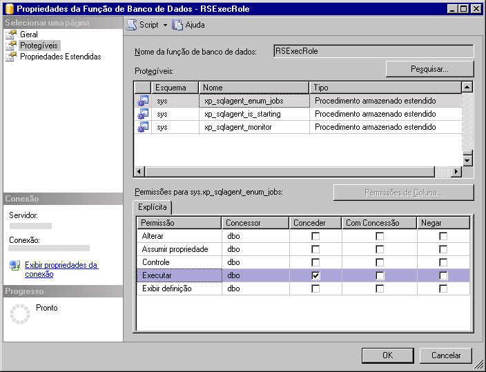

# Criar o RSExecRole

  [!INCLUDE[ssRSnoversion](../../includes/ssrsnoversion-md.md)] usa uma função de banco de dados predefinida chamada **RSExecRole** para conceder permissões de servidor de relatório ao banco de dados de servidor de relatório. A função **RSExecRole** é criada automaticamente com o banco de dados de servidor de relatório. Como regra geral, você nunca deve modificá-la ou atribuir outros usuários à função. No entanto, ao mover um banco de dados de servidor de relatório para um [!INCLUDE[ssNoVersion](../../includes/ssnoversion-md.md)] [!INCLUDE[ssDE](../../includes/ssde-md.md)]novo ou diferente, recrie a função nos bancos de dados Mestre e MSDB do sistema.  
  
 Usando as instruções a seguir, você executará estas etapas:  
  
-   Crie e provisione o **RSExecRole** no banco de dados Mestre do sistema.  
  
-   Crie e provisione o **RSExecRole** no banco de dados MSDB do sistema.  
  
> [!NOTE]  
>  As instruções deste tópico são voltadas para os usuários que não desejam executar um script ou gravar um código WMI para provisionar o banco de dados de servidor de relatório. Se você gerenciar uma grande implantação e mover bancos de dados periodicamente, grave um script para automatizar estas etapas. Para obter mais informações, consulte [Acessar o provedor WMI do Reporting Services](../../reporting-services/tools/access-the-reporting-services-wmi-provider.md).  
  
## Antes de iniciar  
  
-   Faça backup das chaves de criptografia de forma que você possa restaurá-las depois que o banco de dados for movido. Essa etapa não afeta diretamente a possibilidade de criar e provisionar o **RSExecRole**, mas é necessário ter um backup das chaves para verificar seu trabalho. Para saber mais, confira [Back Up and Restore Reporting Services Encryption Keys](../../reporting-services/install-windows/ssrs-encryption-keys-back-up-and-restore-encryption-keys.md).  
  
-   Verifique se você está conectado com uma conta de usuário que tem permissões **sysadmin** na instância do [!INCLUDE[ssNoVersion](../../includes/ssnoversion-md.md)] .  
  
-   Verifique se o serviço do [!INCLUDE[ssNoVersion](../../includes/ssnoversion-md.md)] Agent está instalado e em execução na instância do [!INCLUDE[ssDE](../../includes/ssde-md.md)] que pretende usar.  
  
-   Conecte os bancos de dados reportserver e reportservertempdb. Não é necessário conectar os bancos de dados para criar a função real, mas eles devem ser conectados antes de você testar seu trabalho.  
  
 As instruções para a criação manual do **RSExecRole** devem ser usadas no contexto de migração da instalação de um servidor de relatório. Tarefas importantes como o backup e a movimentação do banco de dados de servidor de relatórios não são descritas neste tópico, mas estão disponíveis na documentação do Mecanismo do Banco de Dados.  
  
## Criar o RSExecRole no Mestre  
 [!INCLUDE[ssRSnoversion](../../includes/ssrsnoversion-md.md)] usa procedimentos armazenados estendidos para que o serviço do [!INCLUDE[ssNoVersion](../../includes/ssnoversion-md.md)] Agent dê suporte a operações agendadas. As etapas a seguir explicam como conceder permissões Executar para os procedimentos da função **RSExecRole** .  
  
#### Para criar o RSExecRole no banco de dados Mestre do sistema usando o Management Studio  
  
1.  Inicie o [!INCLUDE[ssNoVersion](../../includes/ssnoversion-md.md)] [!INCLUDE[ssManStudio](../../includes/ssmanstudio-md.md)] e estabeleça uma conexão com a instância do [!INCLUDE[ssDE](../../includes/ssde-md.md)] que hospeda o banco de dados do servidor de relatório.  
  
2.  Abra **Bancos de Dados**.  
  
3.  Abra **Bancos de Dados do Sistema**.  
  
4.  Abra **Mestre**.  
  
5.  Abra **Segurança**.  
  
6.  Abra **Funções**.  
  
7.  Clique com o botão direito do mouse em **Funções de Banco de Dados**e selecione **Nova Função de Banco de Dados**. A página Geral é exibida.  
  
8.  Em **Nome da função**, digite **RSExecRole**.  
  
9. Em **Proprietário**, digite **DBO**.  
  
10. Clique em **Protegíveis**.  
  
11. Clique em **Pesquisar**. A caixa de diálogo **Adicionar Objetos** é exibida. A opção **Objetos Específicos** é selecionada por padrão.  
  
12. Clique em **OK**. A caixa de diálogo **Selecionar Objetos** é exibida.  
  
13. Clique em **Tipos de Objetos**.  
  
14. Clique em **Procedimentos Armazenados Estendidos**.  
  
15. Clique em **OK**.  
  
16. Clique em **Procurar**.  
  
17. Percorra a lista de procedimentos armazenados estendidos e selecione o seguinte:  
  
    1.  xp_sqlagent_enum_jobs  
  
    2.  xp_sqlagent_is_starting  
  
    3.  xp_sqlagent_notify  
  
18. Clique em **OK**e em **OK** novamente.  
  
19. Na linha **Executar** , na coluna **Conceder** , marque a caixa de seleção e, em seguida, clique em **OK**.  
  
20. Repita essas etapas para cada um dos procedimentos armazenados restantes. O**RSExecRole** deve receber permissões Executar para todos os três procedimentos armazenados.  
  
   
  
## Criar o RSExecRole no MSDB  
 O Reporting Services usa procedimentos armazenados para o serviço do SQL Server Agent e recupera informações de trabalho das tabelas do sistema para suportar as operações agendadas. As etapas a seguir explicam como conceder permissões Executar para os procedimentos e as permissões Selecionar nas tabelas para o RSExecRole.  
  
#### Para criar o RSExecRole no banco de dados MSDB do sistema  
  
1.  Repita etapas semelhantes para conceder permissões a procedimentos armazenados e tabelas no MSDB. Para simplificar as etapas, você provisionará os procedimentos armazenados e as tabelas separadamente.  
  
2.  Abra **MSDB**.  
  
3.  Abra **Segurança**.  
  
4.  Abra **Funções**.  
  
5.  Clique com o botão direito do mouse em **Funções de Banco de Dados**e selecione **Nova Função de Banco de Dados**. A página Geral é exibida.  
  
6.  Em Nome da função, digite **RSExecRole**.  
  
7.  Em Proprietário, digite **DBO**.  
  
8.  Clique em **Protegíveis**.  
  
9. Clique em **Adicionar**. A caixa de diálogo **Adicionar Objetos** é exibida. A opção **Especificar Objetos** é selecionada por padrão.  
  
10. Clique em **OK**.  
  
11. Clique em **Tipos de Objetos**.  
  
12. Clique em **Procedimentos Armazenados**.  
  
13. Clique em **OK**.  
  
14. Clique em **Procurar**.  
  
15. Percorra a lista de itens e selecione o seguinte:  
  
    1.  sp_add_category  
  
    2.  sp_add_job  
  
    3.  sp_add_jobschedule  
  
    4.  sp_add_jobserver  
  
    5.  sp_add_jobstep  
  
    6.  sp_delete_job  
  
    7.  sp_help_category  
  
    8.  sp_help_job  
  
    9. sp_help_jobschedule  
  
    10. sp_verify_job_identifiers  
  
16. Clique em **OK**e em **OK** novamente.  
  
17. Selecione o primeiro procedimento armazenado: sp_add_category.  
  
18. Na linha **Executar** , na coluna **Conceder** , marque a caixa de seleção e, em seguida, clique em **OK**.  
  
19. Repita essas etapas para cada um dos procedimentos armazenados restantes. O RSExecRole deve obter permissões Executar para os dez procedimentos armazenados.  
  
20. Na guia Protegíveis, clique em **Adicionar** novamente. A caixa de diálogo **Adicionar Objetos** é exibida. A opção **Especificar Objetos** é selecionada por padrão.  
  
21. Clique em **OK**.  
  
22. Clique em **Tipos de Objetos**.  
  
23. Clique em **Tabelas**.  
  
24. Clique em **OK**.  
  
25. Clique em **Procurar**.  
  
26. Percorra a lista de itens e selecione o seguinte:  
  
    1.  syscategories  
  
    2.  sysjobs  
  
27. Clique em **OK**e em **OK** novamente.  
  
28. Selecione a primeira tabela: syscategories.  
  
29. Na linha **Selecionar** , na coluna **Conceder** , marque a caixa de seleção e, em seguida, clique em **OK**.  
  
30. Repita para a tabela sysjobs. O RSExecRole deve obter permissões Selecionar para as duas tabelas.  
  
## Mover o banco de dados do servidor de relatório  
 Depois de criar as funções, você pode mover o banco de dados de servidor de relatório para a nova instância do SQL Server. Para obter mais informações, consulte [Movendo os bancos de dados do servidor de relatório para outro computador](../../reporting-services/report-server/moving-the-report-server-databases-to-another-computer-ssrs-native-mode.md).  
  
 Se estiver fazendo upgrade do [!INCLUDE[ssDE](../../includes/ssde-md.md)] para o SQL Server 2016, atualize antes ou depois de mover o banco de dados.  
  
 O banco de dados do servidor de relatório será atualizado automaticamente quando o servidor de relatório se conectar a ele. Não há nenhuma etapa específica necessária para atualizar o banco de dados.  
  
## Restaurar as chaves de criptografia e verificar seu trabalho  
 Se você tiver anexado os bancos de dados de servidor de relatório, execute estas etapas para verificar seu trabalho.  
  
#### Para verificar a operabilidade do servidor de relatório depois de um movimento de banco de dados  
  
1.  Inicie a ferramenta Configuração do Reporting Services e conecte-se ao servidor de relatório.  
  
2.  Clique em **Banco de Dados**.  
  
3.  Clique em **Alterar Banco de Dados**.  
  
4.  Clique em **Escolher um banco de dados existente do servidor de relatório**.  
  
5.  Insira o nome do servidor do Mecanismo de Banco de Dados. Se você anexou os bancos de dados do servidor de relatório a uma instância nomeada, digite o nome da instância neste formato: \<servername>\\<instancename\>.  
  
6.  Clique em **Testar Conexão**.  
  
7.  Clique em **Avançar**.  
  
8.  Em Banco de Dados, selecione o banco de dados de servidor de relatório.  
  
9. Clique em **Avançar** e conclua o assistente.  
  
10. Clique em **Chaves de Criptografia**.  
  
11. Clique em **Restaurar**.  
  
12. Selecione o arquivo forte (.snk) que tem a cópia de backup da chave simétrica usada para descriptografar as credenciais armazenadas e as informações de conexão no banco de dados de servidor de relatório.  
  
13. Insira a senha e clique em **OK**.  
  
14. Clique em **URL do Gerenciador de Relatórios**.  
  
15. Clique no link para abrir o Gerenciador de Relatórios. Você deve ver os itens de servidor de relatório do banco de dados de servidor de relatório.  

## Próximas etapas

[Movendo os bancos de dados do servidor de relatório para outro computador &#40;modo nativo do SSRS&#41;](../../reporting-services/report-server/moving-the-report-server-databases-to-another-computer-ssrs-native-mode.md)   
[Reporting Services Configuration Manager &#40;Modo Nativo&#41;](../../reporting-services/install-windows/reporting-services-configuration-manager-native-mode.md)   
[Criar um banco de dados de servidor de relatório do modo nativo &#40;SSRS Configuration Manager&#41;](../../reporting-services/install-windows/ssrs-report-server-create-a-native-mode-report-server-database.md)   
[Fazer backup e restaurar as chaves de criptografia do Reporting Services](../../reporting-services/install-windows/ssrs-encryption-keys-back-up-and-restore-encryption-keys.md)  

Ainda tem dúvidas? [Experimente perguntar no fórum do Reporting Services](http://go.microsoft.com/fwlink/?LinkId=620231)
