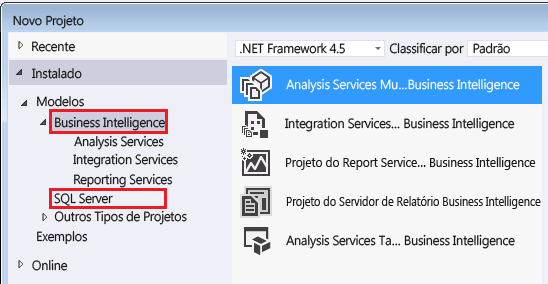

# <a name="reporting-services-in-sql-server-data-tools-ssdt"></a>Reporting Services no SQL Server Data Tools (SSDT)

  [!INCLUDE[ssBIDevStudioFull](../../includes/ssbidevstudiofull-md.md)] é um [!INCLUDE[msCoName](../../includes/msconame-md.md)] [!INCLUDE[vsprvs](../../includes/vsprvs-md.md)] ambiente para criar soluções de business intelligence. O SSDT contém um ambiente de autoria do Designer de Relatórios, em que você pode abrir, modificar, visualizar, salvar e implantar [!INCLUDE[ssRSnoversion_md](../../includes/ssrsnoversion-md.md)] definições de relatório paginados, fontes de dados compartilhados, conjuntos de dados compartilhados e partes de relatório. [!INCLUDE[ssBIDevStudioFull](../../includes/ssbidevstudiofull-md.md)] não é incluído com o SQL Server. Baixar o [SQL Server Data Tools](http://go.microsoft.com/fwlink/?LinkID=616714). 
  
 Este tópico descreve as soluções, os projetos, os modelos de projetos e as configurações do [!INCLUDE[ssBIDevStudio](../../includes/ssbidevstudio-md.md)] usados para o [!INCLUDE[ssRSnoversion](../../includes/ssrsnoversion-md.md)]e as exibições, menus, barras de ferramentas e atalhos que podem ser usados no Designer de Relatórios.  
  
 Para começar a criação de relatórios, consulte [Criar relatórios com o Designer de Relatórios &#40;SSRS&#41;](../../reporting-services/tools/design-reporting-services-paginated-reports-with-report-designer-ssrs.md).  
  
##  <a name="bkmk_SolutionsandProjects"></a> Soluções e projetos  
 Um projeto de relatório atua como um contêiner para recursos e definições de relatório. Cada arquivo no projeto de relatório é publicado no servidor de relatório quando o projeto é implantado. Quando você cria um projeto pela primeira vez, uma solução também é criada como contêiner para o projeto. É possível adicionar vários projetos a uma única solução.  
  
  
##  <a name="bkmk_Configurations"></a> Configurações  
 Para criar vários conjuntos de propriedades de projeto para variações de implantação como teste de empresa e servidores de relatórios de produção, use o Gerenciador de Configuração. Para obter mais informações, veja [Implantação e suporte de versão no SQL Server Data Tools &#40;SSRS&#41;](../../reporting-services/tools/deployment-and-version-support-in-sql-server-data-tools-ssrs.md).  
  
##  <a name="bkmk_ReportServerProjects"></a> Projetos do Servidor de Relatório  
 Ao instalar o [!INCLUDE[ssRSnoversion](../../includes/ssrsnoversion-md.md)], os seguintes modelos de projeto são disponibilizados em [!INCLUDE[ssBIDevStudioFull](../../includes/ssbidevstudiofull-md.md)]:  
  
-   **Projeto do servidor de relatório.** Quando você seleciona um Projeto do Servidor de Relatórios, o Designer de Relatórios é aberto. O Projeto do Servidor de Relatório é um modelo Projetos do Business Intelligence instalado pelo [!INCLUDE[vsprvs](../../includes/vsprvs-md.md)] que está disponível na caixa de diálogo **Novo Projeto** . Para obter mais informações, consulte [Adicionar um relatório novo ou existente a um projeto de relatório &#40;SSRS&#41;](../../reporting-services/tools/add-a-new-or-existing-report-to-a-report-project-ssrs.md). As propriedades de projeto do Servidor de Relatório se aplicam a todos os relatórios e a todas as fontes de dados compartilhadas em um projeto do [!INCLUDE[ssBIDevStudioFull](../../includes/ssbidevstudiofull-md.md)]. Estas propriedades incluem a URL para o servidor de relatórios e os nomes de pastas para relatórios e fontes de dados compartilhadas. Use a caixa de diálogo **Páginas de Propriedades de Projeto** para exibir os valores da propriedade atual. Para abrir essa caixa de diálogo, no menu **Projeto** , clique em **Propriedades**.  
  
-   **Assistente de projeto do servidor de relatório.** Quando você seleciona um Projeto do Assistente do Servidor de Relatórios, um projeto do servidor de relatórios é criado automaticamente e o Assistente de Relatório, aberto. No assistente, você pode criar um relatório seguindo as instruções em cada página para criar uma cadeia de conexão em uma origem de dados, definir credenciais de fonte de dados, criar uma consulta, adicionar uma região de dados de tabela ou matriz, especificar dados e grupos de relatórios, selecionar um estilo de fonte e cor, publicar o relatório em um servidor de relatórios e visualizá-lo localmente. Depois de criar um relatório com o assistente, você pode alterar os dados e o designer de relatórios, usando o Designer de Relatórios no Projeto do Servidor de Relatórios.  
  
   
  
  
##  <a name="bkmk_ReportDesignerWindowsandPanes"></a> Janelas e painéis do Designer de Relatórios  
 O Designer de relatórios dá suporte a dois modos de exibição: **Design** para definir os dados e layout do relatório, e **Visualização** para exibir uma exibição processada do relatório. Em cada exibição, você pode exibir várias janelas úteis para design ou exibição de um relatório renderizado.  
  
###  <a name="bkmk_ReportDataPane"></a> Painel de Dados do Relatório  
 O painel de Dados do Relatório exibe campos internos, fontes de dados, conjuntos de dados, coleções de campos, parâmetros do relatório e imagens.  
  
 Use o painel de Dados do Relatório para exibir:  
  
-   **Campos Internos** Informações predefinidas do relatório, como o nome do relatório ou a hora em que o relatório foi processado.  
  
-   **Fontes de dados** Uma fonte de dados representa um nome e uma conexão a uma fonte de dados.  
  
-   **Conjuntos de Dados** Cada conjunto de dados inclui uma consulta que especifica quais dados recuperar da fonte de dados. Expanda o conjunto de dados para exibir a coleção de campos especificada pela consulta de conjunto de dados.  
  
     Em alguns designers de consulta de conjuntos de dados multidimensionais, você pode especificar filtros no painel Filtros e indicar se deseja criar parâmetros de relatório. Se você especificar a opção de parâmetro de relatório, um conjunto de dados especial será criado automaticamente para popular a lista de valores válidos dos parâmetros.  Por padrão, esses conjuntos de dados não são exibidos no painel de dados do relatório. Para obter mais informações, consulte [Mostrar conjuntos de dados ocultos para obter valores de parâmetros para dados multidimensionais &#40;Construtor de Relatórios e SSRS&#41;](../../reporting-services/report-data/show-hidden-datasets-for-parameter-values-multidimensional-data.md).  
  
-   **Parâmetros de Relatório** A lista de parâmetros de relatório. Os parâmetros podem ser criados manual ou automaticamente quando uma consulta de conjunto de dados inclui parâmetros de consulta.  
  
-   **Imagens** A lista de imagens que estão disponíveis para serem incluídas como um item de Imagem em um relatório.  
  
 As fontes de dados e os conjuntos de dados no painel Dados do Relatório representam os elementos da definição do relatório. O painel de Dados do Relatório é um recurso com suporte de vários ambientes de criação de relatórios. No Construtor de Relatórios, esse é o único painel disponível para gerenciar fontes de dados e conjuntos de dados. No Designer de Relatórios, o painel de Dados do Relatório funciona com o Gerenciador de Soluções, que lista fontes de dados e conjuntos de dados compartilhados como arquivos. As fontes de dados compartilhadas e os conjuntos de dados compartilhados do painel de Dados do Relatório devem apontar para suas fontes de dados compartilhadas e conjuntos de dados compartilhados no Gerenciador de Soluções. Os elementos do painel de Dados do Relatórios então contêm uma referência aos arquivos de dados no Gerenciador de Soluções. As propriedades do projeto determinam se as fontes de dados compartilhadas e os conjuntos de dados compartilhados são implantados no servidor de relatório ou no site do SharePoint. Para obter mais informações, consulte [Converter fontes de dados &#40;Construtor de Relatórios e SSRS&#41;](../../reporting-services/report-data/convert-data-sources-report-builder-and-ssrs.md).  
  
> [!NOTE]  
>  Se o painel Dados do Relatório não estiver visível, clique na área de Design e, em seguida, no menu **Exibir** , clique em **Dados do Relatório**. Se o painel de dados do relatório estiver flutuando, é possível ancorá-lo. Para obter mais informações, consulte [Encaixar o painel de dados do relatório no Designer de Relatórios &#40;SSRS&#41;](../../reporting-services/tools/dock-the-report-data-pane-in-report-designer-ssrs.md).  
  
  
###  <a name="bkmk_GroupingPane"></a> Painel Agrupamento  
 Use o painel de Agrupamento para definir grupos para uma região de dados tablix. É possível definir grupos de linhas e de detalhes para tabelas, e grupos de linhas e de colunas para matrizes. Você não pode usar o painel de Agrupamento para definir grupos para Gráficos ou outras regiões de dados. Para obter mais informações, consulte [Compreendendo grupos &#40;Construtor de Relatórios e SSRS&#41;](../../reporting-services/report-design/understanding-groups-report-builder-and-ssrs.md).  
  
 O painel de Agrupamento tem dois modos:  
  
-   **Padrão.** Use a caixa de diálogo **Padrão** para exibir todos os grupos de linhas e colunas em um formato hierárquico que mostre a relação dos grupos pai, filho, adjacentes e de detalhes. Um grupo filho aparece em e sob o próximo nível de recuo em relação ao respectivo grupo pai. Um grupo adjacente é exibido no mesmo nível de recuo que seus grupos irmãos ou pares.  
  
     Use o modo padrão para adicionar, editar ou excluir grupos. Para grupos baseados em um único campo de conjunto de dados, arraste o campo para o painel de Grupos de Linhas ou de Grupos de Colunas. É possível inserir o grupo acima ou abaixo de um grupo existente. Para adicionar um grupo adjacente, clique com o botão direito do mouse no grupo irmão e use o menu de atalhos. Para exibir quais células tablix pertencem a um grupo, selecione o grupo no painel de Agrupamento.  
  
-   **Avançado.** Use a caixa de diálogo **Avançado** para exibir os membros de grupos de linhas e de colunas estáticos e dinâmicos da região de dados tablix selecionada.  Use os membros do grupo para definir as propriedades que controlam a visibilidade das linhas e colunas associadas a um grupo ou a um membro do grupo ou as regras que os renderizadores usam ao tentar manter os grupos juntos em uma página. Os membros do grupo aparecem na superfície de design como células no grupo de linhas e nas áreas do grupo de colunas.  
  
> [!NOTE]  
>  Para alternar entre os modos **Padrão** e **Avançado** , clique com o botão direito do mouse na seta para baixo à direita do ícone **Grupos de Colunas** .  
  
 Para obter mais informações, consulte [Grouping Pane](../../reporting-services/tools/grouping-pane.md).  
  
  
###  <a name="bkmk_Toolbox"></a> Caixa de Ferramentas  
 A Caixa de Ferramentas contém itens de relatório que você pode arrastar para a superfície de design. Regiões de dados são itens de relatório que você usa para organizar os dados no relatório. Tabela, Matriz, Lista, Gráfico, Medidor, Barra de dados, Minigráfico e Indicador são regiões de dados. Outros itens de relatório incluem Mapa, Caixa de Texto, Retângulo, Linha, Imagem e Sub-relatório. Itens de relatório personalizados também podem constar dessa lista se forem instalados e registrados pelo administrador do sistema.  
  
###  <a name="bkmk_PropertiesPane"></a> Painel Propriedades  
 O painel Propriedades é uma janela do [!INCLUDE[vsprvs](../../includes/vsprvs-md.md)] padrão que apresenta os nomes e os valores das propriedades para o item de relatório atualmente selecionado na superfície de design. Na maioria dos casos, os nomes de propriedades correspondem aos elementos e atributos no arquivo de linguagem RDL. As propriedades mais comumente utilizadas podem ser definidas usando a caixa de diálogo Propriedades do item selecionado. Para abrir a caixa de diálogo correspondente, clique no botão **Páginas de Propriedades** na barra de tarefas do painel Propriedades. Os usuários avançados podem definir valores de propriedades diretamente no painel de Propriedades.  
  
 Use o painel de Propriedades para:  
  
-   Definir propriedades para o item selecionado na superfície de design. Algumas propriedades apresentam uma lista suspensa de valores. Também é possível digitar o valor diretamente na célula. Algumas propriedades contêm uma coleção de valores, indicada pelo valor **(Coleção)**. A maioria das propriedades pode aceitar uma expressão; expressões complexas são indicadas pelo valor **\<Expression>**. Clique em **\<Expression>** para abrir a caixa de diálogo **Expressão**. Para obter mais informações, consulte [Expression Dialog Box](http://msdn.microsoft.com/library/e6c74ccb-4594-4d4f-b958-618d710e34eb).  
  
-   Use os botões da barra de tarefas do painel Propriedades para alterar a grade de exibição por categoria para exibição alfabética. Na exibição por categoria, pode ser necessário expandir a categoria para ver todas as propriedades que ela contém. Para abrir a caixa de diálogo Propriedades de um item, clique no botão **Páginas de Propriedades** na barra de ferramentas ou clique no item com o botão direito do mouse e clique em **Propriedades**.  
  
-   Defina as propriedades do membro do grupo selecionado atualmente no painel de Agrupamento. A propriedades de membro do grupo ajudam a controlar como as linhas de cabeçalho e de rodapé de grupos estáticos são repetidas para cada instância do grupo. Para obter mais informações, consulte [Exibir cabeçalhos e rodapés com um grupo &#40;Construtor de Relatórios e SSRS&#41;](../../reporting-services/report-design/display-headers-and-footers-with-a-group-report-builder-and-ssrs.md).  
  
 Para exibir o painel Propriedades, no menu **Exibir** , clique em **Janela Propriedades**. É possível desencaixar esse painel e movê-lo para outra área da janela do [!INCLUDE[ssBIDevStudio](../../includes/ssbidevstudio-md.md)]ou exibi-lo como uma exibição com guias na superfície de design.  
  
  
###  <a name="bkmk_SolutionExplorer"></a> Gerenciador de Soluções  
 O Gerenciador de Soluções é um componente padrão do [!INCLUDE[vsprvs](../../includes/vsprvs-md.md)] que exibe todos os itens do projeto. Para um projeto do Servidor de Relatório, isso inclui pastas para organizar fontes de dados compartilhadas, conjuntos de dados compartilhados, relatórios e recursos. Os itens de pasta são automaticamente alfabetizados quando você abre o arquivo da solução. Para exibir propriedades de itens no painel de Propriedades, selecione o item.  
  
###  <a name="bkmk_Output"></a> Saída  
 A janela Saída exibe os erros de processamento quando você visualiza um relatório e os erros de publicação quando você implanta um relatório ou uma fonte de dados compartilhada.  
  
 Use a Saída e as janelas da Estrutura de Tópicos do Documento para ajudar a depurar erros em expressões.  
  
  
###  <a name="bkmk_DocumentOutline"></a> Estrutura de Tópicos do Documento  
 A janela Estrutura de Tópicos do Documento exibe uma lista hierárquica de todos os itens de relatório na definição do relatório. Para abrir o painel Estrutura de Tópicos do Documento, no menu **Exibir** , aponte a **Outras Janelas** e clique em **Janela de Documentos**.  
  
 Use o painel de Estrutura de Tópicos do Documento para ajudar a identificar caixas de texto e outros itens de relatório por nome. Quando você seleciona um item na Estrutura de Tópicos do Documento, o item também é selecionado na Superfície de Design.  
  
###  <a name="bkmk_TaskList"></a> Lista de Tarefas  
 A janela Lista de Tarefas exibe erros de compilação para recursos sem-suporte quando você importa um relatório de outro aplicativo, como o [!INCLUDE[msCoName](../../includes/msconame-md.md)] Access.  
  
  
##  <a name="bkmk_ReportDesignerDesignView"></a> Exibição do design do Designer de Relatórios  
 Por padrão, quando você cria um projeto do Servidor de Relatório, o Designer de Relatórios é aberto na exibição Design e exibe a superfície de design. Por padrão, a superfície de design exibe o corpo do relatório e o plano de fundo do relatório.  
  
 O menu de atalhos no plano de fundo apresenta opções para adicionar cabeçalho e rodapé de página e, no menu Exibir, exibe uma régua e o painel Agrupamento.  
  
 Use o controle de zoom para aumentar ou diminuir a ampliação do relatório.  
  
 Para criar um relatório, arraste os itens de relatório da Caixa de Ferramentas para a superfície de design e, em seguida, configure suas propriedades e altere sua disposição no relatório.  
  
  
##  <a name="bkmk_ReportDesignerPreview"></a> Visualização do Designer de Relatórios  
 Use Visualização para executar o relatório e exibir o relatório renderizado no visualizador de relatórios. Visualize os dados dos relatórios em cache localmente. Você também pode definir as propriedades de configuração para executar o relatório na exibição de depuração, usando um navegador.  
  
 Quando você visualiza um relatório, o Designer de Relatórios conecta-se às fontes de dados do relatório, executa consultas nos conjuntos de dados, armazena em cache os dados no computador local, processa o relatório de modo a combinar dados e layout, e renderiza o relatório. É possível exibir o relatório na guia Visualizar ou configurar as propriedades do projeto para exibi-lo no modo de depuração e diretamente em um navegador.  
  
-   **Visualizando relatórios com parâmetros.** Quando você visualiza um relatório, ele será processado automaticamente se todos os parâmetros forem valores padrão válidos. Se um ou mais parâmetros do relatório não tiver um valor padrão válido, você deve escolher um valor para cada parâmetro não atribuído e, na barra de ferramentas de relatórios, clicar em **Exibir Relatório**.  
  
-   **Compreendendo o cache de dados local** Quando você visualiza um relatório, o processador de relatórios executa todas as consultas dos conjuntos de dados no relatório com os padrões atuais dos parâmetros e salva os resultados como um arquivo de cache de dados local (.rdl.data). É possível continuar a criar o relatório sem incorrer na sobrecarga de recuperar os dados novamente caso você não faça nenhuma alteração nas consultas do conjunto de dados de relatório ou nos parâmetros do relatório.  
  
-   **Visualizando o relatório usando o Gerenciador de configuração e depuração.** No [!INCLUDE[ssBIDevStudioFull](../../includes/ssbidevstudiofull-md.md)], as propriedades do projeto definem como você deseja implantar e depurar seus relatórios. Essas propriedades são aplicadas a todos os relatórios e fontes de dados compartilhadas no projeto. Para definir as propriedades de projeto, no menu **Projeto** , clique em **Propriedades**. Use estas configurações para testar seus relatórios e publicá-los no servidor de relatórios.  
  
-   **Monitorando o painel Saída para mensagens de erro.** Quando você visualiza um relatório e o processador de relatório detecta um problema, ele registra as mensagens de erro no painel Saída.  
  
  
##  <a name="bkmk_ReportDesignerMenus"></a> Menus do Designer de Relatórios  
 Quando um projeto do Designer de Relatórios está ativo no [!INCLUDE[ssBIDevStudioFull](../../includes/ssbidevstudiofull-md.md)], as barras de ferramentas a seguir são adicionadas à barra de ferramentas principal. Os menus do Designer de Relatórios são visíveis apenas na exibição Design.  
  
###  <a name="FormatMenu"></a> Menu Formatar  
 Quando você seleciona um item na superfície de design, o menu **Formatar** contém as seguintes opções:  
  
-   **Cor do Primeiro Plano** Selecione uma cor de texto. Preto é a cor de texto padrão.  
  
-   **Cor do Plano de Fundo** Selecione uma cor de plano de fundo para as caixas de texto e regiões de dados.  
  
-   **Fonte** Especifique se o texto deve estar em negrito, itálico ou sublinhado.  
  
-   **Justificar** Especifique se o texto deve estar alinhado à direita, ao centro ou à esquerda.  
  
-   **Alinhar** Especifique o alinhamento entre os objetos no relatório.  
  
-   **Mesmo Tamanho** Ajuste o tamanho dos objetos selecionados no relatório.  
  
-   **Espaçamento horizontal** Ajuste o espaçamento horizontal entre os objetos selecionados no relatório.  
  
-   **Espaçamento Vertical** Ajuste o espaçamento vertical entre os objetos selecionados no relatório.  
  
-   **Centralizar no Formulário** Centralize o objeto selecionado vertical e horizontalmente em relação à janela Designer de Relatórios.  
  
-   **Ordem** Mova os objetos selecionados para o primeiro ou segundo plano.  
  
###  <a name="ReportMenu"></a> Menu Relatório  
 Quando o foco está na superfície de design do relatório, o menu **Relatório** contém as seguintes opções:  
  
-   **Propriedades do Relatório** Selecione esta opção para abrir a caixa de diálogo **Propriedades do Relatório** . Nesta caixa de diálogo, é possível atribuir propriedades gerais do relatório, como o nome do autor e espaçamento da grade, além de propriedades específicas do layout, como o número de colunas e o tamanho da página. Você também pode incluir código personalizado, referência a assemblies e classes, e os nomes de elementos de saída de dados, transformações de dados e esquemas de dados.  
  
-   **Exibição** Alternar entre as duas guias do Designer de relatórios: Design e visualização.  
  
-   **Cabeçalho da Página** Adicione (ou exclua) um cabeçalho de página ao relatório. Quando você exclui um cabeçalho de página, todos os itens no cabeçalho são excluídos.  
  
-   **Rodapé da Página** Adicione (ou exclua) um rodapé de página ao relatório. Quando você exclui um rodapé de página, todos os itens no rodapé de página são excluídos.  
  
-   **Painel Agrupamento** Mostre ou oculte o painel Agrupamento.  
  
###  <a name="ViewMenu"></a> Menu Exibir  
 Use o menu **Exibir** para exibir as janelas do Designer de Relatórios e barras de ferramentas  
  
-   **Lista de Erros** Use esta opção para exibir os erros detectados ao publicar ou visualizar um relatório.  
  
-   **Saída** Use esta opção para exibir os erros detectados ao publicar ou processar um relatório, ou para obter mais informações sobre erros de expressão quando o relatório exibe o texto "#Error".  
  
-   **Janela Propriedades** Use esta opção para exibir os valores de propriedade do item de relatórios atualmente selecionado na superfície de design. Para consultar as propriedades dos itens de relatório aninhados, clique em um item várias vezes para alternar entre a hierarquia de um item de relatório e seus membros aninhados. Verifique o nome do item que aparece na parte superior do painel Propriedades para ver quais propriedades do item de relatório são exibidas.  
  
-   **Caixa de Ferramentas** Use esta opção para exibir a Caixa de Ferramentas.  
  
-   **Outras Janelas** Use esta opção para exibir o seguinte painel:  
  
    -   **Estrutura de Tópicos do Documento** Use esta opção para exibir uma exibição hierárquica dos itens de relatório.  
  
-   **Barras de Ferramentas** Use esta opção para exibir as barras de ferramentas que dão suporte aos recursos do Designer de Relatórios, inclusive **Bordas do Relatório** e **Formatação do Relatório**. Para obter mais informações, consulte [Barras de Ferramentas do Designer de Relatórios](#bkmk_ReportDesignerToolbars).  
  
-   **Dados do Relatório** Use esta opção para exibir o painel de dados do relatório, onde você pode adicionar parâmetros do relatório, fontes de dados, conjuntos de dados e imagens.  
  
###  <a name="ProjectMenu"></a> Menu Projeto  
 Use o menu **Projeto** para gerenciar fontes de dados compartilhadas e relatórios em um projeto. Quando você adiciona ou remove itens do projeto, a exibição hierárquica de itens de projeto no Gerenciador de Soluções é atualizada automaticamente.  
  
-   **Adicionar Novo Item** Adicione uma nova fonte de dados compartilhada ou um novo relatório para o projeto.  
  
-   **Adicionar Item Existente** Adicione uma fonte de dados compartilhada ou um relatório existente ao projeto.  
  
-   **Importar Relatórios** Importe relatórios de outro aplicativo, por exemplo, o Microsoft Access.  
  
-   **Excluir do Projeto** Exclua itens do projeto. Esta opção não exclui o item do seu sistema de arquivos.  
  
-   **Mostrar Todos os Arquivos** Exiba todos os arquivos em um projeto.  
  
-   **Atualizar Itens da Caixa de Ferramentas Projeto** Atualize o cache da caixa de ferramentas ao instalar novos itens de relatório personalizados no projeto.  
  
-   **Propriedades** Abra a caixa de diálogo **Páginas de Propriedades** para o projeto. Para obter mais informações, consulte [Caixa de diálogo Páginas de Propriedades do Projeto](../../reporting-services/tools/project-property-pages-dialog-box.md).  
  
  
##  <a name="bkmk_ReportDesignerToolbars"></a> Barras de Ferramentas do Designer de Relatórios  
 O Designer de Relatórios fornece as seguintes barras de ferramentas especializadas para criação de relatórios:  
  
-   **Relatório** Adicione um cabeçalho ou rodapé à página, defina as propriedades do relatório, alterne para a régua ou painel Agrupamento, ou use o zoom para alterar exibição do relatório.  
  
-   **Bordas do Relatório** Defina a cor, o estilo e a largura de todas as linhas selecionadas e as bordas de todos os itens do relatório selecionados.  
  
-   **Formatação de Relatório** Defina o formato dos itens de relatório selecionados. Para as caixas de texto, os seguintes tipos de formatação podem ser alterados usando a barra de ferramentas: propriedades da fonte, cor do texto, cor do plano de fundo e justificação do texto.  
  
-   **Layout** Defina a ordem de desenho dos itens de relatório e as células de mesclagem em uma região de dados.  
  
-   **Padrão** Abra ou salve projetos, exiba janelas e selecione a configuração de Depuração.  
  
 Use o menu **Exibir** para controlar se essas barras de ferramentas serão exibidas. Outras barras de ferramentas do [!INCLUDE[vsprvs](../../includes/vsprvs-md.md)] podem ser desativadas se a funcionalidade não se aplicar aos recursos do Designer de Relatórios.  
  

##  <a name="bkmk_SourceControl"></a> Controle do código-fonte  
 [!INCLUDE[ssBIDevStudio](../../includes/ssbidevstudio-md.md)] pode ser integrado com plug-ins de origem. Use as páginas de Projetos e Soluções na caixa de diálogo **Opções** para especificar o plug-in e configurar as propriedades.  
  
##  <a name="bkmk_CustomReportTemplates"></a> Modelos de relatório personalizados  
 Para usar relatórios personalizados como modelos de novos relatórios, basta copiá-los na pasta ReportProject no computador em que o [!INCLUDE[ssBIDevStudio](../../includes/ssbidevstudio-md.md)] está instalado. Por padrão, essa pasta está no seguinte local: `<drive>:\Program Files\Microsoft Visual Studio 14.0\Common7\IDE\Private Assemblies\ProjectItems\ReportProject`. Quando você adiciona um novo item ao projeto de relatório, o relatório personalizado aparece no painel Modelos.  
  
 Também é possível adicionar estilos personalizados ao assistente de relatório.  
  
  
##  <a name="bkmk_CommandLineSupportForssdt"></a> Suporte de linha de comando para o SQL Server Data Tools  
 [!INCLUDE[ssBIDevStudio](../../includes/ssbidevstudio-md.md)] se baseia no [!INCLUDE[msCoName](../../includes/msconame-md.md)] [!INCLUDE[vsprvs](../../includes/vsprvs-md.md)] e no aplicativo devenv.exe subjacente. Antes de usar essas opções, você deve definir valores válidos para estes dois itens:  
  
-   Propriedades de projeto para OverwriteDataSources, TargetDataSourceFolder, TargetReportFolder e TargetServerURL.  
  
-   Pelo menos um conjunto de propriedades de configuração, por exemplo, Debug ou Release.  
  
 Para obter mais informações, consulte [Publishing Data Sources and Reports](../../reporting-services/reports/publishing-data-sources-and-reports.md).  
  
 Para um projeto de servidor de relatório, é possível especificar as seguintes opções pela linha de comando:  
  
-   **/deploy** Implanta relatórios usando as propriedades de projeto especificadas em um arquivo de configuração. Por exemplo, o seguinte comando implanta os relatórios especificados pelo arquivo de solução Reports.sln usando os parâmetros de configuração de Release especificados nas propriedades de projeto:  
  
    ```  
    devenv.exe "C:\Users\MyUser\Documents\Visual Studio 2015\Projects\Reports\Reports.sln" /deploy "Release"  
    ```  
  
-   **/build** Cria o arquivo de solução, mas não implanta. Por exemplo, o seguinte comando cria os relatórios especificados pelo arquivo de solução Reports.sln usando os parâmetros de configuração de Debug especificados nas propriedades de projeto:  
  
    ```  
    devenv.exe "C:\Users\MyUser\Documents\Visual Studio 2015\Projects\Reports\Reports.sln" /build "Debug"  
    ```  
  
-   **/out** Redireciona a saída gerada pela criação de uma solução para o arquivo especificado. Por exemplo, o comando a seguir redireciona a saída da criação no exemplo anterior para um arquivo denominado mybuildlog.txt.  
  
    ```  
    devenv.exe "C:\Users\MyUser\Documents\Visual Studio 2015\Projects\Reports\Reports.sln" /build "Debug" /out mybuildlog.txt  
    ```  
  
##  <a name="bkmk_KeyboardShortcuts"></a> Teclas de atalho no Reporting Services  
 Use os atalhos do teclado para:  
  
-   Controlar janelas e modos no [!INCLUDE[ssBIDevStudio](../../includes/ssbidevstudio-md.md)]:  
  
    |Descrição|Combinação de teclas|  
    |-----------------|---------------------|  
    |Compilar o projeto selecionado|CTRL+SHIFT+B|  
    |Exibir a janela Propriedades|F4|  
    |Exiba janela de Dados|CTRL+Alt+D|  
    |Iniciar a depuração|F5|  
    |Mover de uma janela aberta para outra|F6|  
  
-   Controlar itens na superfície de design de relatório:  
  
    |Descrição|Combinação de teclas|  
    |-----------------|---------------------|  
    |Mover o foco de um item de relatório para outro item de relatório|TAB|  
    |Mover o item de relatório selecionado|Teclas de direção|  
    |Ajustar o item de relatório selecionado|CTRL+Teclas de direção|  
    |Aumentar ou diminuir o tamanho do item de relatório selecionado|CTRL+SHIFT+Teclas de direção|  
    |Em uma caixa de texto, mover o cursor para o início do texto que estiver sendo visualizado|CTRL+HOME|  
    |Em uma caixa de texto, mover o cursor para o fim do texto que estiver sendo visualizado|CTRL+END|  
    |Em uma caixa de texto, selecionar o texto a partir da posição atual do cursor até o início do texto que estiver sendo visualizado|SHIFT+HOME|  
    |Em uma caixa de texto, selecionar o texto a partir da posição atual do cursor até o fim do texto que estiver sendo visualizado|SHIFT+END|  
    |Em uma caixa de texto, selecionar o texto a partir da posição atual do cursor até o início da expressão|CTRL+SHIFT+HOME|  
    |Em uma caixa de texto, selecionar o texto a partir da posição atual do cursor até o fim da expressão|CTRL+SHIFT+END|  
    |Abrir o atalhe de menu do item de relatório selecionado|SHIFT+F10+Tecla de Propriedade, em modelos de teclado mais novos|
  
## <a name="next-steps"></a>Próximas etapas

[Baixar o SQL Server Data Tools](http://go.microsoft.com/fwlink/?LinkID=616714)
[Gerenciador de Soluções](../../ssms/solution/solution-explorer.md)   
[Relatórios do Reporting Services](../../reporting-services/reports/reporting-services-reports-ssrs.md)   
[Linguagem RDL](../../reporting-services/reports/report-definition-language-ssrs.md)   
[Implantação e suporte de versão no SQL Server Data Tools](../../reporting-services/tools/deployment-and-version-support-in-sql-server-data-tools-ssrs.md)  

Ainda tem dúvidas? [Experimente perguntar no fórum do Reporting Services](http://go.microsoft.com/fwlink/?LinkId=620231)
