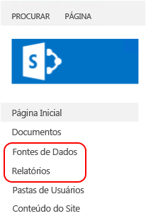

# <a name="sample-reporting-services-rsexe-script-to-copy-content-between-report-servers"></a>Script rs.exe do Reporting Services de exemplo para copiar conteúdo entre Servidores de Relatório

[!INCLUDE[ssrs-appliesto](../../includes/ssrs-appliesto.md)] [!INCLUDE [ssrs-appliesto-2008r2-and-later](../../includes/ssrs-appliesto-2008r2-and-later.md)] [!INCLUDE [ssrs-appliesto-sharepoint-2013-2016](../../includes/ssrs-appliesto-sharepoint-2013-2016.md)] [!INCLUDE [ssrs-appliesto-pbirs](../../includes/ssrs-appliesto-pbirs.md)]

Este artigo inclui e descreve um exemplo de script [!INCLUDE[ssRSnoversion](../../includes/ssrsnoversion-md.md)] RSS que copia itens de conteúdo e configurações de um servidor de relatório do [!INCLUDE[ssNoVersion](../../includes/ssnoversion-md.md)] [!INCLUDE[ssRSnoversion](../../includes/ssrsnoversion-md.md)] para outro servidor de relatório, usando o utilitário **RS.exe**. O RS.exe é instalado com [!INCLUDE[ssRSnoversion](../../includes/ssrsnoversion-md.md)], tanto em modo nativo quanto no SharePoint. O script a copia itens de [!INCLUDE[ssRSnoversion](../../includes/ssrsnoversion-md.md)] , por exemplo, relatórios e assinaturas de servidor para outro servidor. O script oferece suporte a servidores de relatório do modo do SharePoint e de modo nativo.  

##  <a name="bkmk_download_script"></a> Para baixar o script de ssrs_migration.rss  
 Baixe o [script de migração RS.exe do Reporting Services](https://github.com/Microsoft/sql-server-samples/tree/master/samples/features/reporting-services/ssrs-migration-rss) do site do GitHub para uma pasta local. Para obter mais informações, consulte a seção [Como usar o script](#bkmk_how_to_use_the_script) neste artigo.  
  
##  <a name="bkmk_supported_scenarios"></a> Cenários com suporte  
 O script oferece suporte a servidores de relatório do modo do SharePoint e de modo nativo. O script é compatível com as versões [!INCLUDE[ssKilimanjaro](../../includes/sskilimanjaro-md.md)] e posteriores do servidor de relatórios e com o Servidor de Relatórios do Power BI.  
  
O script pode ser usado para copiar o conteúdo entre servidores de relatório do mesmo modo ou de modos diferentes. Por exemplo, você pode executar o script para copiar conteúdo de um servidor de relatório do modo nativo do [!INCLUDE[ssKilimanjaro](../../includes/sskilimanjaro-md.md)] para um servidor de relatório do modo do [!INCLUDE[ssSQL11SP1](../../includes/sssql11sp1-md.md)] SharePoint. Você pode executar o script de qualquer servidor no qual o RS.exe esteja instalado. Por exemplo, na implantação a seguir, você pode:  
  
-   Executar o RS.exe e o script **NO** Servidor A.  
  
-   Copiar o conteúdo **DO** Servidor B  
  
-   **PARA** o Servidor C  
  
|Nome do servidor|Modo do Servidor de Relatório|  
|-----------------|------------------------|  
|Servidor A|Nativo|  
|Servidor B|SharePoint|  
|o Servidor C|SharePoint|  
  
 Para obter mais informações sobre o utilitário RS.exe, consulte [Utilitário RS.exe &#40;SSRS&#41;](../../reporting-services/tools/rs-exe-utility-ssrs.md).  
  
###  <a name="bkmk_what_is_migrated"></a> Itens e recursos que o script migra  
 O script não será gravado sobre itens de conteúdo existentes de mesmo nome.  Se o script detectar itens com o mesmo nome no servidor de destino que estejam no servidor de origem, os itens individuais resultarão em uma mensagem de “falha” e o script continuará. A tabela a seguir lista os tipos de conteúdo e recursos que o script pode migrar para os modos do servidor de relatório de destino.  
  
|Item|Migrado|SharePoint|Description|  
|----------|--------------|----------------|-----------------|  
|Senhas|**Não**|**Não**|As senhas **NÃO** são migradas. Depois que os itens de conteúdo forem migrados, atualize as informações de credenciais no servidor de destino. Por exemplo, fontes de dados com credenciais armazenadas.|  
|Meus Relatórios|**Não**|**Não**|O recurso “Meus Relatórios” no modo Nativo se baseia em logons de usuário individuais, portanto, o serviço de scripts não tem acesso ao conteúdo nas pastas “Meus Relatórios” para outros usuários, sem ser o parâmetro **–u** usado para execução do script rss. Além disso, “Meus Relatórios” não é um recurso do modo do [!INCLUDE[ssRSnoversion](../../includes/ssrsnoversion-md.md)] SharePoint e os itens nas pastas não podem ser copiados para um ambiente do SharePoint. Em virtude disso, o script não copia os itens de relatório que estão na pasta "Meus Relatórios" em um servidor de relatório de modo nativo de origem<br /><br /> Para migrar p conteúdo de em pastas "Meus Relatórios" com esse script, siga estas etapas:<br /><br /> 1.  Crie novas pastas no Gerenciador de Relatórios. Opcionalmente, você pode criar pastas ou subpastas para cada usuário.<br />2.  Faça logon como um dos usuários com o conteúdo "Meus relatórios".<br />3.  No Gerenciador de Relatórios, clique na pasta **Meus Relatórios**.<br />4.  Clique na exibição **Detalhes** da pasta.<br />5.  Selecione cada relatório que você quer copiar.<br />6.  Clique em **Mover** na barra de ferramentas do Gerenciador de Relatórios.<br />7.  Selecione a pasta de destino desejada.<br />8.  Repita as etapas 2-7 para cada usuário.<br />9. Execute o script.|  
|Histórico|**Não**|**Não**||  
|Configurações de histórico|Sim|Sim|As configurações de histórico são migradas, mas os detalhes do histórico NÃO.|  
|Agendamentos|sim|sim|Para migrar agendamentos, é necessário que o SQL Server Agent esteja em execução no servidor de destino. Se o SQL Server Agent não estiver em execução no destino, você verá uma mensagem de erro semelhante à seguinte:<br /><br /> `Migrating schedules: 1 items found. Migrating schedule: theMondaySchedule ... FAILURE:  The SQL Agent service isn't running. This operation requires the SQL Agent service. ---> Microsoft.ReportingServices.Diagnostics.Utilities.SchedulerNotResponding Exception: The SQL Agent service isn't running. This operation requires the SQL Agent service.`|  
|Funções e políticas do sistema|Sim|Sim|Por padrão, o script não copiará o esquema de permissão personalizado entre servidores. O comportamento padrão é que os itens sejam copiados para o servidor de destino com o sinalizador ‘herdar permissões pai’ definido como TRUE. Se você quiser que o script copie permissões para itens individuais, use a opção SECURITY.<br /><br /> Se os servidores de origem e destino **não estiverem no mesmo modo de servidor de relatório**, por exemplo, do modo nativo para o modo do SharePoint e você usar a opção SECURITY, o script tentará mapear as funções e os grupos padrão com base na comparação no artigo [Comparar funções e tarefas no Reporting Services com grupos e permissões do SharePoint](../../reporting-services/security/reporting-services-roles-tasks-vs-sharepoint-groups-permissions.md). As funções e os grupos personalizados não são copiados para o servidor de destino.<br /><br /> Quando o script estiver sendo copiado entre servidores **que estejam no mesmo modo**e você usar a opção SECURITY, o script criará novas funções (modo nativo) ou grupos (modo do SharePoint) no servidor de destino.<br /><br /> Se uma função já existir no servidor de destino, o script criará uma mensagem de “Falha” semelhante à seguinte e continuará a migração de outros itens. Depois que o script for concluído, verifique se as funções no servidor de destino estão configuradas para atender às suas necessidades. as funções de Migração: 8 itens encontrados.<br /><br /> `Migrating role: Browser ... FAILURE: The role 'Browser' already exists and cannot be created. ---> Microsoft.ReportingServices.Diagnostics.Utilities.RoleAlreadyExistsException: The role 'Browser' already exists and cannot be created.`<br /><br /> Para obter mais informações, consulte [Conceder acesso ao usuário a um servidor de relatório &#40;Gerenciador de Relatórios&#41;](../../reporting-services/security/grant-user-access-to-a-report-server-report-manager.md)<br /><br /> **Observação:** se um usuário existente no servidor de origem não existir no servidor de destino, o script não poderá aplicar atribuições de função no servidor de destino, o script não poderá aplicar atribuições de função, mesmo que a opção SECURITY seja usada.|  
|Fonte de dados compartilhada|Sim|Sim|O script não substituirá itens existentes no servidor de destino. Se um item no servidor de destino já existir com o mesmo nome, você verá uma mensagem de erro semelhante a esta:<br /><br /> `Migrating DataSource: /Data Sources/Aworks2012_oltp ... FAILURE:The item '/Data Sources/Aworks2012_oltp' already exists. ---> Microsoft.ReportingServices.Diagnostics.Utilities.ItemAlreadyExistsException: The item '/Data Source s/Aworks2012_oltp' already exists.`<br /><br /> Credenciais **NÃO** são copiadas como parte da fonte de dados. Depois que os itens de conteúdo forem migrados, atualize as informações de credenciais no servidor de destino.|  
|Conjunto de dados compartilhado|Sim|Sim||  
|Pasta|Sim|Sim|O script não substituirá itens existentes no servidor de destino. Se um item no servidor de destino já existir com o mesmo nome, você verá uma mensagem de erro semelhante a esta:<br /><br /> `Migrating Folder: /Reports ... FAILURE: The item '/Reports' already exists. ---> Microsoft.ReportingServices.Diagnostics.Utilities.ItemAlreadyExistsException: The item '/Reports' already exists.`|  
|Relatório|Sim|Sim|O script não substituirá itens existentes no servidor de destino. Se um item no servidor de destino já existir com o mesmo nome, você verá uma mensagem de erro semelhante a esta:<br /><br /> `Migrating Report: /Reports/testThe item '/Reports/test' already exists. ---> Microsoft.ReportingServices.Diagnostics.Utilities.ItemAlreadyExistsException: The item '/Reports/test' already exists.`|  
|Parâmetros|Sim|Sim||  
|Assinaturas|Sim|Sim||  
|Configurações de histórico|Sim|Sim|As configurações de histórico são migradas, mas os detalhes do histórico NÃO.|  
|opções de processamento|Sim|Sim||  
|opções de atualização de cache|Sim|Sim|As configurações dependentes são migradas como parte de um item de catálogo. O exemplo a seguir está fora do script, pois migra um relatório (.rdl) e as configurações relacionadas como opções de atualização de cache:<br /><br /> -   Migrando parâmetros para o relatório TitleOnly.rdl 0 itens encontrados.<br />-   Migrando assinaturas para o relatório TitleOnly.rdl 1 item encontrado.<br />-   Migrando assinaturas Salvar em \\\server\public\savedreports como TitleOnly... SUCCESS<br />-   Migrando configurações do histórico para o relatório TitleOnly.rdl... SUCCESS<br />-   Migrando opções de processamento para o relatório TitleOnly.rdl... 0 items found.<br />-   Migrando opções de atualização do cache para o relatório TitleOnly.rdl... SUCCESS<br />-   Migrando planos de atualização de cache para o relatório TitleOnly.rdl: 1 item encontrado.<br />-   Migrando plano de atualização do cache titleonly_refresh735amM2F... SUCCESS|  
|Planos de atualização de cache|Sim|Sim||  
|Imagens|Sim|Sim||  
|Partes de relatório|Sim|Sim||  
  
##  <a name="bkmk_required_permissions"></a> Permissões necessárias  
 As permissões necessárias para ler ou gravar itens e recursos não são as mesmas para todos os métodos usados no script. A tabela a seguir resume os métodos usados para cada item ou recurso e vincula ao conteúdo relacionado. Navegue até o tópico individual para ver as permissões necessárias. Por exemplo, o tópico do método de ListChildren indica as permissões necessárias de:  
  
-   **Permissões necessárias de modo nativo:** ReadProperties no item  
  
-   **Permissões necessárias do modo do SharePoint:** ViewListItems  
  
|Item ou recurso|Origem|Destino|  
|----------------------|------------|------------|  
|Itens de catálogo|<xref:ReportService2010.ReportingService2010.ListChildren%2A><br /><br /> <xref:ReportService2010.ReportingService2010.GetProperties%2A><br /><br /> <xref:ReportService2010.ReportingService2010.GetItemDataSources%2A><br /><br /> <xref:ReportService2010.ReportingService2010.GetItemReferences%2A><br /><br /> <xref:ReportService2010.ReportingService2010.GetDataSourceContents%2A><br /><br /> <xref:ReportService2010.ReportingService2010.GetItemLink%2A>|<xref:ReportService2010.ReportingService2010.CreateCatalogItem%2A><br /><br /> <xref:ReportService2010.ReportingService2010.SetItemDataSources%2A><br /><br /> <xref:ReportService2010.ReportingService2010.GetItemReferences%2A><br /><br /> <xref:ReportService2010.ReportingService2010.CreateDataSource%2A><br /><br /> <xref:ReportService2010.ReportingService2010.CreateLinkedItem%2A><br /><br /> <xref:ReportService2010.ReportingService2010.CreateFolder%2A>|  
|Role|<xref:ReportService2010.ReportingService2010.ListRoles%2A><br /><br /> <xref:ReportService2010.ReportingService2010.GetRoleProperties%2A>|<xref:ReportService2010.ReportingService2010.CreateRole%2A>|  
|Política do sistema|<xref:ReportService2010.ReportingService2010.GetSystemPolicies%2A>|<xref:ReportService2010.ReportingService2010.SetSystemPolicies%2A>|  
|Agenda|<xref:ReportService2010.ReportingService2010.ListSchedules%2A>|<xref:ReportService2010.ReportingService2010.CreateSchedule%2A>|  
|Assinatura|<xref:ReportService2010.ReportingService2010.ListSubscriptions%2A><br /><br /> <xref:ReportService2010.ReportingService2010.GetSubscriptionProperties%2A><br /><br /> <xref:ReportService2010.ReportingService2010.GetDataDrivenSubscriptionProperties%2A>|<xref:ReportService2010.ReportingService2010.CreateSubscription%2A><br /><br /> <xref:ReportService2010.ReportingService2010.CreateDataDrivenSubscription%2A>|  
|Plano de atualização do cache|<xref:ReportService2010.ReportingService2010.ListCacheRefreshPlans%2A><br /><br /> <xref:ReportService2010.ReportingService2010.GetCacheRefreshPlanProperties%2A>|<xref:ReportService2010.ReportingService2010.CreateCacheRefreshPlan%2A>|  
|Parâmetros|<xref:ReportService2010.ReportingService2010.GetItemParameters%2A>|<xref:ReportService2010.ReportingService2010.SetItemParameters%2A>|  
|Opções de execução|<xref:ReportService2010.ReportingService2010.GetExecutionOptions%2A>|<xref:ReportService2010.ReportingService2010.SetExecutionOptions%2A>|  
|Opções de cache|<xref:ReportService2010.ReportingService2010.GetCacheOptions%2A>|<xref:ReportService2010.ReportingService2010.SetCacheOptions%2A>|  
|Configurações de histórico|<xref:ReportService2010.ReportingService2010.GetItemHistoryOptions%2A>|<xref:ReportService2010.ReportingService2010.SetItemHistoryOptions%2A>|  
|Política do item|<xref:ReportService2010.ReportingService2010.GetPolicies%2A>|<xref:ReportService2010.ReportingService2010.SetPolicies%2A>|  
  
 Para obter mais informações, consulte [Comparar funções e tarefas no Reporting Services com grupos e permissões do SharePoint](../../reporting-services/security/reporting-services-roles-tasks-vs-sharepoint-groups-permissions.md).  
  
##  <a name="bkmk_how_to_use_the_script"></a> Como usar o script  
  
1.  Baixe o arquivo de script em uma pasta local, por exemplo, **c:\rss\ssrs _migration.rss**.  
  
2.  Abra um prompt de comando **com privilégios administrativos**.  
  
3.  Navegue até a pasta que contém o arquivo de ssrs_migration.rss.  
  
4.  Execute o comando com os parâmetros adequados para seu cenário.  
  
 **Exemplo básico, o servidor de relatório de modo nativo para um servidor de relatório de modo nativo:**  
  
 O exemplo a seguir migra o conteúdo do modo nativo **Sourceserver** para o modo nativo **Targetserver**.  
  
 `rs.exe -i ssrs_migration.rss -e Mgmt2010 -s http://SourceServer/ReportServer -u Domain\User -p password -v ts="http://TargetServer/reportserver" -v tu="Domain\Userser" -v tp="password"`  
  
 **Observações de uso:**  
  
-   O script é executado em duas etapas.  
  
     A primeira etapa é uma auditoria, para retornar uma lista de itens que serão migrados e a segunda etapa é o processo de migração.  
  
     Você poderá **cancelar o script após a etapa** 1 se você só quiser ver a lista possível de migração ou caso você queira alterar os parâmetros. As configurações dependentes não estão listadas na etapa um. Por exemplo, as opções de cache de um relatório não são listadas, mas o relatório em si, sim.  
  
    > [!TIP]  
    >  Se você deseja auditar um único servidor, use o mesmo servidor como origem e destino, e cancele depois da etapa 1.  
  
     Um bom uso das informações de auditoria da etapa 1 é verificar funções existentes no servidor de modo nativo de origem e destino. O item a seguir é um exemplo da lista de auditoria da etapa um. Observe que a lista inclui uma seção “funções” porque a opção -v security="True" foi usada:  
  
    -   `Retrieve and report the list of items that will be migrated. You can cancel the script after step 1 if you do not want to start the actual migration.`  
  
         `Retrieving roles:`  
  
         `Role: Browser`  
  
         `Role: Content Manager`  
  
         `Role: Model Item Browser`  
  
         `Retrieve and report the list of items that will be migrated. You can cancel the script after step 1 if you do not want to start the actual migration.`  
  
         `Retrieving roles:`  
  
         `Role: Browser`  
  
         `Role: Content Manager`  
  
         `Role: CustomRole`  
  
         `Role: Model Item Browser`  
  
         `Role: My Reports`  
  
         `Role: Publisher`  
  
         `Role: Report Builder`  
  
         `Role: System Administrator`  
  
         `Role: System User`  
  
         `Retrieving system policies:`  
  
         `Retrieving system policies:`  
  
         `System policy: BUILTIN\Administrators`  
  
         `System policy: domain\user1`  
  
         `System policy: domain\ueser2`  
  
         `Retrieving schedules:`  
  
         `Schedule: theMondaySchedule`  
  
         `Retrieving catalog items. This may take a while.`  
  
         `Folder: /Data Sources`  
  
         `DataSource: /Data Sources/Aworks2012_oltp`  
  
         `Folder: /images`  
  
         `Resource: /images/Boba Fett.png`  
  
         `Resource: /images/R2-D2.png`  
  
         `Folder: /Reports`  
  
         `Report: /Reports/products`  
  
         `Report: /Reports/test`  
  
         `Report: /Reports/TitleOnly`  
  
-   SOURCE_URL e TARGET_URL devem ser URLs de servidor de relatório válidas que apontem para o servidor de relatório do [!INCLUDE[ssRSnoversion](../../includes/ssrsnoversion-md.md)] de origem e destino. No modo nativo, uma URL de servidor de relatórios é semelhante à seguinte:  
  
    -   `http://servername/reportserver`  
  
     No modo de SharePoint, a URL tem a esta aparência:  
  
    -   `http://servername/_vti_bin/reportserver`  
  
-   A estrutura de pasta virtual apresentada ao usuário no SharePoint pode ser diferente da subjacente. Abra `http://servername/_vti_bin/reportserver` ou `http://servername/sites/site_name/_vti_bin/reportserver` em um navegador para ver a estrutura de pastas não virtual. Isso é útil para definir as pastas de origem e destino como algo diferente de “/”, para um servidor no modo do SharePoint.  
  
-   As senhas não são migradas e devem ser reinseridas, por exemplo, fontes de dados com credenciais armazenadas.  
  
##  <a name="bkmk_parameter_description"></a> Descrição do parâmetro  
  
|Parâmetro|Description|Obrigatório|  
|---------------|-----------------|--------------|  
|**-s** Source_URL|URL do servidor de relatório de origem|Sim|  
|**-u** Domain\password **–p** password|Credenciais do servidor de origem.|OPCIONAL, as credenciais padrão serão usadas se ausente|  
|**-v st**="SITE"||OPCIONAL. Esse parâmetro é usado apenas para servidores de relatório do modo do SharePoint.|  
|**- v f**="SOURCEFOLDER"|Defina “/” para migrar tudo, ou para algo como “/folder/subfolder” para a migração parcial. Tudo nessa pasta será copiado|OPCIONAL, o padrão é "/".|  
|**-v ts**="TARGET_URL"|'URL do servidor RS de destino"||  
|**-v tu**="domain\username" **-v tp**="password"|'Credenciais do servidor de destino.|OPCIONAL, as credenciais padrão serão usadas se ausente. **Observação:** o usuário será listado como “autor” de agendas compartilhadas e conta “alterado por” para itens de relatório, no servidor de destino.|  
|**-v tst**="SITE"||OPCIONAL. Esse parâmetro é usado apenas para servidores de relatório do modo do SharePoint.|  
|**-v tf** ="TARGETFOLDER"|'Defina como "/" para migração para o nível raiz. Defina como "/folder/subfolder" para copiar para uma pasta que já exista. Tudo em "SOURCEFOLDER" será copiado para "TARGETFOLDER.|OPCIONAL, o padrão é "/".|  
|**-v security**= "True/False"|Se definido como “False”, itens de catálogo de destino herdarão a configuração de segurança de acordo com as configurações do sistema de destino. Essa configuração é recomendada para migrações entre diferentes tipos de servidor de relatórios, por exemplo, do modo nativo para o modo do SharePoint. Se definido como “True”, o script tentará migrar configurações de segurança.|OPCIONAL, o padrão é “False”.|  
  
##  <a name="bkmk_more_examples"></a> Mais exemplos  
  
###  <a name="bkmk_native_2_native"></a> Servidor de relatório do modo nativo para servidor de relatório do modo nativo  
 O exemplo a seguir migra o conteúdo do modo nativo **Sourceserver** para o modo nativo **Targetserver**.  
  
```  
rs.exe -i ssrs_migration.rss -e Mgmt2010 -s http://SourceServer/ReportServer -u Domain\User -p password -v ts="http://TargetServer/reportserver" -v tu="Domain\Userser" -v tp="password"  
```  
  
 O exemplo a seguir adiciona a opção de segurança:  
  
```  
rs.exe -i ssrs_migration.rss -e Mgmt2010 -s http://SourceServer/ReportServer -u Domain\User -p password -v ts="http://TargetServer/reportserver" -v tu="Domain\Userser" -v tp="password" -v security="True"  
```  
  
###  <a name="bkmk_native_2_sharepoint_root"></a> Modo nativo para modo do SharePoint – site raiz  
 O exemplo a seguir migra o conteúdo de um modo nativo **SourceServer** para o "site raiz" em um servidor do modo do SharePoint **TargetServer**. As pastas “Reports” e “Data Sources” no servidor no modo nativo conforme migradas como novas bibliotecas na implantação do SharePoint.  
  
   
  
```  
rs.exe -i ssrs_migration.rss -e Mgmt2010 -s http://SourceServer/ReportServer -u Domain\User -p Password -v ts="http://TargetServer/_vti_bin/ReportServer" -v tu="Domain\User" -v tp="Password"  
```  
  
###  <a name="bkmk_native_2_sharepoint_with_site"></a> Modo nativo para modo do SharePoint – conjunto de sites ‘bi’  
 O exemplo a seguir migra o conteúdo de um servidor de modo nativo para um servidor do SharePoint que contém um conjunto de sites "sites/bi" e uma biblioteca de documentos compartilhados. O script cria pastas no documento na biblioteca de destino. Por exemplo, o script criará pastas “Reports” e "Data Sources” na biblioteca de documentos de destino.  
  
```  
rs.exe -i ssrs_migration.rss -e Mgmt2010 -s http://SourceServer/ReportServer -u Domain\User -p Password -v ts="http://TargetServer/sites/bi/_vti_bin/reportserver" -v tst="sites/bi" -v tf="Shared Documents" -v tu="Domain\User" -v tp="Password"  
```  
  
###  <a name="bkmk_sharepoint_2_sharepoint"></a> Modo do SharePoint para modo do SharePoint – conjunto de sites ‘bi’  
 O exemplo a seguir migra conteúdo:  
  
-   De um servidor do SharePoint **SourceServer** que contém um conjunto de sites "sites/bi" e uma biblioteca de documentos compartilhados.  
  
-   Para um servidor do SharePoint **TargetServer** que contém um conjunto de sites "sites/bi" e uma biblioteca de documentos compartilhados.  
  
```  
rs.exe -i ssrs_migration.rss -e Mgmt2010 -s http://SourceServer/_vti_bin/reportserver -v st="sites/bi" -v f="Shared Documents" -u Domain\User1 -p Password -v ts="http://TargetServer/sites/bi/_vti_bin/reportserver" -v tst="sites/bi" -v tf="Shared Documents" -v tu="Domain\User" -v tp="Password"  
```  
  
###  <a name="bkmk_native_to_native_Azure_vm"></a> Modo nativo para o modo nativo – máquina virtual do Windows Azure  
 O exemplo a seguir migra conteúdo:  
  
-   De um servidor de relatório do modo nativo **SourceServer**.  
  
-   Para um servidor de relatório nativo **TargetServer** em execução em uma máquina virtual do Microsoft Azure. O **TargetServer** não é ingressado ao domínio de **SourceServer**, e **User2** é um administrador na máquina virtual do Microsoft Azure **TargetServer**.  
  
```  
rs.exe -i ssrs_migration.rss -e Mgmt2010 -s http://SourceServer/ReportServer -u Domain\user1 -p Password -v ts="http://ssrsnativeazure.cloudapp.net/ReportServer" -v tu="user2" -v tp="Password2"  
```  
  
> [!TIP]  
>  Para obter informações sobre como usar o Windows PowerShell para criar servidores de relatório do [!INCLUDE[ssRSnoversion](../../includes/ssrsnoversion-md.md)] nas máquinas virtuais do Microsoft Azure virtual, consulte [Usar PowerShell para criar uma máquina virtual do Microsoft Azure com um servidor de relatório do modo nativo](http://msdn.microsoft.com/library/dn449661.aspx).  
  
##  <a name="bkmk_sharepoint_site_to_native_Azure_vm"></a> Modo do SharePoint –conjunto de sites ‘bi’ para o servidor de modo nativo na Máquina Virtual do Windows Azure  
 O exemplo a seguir migra conteúdo:  
  
-   De um servidor de relatório do modo do SharePoint **SourceServer** que contém um conjunto de sites "sites/bi" e uma biblioteca de documentos compartilhados.  
  
-   Para um servidor de relatório nativo **TargetServer** em execução em uma máquina virtual do Microsoft Azure. O **TargetServer** não é ingressado ao domínio de **SourceServer**, e **User2** é um administrador na máquina virtual do Microsoft Azure **TargetServer**.  
  
```  
rs.exe -i ssrs_migration.rss -e Mgmt2010 -s http://uetesta02/_vti_bin/reportserver -u user1 -p Password -v ts="http://ssrsnativeazure.cloudapp.net/ReportServer" -v tu="user2" -v tp="Passowrd2"  
```  
  
##  <a name="bkmk_verification"></a> Verificação  
 A seção resume algumas das etapas a serem realizadas no servidor de destino para verificar se o conteúdo e as políticas foram migrados com êxito.  
  
### <a name="schedules"></a>Agendamentos  
 Para verificar agendamentos no servidor de destino:  
  
 **Native Mode**  
  
1.  Navegue até o Gerenciador de Relatórios no servidor de destino.  
  
2.  Clique em **Configurações de Site** no menu inicial.  
  
3.  Clique em **Agendamentos** no painel esquerdo.  
  
 **Modo do SharePoint:**  
  
1.  Navegue para **Configurações de site**.  
  
2.  No grupo **Reporting Services** , clique em **Gerenciar Agendas Compartilhadas**.  
  
### <a name="roles-and-groups"></a>Funções e grupos  
 **Native Mode**  
  
1.  Abra o [!INCLUDE[ssManStudioFull](../../includes/ssmanstudiofull-md.md)] e conecte-se ao servidor de relatório de modo nativo.  
  
2.  No **Pesquisador de Objetos** , clique em **Segurança**.  
  
3.  Clique em **Funções**.  
  
##  <a name="bkmk_troubleshoot"></a> Solução de problemas  
 Use o sinalizador de rastreamento **–t** para receber mais informações. Por exemplo, se você executar o script e visualizar uma mensagem semelhante à seguinte  
  
-   Não foi possível se conectar ao servidor: http://\<servername>/ReportServer/ReportService2010.asmx  
  
 Execute o script novamente com o sinalizador **–t** para ver uma mensagem semelhante a esta:  
  
-   System.Exception: não foi possível conectar ao servidor: http://\<servername>/ReportServer/ReportService2010.asmx ---> System.Net.WebException: **a solicitação falhou com o status HTTP 401: não autorizado**.   no System.Web.Services.Protocols.SoapHttpClientProtocol.ReadResponse (SoapClientMessage mensagem, resposta WebResponse, fluxo responseStream, Boolean asyncCall) em System.Web.Services.Protocols.SoapHttpClientProtocol.Invoke (cadeia de caracteres methodName, parâmetros de objeto de []) no Microsoft.SqlServer.ReportingServices2010.ReportingService2010.IsSSLRequired() em Microsoft.ReportingServices.ScriptHost.Management2010Endpoint.PingService (url de cadeia de caracteres, cadeia de caracteres de nome de usuário, senha de cadeia de caracteres Domínio de cadeia de caracteres, o tempo limite de Int32) em Microsoft.ReportingServices.ScriptHost.ScriptHost.DetermineServerUrlSecurity()---fim do rastreamento de pilha de exceção interna--  
  
## <a name="see-also"></a>Consulte Também  
 [Utilitário RS.exe &#40;SSRS&#41;](../../reporting-services/tools/rs-exe-utility-ssrs.md)   
 [Comparar funções e tarefas no Reporting Services com grupos e permissões do SharePoint](../../reporting-services/security/reporting-services-roles-tasks-vs-sharepoint-groups-permissions.md)  
  
  
