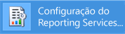
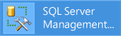
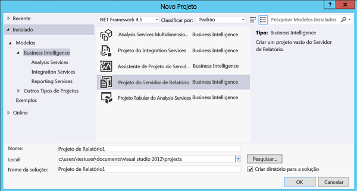

# Tutorial: Como localizar e iniciar as ferramentas do Reporting Services (SSRS)
  Este tutorial apresenta as ferramentas usadas para configurar um servidor de relatório, gerenciar o conteúdo e as operações do servidor de relatório e criar e publicar relatórios paginados e móveis do [!INCLUDE[ssRSnoversion](../../includes/ssrsnoversion-md.md)] . Se você já está familiarizado com as ferramentas, pode passar para outros tutoriais para aprender habilidades para usar o [!INCLUDE[ssRSnoversion](../../includes/ssrsnoversion-md.md)]. Para ver outros tutoriais, consulte [Reporting Services Tutorials &#40;SSRS&#41;](../../reporting-services/reporting-services-tutorials-ssrs.md).  
  
  
##   Gerenciador de Configurações do Reporting Services (Modo Nativo).  
 Use o gerenciador de configurações do modo nativo para concluir o seguinte:  
  
-   Especifique a conta de serviço.  
-   Crie ou atualize o banco de dados do servidor de relatório.  
-   Modifique as propriedades de conexão.  
-   Especifique as URLs.  
-   Gerenciar as chaves de criptografia.  
-   Configurar o processamento autônomo de relatório e a entrega por email.  
  
 **Instalação:** [!INCLUDE[ssRSnoversion](../../includes/ssrsnoversion-md.md)] é instalado quando você instala o modo nativo do [!INCLUDE[ssRSnoversion](../../includes/ssrsnoversion-md.md)] . Para obter mais informações, consulte [Instalar o servidor de relatórios no modo nativo do Reporting Services](assetid:///8f25e6dc-b753-400e-9e9a-50f4f35bf6c4).  
  
### Para iniciar o Gerenciador de Configuração do Reporting Services  
  
1.  Na tela inicial do Windows, digite **reporting** e, nos resultados da pesquisa de **Aplicativos** , clique em **Gerenciador de Configurações do Reporting Services**.  
  
       
  
     **Ou**  
  
     Clique em **Iniciar**, **Programas**, [!INCLUDE[ssCurrentUI](../../includes/sscurrentui-md.md)], **Ferramentas de Configuração**e **Gerenciador de Configurações do Reporting Services**.  
  
     A caixa de diálogo **Seleção da Instância de Instalação do Servidor de Relatório** será exibida, para que você possa selecionar a instância do servidor de relatório que deseja configurar.  
  
2.  Em **Nome do Servidor**, especifique o nome do computador no qual a instância do servidor de relatório está instalada. O nome do computador local é especificado por padrão, mas você também pode digitar o nome de uma instância remota do [!INCLUDE[ssNoVersion](../../includes/ssnoversion-md.md)] .  
  
     Se você especificar um computador remoto, clique em **Localizar** para estabelecer uma conexão. O servidor de relatório deve ser configurado com antecedência para administração remota. Para obter mais informações, consulte [Configurar um Servidor de Relatório para Administração Remota](../../reporting-services/report-server/configure-a-report-server-for-remote-administration.md).  
  
3.  Em **Emstance Name**, escolha a instância do [!INCLUDE[ssNoVersion](../../includes/ssnoversion-md.md)] [!INCLUDE[ssRSnoversion](../../includes/ssrsnoversion-md.md)] que deseja configurar. Somente instâncias de servidor de relatório do [!INCLUDE[ssKatmai](../../includes/sskatmai-md.md)], do [!INCLUDE[ssKilimanjaro](../../includes/sskilimanjaro-md.md)]e do [!INCLUDE[ssCurrent](../../includes/sscurrent-md.md)] aparecem na lista. Você não pode configurar versões anteriores do [!INCLUDE[ssRSnoversion](../../includes/ssrsnoversion-md.md)].  
  
4.  Clique em **Conectar**.  
  
5.  Para verificar se você iniciou a ferramenta, compare seus resultados com a seguinte imagem:  
  
       
  
 **Próximas etapas:** [Configurar e administrar um servidor de relatório &#40;modo nativo do SSRS&#41;](../../reporting-services/report-server/configure-and-administer-a-report-server-ssrs-native-mode.md) e [Reporting Services Configuration Manager &#40;Modo Nativo&#41;](../../reporting-services/install-windows/reporting-services-configuration-manager-native-mode.md).  
  
##  Portal da Web (modo nativo)  
 Use o [Portal da Web (modo nativo do SSRS)](../../reporting-services/web-portal-ssrs-native-mode.md) para definir permissões, gerenciar assinaturas e agendas e trabalhar com relatórios. Você também pode usar o Portal da Web para exibir relatórios.  
  
 **Instalação:** o Portal da Web é instalado quando você instala o Modo nativo do [!INCLUDE[ssRSnoversion](../../includes/ssrsnoversion-md.md)]: [Instalar o servidor de relatórios de modo nativo do Reporting Services](assetid:///8f25e6dc-b753-400e-9e9a-50f4f35bf6c4)  
  
 Antes de poder abrir o Portal da Web, é necessário ter permissões suficientes (inicialmente, somente os membros do grupo Administradores local têm permissões que fornecem acesso aos recursos do Portal da Web). O Portal da Web fornece diferentes páginas e opções que dependem das atribuições de função do usuário atual. Os usuários que não têm nenhuma permissão obterão uma página em branco. Os usuários com permissões para exibir relatórios obterão links nos quais podem clicar para abrir os relatórios. Para saber mais sobre permissões, consulte [Funções e permissões &#40;Reporting Services&#41;](../../reporting-services/security/roles-and-permissions-reporting-services.md).  
  
### Para iniciar o Portal da Web  
  
1.  Abra seu navegador. Para saber mais sobre navegadores e versões compatíveis, confira [Suporte ao navegador para Reporting Services e Power View](../../reporting-services/browser-support-for-reporting-services-and-power-view.md).  
  
2.  Na barra de endereço do navegador da Web, digite a URL do Portal da Web. Por padrão, a URL é **http://\<NomeDoServidor>/reports**. Você pode usar a ferramenta Configuração do Reporting Services para confirmar o nome de servidor e a URL. Para obter mais informações sobre as URLs usadas no [!INCLUDE[ssRSnoversion](../../includes/ssrsnoversion-md.md)], veja [Configurar as URLs do servidor de relatório &#40;SSRS Configuration Manager&#41;](../../reporting-services/install-windows/configure-report-server-urls-ssrs-configuration-manager.md).  
  
3.  O Portal da Web é aberto na janela de navegador. A página de inicialização é a pasta Base. Dependendo das permissões, você poderá ver pastas adicionais, hiperlinks para relatórios e arquivos de recursos na página de inicialização. Você também poderá ver botões e comandos adicionais na barra de ferramentas.  
  
4.  Se você executar o Portal da Web no servidor de relatório local, consulte [Configurar um servidor de relatório no modo nativo para a Administração Local &#40;SSRS&#41;](../../reporting-services/report-server/configure-a-native-mode-report-server-for-local-administration-ssrs.md).  
   
##   Management Studio  
 Os administradores de servidor de relatório podem usar o [!INCLUDE[ssManStudio](../../includes/ssmanstudio-md.md)] para gerenciar um servidor de relatório com outros servidores de componente do [!INCLUDE[ssNoVersion](../../includes/ssnoversion-md.md)] . Para obter mais informações, consulte [Use SQL Server Management Studio](../../ssms/use-sql-server-management-studio.md).  
  
### Para iniciar o SQL Server Management Studio  
  
1.  Na tela inicial do Windows, digite **sql server** e, nos resultados da pesquisa de **Aplicativos** , clique em **SQL Server Management Studio**.  
  
       
  
     **Ou**  
  
     Clique em **Iniciar**e em **Todos os Programas**. Em seguida, clique em [!INCLUDE[ssCurrentUI](../../includes/sscurrentui-md.md)]e em **SQL Server Management Studio**. A caixa de diálogo **Conectar ao Servidor** é exibida.  
  
2.  Se a caixa de diálogo **Conectar ao Servidor** não aparecer, no **Pesquisador de Objetos**, clique em **Conectar** e selecione **Reporting Services**.  
  
3.  Na lista **Tipo de servidor** , selecione **Reporting Services**. Se o [!INCLUDE[ssRSnoversion](../../includes/ssrsnoversion-md.md)] não estiver na lista, ele não será instalado.  
  
4.  Na lista **Nome do servidor** , selecione uma instância de servidor de relatório. As instâncias locais aparecem na lista. Você também pode digitar o nome de uma instância remota do [!INCLUDE[ssNoVersion](../../includes/ssnoversion-md.md)] .  
  
5.  Clique em **Conectar**. Você pode expandir o nó de raiz para definir propriedades de servidor, modificar definições de função ou desativar recursos de servidor de relatório.  
  
##   Ferramenta de Dados do SQL Server com Designer de Relatórios e Assistente de Relatórios  
 Você tem a opção de duas ferramentas diferentes para a criação de relatórios paginados do [!INCLUDE[ssNoVersion](../../includes/ssnoversion-md.md)] : Report Designer e [Construtor de Relatório](#bkmk_report_builder).  
  
 O Designer de Relatórios está disponível em [!INCLUDE[ssBIDevStudioFull](../../includes/ssbidevstudiofull-md.md)] -Visual Studio. A superfície de design do Designer de Relatórios inclui janelas tabuladas, assistentes e menus usados para acessar recursos de criação de relatórios. A ferramenta do designer de relatórios torna-se disponível quando você escolhe um modelo de Projeto do Report Server ou um Assistente do Report Server em [!INCLUDE[ssBIDevStudioFull](../../includes/ssbidevstudiofull-md.md)]. Para saber mais, consulte [Reporting Services no SQL Server Data Tools &#40;SSDT&#41;](../../reporting-services/tools/reporting-services-in-sql-server-data-tools-ssdt.md). 
 
Baixar o [SQL Server Data Tools](http://go.microsoft.com/fwlink/?LinkID=616714).  
  
### Para iniciar o Designer de Relatórios  
  
1.  Abra o **SQL Server Data Tools**.  
  
2.  No menu **Arquivo** , aponte para **Novo**e clique em **Projeto**.  
  
3.  Na lista **Tipos de Projeto** , clique em **Projetos de Business Intelligence**.  
  
4.  Na lista **Modelos** , clique em **Projeto do Servidor de Relatório**. O diagrama a seguir mostra como os modelos de projeto aparecem na caixa de diálogo:  
  
       
  
5.  Digite um nome e um local para o projeto ou clique em **Procurar** e selecione um local.  
  
6.  [!INCLUDE[clickOK](../../includes/clickok-md.md)] [!INCLUDE[ssBIDevStudioFull](../../includes/ssbidevstudiofull-md.md)] é aberto com a página inicial do [!INCLUDE[vsprvs](../../includes/vsprvs-md.md)] . O Gerenciador de Soluções fornece categorias para criar relatórios e fontes de dados. Você pode usar essas categorias para criar novos relatórios e fontes de dados. As janelas tabuladas aparecem ao criar uma definição de relatório. As janelas tabuladas são Dados, Layout e Visualização.  
  
 Para iniciar seu primeiro relatório, consulte [Criar um relatório de tabela básico &#40;Tutorial do SSRS&#41;](../../reporting-services/create-a-basic-table-report-ssrs-tutorial.md). Para obter mais informações sobre os designers de consulta que podem ser usados no Designer de Relatórios, consulte [Ferramentas de Design da Consulta &#40;SSRS&#41;](../../reporting-services/report-data/query-design-tools-ssrs.md).  
  
##   [!INCLUDE[ssRBnoversion](../../includes/ssrbnoversion-md.md)]  
 O[Construtor de Relatórios no SQL Server 2016](../../reporting-services/report-builder/report-builder-in-sql-server-2016.md) é um aplicativo autônomo que você pode usar para criar relatórios paginados fora do [!INCLUDE[ssNoVersion](../../includes/ssnoversion-md.md)]. Você pode personalizar e atualizar todos os relatórios existentes, quer tenham sido criados no Designer de Relatórios ou em versões anteriores do [!INCLUDE[ssRBnoversion](../../includes/ssrbnoversion-md.md)]. Você pode instalá-lo do portal da Web [!INCLUDE[ssNoVersion](../../includes/ssnoversion-md.md)] ou do Centro de Download da Microsoft.  
  
 [Baixe o Construtor de Relatórios](http://go.microsoft.com/fwlink/?LinkID=219138) do Centro de Download da Microsoft.  
  
### Para iniciar o [!INCLUDE[ssRBnoversion](../../includes/ssrbnoversion-md.md)]  
  
1.  No portal da Web [!INCLUDE[ssNoVersion](../../includes/ssnoversion-md.md)] , no menu  **Novo** , selecione **Relatório Paginado**.  
  
       
  
2.  Se o [!INCLUDE[ssRBnoversion](../../includes/ssrbnoversion-md.md)] não estiver instalado no computador, selecione **Obter [!INCLUDE[ssRBnoversion](../../includes/ssrbnoversion-md.md)]**.  
  
     Ou  
  
     [Baixe o Construtor de Relatórios](http://go.microsoft.com/fwlink/?LinkID=219138) do Centro de Download da Microsoft.  
  
3.  [!INCLUDE[ssRBnoversion](../../includes/ssrbnoversion-md.md)] é aberto e você pode criar ou abrir um relatório paginado.  
  
##   [!INCLUDE[SS_MobileReptPub_Long](../../includes/ss-mobilereptpub-long-md.md)]  
 Use o [Publicador de Relatórios Móveis do SQL Server](../Topic/SQL%20Server%20Mobile%20Report%20Publisher.md) para criar relatórios móveis que você pode exibir no portal da Web do [!INCLUDE[ssNoVersion](../../includes/ssnoversion-md.md)] e em dispositivos móveis, como iPads e iPhones.   Você pode instalá-lo do portal da Web [!INCLUDE[ssNoVersion](../../includes/ssnoversion-md.md)] ou do Centro de Download da Microsoft.  
  
 [Baixar Publicador de Relatórios Móveis do SQL Server](http://go.microsoft.com/fwlink/?LinkID=733527) do Centro de Download da Microsoft.  
  
### Para iniciar o [!INCLUDE[SS_MobileReptPub_Short](../../includes/ss-mobilereptpub-short-md.md)]  
  
1.  No portal da Web [!INCLUDE[ssNoVersion](../../includes/ssnoversion-md.md)] , no menu  **Novo** , selecione **Relatório Móvel**.  
  
       
  
2.  Se o [!INCLUDE[SS_MobileReptPub_Short](../../includes/ss-mobilereptpub-short-md.md)] não estiver instalado no computador, selecione **Obter [!INCLUDE[SS_MobileReptPub_Short](../../includes/ss-mobilereptpub-short-md.md)]**.  
  
     Ou  
  
     [Baixar Publicador de Relatórios Móveis do SQL Server](http://go.microsoft.com/fwlink/?LinkID=733527) do Centro de Download da Microsoft.  
  
3.  [!INCLUDE[SS_MobileReptPub_Short](../../includes/ss-mobilereptpub-short-md.md)] é aberto e você pode criar ou abrir um relatório móvel.  
  
## Consulte também  
*  [Baixar Publicador de Relatórios Móveis do SQL Server](http://go.microsoft.com/fwlink/?LinkID=733527)   
*  [Baixe o Construtor de Relatórios](http://go.microsoft.com/fwlink/?LinkID=219138)  
*  [Baixar o SQL Server Data Tools](http://go.microsoft.com/fwlink/?LinkID=616714) 
*  [Instalar o Reporting Services no modo do SharePoint](../../reporting-services/install-windows/install-reporting-services-sharepoint-mode.md)   
*  [Servidor de Relatório do Reporting Services](../../reporting-services/report-server-sharepoint/servidor-de-relatório-do-reporting-services.md)   
*  [Ferramentas de Design da Consulta &#40;SSRS&#41;](../../reporting-services/report-data/query-design-tools-ssrs.md)   
*  [Tutoriais do Reporting Services &#40;SSRS&#41;](../../reporting-services/reporting-services-tutorials-ssrs.md)  
  
  