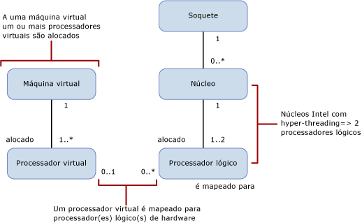

# Computar limites de capacidade por edição do SQL Server
[!INCLUDE[appliesto-ss-xxxx-xxxx-xxx-md](../includes/appliesto-ss-xxxx-xxxx-xxx-md.md)]
  Este artigo discute os limites de capacidade de computação das edições diferentes do [!INCLUDE[ssCurrent](../includes/sscurrent-md.md)] e quais suas diferenças em ambientes físicos e virtuais com processadores com hyperthreading.  
  
   
  
 Esta tabela descreve as notações do diagrama anterior:  
  
|Valor|Descrição|  
|-----------|-----------------|  
|0..1|Zero ou um|  
|1|Exatamente um|  
|1..\*|Um ou mais|  
|0..\*|Zero ou mais|  
|1..2|Um ou dois|  
  
> [!IMPORTANT]  
> Para elaborar mais:  
>   
> - Uma VM (máquina virtual) tem um ou mais processadores virtuais.  
> - Uma ou mais processadores virtuais são alocados a exatamente uma máquina virtual.  
> - Zero ou um processador virtual é mapeado para zero ou mais processadores lógicos. Quando o mapeamento dos processadores virtuais para os processadores lógicos é: 
>     -   Um para zero, representa um processador lógico não associado não usado pelos sistemas operacionais convidados.  
>     -   Um para muitos, representa uma superconfirmação.  
>     -   Zero para muitos, representa a ausência de máquina virtual no sistema host. Portanto, as VMs não usam nenhum processador lógico.  
> - Um soquete é mapeado para zero ou mais núcleos. Quando o mapeamento do soquete para núcleo é:  
>     -   Um para zero, representa um soquete vazio. Não há chip instalado.  
>     -   Um para um, representa um chip de núcleo único instalado no soquete. Esse mapeamento é raro nos dias atuais.  
>     -   Um para muitos, representa um chip de vários núcleos instalado no soquete. Os valores típicos são 2, 4 e 8.  
> - Um núcleo é mapeado para um ou dois processadores lógicos. Quando o mapeamento dos núcleos cores para os processadores lógicos é:  
>     -   Um para um, o hyperthreading está desativado.  
>     -   Um para dois, o hyperthreading está ativado.  
  
 As definições a seguir aplicam-se aos termos usados neste artigo:  
  
-   Um thread ou processador lógico é um mecanismo de computação lógico da perspectiva do [!INCLUDE[ssNoVersion](../includes/ssnoversion-md.md)], do sistema operacional, de um aplicativo ou de um driver.  
  
-   Um núcleo é uma unidade de processador. Ele pode consistir em um ou mais processadores lógicos.  
  
-   Um processador físico pode consistir em um ou mais núcleos. Um processador físico é o mesmo que um pacote de processadores ou um soquete.  
  
Os sistemas com mais de um processador físico ou sistemas com processadores físicos que têm vários núcleos e/ou hyperthreads permitem que o sistema operacional execute várias tarefas simultaneamente. Cada thread de execução aparece como um processador lógico. Por exemplo, se você tiver um computador com dois processadores com núcleo quádruplo, hyperthreading habilitado e dois threads por núcleo, você terá 16 processadores lógicos: 2 processadores x 4 núcleos por processador x 2 threads por núcleo. Vale observar que:  
  
-   A capacidade de computação de um processador lógico de um único thread de um núcleo hyper-threaded é menor que a capacidade de computação de um processador lógico daquele mesmo núcleo com hyperthreading desabilitado.  
  
-   A capacidade de computação dos dois processadores lógicos no núcleo com hyperthreading é maior que a capacidade de computação do mesmo núcleo com o hyperthreading desabilitado.  
  
Cada edição do [!INCLUDE[ssNoVersion](../includes/ssnoversion-md.md)] tem dois limites de capacidade de computação:  
  
- Um número máximo de soquetes (ou de processadores físicos ou de pacotes de processadores)  
  
- Um número máximo de núcleos como relatado pelo sistema operacional  
  
Esses limites se aplicam a uma única instância do [!INCLUDE[ssNoVersion](../includes/ssnoversion-md.md)]. Eles representam a capacidade máxima de computação que uma única instância usará. Eles não restringem o servidor em que a instância pode ser implantada. Na verdade, implantar várias instâncias do [!INCLUDE[ssNoVersion](../includes/ssnoversion-md.md)] no mesmo servidor físico é um modo eficiente de usar a capacidade de computação de um servidor físico com mais soquetes e/ou núcleos que os permitidos pelos limites de capacidade.  
  
A tabela a seguir especifica os limites de capacidade de computação para uma única instância de cada edição do [!INCLUDE[ssCurrent](../includes/sscurrent-md.md)]:  
  
|[!INCLUDE[ssNoVersion](../includes/ssnoversion-md.md)] edição|Capacidade máxima de computação para uma única instância ([!INCLUDE[ssNoVersion](../includes/ssnoversion-md.md)][!INCLUDE[ssDE](../includes/ssde-md.md)])|Capacidade máxima de computação para uma única instância (AS, RS)|  
|---------------------------------------|--------------------------------------------------------------------------------------------------------|-------------------------------------------------------------------|  
|Enterprise Edition: licenciamento baseado em núcleo\*|Máximo do sistema operacional|Máximo do sistema operacional|  
|Desenvolvedor|Máximo do sistema operacional|Máximo do sistema operacional|  
|Standard|Limitado a menos de 4 soquetes ou 24 núcleos|Limitado a menos de 4 soquetes ou 24 núcleos|  
|Express|Limitado a menos de 1 soquete ou 4 núcleos|Limitado a menos de 1 soquete ou 4 núcleos|  

\*O licenciamento Enterprise Edition com servidor + CAL (licença de acesso para cliente) limita-se a 20 núcleos por instância do [!INCLUDE[ssNoVersion](../includes/ssnoversion-md.md)]. (Esse licenciamento não está disponível para novos contratos.) Não há limites no modelo de Licenciamento de Servidor Baseado em Núcleo.  
  
Em um ambiente virtualizado, o limite de capacidade de computação é baseado no número de processadores lógicos, e não de núcleos. O motivo é que a arquitetura dos processadores não é visível aos aplicativos convidados. 

Por exemplo, um servidor com quatro soquetes preenchidos com processadores com núcleo quádruplo e com a capacidade para habilitar dois hyperthreads por núcleo contém 32 processadores lógicos com o hyperthreading habilitado. No entanto, ele contém só 16 processadores lógicos com o hyperthreading desabilitado. Esses processadores lógicos podem ser mapeados para máquinas virtuais no servidor. A carga de computação das máquinas virtuais nesse processador lógico é mapeada para um thread de execução no processador físico no servidor host.  
  
Quando o desempenho de cada processador virtual for importante, você poderá desabilitar o hyperthreading. Você pode habilitar ou desabilitar o hyperthreading usando uma configuração do BIOS para o processador durante a instalação do BIOS. No entanto, isso normalmente é uma operação com escopo do servidor que afetará todas as cargas de trabalho em execução no servidor. Isso pode sugerir separar as cargas de trabalho que serão executadas em ambientes virtualizados daquelas que se beneficiariam do aumento de desempenho do hyperthreading em um ambiente de sistema operacional físico.  
  
## Confira também  
 [Edições e componentes do SQL Server 2016](../sql-server/editions-and-components-of-sql-server-2016.md)   
 [Recursos compatíveis nas edições do SQL Server 2016](~/sql-server/editions-and-supported-features-for-sql-server-2016.md)   
 [Especificações de capacidade máxima do SQL Server](../sql-server/maximum-capacity-specifications-for-sql-server.md)   
 [Instalação de Início Rápido do SQL Server 2016](http://msdn.microsoft.com/library/672afac9-364d-4946-ad5d-8a2d89cf8d81)  

[!INCLUDE[get-help-options](../includes/paragraph-content/get-help-options.md)]

[!INCLUDE[contribute-to-content](../includes/paragraph-content/contribute-to-content.md)]
