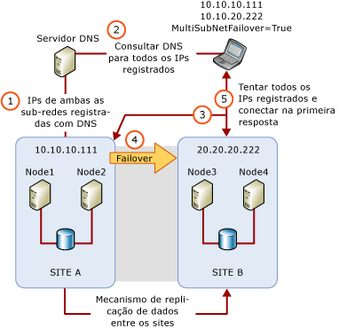

# Clustering de várias sub-redes do SQL Server (SQL Server)
[!INCLUDE[appliesto-ss-xxxx-xxxx-xxx-md](../../../includes/appliesto-ss-xxxx-xxxx-xxx-md.md)]
  Um cluster de failover de várias sub-redes do [!INCLUDE[ssNoVersion](../../../includes/ssnoversion-md.md)] é uma configuração em que cada nó de cluster de failover é conectado a uma sub-rede diferente ou a um conjunto diferente de sub-redes. Essas sub-redes podem estar no mesmo local ou em sites geograficamente dispersos. O clustering em sites geograficamente dispersos é às vezes chamado de clusters expansíveis. Como não há um armazenamento compartilhado que todos os nós possam acessar, os dados devem ser replicados entre o armazenamento de dados nas várias sub-redes. Com a replicação de dados, há mais de uma cópia dos dados disponíveis. Portanto, um cluster de failover de várias sub-redes fornece uma solução de recuperação de desastres além de alta disponibilidade.  
  
   
##   Cluster de Failover de Várias Sub-redes do SQL Server (Dois Nós, Duas Sub-redes)  
 A ilustração a seguir representa um FCI (instância de cluster de failover) com dois nós e duas sub-redes no [!INCLUDE[ssCurrent](../../../includes/sscurrent-md.md)].  
  
   
  
  
##   Configurações da instância do cluster de failover de várias sub-redes  
 A seguir estão alguns exemplos de FCIs do [!INCLUDE[ssNoVersion](../../../includes/ssnoversion-md.md)] que usam várias sub-redes:  
  
-   [!INCLUDE[ssNoVersion](../../../includes/ssnoversion-md.md)] SQLCLUST1 inclui Node1 e Node2. Node1 é conectado a Subnet1. Node2 é conectado a Subnet2. [!INCLUDE[ssNoVersion](../../../includes/ssnoversion-md.md)] A instalação considera essa configuração como um cluster de várias sub-redes e define a dependência do recurso de endereço IP como **OR**.  
  
-   [!INCLUDE[ssNoVersion](../../../includes/ssnoversion-md.md)] SQLCLUST1 inclui Node1, Node2 e Node3. Node1 e Node2 são conectados a Subnet1. Node 3 é conectado a Subnet2. [!INCLUDE[ssNoVersion](../../../includes/ssnoversion-md.md)] A instalação considera essa configuração como um cluster de várias sub-redes e define a dependência do recurso de endereço IP como **OR**. Como Node1 e Node2 estão na mesma sub-rede, essa configuração fornece alta disponibilidade local adicional.  
  
-   [!INCLUDE[ssNoVersion](../../../includes/ssnoversion-md.md)] SQLCLUST1 inclui Node1 e Node2. Node1 está em Subnet1. Node2 está em Subnet1 e Subnet2. [!INCLUDE[ssNoVersion](../../../includes/ssnoversion-md.md)] A instalação considera essa configuração como um cluster de várias sub-redes e define a dependência do recurso de endereço IP como **OR**.  
  
-   [!INCLUDE[ssNoVersion](../../../includes/ssnoversion-md.md)] SQLCLUST1 inclui Node1 e Node2. Node1 é conectado a Subnet1 e Subnet2. Node2 também é conectado a Subnet1 e Subnet2. A dependência de recurso de endereço IP é definida como **AND** pela Instalação do [!INCLUDE[ssNoVersion](../../../includes/ssnoversion-md.md)] .  
  
    > **OBSERVAÇÃO:** essa configuração não é considerada uma configuração de cluster de failover de várias sub-redes, porque os nós clusterizados estão no mesmo conjunto de sub-redes.  
  
##   Considerações sobre o recurso de endereço IP  
 Em uma configuração de cluster de failover de várias sub-redes, os endereços IP não pertencem a todos os nós no cluster de failover, e podem não estar todos online durante inicialização do [!INCLUDE[ssNoVersion](../../../includes/ssnoversion-md.md)] . A partir do [!INCLUDE[ssSQL11](../../../includes/sssql11-md.md)], é possível definir a dependência de recurso de endereço IP como **OR**. Isso habilita o [!INCLUDE[ssNoVersion](../../../includes/ssnoversion-md.md)] para ficar online quando há pelo menos um endereço IP válido ao qual ele possa se associar.  
  
> **OBSERVAÇÕES:** nas versões do [!INCLUDE[ssNoVersion](../../../includes/ssnoversion-md.md)] anteriores ao [!INCLUDE[ssSQL11](../../../includes/sssql11-md.md)], uma tecnologia V-LAN expansível foi usada em configurações de cluster multissite para expor um único endereço IP para failover em sites. Com o novo recurso do [!INCLUDE[ssNoVersion](../../../includes/ssnoversion-md.md)] para nós de cluster em diferentes sub-redes, você pode configurar clusters de failover do [!INCLUDE[ssNoVersion](../../../includes/ssnoversion-md.md)] em vários sites sem implementar a tecnologia V-LAN expansível.  
  
### Considerações sobre a dependência de recurso de endereço IP OR  
 Você poderá considerar o seguinte comportamento de failover se definir a dependência de recurso de endereço IP como **OR**:  
  
-   Quando houver uma falha de um dos endereços IP no nó que atualmente possui o grupo de recursos de cluster do [!INCLUDE[ssNoVersion](../../../includes/ssnoversion-md.md)] , um failover não será disparado automaticamente até todos os endereços IP válidos nesse nó falharem.  
  
-   Quando um failover ocorrer, o [!INCLUDE[ssNoVersion](../../../includes/ssnoversion-md.md)] ficará online se puder ser associado a pelo menos um endereço IP que é válido no nó atual. Serão listados no log de erros os endereços IP que não se associaram ao [!INCLUDE[ssNoVersion](../../../includes/ssnoversion-md.md)] na inicialização.  
  
   
 Quando um FCI do [!INCLUDE[ssNoVersion](../../../includes/ssnoversion-md.md)] for instalada lado a lado com uma instância autônoma do [!INCLUDE[ssDEnoversion](../../../includes/ssdenoversion-md.md)], procure evitar conflitos de número de porta TCP nos endereços IP. Conflitos normalmente ocorrem quando duas instâncias do [!INCLUDE[ssDE](../../../includes/ssde-md.md)] são ambas configuradas para usar a porta TCP padrão (1433). Para evitar conflitos, configure uma instância para usar uma porta fixa não padrão. A configuração de uma porta fixa é normalmente mais fácil na instância autônoma. A configuração do [!INCLUDE[ssDE](../../../includes/ssde-md.md)] para usar portas diferentes impedirá um conflito inesperado do Endereço IP/porta TCP que bloqueie uma inicialização de instância quando um FCI do [!INCLUDE[ssNoVersion](../../../includes/ssnoversion-md.md)] falhar no nó em espera.  
  
##   Latência de recuperação de cliente durante failover  
 Um FCI de várias sub-redes por padrão habilitam o recurso de cluster de RegisterAllProvidersIP para seu nome de rede. Em uma configuração de várias sub-redes, os endereços de IP online e offline do nome de rede serão registrados no servidor DNS. O aplicativo cliente em seguida recupera todos os endereços IP registrados do servidor DNS tenta se conectar aos endereços na ordem ou em paralelo. Isto significa que o tempo de recuperação de cliente em failovers de várias sub-redes já não dependem de latências de atualização de DNS. Por padrão, o cliente tenta os endereços IP na ordem. Quando o cliente usar o novo parâmetro opcional **MultiSubnetFailover=True** em sua cadeia de conexão, tentará os endereços IP simultaneamente e conectará ao primeiro servidor que responder. Isto pode ajudar a minimizar a latência de recuperação de cliente quando ocorrerem failovers. Para obter mais informações, veja [Conectividade de cliente Always On (SQL Server)](../../../database-engine/availability-groups/windows/always-on-client-connectivity-sql-server.md) e [Criar ou configurar um ouvinte do grupo de disponibilidade (SQL Server)](../../../database-engine/availability-groups/windows/create-or-configure-an-availability-group-listener-sql-server.md).  
  
 Com bibliotecas de cliente herdadas ou provedores de dados de terceiros, você não pode usar o parâmetro **MultiSubnetFailover** em sua cadeia de conexão. Para ajudar a assegurar que seu aplicativo cliente funcione de maneira ideal com FCI de várias sub-redes no [!INCLUDE[ssCurrent](../../../includes/sscurrent-md.md)], tente ajustar o tempo limite de conexão na cadeia de conexão de cliente antes de 21 segundos para cada endereço IP adicional. Isto assegura que a tentativa de reconexão do cliente não excede o tempo limite antes de ser capaz de realizar um ciclo por todos os endereços IP em seu FCI de várias sub-redes.  
  
 O período de tempo limite da conexão cliente padrão para o [!INCLUDE[ssNoVersion](../../../includes/ssnoversion-md.md)] Management Studio e o **sqlcmd** é de 15 segundos.  
  
   
##   Conteúdo relacionado  
  
|Descrição do conteúdo|Tópico|  
|-------------------------|-----------|  
|Instalando um cluster de failover do SQL Server|[Criar um novo cluster de failover do SQL Server (instalação)](../../../sql-server/failover-clusters/install/create-a-new-sql-server-failover-cluster-setup.md)|  
|Atualização in-loco de seu cluster de failover do SQL Server existente|[Atualizar uma instância de cluster de failover do SQL Server &#40;instalação&#41;](../../../sql-server/failover-clusters/windows/upgrade-a-sql-server-failover-cluster-instance-setup.md)|  
|Manutenção do seu cluster de failover existente do SQL Server|[Adicionar ou remover nós em um cluster de failover do SQL Server &#40;Instalação&#41;](../../../sql-server/failover-clusters/install/add-or-remove-nodes-in-a-sql-server-failover-cluster-setup.md)|  
|Use o snap-in Gerenciamento de Cluster de Failover para exibir eventos e logs do WSFC|[Exibir eventos e logs de um cluster de failover](http://technet.microsoft.com/library/cc772342\(WS.10\).aspx)|  
|Use o Windows PowerShell para criar um arquivo de log para todos os nós (ou um nó específico) em um cluster de failover do WSFC|[Cluster de failover Get-ClusterLog do cmdlet](http://technet.microsoft.com/library/ee461045.aspx)|  
  

  
  
