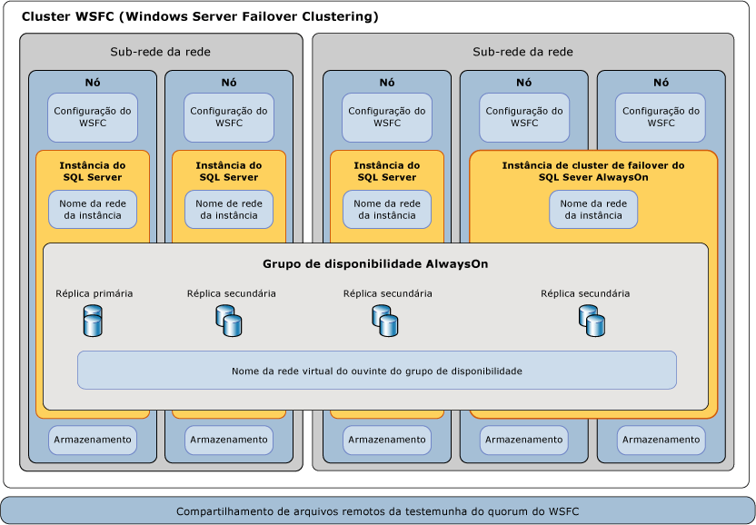

# Clustering de Failover do Windows Server com o SQL Server
[!INCLUDE[appliesto-ss-xxxx-xxxx-xxx-md](../../../includes/appliesto-ss-xxxx-xxxx-xxx-md.md)] Um WSFC *(Cluster de Failover do Windows Server)* é um grupo de servidores independentes que funcionam em conjunto para aumentar a disponibilidade de aplicativos e serviços. [!INCLUDE[ssCurrent](../../../includes/sscurrent-md.md)] tira proveito dos serviços e recursos do WSFC para oferecer suporte às instâncias de cluster de failover do [!INCLUDE[ssHADR](../../../includes/sshadr-md.md)] e do [!INCLUDE[ssNoVersion](../../../includes/ssnoversion-md.md)] .  
  
   
##   Termos e definições  
 WSFC (Cluster de Failover do Windows Server) Um WSFC é um grupo de servidores independentes que funcionam em conjunto para aumentar a disponibilidade de aplicativos e serviços.  
  
 Nó  
 Um servidor que está participando de um WSFC.
  
 Recurso de cluster  
 Uma entidade física ou lógica que pode ser de propriedade de um nó, colocada online e offline, movida entre nós e gerenciada como um objeto de cluster. Um recurso de cluster pode ser de propriedade de apenas um único nó em determinado momento.  
  
 Role  
 Uma coleção de recursos de cluster gerenciados como um único objeto de cluster para fornecer uma funcionalidade específica. Para o SQL Server, uma função será um AG (Grupo de Disponibilidade) Always On ou uma FCI (Instância de Cluster de Failover) Always On. Uma função contém todos os recursos de cluster necessários para um AG ou uma FCI. O failover e failback sempre atuam no contexto de funções. Para uma FCI, a função conterá um recurso de endereço IP, um recurso de nome de rede e os recursos do SQL Server. Uma função do AG conterá o recurso do AG e se um ouvinte for configurado, um nome de networm e um recurso de IP. 

 Recurso de nome de rede  
 Um nome de servidor lógico que é gerenciado como um recurso de cluster. Um recurso de nome de rede deve ser usado com um recurso de endereço IP. Essas entradas podem exigir objetos no Active Directory Domain Services e/ou DNS. 
  
 Dependência de recurso  
 Um recurso do qual outro recurso depende. Se o recurso A depender do recurso B, B será uma dependência de A. O recurso A não poderá ser iniciado sem o recurso B.  
  
  
 Proprietário preferido  
 Um nó no qual um grupo de recursos prefere ser executado. Cada grupo de recursos é associado a uma lista de proprietários preferidos classificados em ordem de preferência. Durante o failover automático, o grupo de recursos é movido para o próximo nó preferido na lista de proprietários preferidos.  
  
 Proprietário possível  
 Um nó secundário no qual um recurso pode ser executado. Cada grupo de recursos é associado a uma lista de possíveis proprietários. As funções podem fazer failover apenas nos nós listados como possíveis proprietários.   
  
 Modo de quorum  
 A configuração de quorum em um cluster de failover que determina o número de falhas de nós que o cluster pode sustentar.  
  
 Forçar o quorum  
 O processo para iniciar o cluster embora apenas uma minoria dos elementos que são necessários para o quorum esteja em comunicação.  
  

##   Visão geral do Windows Server Failover Clustering  
 O Windows Server Failover Clustering fornece recursos de infraestrutura que dão suporte aos cenários de alta disponibilidade e recuperação de desastres dos aplicativos de servidor hospedados, como o Microsoft [!INCLUDE[ssNoVersion](../../../includes/ssnoversion-md.md)] e o Microsoft Exchange. Se houver falha em um nó de cluster ou serviço, os serviços que foram hospedados naquele nó poderão ser transferidos automática ou manualmente para outro nó disponível em um processo conhecido como *failover*.  
  
 Os nós em um WSFC funcionam em conjunto para fornecer coletivamente estes tipos de funcionalidades:  
  
-   **Metadados distribuídos e notificações.** O serviço WSFC e os metadados de aplicativos hospedados são mantidos em cada nó do cluster. Esses metadados incluem a configuração e o status do WSFC, além das configurações dos aplicativos hospedados. As alterações nos metadados ou no status de um nó são propagadas automaticamente para os outros nós do WSFC.  
  
-   **Gerenciamento de recursos.** Os nós individuais do WSFC podem fornecer recursos físicos, como armazenamento de conexão direta, adaptadores de rede e acesso a armazenamento em disco compartilhado. Os aplicativos hospedados se registram como um recurso de cluster e podem configurar dependências de inicialização e de integridade em outros recursos.  
  
-   **Monitoramento de integridade.** A detecção de integridade entre nós e de nó primário é realizada por meio de uma combinação de comunicações de rede de estilo de pulsação e de monitoramento de recursos. A integridade geral do WSFC é determinada pelos votos de um quorum de nós no WSFC.  
  
-   **Coordenação de failover.** Cada recurso é configurado para ser hospedado em um nó primário, e cada um deles pode ser transferido automática ou manualmente para um ou mais nós secundários. Uma política de failover baseado em integridade controla a transferência automática de propriedade de recurso entre nós. Os nós e os aplicativos hospedados são notificados quando ocorre um failover para que possam reagir de maneira apropriada.  
  
 Para obter mais informações, consulte: [Visão geral do Clustering de Failover – Windows Server](https://technet.microsoft.com/library/hh831579(v=ws.11).aspx)  
  
##   Tecnologias do SQL Server AlwaysOn e WSFC  
 [!INCLUDE[ssCurrent](../../../includes/sscurrent-md.md)] *AlwaysOn* é uma solução de alta disponibilidade e de recuperação de desastre que utiliza o WSFC. Os recursos do Always On fornecem soluções integradas e flexíveis, que aumentam a disponibilidade do aplicativo, fornecem melhores retornos sobre os investimentos de hardware e simplificam a implantação e o gerenciamento de alta disponibilidade.  
  
 As Instâncias de Cluster de Failover [!INCLUDE[ssHADR](../../../includes/sshadr-md.md)] e AlwaysOn usam o WSFC como uma tecnologia de plataforma, registrando componentes como recursos de cluster WSFC.  Os recursos relacionados são combinados em uma *função*, que podem ser tornados dependentes de outros recursos de cluster do WSFC. Em seguida, o WSFC pode detectar e sinalizar a necessidade de reiniciar a instância do [!INCLUDE[ssNoVersion](../../../includes/ssnoversion-md.md)] ou fazer failover automaticamente dela em um nó de servidor diferente no WSFC.  
  
> **IMPORTANTE:** Para aproveitar ao máximo as tecnologias do [!INCLUDE[ssNoVersion](../../../includes/ssnoversion-md.md)] AlwaysOn, você deve aplicar vários pré-requisitos relacionados ao WSFC.  
>   
>  Para obter mais informações, consulte: [Pré-requisitos, restrições e recomendações para Grupos de Disponibilidade AlwaysOn &#40;SQL Server&#41;](../../../database-engine/availability-groups/windows/prereqs-restrictions-recommendations-always-on-availability.md)  
  
### Alta disponibilidade em nível de instância com Instâncias de Cluster de Failover AlwaysOn  
 Uma FCI *(Instância de Cluster de Failover)* Always On é uma instância do [!INCLUDE[ssNoVersion](../../../includes/ssnoversion-md.md)] instalada em nós em um WSFC. Esse tipo de instância depende dos recursos de armazenamento e do nome da rede virtual. O armazenamento pode usar Fibre Channel, iSCSI, FCoE ou SAS para armazenamento em disco compartilhado ou usar armazenamento anexado localmente com [S2D (Espaços de Armazenamento Diretos)](http://technet.microsoft.com/windows-server-docs/storage/storage-spaces/storage-spaces-direct-overview). O recurso de nome de rede virtual depende de um ou mais endereços IP virtuais, cada um em uma sub-rede diferente. O serviço SQL Server e o serviço SQL Server Agent também são recursos e ambos dependem dos recursos de nome de rede virtual e armazenamento.  
  
 No caso de um failover, o serviço WSFC transfere a propriedade dos recursos da instância para um nó de failover designado. A instância do [!INCLUDE[ssNoVersion](../../../includes/ssnoversion-md.md)] é então reiniciada no nó de failover e os bancos de dados são recuperados da maneira usual. Em qualquer momento determinado, apenas um único nó do cluster pode hospedar a FCI e os recursos subjacentes.  
  
> **OBSERVAÇÃO:**  uma Instância de Cluster de Failover AlwaysOn exige armazenamento em disco compartilhado simétrico, como uma SAN (rede de área de armazenamento) ou um compartilhamento de arquivos SMB.  Os volumes de armazenamento de disco compartilhados devem estar disponíveis a todos os nós de failover potenciais no cluster do WSFC.  
  
 Para obter mais informações, consulte [Instâncias de Cluster de Failover AlwaysOn &#40;SQL Server&#41;](../../../sql-server/failover-clusters/windows/always-on-failover-cluster-instances-sql-server.md)  
  
### Alta disponibilidade no nível do banco de dados com o [!INCLUDE[ssHADR](../../../includes/sshadr-md.md)]  
 Um AG *(Grupo de Disponibilidade)* Always On é um ou mais bancos de dados de usuário que fazem failover juntos. Um grupo de disponibilidade consiste em uma *réplica de disponibilidade* primária e em uma a quatro réplicas secundárias que são mantidas pelo movimento de dados baseado em log do SQL Server para proteção de dados, dispensando o armazenamento compartilhado. Cada réplica é hospedada por uma instância do [!INCLUDE[ssNoVersion](../../../includes/ssnoversion-md.md)] em um nó diferente do WSFC. O grupo de disponibilidade e um nome de rede virtual correspondente são registrados como recursos no cluster do WSFC.  
  
 Um *ouvinte de grupo de disponibilidade* no nó de réplica primária responde às solicitações de cliente de entrada para conectar-se ao nome de rede virtual e, com base nos atributos da cadeia de conexão, redireciona cada solicitação à instância apropriada do [!INCLUDE[ssNoVersion](../../../includes/ssnoversion-md.md)] .  
  
 No caso de um failover, em vez de transferir a propriedade de recursos físicos compartilhados para outro nó, o WSFC é utilizado para reconfigurar uma réplica secundária em outra instância do [!INCLUDE[ssNoVersion](../../../includes/ssnoversion-md.md)] para se tornar a réplica primária do grupo de disponibilidade. O recurso de nome de rede virtual do grupo de disponibilidade é transferido para aquela instância.  
  
 A qualquer determinado momento, apenas uma única instância do [!INCLUDE[ssNoVersion](../../../includes/ssnoversion-md.md)] pode hospedar a réplica primária dos bancos de dados de um grupo de disponibilidade. Cada réplica secundária associada deve residir em uma instância separada, e cada instância deve residir em nós físicos separados.  
  
> **OBSERVAÇÃO:** [!INCLUDE[ssHADR](../../../includes/sshadr-md.md)] não exige a implantação de uma Instância de Cluster de Failover nem o uso de armazenamento compartilhado simétrico (SAN ou SMB).  
>   
>  Uma FCI (Instância de Cluster de Failover) pode ser usada junto com um grupo de disponibilidade para aprimorar a disponibilidade de uma réplica de disponibilidade. Entretanto, para impedir situações de competição potenciais no cluster do WSFC, o failover automático do grupo de disponibilidade não tem suporte de e para uma réplica de disponibilidade que está hospedada em uma FCI ou vice-versa.  
  
 Para obter mais informações, consulte: [Visão geral dos Grupos de Disponibilidade AlwaysOn (SQL Server)](../../../database-engine/availability-groups/windows/overview-of-always-on-availability-groups-sql-server.md)  
  
##   Monitoração de integridade e failover do WSFC  
 A alta disponibilidade de uma solução AlwaysOn é realizada por meio do monitoramento proativo da integridade dos recursos físicos e lógicos do cluster WSFC, junto com failover automático e reconfiguração de hardware redundante.  Um administrador do sistema também pode iniciar um *failover manual* de um grupo de disponibilidade ou instância do [!INCLUDE[ssNoVersion](../../../includes/ssnoversion-md.md)] de um nó para outro.  
  
### Políticas de failover para nós, instâncias de cluster de failover e grupos de disponibilidade  
 Uma *política de failover* é configurada no nó do WSFC, na FCI (Instância de Cluster de Failover) do [!INCLUDE[ssNoVersion](../../../includes/ssnoversion-md.md)] e nos níveis de grupos de disponibilidade.  Essas políticas, baseadas na severidade, duração e frequência do status do recurso do cluster não íntegro e na capacidade de resposta do nó, podem disparar uma reinicialização do serviço ou um *failover automático* de recursos do cluster de um nó para outro ou disparar a movimentação de uma réplica primária de grupo de disponibilidade de uma instância do [!INCLUDE[ssNoVersion](../../../includes/ssnoversion-md.md)] para outra.  
  
 O failover de uma réplica de grupo de disponibilidade não afeta a instância do [!INCLUDE[ssNoVersion](../../../includes/ssnoversion-md.md)] subjacente.  O failover de uma FCI move as réplicas do grupo de disponibilidade hospedado com a instância.  
  
 Para obter mais informações, veja [Política de failover para instâncias de cluster de failover](../../../sql-server/failover-clusters/windows/failover-policy-for-failover-cluster-instances.md)  
  
### Detecção de integridade de recursos do WSFC  
 Cada recurso em um WSFC pode relatar seu status e sua integridade, periodicamente ou sob demanda. Várias circunstâncias podem indicar falha no recurso; por exemplo, deficiência de energia, erros de disco ou de memória, erros de comunicação de rede ou serviços sem resposta.  
  
 Recursos do WSFC, como redes, armazenamento ou serviços, podem se tornar dependentes uns dos outros. A integridade cumulativa de um recurso é determinada pela acúmulo bem-sucedido de sua integridade com a integridade de cada uma de suas dependências de recurso.  
  
### Detecção de integridade entre nós do WSFC e votação de quorum  
 Cada nó em um WSFC participa da comunicação de pulsação periódica para compartilhar o status da integridade do nó com os outros nós. Nós sem resposta são considerados como em estado com falha.  
  
 *Quorum* é um mecanismo que ajuda a garantir que o WSFC está em funcionamento por meio da garantia de que recursos suficientes estão online no WSFC. Se o WSFC tiver votos suficientes, ele estará íntegro e poderá fornecer tolerância a falhas no nível do nó.  
  
 Um *modo de quorum* é configurado no WSFC, que determina a metodologia usada na votação do quorum e quando executar um failover automático ou colocar o cluster offline. 
  
> **DICA!** É uma melhor prática sempre ter um número ímpar de votos de quorum em um WSFC.  Para a finalidade da votação de quorum, o [!INCLUDE[ssNoVersion](../../../includes/ssnoversion-md.md)] não precisa ser instalado em todos os nós do cluster. Um servidor adicional pode agir como um membro do quorum, ou o modelo de quorum do WSFC pode ser configurado para usar um compartilhamento de arquivo remoto como um desempatador.  
>   
>  Para obter mais informações, consulte: [Configuração de modos de quorum WSFC e votação (SQL Server)](../../../sql-server/failover-clusters/windows/wsfc-quorum-modes-and-voting-configuration-sql-server.md)  
  
### Recuperação de desastre por meio da imposição de quorum  
 Dependendo das práticas operacionais e da configuração do WSFC, você poderá incorrer em failovers automáticos e manuais e ainda manter uma solução [!INCLUDE[ssNoVersion](../../../includes/ssnoversion-md.md)] Always On robusta e tolerante a falhas. No entanto, se um quorum dos nós de votação qualificados no WSFC não puder se comunicar um com o outro ou se houver falha na validação da integridade do cluster WSFC, o WSFC poderá ficar offline.  
  
 Se o WSFC ficar offline por causa de um desastre não planejado ou devido a uma falha persistente de hardware ou de comunicação, será necessária a intervenção administrativa manual para *forçar o quorum* e colocar os nós de cluster sobreviventes online novamente em uma configuração não tolerante a falhas.  
  
 Posteriormente, uma série de etapas também deve ser realizada para reconfigurar o WSFC, recuperar as réplicas de banco de dados afetadas e restabelecer um novo quorum.  
  
 Para obter mais informações, consulte: [Recuperação de desastre do WSFC por meio de quorum forçado (SQL Server)](../../../sql-server/failover-clusters/windows/wsfc-disaster-recovery-through-forced-quorum-sql-server.md)  
  
##   Relação dos componentes do SQL Server AlwaysOn com o WSFC  
 Existem várias camadas de relações entre o [!INCLUDE[ssNoVersion](../../../includes/ssnoversion-md.md)] AlwaysOn e os recursos e componentes do WSFC.  
  
 Os grupos de disponibilidade AlwaysOn são hospedados nas instâncias do [!INCLUDE[ssNoVersion](../../../includes/ssnoversion-md.md)] .  
 Uma solicitação de cliente que especifica um nome da rede do ouvinte do grupo de disponibilidade lógico para se conectar a um banco de dados primário ou secundário é redirecionada para o nome da rede da instância apropriada da instância subjacente do [!INCLUDE[ssNoVersion](../../../includes/ssnoversion-md.md)] ou da FCI do [!INCLUDE[ssNoVersion](../../../includes/ssnoversion-md.md)].  
  
 As instâncias do SQL Server estão hospedadas ativamente em um único nó.  
 Quando presente, uma instância autônoma do [!INCLUDE[ssNoVersion](../../../includes/ssnoversion-md.md)] sempre reside em um único nó com um nome de rede de instância estático.  Quando presente, uma FCI do [!INCLUDE[ssNoVersion](../../../includes/ssnoversion-md.md)] estará ativa em um entre dois ou mais nós de failover possíveis com um único nome de rede de instância virtual.  
  
 Nós são membros de um cluster do WSFC.  
 Os metadados e o status de configuração do WSFC de todos os nós são armazenados em cada nó. Cada servidor pode oferecer volumes de armazenamento assimétrico ou de armazenamento compartilhado (SAN) para bancos de dados do usuário ou do sistema. Cada servidor tem pelo menos uma interface de rede física em uma ou mais sub-redes IP.  
  
 O WSFC monitora a integridade e gerencia a configuração de um grupo de servidores.  
 Os mecanismos do WSFC propagam alterações para os metadados de configuração do WSFC e o status para todos os nós do WSFC. Se uma testemunha de disco for usada, os metadados também serão armazenados nesse local. Por padrão, cada nó do WSFC obtém um voto para o quorum e uma testemunha será usada, se necessário, e é configurada.
 
 [!INCLUDE[ssHADR](../../../includes/sshadr-md.md)] são subchaves do cluster WSFC.  
 Se você excluir e recriar um WSFC, deverá desabilitar e habilitar o recurso [!INCLUDE[ssHADR](../../../includes/sshadr-md.md)] novamente em cada instância de servidor habilitada para o [!INCLUDE[ssHADR](../../../includes/sshadr-md.md)] no WSFC original. Para obter mais informações, consulte [Habilitar e desabilitar Grupos de Disponibilidade AlwaysOn &#40;SQL Server&#41;](../../../database-engine/availability-groups/windows/enable-and-disable-always-on-availability-groups-sql-server.md).  
  
   
  
##   Tarefas relacionadas  
  
-   [Exibir configurações de NodeWeight de quorum de cluster](../../../sql-server/failover-clusters/windows/view-cluster-quorum-nodeweight-settings.md)  
  
-   [Definir configurações de NodeWeight de quorum do cluster](../../../sql-server/failover-clusters/windows/configure-cluster-quorum-nodeweight-settings.md)  
  
-   [Forçar um cluster WSFC para iniciar sem um quorum](../../../sql-server/failover-clusters/windows/force-a-wsfc-cluster-to-start-without-a-quorum.md)  
  
##   Conteúdo relacionado  
  
-   [Tecnologias do Windows Server: clusters de failover](http://technet.microsoft.com/library/cc732488\(v=WS.10\).aspx)  

-   [Visão geral de S2D \((Espaços de Armazenamento Diretos)\)](http://technet.microsoft.com/windows-server-docs/storage/storage-spaces/storage-spaces-direct-overview)

-   [Clusters de failover no Windows Server 2008 R2](http://technet.microsoft.com/library/ff182338\(WS.10\).aspx)  
  
-   [Exibir eventos e logs de um cluster de failover](http://technet.microsoft.com/library/cc772342\(WS.10\).aspx)  
  
-   [Cluster de failover Get-ClusterLog do cmdlet](http://technet.microsoft.com/library/ee461045.aspx)  
  
## Consulte Também  
 [Instâncias do cluster de failover do AlwaysOn (SQL Server)](../../../sql-server/failover-clusters/windows/always-on-failover-cluster-instances-sql-server.md)   
 [Visão geral dos Grupos de Disponibilidade AlwaysOn (SQL Server)](../../../database-engine/availability-groups/windows/overview-of-always-on-availability-groups-sql-server.md)   
 [Configuração de modos de quorum WSFC e votação (SQL Server)](../../../sql-server/failover-clusters/windows/wsfc-quorum-modes-and-voting-configuration-sql-server.md)   
 [Política de failover para instâncias de cluster de failover](../../../sql-server/failover-clusters/windows/failover-policy-for-failover-cluster-instances.md)   
 [Recuperação de desastre do WSFC por meio de quorum forçado (SQL Server)](../../../sql-server/failover-clusters/windows/wsfc-disaster-recovery-through-forced-quorum-sql-server.md)  
 [O SQL Server 2016 dá suporte a Espaços de Armazenamento Diretos do Windows Server 2016](http://blogs.technet.microsoft.com/dataplatforminsider/2016/09/27/sql-server-2016-now-supports-windows-server-2016-storage-spaces-direct/)
  
