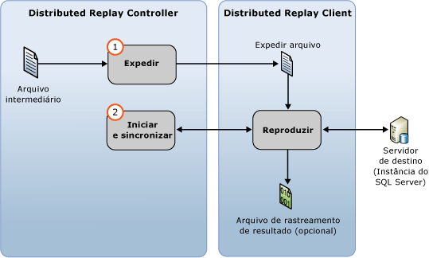

# Reproduzir dados de rastreamento
[!INCLUDE[appliesto-ss-xxxx-xxxx-xxx-md](../../includes/appliesto-ss-xxxx-xxxx-xxx-md.md)]
  É possível iniciar uma reprodução distribuída com o recurso [!INCLUDE[msCoName](../../includes/msconame-md.md)] [!INCLUDE[ssNoVersion](../../includes/ssnoversion-md.md)] Distributed Replay após preparar os dados de rastreamento de entrada. Para obter mais informações, consulte [Preparar os dados de rastreamento de entrada](../../tools/distributed-replay/prepare-the-input-trace-data.md).  
  
 Use a opção **replay** da ferramenta de administração para iniciar o estágio de reprodução de evento da reprodução distribuída. Essa fase consiste em duas partes: a expedição de dados de rastreamento e o início e a sincronização da reprodução distribuída.  
  
   
  
 Você pode reproduzir dados de rastreamento em um dois modos de sequenciamento: modo de estresse ou modo de sincronização. O comportamento padrão é reproduzir os dados de rastreamento em modo de estresse. Para obter mais informações sobre o estágio de reprodução de eventos e os modos de sequenciamento, consulte [SQL Server Distributed Replay](../../tools/distributed-replay/sql-server-distributed-replay.md).  
  
> [!NOTE]  
>  Os dados de rastreamento de entrada devem ser capturados em uma versão do [!INCLUDE[ssNoVersion](../../includes/ssnoversion-md.md)] que seja compatível com o Distributed Replay. Os dados de rastreamento de entrada também devem ser compatíveis com o servidor de destino no qual você deseja reproduzir os dados de rastreamento. Para obter mais informações sobre os requisitos da versão, consulte [Distributed Replay Requirements](../../tools/distributed-replay/distributed-replay-requirements.md).  
  
### Para reproduzir o rastreamento  
  
1.  **(Opcional) Modifique os parâmetros de configuração da reprodução:** se desejar modificar os parâmetros de configuração da reprodução, como o modo de sequenciamento e vários valores de escala, você deverá modificar o elemento `<ReplayOptions>` do arquivo de configuração da reprodução baseado em XML `DReplay.exe.replay.config`. Você também pode modificar o elemento `<OutputOptions>` para especificar configurações de saída, como, por exemplo, se a contagem de linhas deve ser registrada. Se você modificar o arquivo de configuração de reprodução, é recomendável modificar uma cópia em vez do original. Para modificar as configurações, siga estas etapas:  
  
    1.  Faça uma cópia do arquivo de configuração de reprodução padrão, `DReplay.exe.replay.config`, e renomeie o novo arquivo. O arquivo de configuração de reprodução padrão está localizado na pasta de instalação da ferramenta de administração.  
  
    2.  Modifique os parâmetros de configuração de reprodução no novo arquivo de configuração.  
  
    3.  Ao iniciar o estágio de reprodução de eventos (a próxima etapa), use o parâmetro *config_file* da opção **replay** para especificar o local do arquivo de configuração modificado.  
  
     Para obter mais informações sobre o arquivo de configuração de reprodução, consulte [Configurar Distributed Replay](../../tools/distributed-replay/configure-distributed-replay.md).  
  
2.  **Inicie o estágio de reprodução de eventos**: para iniciar a reprodução distribuída, você deve executar a ferramenta de administração com a opção **replay** . Para obter mais informações, consulte [Opção Replay &#40;ferramenta de administração do Distributed Replay&#41;](../../tools/distributed-replay/replay-option-distributed-replay-administration-tool.md).  
  
    1.  Abra o utilitário Prompt de Comando do Windows (**CMD.exe**) e navegue até o local de instalação da ferramenta de administração Distributed Replay (**DReplay.exe**).  
  
    2.  (Opcional) Use o parâmetro *controller* , **-m**, para especificar o controlador, se o serviço de controlador estiver em execução em um computador diferente da ferramenta de administração.  
  
    3.  Use o parâmetro *controller_working_directory* , **-d**, para especificar onde o arquivo intermediário foi salvo no controlador durante o estágio de pré-processamento.  
  
    4.  (Opcional) Use o parâmetro **-o** para capturar a atividade de reprodução em um arquivo de rastreamento de resultado em cada cliente.  
  
    5.  (Opcional) Use o parâmetro *target_server* , **-s**, para especificar a instância do [!INCLUDE[ssNoVersion](../../includes/ssnoversion-md.md)] em que os clientes de reprodução distribuída devem reproduzir a carga de trabalho de rastreamento. Esse parâmetro não será necessário se você tiver usado o elemento `<Server>` para especificar o servidor de destino no elemento `<ReplayOptions>` do arquivo de configuração de reprodução.  
  
    6.  Use o parâmetro *clients* , **-w**, para especificar os clientes de reprodução distribuída que devem participar da reprodução. Liste os nomes dos computadores cliente, separados por vírgulas. Observação: endereços IP não são permitidos.  
  
    7.  (Opcional) Use o parâmetro *config_file* , **-c**, para especificar o local do arquivo de configuração de reprodução. Use esse parâmetro para apontar para o novo arquivo de configuração se você tiver modificado uma cópia do arquivo de configuração de reprodução padrão.  
  
    8.  (Opcional) Use o parâmetro *status_interval* , **-f**, para especificar se deseja que a ferramenta de administração exiba mensagens de status em uma frequência diferente de 30 segundos.  
  
     Por exemplo, a sintaxe a seguir inicia o estágio de reprodução no mesmo computador que o serviço de controlador, usa um diretório de trabalho de controlador localizado em `c:\WorkingDir`, captura a atividade de reprodução em cada cliente participante, usa os clientes `client1` e `client2` para executar a reprodução e obtém os parâmetros de configuração de reprodução restantes em um arquivo de configuração de reprodução modificado localizado em `c:\modifiedreplay.config`:  
  
     `dreplay replay -d c:\WorkingDir -o -w client1,client2 -c c:\modifiedreplay.config`  
  
3.  Quando a reprodução distribuída for concluída, a ferramenta de administração retornará informações resumidas. Se você tiver especificado a opção **-o** , a atividade de reprodução terá sido salva nos arquivos de rastreamento de resultado em cada cliente. Para obter mais informações sobre os arquivos de rastreamento de resultados, consulte [Revisar os resultados da reprodução](../../tools/distributed-replay/review-the-replay-results.md).  
  
## Consulte Também  
 [Distributed Replay Requirements](../../tools/distributed-replay/distributed-replay-requirements.md)   
 [Opções de linha de comando da ferramenta de administração &#40;Distributed Replay Utility&#41;](../../tools/distributed-replay/administration-tool-command-line-options-distributed-replay-utility.md)   
 [Configurar o Distributed Replay](../../tools/distributed-replay/configure-distributed-replay.md)  
  
  
