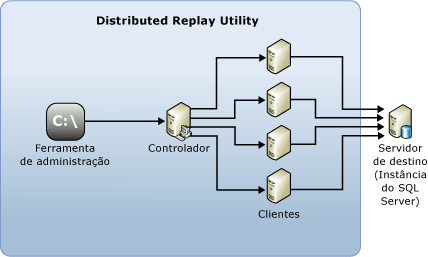

# SQL Server Distributed Replay

 [!INCLUDE [SQL Server](../../includes/applies-to-version/sqlserver.md)]

O recurso [!INCLUDE[msCoName](../../includes/msconame-md.md)] [!INCLUDE[ssNoVersion](../../includes/ssnoversion-md.md)] Distributed Replay ajuda a avaliar o impacto de atualizações futuras do [!INCLUDE[ssNoVersion](../../includes/ssnoversion-md.md)]. Também é possível usar esse recurso para ajudar a avaliar o impacto das atualizações de hardware e sistemas operacionais e ajuste do [!INCLUDE[ssNoVersion](../../includes/ssnoversion-md.md)] .

## Benefícios do Distributed Replay

De modo semelhante ao SQL Server Profiler você pode usar o Distributed Replay para reproduzir um rastreamento capturado em um ambiente de teste atualizado. Diferentemente do SQL Server Profiler, o Distributed Replay não está limitado à reprodução da carga de trabalho de um só computador.

O Distributed Replay oferece uma solução mais escalonável do que o SQL Server Profiler. Com o Distributed Replay, é possível reproduzir uma carga de trabalho de vários computadores e simular melhor uma carga de trabalho de missão crítica.

O recurso [!INCLUDE[msCoName](../../includes/msconame-md.md)] [!INCLUDE[ssNoVersion](../../includes/ssnoversion-md.md)] Distributed Replay pode usar vários computadores para reproduzir dados de rastreamento e simular uma carga de trabalho de missão crítica. Use o Distributed Replay para teste de compatibilidade de aplicativo, teste de desempenho ou planejamento de capacidade.

## Quando usar o Distributed Replay

O SQL Server Profiler e o Distributed Replay fornecem algumas funções sobrepostas.

Você pode usar o SQL Server Profiler para reproduzir um rastreamento capturado em um ambiente de teste atualizado. Também é possível analisar os resultados da repetição para procurar incompatibilidades de função e desempenho. No entanto, o SQL Server Profiler só pode reproduzir uma carga de trabalho de um só computador. Ao repetir um aplicativo OLTP intensivo que tenha muitas conexões simultâneas ativas ou alta taxa de transferência, o SQL Server Profiler pode se tornar um gargalo de recurso.

O Distributed Replay oferece uma solução mais escalonável do que o SQL Server Profiler. Use o Distributed Replay para reproduzir uma carga de trabalho de vários computadores e simular melhor uma carga de trabalho de missão crítica.

A tabela a seguir descreve quando usar cada ferramenta.

|Ferramenta|Use quando...|
|----------|---------------|
| SQL Server Profiler | Você quiser usar o mecanismo de repetição convencional em um único computador. Em particular, você precisa de recursos de depuração linha a linha, como os comandos **Etapa**, **Executar até o Cursor**e **Ativar/Desativar Pontos de Interrupção** .   Você deseja repetir um rastreamento [!INCLUDE[ssASnoversion](../../includes/ssasnoversion-md.md)] . |
| Distributed Replay |Você quiser avaliar a compatibilidade de aplicativo. Por exemplo, você deseja testar o [!INCLUDE[ssNoVersion](../../includes/ssnoversion-md.md)] e os cenários de atualização de sistema operacional, atualizações de hardware ou ajuste de índice.   A simultaneidade no rastreamento capturado é tão alta que um cliente de repetição não pode simular isso suficientemente.|  

## Conceitos do Distributed Replay

Os seguintes componentes fazem parte do ambiente do Distributed Replay:  

- **Ferramenta de administração do Distributed Replay**: um aplicativo de console, **DReplay.exe**, usado para se comunicar com o controlador de reprodução distribuída. Use a ferramenta de administração para controlar a reprodução distribuída.  

- **Controlador do Distributed Replay**: um computador que executa o serviço Windows denominado controlador Distributed Replay do [!INCLUDE[ssNoVersion](../../includes/ssnoversion-md.md)]. O controlador Distributed Replay orquestra as ações dos clientes de reprodução distribuída. Cada ambiente de Distributed Replay pode conter apenas uma instância de controlador.  

- **Clientes do Distributed Replay**: um ou mais computadores (físicos ou virtuais) que executam o serviço Windows denominado Cliente do [!INCLUDE[ssNoVersion](../../includes/ssnoversion-md.md)] Distributed Replay. Os clientes do Distributed Replay trabalham juntos para simular cargas de trabalho em uma instância do SQL Server do [!INCLUDE[ssNoVersion](../../includes/ssnoversion-md.md)]. Pode haver um ou mais clientes em cada ambiente do Distributed Replay.  

- **Servidor de destino**: uma instância do [!INCLUDE[ssNoVersion](../../includes/ssnoversion-md.md)] que clientes do Distributed Replay podem usar para reproduzir dados de rastreamento. Nós recomendamos que o servidor de destino seja localizado em um ambiente de teste.

A ferramenta de administração Distributed Replay, o controlador e o cliente podem ser instalados em diferentes computadores ou no mesmo computador. Só pode existir uma instância do serviço de cliente ou controlador do Distributed Replay em execução no mesmo computador.

A seguinte figura mostra para a arquitetura física do [!INCLUDE[ssNoVersion](../../includes/ssnoversion-md.md)] Distributed Replay:  

  

## Tarefas do Distributed Replay

|Descrição da tarefa|Tópico|  
|----------------------|-----------|  
| Descreve como configurar o Distributed Replay. | [Configurar o Distributed Replay](../../tools/distributed-replay/configure-distributed-replay.md) |
| Descreve como preparar os dados de rastreamento de entrada. | [Preparar os dados de rastreamento de entrada](../../tools/distributed-replay/prepare-the-input-trace-data.md) |
| Descreve como reproduzir dados de rastreamento. |[Reproduzir dados de rastreamento](../../tools/distributed-replay/replay-trace-data.md) | | Descreve como revisar os resultados de dados de rastreamento de Distributed Replay. |[Examinar os resultados da reprodução](../../tools/distributed-replay/review-the-replay-results.md)|
| Descreve como usar a ferramenta de administração para iniciar, monitorar e cancelar operações no controlador. | [Opções de linha de comando da ferramenta de administração &#40;Distributed Replay Utility&#41;](../../tools/distributed-replay/administration-tool-command-line-options-distributed-replay-utility.md) |

## Consulte Também

[Fórum do SQL Server Distributed Replay](https://social.technet.microsoft.com/Forums/sl/sqldru/)