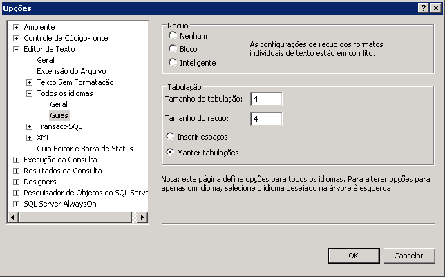

# Adicionando recuo
O Editor de Consultas permite o recuo de grandes seções de código em uma única etapa, além de também possibilitar a alteração da quantidade de recuo.  
  
## Recuando código  
  
#### Para recuar várias linhas de código  
  
1.  Na barra de ferramentas, clique em **Nova Consulta**.  
  
2.  Crie uma segunda consulta que seleciona as colunas **BusinessEntityID**, FirstName, **MiddleName**e **LastName** da tabela **Person** do esquema **Person** . Coloque cada coluna em uma linha separada de forma que o código se pareça com o exemplo a seguir:  
  
    ```  
    -- Search for a contact  
    SELECT   
    BusinessEntityID,  
    FirstName,   
    MiddleName,   
    LastName  
    FROM Person.Person  
    WHERE LastName = 'Sanchez';  
    GO  
    ```  
  
3.  Selecione todo o texto de `BusinessEntityID` para `LastName`.  
  
4.  Na barra de ferramentas do **Editor SQL** , clique em **Aumentar Recuo** para recuar todas as linhas de uma vez.  
  
#### Para alterar o recuo padrão  
  
1.  No menu **Ferramentas** , clique em **Opções**.  
  
2.  Expanda **Editor de Texto**, expanda **Todos os Idiomas**, clique em **Guias** e defina valores de recuo conforme o necessário. Note que você pode alterar o tamanho do recuo assim como o tamanho das guias e se as guias serão convertidas em espaços.  
  
      
  
3.  Clique em **OK**.  
  
## Próxima tarefa da lição  
[Maximizando o Editor de Consultas](../../tools/sql-server-management-studio/maximizing-query-editor.md)  
  
  
  
